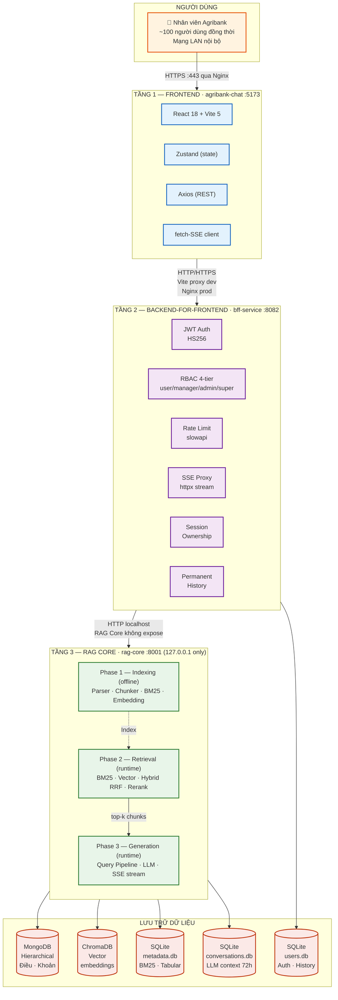

```mermaid
flowchart TB
    subgraph Client["NGƯỜI DÙNG"]
        U["👤 Nhân viên Agribank<br/>~100 người dùng đồng thời<br/>Mạng LAN nội bộ"]
    end

    subgraph FE["TẦNG 1 — FRONTEND · agribank-chat :5173"]
        direction LR
        F1["React 18 + Vite 5"]
        F2["Zustand (state)"]
        F3["Axios (REST)"]
        F4["fetch-SSE client"]
    end

    subgraph BFF["TẦNG 2 — BACKEND-FOR-FRONTEND · bff-service :8082"]
        direction LR
        B1["JWT Auth<br/>HS256"]
        B2["RBAC 4-tier<br/>user/manager/admin/super"]
        B3["Rate Limit<br/>slowapi"]
        B4["SSE Proxy<br/>httpx stream"]
        B5["Session<br/>Ownership"]
        B6["Permanent<br/>History"]
    end

    subgraph CORE["TẦNG 3 — RAG CORE · rag-core :8001 (127.0.0.1 only)"]
        direction TB
        C1["Phase 1 — Indexing (offline)<br/>Parser · Chunker · BM25 · Embedding"]
        C2["Phase 2 — Retrieval (runtime)<br/>BM25 · Vector · Hybrid RRF · Rerank"]
        C3["Phase 3 — Generation (runtime)<br/>Query Pipeline · LLM · SSE stream"]
        C1 -.->|Index| C2
        C2 -->|top-k chunks| C3
    end

    subgraph DATA["LƯU TRỮ DỮ LIỆU"]
        direction LR
        D1[("MongoDB<br/>Hierarchical<br/>Điều · Khoản")]
        D2[("ChromaDB<br/>Vector<br/>embeddings")]
        D3[("SQLite<br/>metadata.db<br/>BM25 · Tabular")]
        D4[("SQLite<br/>conversations.db<br/>LLM context 72h")]
        D5[("SQLite<br/>users.db<br/>Auth · History")]
    end

    U -->|HTTPS :443 qua Nginx| FE
    FE -->|"HTTP/HTTPS<br/>Vite proxy dev<br/>Nginx prod"| BFF
    BFF -->|"HTTP localhost<br/>RAG Core không expose"| CORE

    CORE --> D1
    CORE --> D2
    CORE --> D3
    CORE --> D4
    BFF --> D5

    classDef userNode fill:#fff3e0,stroke:#e65100,stroke-width:2px
    classDef feNode fill:#e3f2fd,stroke:#1565c0,stroke-width:2px
    classDef bffNode fill:#f3e5f5,stroke:#6a1b9a,stroke-width:2px
    classDef coreNode fill:#e8f5e9,stroke:#2e7d32,stroke-width:2px
    classDef dataNode fill:#fbe9e7,stroke:#bf360c,stroke-width:2px
    class U userNode
    class F1,F2,F3,F4 feNode
    class B1,B2,B3,B4,B5,B6 bffNode
    class C1,C2,C3 coreNode
    class D1,D2,D3,D4,D5 dataNode
```