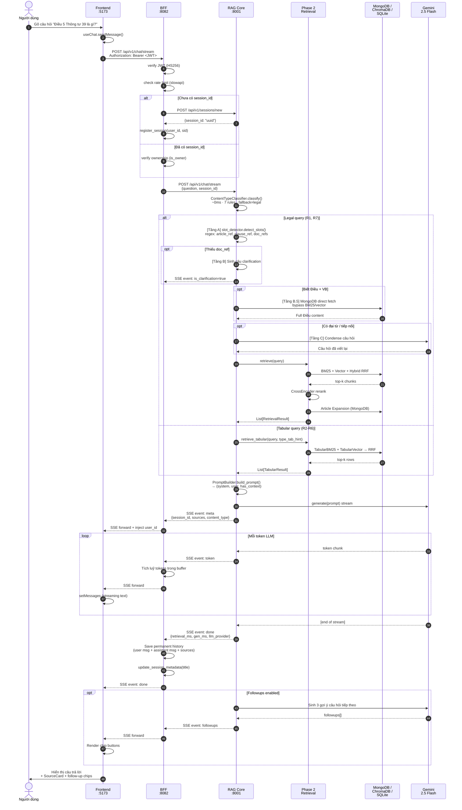

```mermaid
sequenceDiagram
    autonumber
    actor U as Người dùng
    participant FE as Frontend<br/>:5173
    participant BFF as BFF<br/>:8082
    participant RC as RAG Core<br/>:8001
    participant P2 as Phase 2<br/>Retrieval
    participant DB as MongoDB /<br/>ChromaDB /<br/>SQLite
    participant LLM as Gemini<br/>2.5 Flash

    U->>FE: Gõ câu hỏi "Điều 5 Thông tư 39 là gì?"
    FE->>FE: useChat.sendMessage()
    FE->>BFF: POST /api/v1/chat/stream<br/>Authorization: Bearer <JWT>

    BFF->>BFF: verify JWT (HS256)
    BFF->>BFF: check rate limit (slowapi)

    alt Chưa có session_id
        BFF->>RC: POST /api/v1/sessions/new
        RC-->>BFF: {session_id: "uuid"}
        BFF->>BFF: register_session(user_id, sid)
    else Đã có session_id
        BFF->>BFF: verify ownership (is_owner)
    end

    BFF->>RC: POST /api/v1/chat/stream<br/>{question, session_id}

    RC->>RC: ContentTypeClassifier.classify()<br/>~0ms · 7 rules · fallback=legal

    alt Legal query (R1, R7)
        RC->>RC: [Tầng A] slot_detector.detect_slots()<br/>regex: article_ref, clause_ref, doc_refs
        opt Thiếu doc_ref
            RC->>RC: [Tầng B] Sinh câu clarification
            RC-->>BFF: SSE event: is_clarification=true
        end
        opt Biết Điều + VB
            RC->>DB: [Tầng B.5] MongoDB direct fetch<br/>bypass BM25/vector
            DB-->>RC: Full Điều content
        end
        opt Có đại từ / tiếp nối
            RC->>LLM: [Tầng C] Condense câu hỏi
            LLM-->>RC: Câu hỏi đã viết lại
        end
        RC->>P2: retrieve(query)
        P2->>DB: BM25 + Vector + Hybrid RRF
        DB-->>P2: top-k chunks
        P2->>P2: CrossEncoder rerank
        P2->>DB: Article Expansion (MongoDB)
        P2-->>RC: List[RetrievalResult]
    else Tabular query (R2-R6)
        RC->>P2: retrieve_tabular(query, type_tab_hint)
        P2->>DB: TabularBM25 + TabularVector → RRF
        DB-->>P2: top-k rows
        P2-->>RC: List[TabularResult]
    end

    RC->>RC: PromptBuilder.build_prompt()<br/>→ (system, user, has_context)
    RC->>LLM: generate(prompt) stream
    RC-->>BFF: SSE event: meta<br/>{session_id, sources, content_type}
    BFF-->>FE: SSE forward + inject user_id

    loop Mỗi token LLM
        LLM-->>RC: token chunk
        RC-->>BFF: SSE event: token
        BFF->>BFF: Tích luỹ tokens trong buffer
        BFF-->>FE: SSE forward
        FE->>FE: setMessages (streaming text)
    end

    LLM-->>RC: [end of stream]
    RC-->>BFF: SSE event: done<br/>{retrieval_ms, gen_ms, llm_provider}
    BFF->>BFF: Save permanent history<br/>(user msg + assistant msg + sources)
    BFF->>BFF: update_session_metadata(title)
    BFF-->>FE: SSE event: done

    opt Followups enabled
        RC->>LLM: Sinh 3 gợi ý câu hỏi tiếp theo
        LLM-->>RC: followups[]
        RC-->>BFF: SSE event: followups
        BFF-->>FE: SSE forward
        FE->>FE: Render chip buttons
    end

    FE->>U: Hiển thị câu trả lời<br/>+ SourceCard + follow-up chips
```