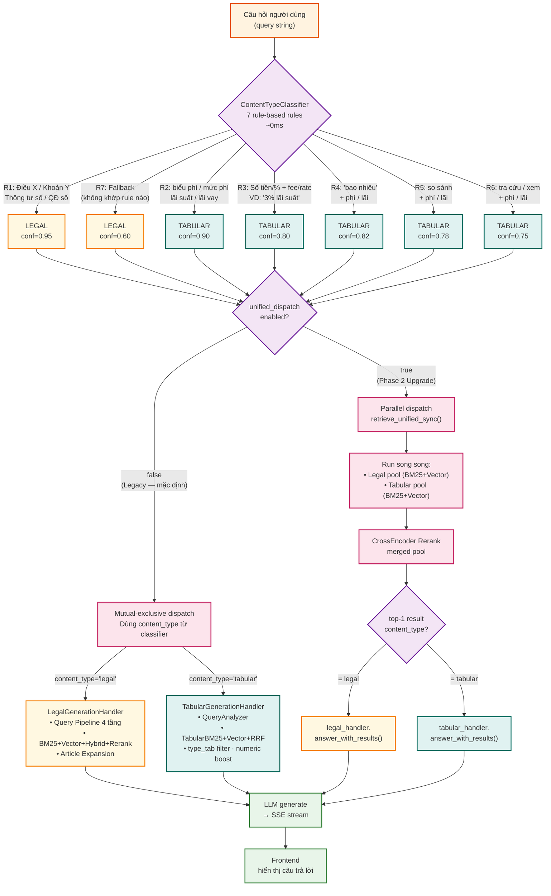

```mermaid
flowchart TB
    Q["Câu hỏi người dùng<br/>(query string)"] --> CT{"ContentTypeClassifier<br/>7 rule-based rules<br/>~0ms"}

    CT -->|"R1: Điều X / Khoản Y<br/>Thông tư số / QĐ số"| L1["LEGAL<br/>conf=0.95"]
    CT -->|"R2: biểu phí / mức phí<br/>lãi suất / lãi vay"| T1["TABULAR<br/>conf=0.90"]
    CT -->|"R3: Số tiền/% + fee/rate<br/>VD: '3% lãi suất'"| T2["TABULAR<br/>conf=0.80"]
    CT -->|"R4: 'bao nhiêu'<br/>+ phí / lãi"| T3["TABULAR<br/>conf=0.82"]
    CT -->|"R5: so sánh<br/>+ phí / lãi"| T4["TABULAR<br/>conf=0.78"]
    CT -->|"R6: tra cứu / xem<br/>+ phí / lãi"| T5["TABULAR<br/>conf=0.75"]
    CT -->|"R7: Fallback<br/>(không khớp rule nào)"| L2["LEGAL<br/>conf=0.60"]

    L1 --> FLAG{"unified_dispatch<br/>enabled?"}
    L2 --> FLAG
    T1 --> FLAG
    T2 --> FLAG
    T3 --> FLAG
    T4 --> FLAG
    T5 --> FLAG

    FLAG -->|"false<br/>(Legacy — mặc định)"| MUT["Mutual-exclusive dispatch<br/>Dùng content_type từ classifier"]
    FLAG -->|"true<br/>(Phase 2 Upgrade)"| PAR["Parallel dispatch<br/>retrieve_unified_sync()"]

    MUT -->|"content_type='legal'"| LH["LegalGenerationHandler<br/>• Query Pipeline 4 tầng<br/>• BM25+Vector+Hybrid+Rerank<br/>• Article Expansion"]
    MUT -->|"content_type='tabular'"| TH["TabularGenerationHandler<br/>• QueryAnalyzer<br/>• TabularBM25+Vector+RRF<br/>• type_tab filter · numeric boost"]

    PAR --> UR["Run song song:<br/>• Legal pool (BM25+Vector)<br/>• Tabular pool (BM25+Vector)"]
    UR --> RR["CrossEncoder Rerank<br/>merged pool"]
    RR --> TOP1{"top-1 result<br/>content_type?"}
    TOP1 -->|"= legal"| LHW["legal_handler.<br/>answer_with_results()"]
    TOP1 -->|"= tabular"| THW["tabular_handler.<br/>answer_with_results()"]

    LH --> OUT["LLM generate<br/>→ SSE stream"]
    TH --> OUT
    LHW --> OUT
    THW --> OUT
    OUT --> FE["Frontend<br/>hiển thị câu trả lời"]

    classDef queryNode fill:#fff3e0,stroke:#e65100,stroke-width:2px
    classDef classifierNode fill:#f3e5f5,stroke:#6a1b9a,stroke-width:2px
    classDef legalNode fill:#fff8e1,stroke:#f57c00,stroke-width:2px
    classDef tabularNode fill:#e0f2f1,stroke:#00695c,stroke-width:2px
    classDef flagNode fill:#fce4ec,stroke:#c2185b,stroke-width:2px
    classDef outNode fill:#e8f5e9,stroke:#2e7d32,stroke-width:2px
    class Q queryNode
    class CT,FLAG,TOP1 classifierNode
    class L1,L2,LH,LHW legalNode
    class T1,T2,T3,T4,T5,TH,THW tabularNode
    class MUT,PAR,UR,RR flagNode
    class OUT,FE outNode
```