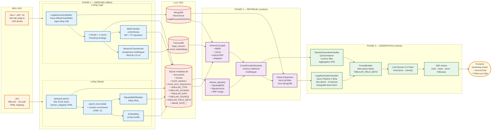

```mermaid
flowchart LR
    subgraph INPUT["ĐẦU VÀO"]
        direction TB
        I1[".docx / .pdf / .txt<br/>Văn bản pháp lý<br/>~500 tài liệu"]
        I2[".xlsx<br/>Biểu phí · Lãi suất<br/>YAML mapping"]
    end

    subgraph P1["PHASE 1 — INDEXING (offline)"]
        direction TB
        subgraph P1A["Luồng Legal"]
            A1["LegalDocumentSplitter<br/>Parse Điều/Khoản/Điểm<br/>regex tiếng Việt"]
            A2["1 Khoản = 1 chunk<br/>Chunking strategy"]
            A3["SentenceTransformer<br/>paraphrase-multilingual<br/>MiniLM-L12-v2"]
            A4["BM25 Builder<br/>underthesea<br/>IDF + TF saturation"]
            A1 --> A2 --> A3
            A2 --> A4
        end
        subgraph P1B["Luồng Tabular"]
            B1["openpyxl parser<br/>Đọc Excel sheet<br/>column_mapping YAML"]
            B2["search_text builder<br/>+ numeric enrichment<br/>(VNĐ, %)"]
            B3["Embedding<br/>(cùng model)"]
            B4["TabularBM25Builder<br/>bảng riêng"]
            B1 --> B2 --> B3
            B2 --> B4
        end
    end

    subgraph STORE["LƯU TRỮ"]
        direction TB
        S1[("MongoDB<br/>Hierarchical<br/>LegalDocumentSchema")]
        S2[("ChromaDB<br/>legal_clauses<br/>vector embeddings")]
        S3[("SQLite metadata.db<br/>• documents<br/>• chunks<br/>• bm25_statistics<br/>• chunk_term_frequencies<br/>• TABULAR_TYPE<br/>• TABULAR_SCHEMA<br/>• TABULAR_DATA<br/>• TABULAR_SOURCE<br/>• TABULAR_FIELD_META<br/>• tabular_bm25_*")]
    end

    subgraph P2["PHASE 2 — RETRIEVAL (runtime)"]
        direction TB
        R1["retrieve() [Legal]<br/>• BM25<br/>• Vector<br/>• Hybrid RRF<br/>• Adaptive"]
        R2["retrieve_tabular()<br/>• TabularBM25<br/>• TabularVector<br/>• RRF merge"]
        R3["CrossEncoderReranker<br/>mmarco-mMiniLM<br/>multilingual"]
        R4["Article Expansion<br/>fetch full Điều<br/>from MongoDB"]
        R1 --> R3
        R2 --> R3
        R3 --> R4
    end

    subgraph P3["PHASE 3 — GENERATION (runtime)"]
        direction TB
        G1["LegalGenerationHandler<br/>Query Pipeline 4 tầng<br/>Slot detect · Condense<br/>MongoDB direct fetch"]
        G2["TabularGenerationHandler<br/>QueryAnalyzer<br/>numeric filter<br/>Aggregation (P5)"]
        G3["PromptBuilder<br/>field-aware labels<br/>TABULAR_FIELD_META"]
        G4["LLM (Gemini 2.5 Flash<br/>VinaLlama · Llama3)"]
        G5["SSE stream<br/>meta · token · done · followups"]
        G1 --> G3
        G2 --> G3
        G3 --> G4 --> G5
    end

    OUT(["Frontend<br/>streaming render<br/>+ SourceCard<br/>+ Follow-up chips"])

    I1 --> P1A
    I2 --> P1B

    A1 --> S1
    A3 --> S2
    A2 --> S3
    A4 --> S3
    B1 --> S3
    B3 --> S3
    B4 --> S3

    S1 --> R1
    S1 --> R4
    S2 --> R1
    S3 --> R1
    S3 --> R2

    R4 --> G1
    R3 --> G2
    G5 --> OUT

    classDef inputNode fill:#fff3e0,stroke:#e65100,stroke-width:2px
    classDef p1Node fill:#e3f2fd,stroke:#1565c0,stroke-width:2px
    classDef storeNode fill:#fbe9e7,stroke:#bf360c,stroke-width:2px
    classDef p2Node fill:#f3e5f5,stroke:#6a1b9a,stroke-width:2px
    classDef p3Node fill:#e8f5e9,stroke:#2e7d32,stroke-width:2px
    classDef outNode fill:#fff8e1,stroke:#f57c00,stroke-width:2px
    class I1,I2 inputNode
    class A1,A2,A3,A4,B1,B2,B3,B4 p1Node
    class S1,S2,S3 storeNode
    class R1,R2,R3,R4 p2Node
    class G1,G2,G3,G4,G5 p3Node
    class OUT outNode
```