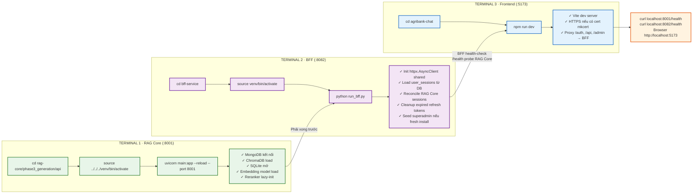

```mermaid
flowchart LR
    subgraph T1["TERMINAL 1 · RAG Core (:8001)"]
        direction TB
        A1["cd rag-core/phase3_generation/api"]
        A2["source ../../../venv/bin/activate"]
        A3["uvicorn main:app --reload --port 8001"]
        A4["✓ MongoDB kết nối<br/>✓ ChromaDB load<br/>✓ SQLite mở<br/>✓ Embedding model load<br/>✓ Reranker lazy-init"]
        A1 --> A2 --> A3 --> A4
    end

    subgraph T2["TERMINAL 2 · BFF (:8082)"]
        direction TB
        B1["cd bff-service"]
        B2["source venv/bin/activate"]
        B3["python run_bff.py"]
        B4["✓ Init httpx.AsyncClient shared<br/>✓ Load user_sessions từ DB<br/>✓ Reconcile RAG Core sessions<br/>✓ Cleanup expired refresh tokens<br/>✓ Seed superadmin nếu fresh install"]
        B1 --> B2 --> B3 --> B4
    end

    subgraph T3["TERMINAL 3 · Frontend (:5173)"]
        direction TB
        C1["cd agribank-chat"]
        C2["npm run dev"]
        C3["✓ Vite dev server<br/>✓ HTTPS nếu có cert mkcert<br/>✓ Proxy /auth, /api, /admin → BFF"]
        C1 --> C2 --> C3
    end

    CHECK["curl localhost:8001/health<br/>curl localhost:8082/health<br/>Browser http://localhost:5173"]

    A4 -->|"Phải xong trước"| B3
    B4 -->|"BFF health-check<br/>/health probe RAG Core"| C2
    C3 --> CHECK

    classDef t1Node fill:#e8f5e9,stroke:#2e7d32,stroke-width:2px
    classDef t2Node fill:#f3e5f5,stroke:#6a1b9a,stroke-width:2px
    classDef t3Node fill:#e3f2fd,stroke:#1565c0,stroke-width:2px
    classDef checkNode fill:#fff3e0,stroke:#e65100,stroke-width:2px
    class A1,A2,A3,A4 t1Node
    class B1,B2,B3,B4 t2Node
    class C1,C2,C3 t3Node
    class CHECK checkNode
```