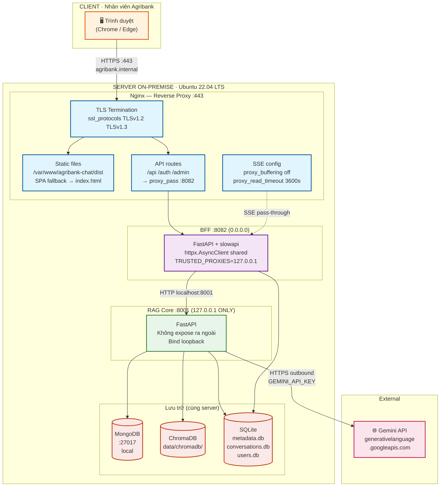

```mermaid
flowchart TB
    subgraph CLIENT["CLIENT · Nhân viên Agribank"]
        W["🖥️ Trình duyệt<br/>(Chrome / Edge)"]
    end

    subgraph SERVER["SERVER ON-PREMISE · Ubuntu 22.04 LTS"]
        direction TB
        subgraph NGINX["Nginx — Reverse Proxy :443"]
            N1["TLS Termination<br/>ssl_protocols TLSv1.2 TLSv1.3"]
            N2["Static files<br/>/var/www/agribank-chat/dist<br/>SPA fallback → index.html"]
            N3["API routes<br/>/api /auth /admin<br/>→ proxy_pass :8082"]
            N4["SSE config<br/>proxy_buffering off<br/>proxy_read_timeout 3600s"]
        end

        subgraph BFF_S["BFF :8082 (0.0.0.0)"]
            BF["FastAPI + slowapi<br/>httpx.AsyncClient shared<br/>TRUSTED_PROXIES=127.0.0.1"]
        end

        subgraph CORE_S["RAG Core :8001 (127.0.0.1 ONLY)"]
            CR["FastAPI<br/>Không expose ra ngoài<br/>Bind loopback"]
        end

        subgraph STORAGE["Lưu trữ (cùng server)"]
            direction LR
            M[("MongoDB<br/>:27017<br/>local")]
            CH[("ChromaDB<br/>data/chromadb/")]
            SQ[("SQLite<br/>metadata.db<br/>conversations.db<br/>users.db")]
        end
    end

    subgraph EXT["External"]
        GM["🌐 Gemini API<br/>generativelanguage<br/>.googleapis.com"]
    end

    W -->|"HTTPS :443<br/>agribank.internal"| N1
    N1 --> N2
    N1 --> N3
    N3 --> BF
    N4 -.->|"SSE pass-through"| BF
    BF -->|"HTTP localhost:8001"| CR
    CR --> M
    CR --> CH
    CR --> SQ
    BF --> SQ
    CR -->|"HTTPS outbound<br/>GEMINI_API_KEY"| GM

    classDef clientNode fill:#fff3e0,stroke:#e65100,stroke-width:2px
    classDef nginxNode fill:#e1f5fe,stroke:#01579b,stroke-width:2px
    classDef bffNode fill:#f3e5f5,stroke:#6a1b9a,stroke-width:2px
    classDef coreNode fill:#e8f5e9,stroke:#2e7d32,stroke-width:2px
    classDef storageNode fill:#fbe9e7,stroke:#bf360c,stroke-width:2px
    classDef extNode fill:#fce4ec,stroke:#c2185b,stroke-width:2px
    class W clientNode
    class N1,N2,N3,N4 nginxNode
    class BF bffNode
    class CR coreNode
    class M,CH,SQ storageNode
    class GM extNode
```