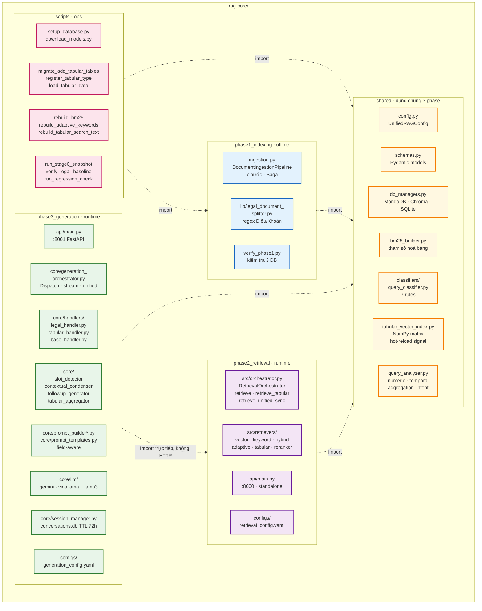

```mermaid
flowchart TB
    subgraph ROOT["rag-core/"]
        subgraph SHARED["shared · dùng chung 3 phase"]
            direction LR
            SH1["config.py<br/>UnifiedRAGConfig"]
            SH2["schemas.py<br/>Pydantic models"]
            SH3["db_managers.py<br/>MongoDB · Chroma · SQLite"]
            SH4["bm25_builder.py<br/>tham số hoá bảng"]
            SH5["classifiers/<br/>query_classifier.py<br/>7 rules"]
            SH6["tabular_vector_index.py<br/>NumPy matrix<br/>hot-reload signal"]
            SH7["query_analyzer.py<br/>numeric · temporal<br/>aggregation_intent"]
        end

        subgraph PH1["phase1_indexing · offline"]
            direction LR
            P11["ingestion.py<br/>DocumentIngestionPipeline<br/>7 bước · Saga"]
            P12["lib/legal_document_<br/>splitter.py<br/>regex Điều/Khoản"]
            P13["verify_phase1.py<br/>kiểm tra 3 DB"]
        end

        subgraph PH2["phase2_retrieval · runtime"]
            direction LR
            P21["src/orchestrator.py<br/>RetrievalOrchestrator<br/>retrieve · retrieve_tabular<br/>retrieve_unified_sync"]
            P22["src/retrievers/<br/>vector · keyword · hybrid<br/>adaptive · tabular · reranker"]
            P23["api/main.py<br/>:8000 · standalone"]
            P24["configs/<br/>retrieval_config.yaml"]
        end

        subgraph PH3["phase3_generation · runtime"]
            direction LR
            P31["api/main.py<br/>:8001 FastAPI"]
            P32["core/generation_<br/>orchestrator.py<br/>Dispatch · stream · unified"]
            P33["core/handlers/<br/>legal_handler.py<br/>tabular_handler.py<br/>base_handler.py"]
            P34["core/<br/>slot_detector<br/>contextual_condenser<br/>followup_generator<br/>tabular_aggregator"]
            P35["core/prompt_builder*.py<br/>core/prompt_templates.py<br/>field-aware"]
            P36["core/llm/<br/>gemini · vinallama · llama3"]
            P37["core/session_manager.py<br/>conversations.db TTL 72h"]
            P38["configs/<br/>generation_config.yaml"]
        end

        subgraph SCRIPTS["scripts · ops"]
            direction LR
            SC1["setup_database.py<br/>download_models.py"]
            SC2["migrate_add_tabular_tables<br/>register_tabular_type<br/>load_tabular_data"]
            SC3["rebuild_bm25<br/>rebuild_adaptive_keywords<br/>rebuild_tabular_search_text"]
            SC4["run_stage0_snapshot<br/>verify_legal_baseline<br/>run_regression_check"]
        end
    end

    PH1 -.->|import| SHARED
    PH2 -.->|import| SHARED
    PH3 -.->|import| SHARED
    PH3 -.->|import trực tiếp, không HTTP| PH2
    SCRIPTS -.->|import| SHARED
    SCRIPTS -.->|import| PH1

    classDef sharedNode fill:#fff8e1,stroke:#f57c00,stroke-width:2px
    classDef ph1Node fill:#e3f2fd,stroke:#1565c0,stroke-width:2px
    classDef ph2Node fill:#f3e5f5,stroke:#6a1b9a,stroke-width:2px
    classDef ph3Node fill:#e8f5e9,stroke:#2e7d32,stroke-width:2px
    classDef scNode fill:#fce4ec,stroke:#c2185b,stroke-width:2px
    class SH1,SH2,SH3,SH4,SH5,SH6,SH7 sharedNode
    class P11,P12,P13 ph1Node
    class P21,P22,P23,P24 ph2Node
    class P31,P32,P33,P34,P35,P36,P37,P38 ph3Node
    class SC1,SC2,SC3,SC4 scNode
```