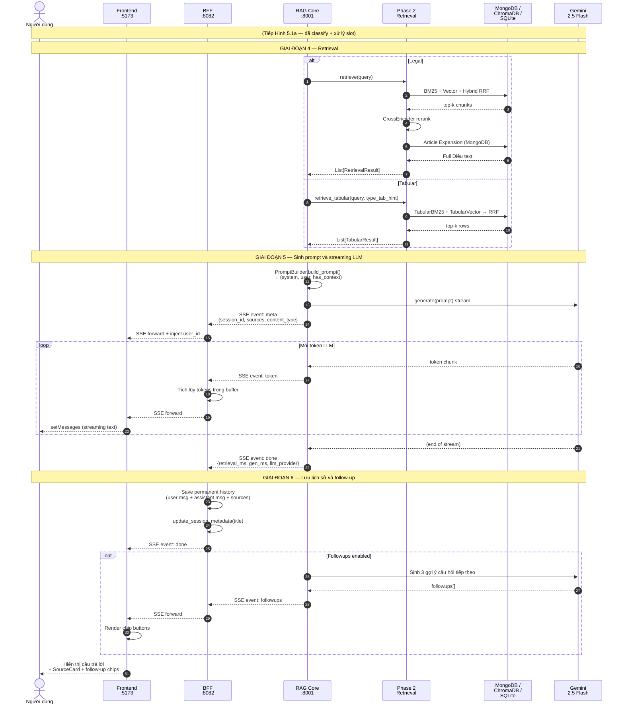

```mermaid
sequenceDiagram
    autonumber
    actor U as Người dùng
    participant FE as Frontend<br/>:5173
    participant BFF as BFF<br/>:8082
    participant RAG as RAG Core<br/>:8001
    participant P2 as Phase 2<br/>Retrieval
    participant DB as MongoDB /<br/>ChromaDB /<br/>SQLite
    participant LLM as Gemini<br/>2.5 Flash

    Note over U,LLM: (Tiếp Hình 5.1a — đã classify + xử lý slot)

    Note over U,LLM: GIAI ĐOẠN 4 — Retrieval

    alt Legal
        RAG->>P2: retrieve(query)
        P2->>DB: BM25 + Vector + Hybrid RRF
        DB-->>P2: top-k chunks
        P2->>P2: CrossEncoder rerank
        P2->>DB: Article Expansion (MongoDB)
        DB-->>P2: Full Điều text
        P2-->>RAG: List[RetrievalResult]
    else Tabular
        RAG->>P2: retrieve_tabular(query, type_tab_hint)
        P2->>DB: TabularBM25 + TabularVector → RRF
        DB-->>P2: top-k rows
        P2-->>RAG: List[TabularResult]
    end

    Note over U,LLM: GIAI ĐOẠN 5 — Sinh prompt và streaming LLM

    RAG->>RAG: PromptBuilder.build_prompt()<br/>→ (system, user, has_context)

    RAG->>LLM: generate(prompt) stream

    RAG-->>BFF: SSE event: meta<br/>{session_id, sources, content_type}
    BFF-->>FE: SSE forward + inject user_id

    loop Mỗi token LLM
        LLM-->>RAG: token chunk
        RAG-->>BFF: SSE event: token
        BFF->>BFF: Tích lũy tokens trong buffer
        BFF-->>FE: SSE forward
        FE-->>U: setMessages (streaming text)
    end

    LLM-->>RAG: (end of stream)
    RAG-->>BFF: SSE event: done<br/>{retrieval_ms, gen_ms, llm_provider}

    Note over U,LLM: GIAI ĐOẠN 6 — Lưu lịch sử và follow-up

    BFF->>BFF: Save permanent history<br/>(user msg + assistant msg + sources)
    BFF->>BFF: update_session_metadata(title)
    BFF-->>FE: SSE event: done

    opt Followups enabled
        RAG->>LLM: Sinh 3 gợi ý câu hỏi tiếp theo
        LLM-->>RAG: followups[]
        RAG-->>BFF: SSE event: followups
        BFF-->>FE: SSE forward
        FE->>FE: Render chip buttons
    end

    FE-->>U: Hiển thị câu trả lời<br/>+ SourceCard + follow-up chips
```