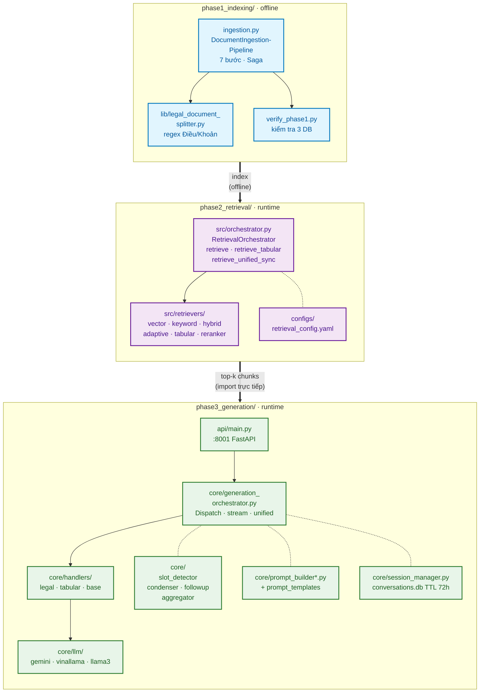

```mermaid
flowchart TB
    subgraph P1["phase1_indexing/ · offline"]
        direction TB
        P1A["ingestion.py<br/>DocumentIngestion-<br/>Pipeline<br/>7 bước · Saga"]
        P1B["lib/legal_document_<br/>splitter.py<br/>regex Điều/Khoản"]
        P1C["verify_phase1.py<br/>kiểm tra 3 DB"]
        P1A --> P1B
        P1A --> P1C
    end

    subgraph P2["phase2_retrieval/ · runtime"]
        direction TB
        P2A["src/orchestrator.py<br/>RetrievalOrchestrator<br/>retrieve · retrieve_tabular<br/>retrieve_unified_sync"]
        P2B["src/retrievers/<br/>vector · keyword · hybrid<br/>adaptive · tabular · reranker"]
        P2D["configs/<br/>retrieval_config.yaml"]
        P2A --> P2B
        P2A -.- P2D
    end

    subgraph P3["phase3_generation/ · runtime"]
        direction TB
        P3A["api/main.py<br/>:8001 FastAPI"]
        P3B["core/generation_<br/>orchestrator.py<br/>Dispatch · stream · unified"]
        P3C["core/handlers/<br/>legal · tabular · base"]
        P3F["core/llm/<br/>gemini · vinallama · llama3"]
        P3D["core/<br/>slot_detector<br/>condenser · followup<br/>aggregator"]
        P3E["core/prompt_builder*.py<br/>+ prompt_templates"]
        P3G["core/session_manager.py<br/>conversations.db TTL 72h"]
        P3A --> P3B
        P3B --> P3C
        P3C --> P3F
        P3B -.- P3D
        P3B -.- P3E
        P3B -.- P3G
    end

    P1 ==>|"index<br/>(offline)"| P2
    P2 ==>|"top-k chunks<br/>(import trực tiếp)"| P3

    classDef p1 fill:#E1F5FE,stroke:#0277BD,stroke-width:2px,color:#01579B
    classDef p2 fill:#F3E5F5,stroke:#6A1B9A,stroke-width:2px,color:#4A148C
    classDef p3 fill:#E8F5E9,stroke:#2E7D32,stroke-width:2px,color:#1B5E20

    class P1A,P1B,P1C p1
    class P2A,P2B,P2D p2
    class P3A,P3B,P3C,P3D,P3E,P3F,P3G p3
```