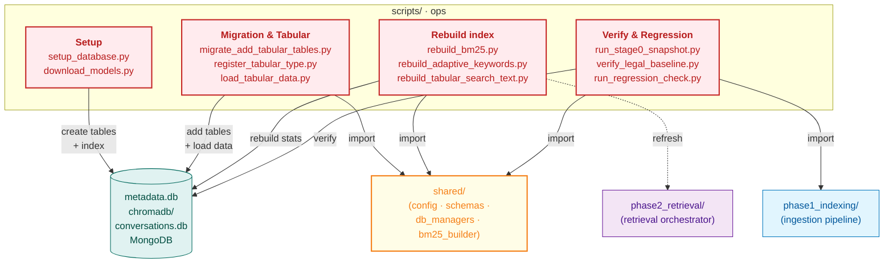

```mermaid
flowchart TB
    subgraph SCRIPTS["scripts/ · ops"]
        direction TB
        S_SETUP["<b>Setup</b><br/>setup_database.py<br/>download_models.py"]
        S_MIGRATE["<b>Migration & Tabular</b><br/>migrate_add_tabular_tables.py<br/>register_tabular_type.py<br/>load_tabular_data.py"]
        S_REBUILD["<b>Rebuild index</b><br/>rebuild_bm25.py<br/>rebuild_adaptive_keywords.py<br/>rebuild_tabular_search_text.py"]
        S_VERIFY["<b>Verify & Regression</b><br/>run_stage0_snapshot.py<br/>verify_legal_baseline.py<br/>run_regression_check.py"]
    end

    SHARED["shared/<br/>(config · schemas ·<br/>db_managers · bm25_builder)"]

    P1["phase1_indexing/<br/>(ingestion pipeline)"]

    P2["phase2_retrieval/<br/>(retrieval orchestrator)"]

    DBS[("metadata.db<br/>chromadb/<br/>conversations.db<br/>MongoDB")]

    S_SETUP -->|"create tables<br/>+ index"| DBS
    S_MIGRATE -->|"import"| SHARED
    S_MIGRATE -->|"add tables<br/>+ load data"| DBS
    S_REBUILD -->|"import"| SHARED
    S_REBUILD -->|"rebuild stats"| DBS
    S_REBUILD -.->|"refresh"| P2
    S_VERIFY -->|"import"| P1
    S_VERIFY -->|"import"| SHARED
    S_VERIFY -->|"verify"| DBS

    classDef scripts fill:#FFEBEE,stroke:#C62828,stroke-width:2px,color:#B71C1C
    classDef shared fill:#FFFDE7,stroke:#F57F17,stroke-width:2px,color:#F57F17
    classDef p1 fill:#E1F5FE,stroke:#0277BD,color:#01579B
    classDef p2 fill:#F3E5F5,stroke:#6A1B9A,color:#4A148C
    classDef db fill:#E0F2F1,stroke:#00695C,color:#004D40

    class S_SETUP,S_MIGRATE,S_REBUILD,S_VERIFY scripts
    class SHARED shared
    class P1 p1
    class P2 p2
    class DBS db
```