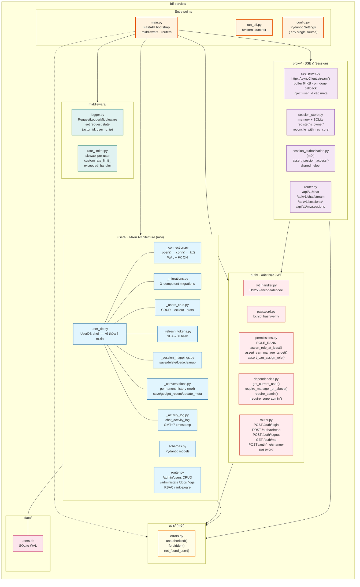

```mermaid
flowchart TB
    subgraph BFF["bff-service/"]
        direction TB

        subgraph ENTRY["Entry points"]
            E1["main.py<br/>FastAPI bootstrap<br/>middleware · routers"]
            E2["run_bff.py<br/>uvicorn launcher"]
            E3["config.py<br/>Pydantic Settings<br/>(.env single source)"]
        end

        subgraph AUTH["auth/ · Xác thực JWT"]
            A1["jwt_handler.py<br/>HS256 encode/decode"]
            A2["password.py<br/>bcrypt hash/verify"]
            A3["permissions.py<br/>ROLE_RANK<br/>assert_role_at_least()<br/>assert_can_manage_target()<br/>assert_can_assign_role()"]
            A4["dependencies.py<br/>get_current_user()<br/>require_manager_or_above()<br/>require_admin()<br/>require_superadmin()"]
            A5["router.py<br/>POST /auth/login<br/>POST /auth/refresh<br/>POST /auth/logout<br/>GET /auth/me<br/>POST /auth/me/change-password"]
        end

        subgraph USERS["users/ · Mixin Architecture (mới)"]
            U0["user_db.py<br/>UserDB shell — kế thừa 7 mixin"]
            U1["_connection.py<br/>_open() · _conn() · _tx()<br/>WAL + FK ON"]
            U2["_migrations.py<br/>3 idempotent migrations"]
            U3["_users_crud.py<br/>CRUD · lockout · stats"]
            U4["_refresh_tokens.py<br/>SHA-256 hash"]
            U5["_session_mappings.py<br/>save/delete/load/cleanup"]
            U6["_conversations.py<br/>permanent history (mới)<br/>save/get/get_recent/update_meta"]
            U7["_activity_log.py<br/>chat_activity_log<br/>GMT+7 timestamp"]
            U8["schemas.py<br/>Pydantic models"]
            U9["router.py<br/>/admin/users CRUD<br/>/admin/stats /docs /logs<br/>RBAC rank-aware"]
        end

        subgraph PROXY["proxy/ · SSE & Sessions"]
            P1["sse_proxy.py<br/>httpx.AsyncClient.stream()<br/>buffer 64KB · on_done callback<br/>inject user_id vào meta"]
            P2["session_store.py<br/>memory + SQLite<br/>register/is_owner/<br/>reconcile_with_rag_core"]
            P3["session_authorization.py<br/>(mới)<br/>assert_session_access()<br/>shared helper"]
            P4["router.py<br/>/api/v1/chat<br/>/api/v1/chat/stream<br/>/api/v1/sessions/*<br/>/api/v1/my/sessions"]
        end

        subgraph MID["middleware/"]
            M1["logger.py<br/>RequestLoggerMiddleware<br/>set request.state<br/>(actor_id, user_id, ip)"]
            M2["rate_limiter.py<br/>slowapi per-user<br/>custom rate_limit_<br/>exceeded_handler"]
        end

        subgraph UTILS["utils/ (mới)"]
            UT1["errors.py<br/>unauthorized()<br/>forbidden()<br/>not_found_user()"]
        end

        subgraph DATA["data/"]
            D1["users.db<br/>SQLite WAL"]
        end
    end

    E1 --> AUTH
    E1 --> USERS
    E1 --> PROXY
    E1 --> MID
    E1 -.-> UTILS

    AUTH --> UTILS
    USERS --> UTILS
    PROXY --> UTILS
    PROXY --> AUTH

    U0 --- U1
    U0 --- U2
    U0 --- U3
    U0 --- U4
    U0 --- U5
    U0 --- U6
    U0 --- U7

    USERS --- D1

    classDef entry fill:#FFF3E0,stroke:#E65100,stroke-width:2px
    classDef auth fill:#FFEBEE,stroke:#C62828,stroke-width:1px
    classDef users fill:#E1F5FE,stroke:#01579B,stroke-width:1px
    classDef proxy fill:#F3E5F5,stroke:#6A1B9A,stroke-width:1px
    classDef mid fill:#E0F2F1,stroke:#00695C,stroke-width:1px
    classDef utils fill:#FFFDE7,stroke:#F57F17,stroke-width:1px
    classDef data fill:#FCE4EC,stroke:#C2185B,stroke-width:1px

    class E1,E2,E3 entry
    class A1,A2,A3,A4,A5 auth
    class U0,U1,U2,U3,U4,U5,U6,U7,U8,U9 users
    class P1,P2,P3,P4 proxy
    class M1,M2 mid
    class UT1 utils
    class D1 data
```