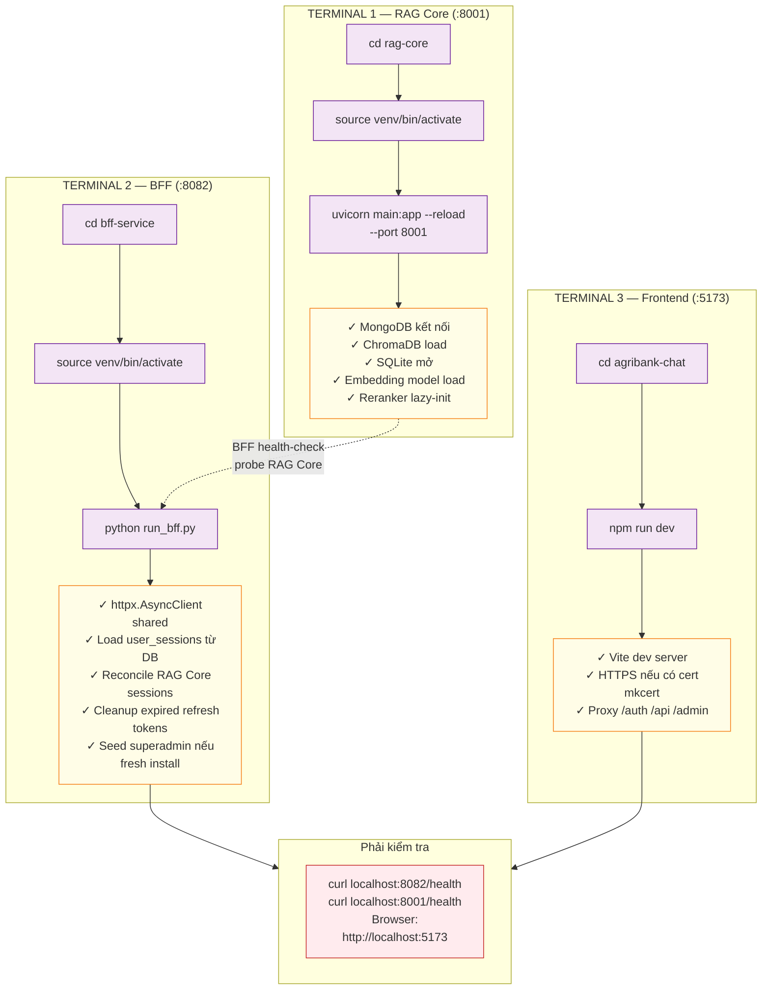

```mermaid
flowchart TB
    subgraph T1["TERMINAL 1 — RAG Core (:8001)"]
        direction TB
        A1["cd rag-core"] --> A2["source venv/bin/activate"] --> A3["uvicorn main:app --reload<br/>--port 8001"]
        A3 --> A4["✓ MongoDB kết nối<br/>✓ ChromaDB load<br/>✓ SQLite mở<br/>✓ Embedding model load<br/>✓ Reranker lazy-init"]
    end

    subgraph T2["TERMINAL 2 — BFF (:8082)"]
        direction TB
        B1["cd bff-service"] --> B2["source venv/bin/activate"] --> B3["python run_bff.py"]
        B3 --> B4["✓ httpx.AsyncClient<br/>shared<br/>✓ Load user_sessions từ<br/>DB<br/>✓ Reconcile RAG Core<br/>sessions<br/>✓ Cleanup expired refresh<br/>tokens<br/>✓ Seed superadmin nếu<br/>fresh install"]
    end

    subgraph T3["TERMINAL 3 — Frontend (:5173)"]
        direction TB
        C1["cd agribank-chat"] --> C2["npm run dev"]
        C2 --> C3["✓ Vite dev server<br/>✓ HTTPS nếu có cert<br/>mkcert<br/>✓ Proxy /auth /api /admin"]
    end

    subgraph CHECK["Phải kiểm tra"]
        H1["curl localhost:8082/health<br/>curl localhost:8001/health<br/>Browser:<br/>http://localhost:5173"]
    end

    A4 -.->|"BFF health-check<br/>probe RAG Core"| B3
    B4 --> CHECK
    C3 --> CHECK

    classDef term fill:#E8F5E9,stroke:#2E7D32,stroke-width:2px
    classDef cmd fill:#F3E5F5,stroke:#6A1B9A
    classDef ok fill:#FFFDE7,stroke:#F57F17
    classDef check fill:#FFEBEE,stroke:#C62828

    class A1,A2,B1,B2,C1 cmd
    class A3,B3,C2 cmd
    class A4,B4,C3 ok
    class H1 check
```