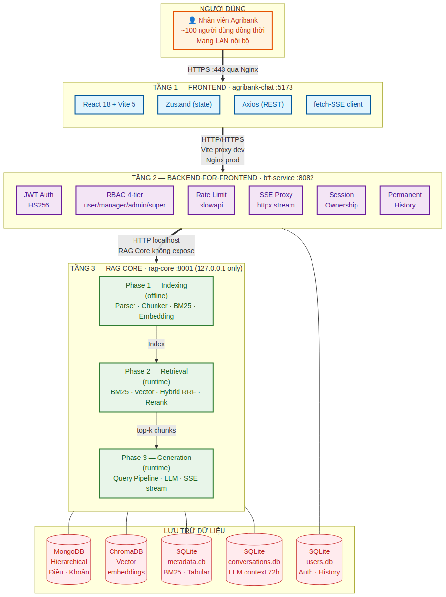
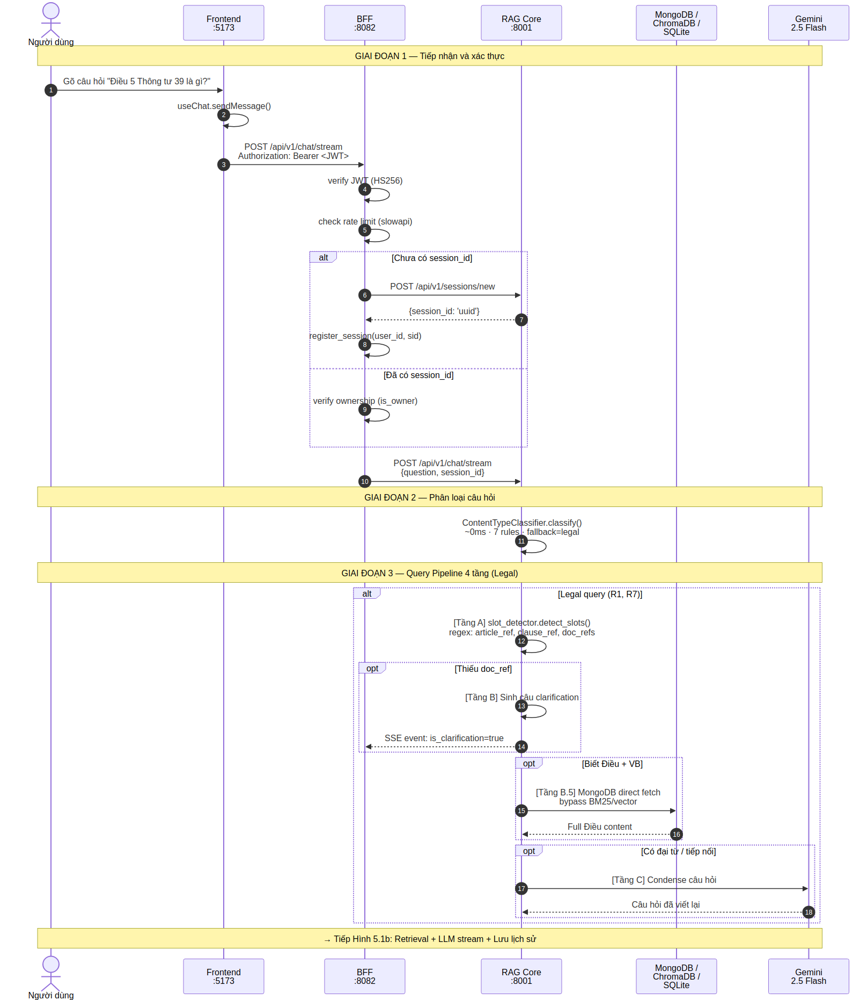
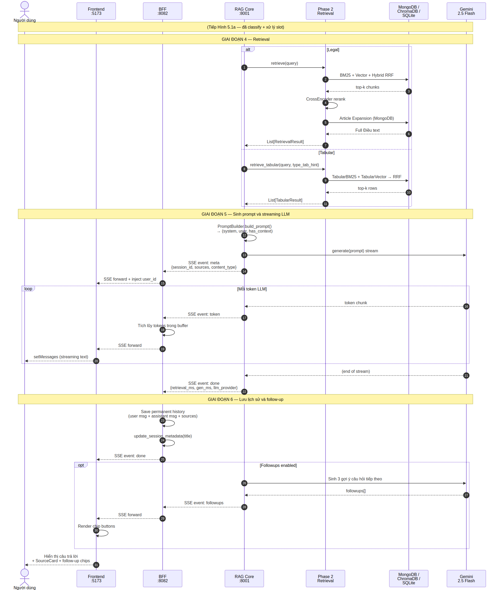
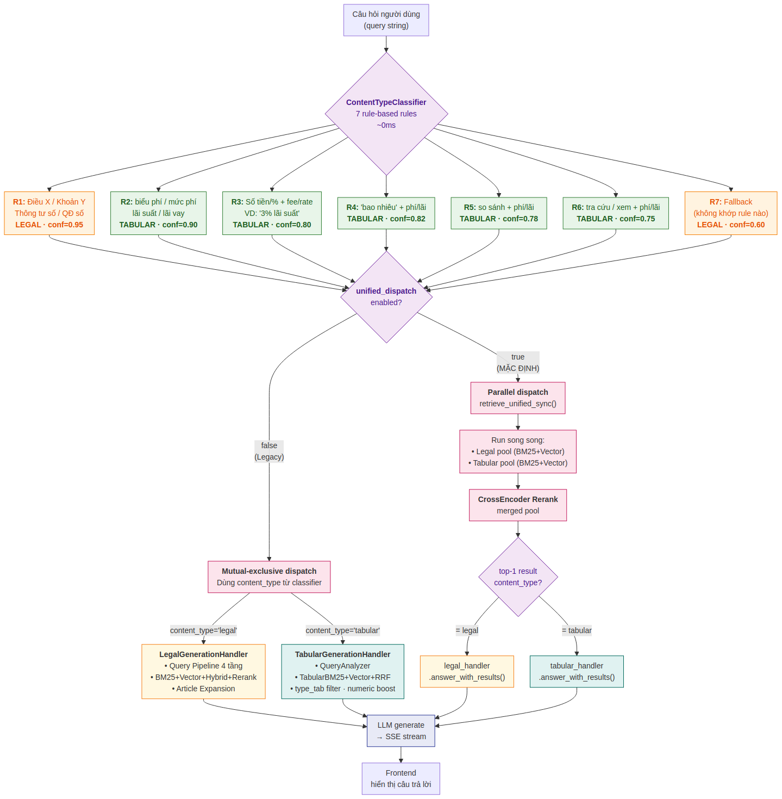
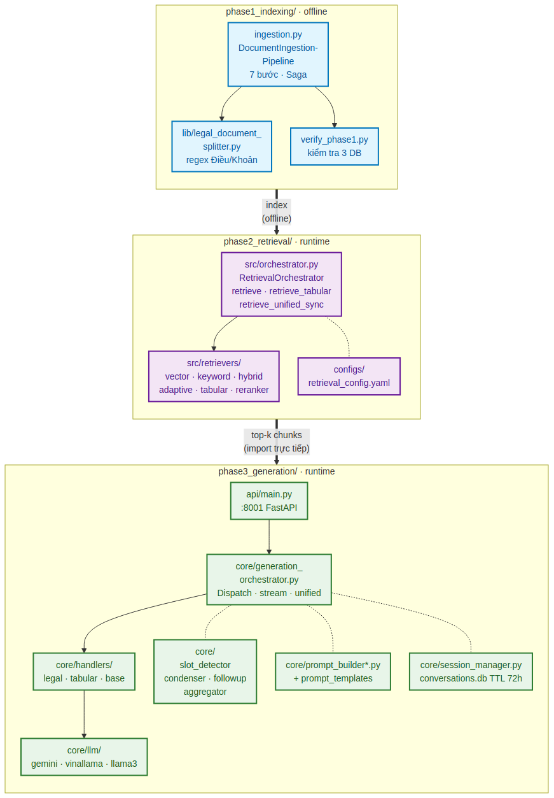
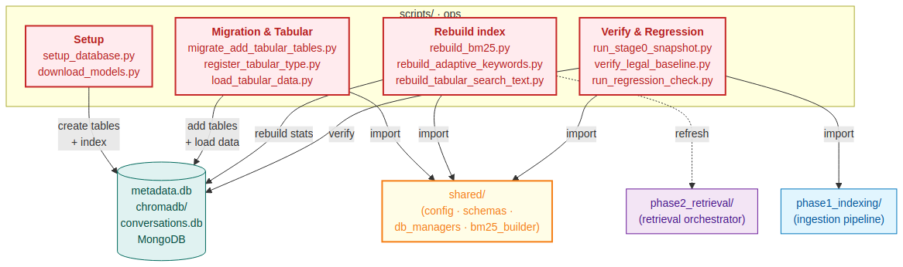
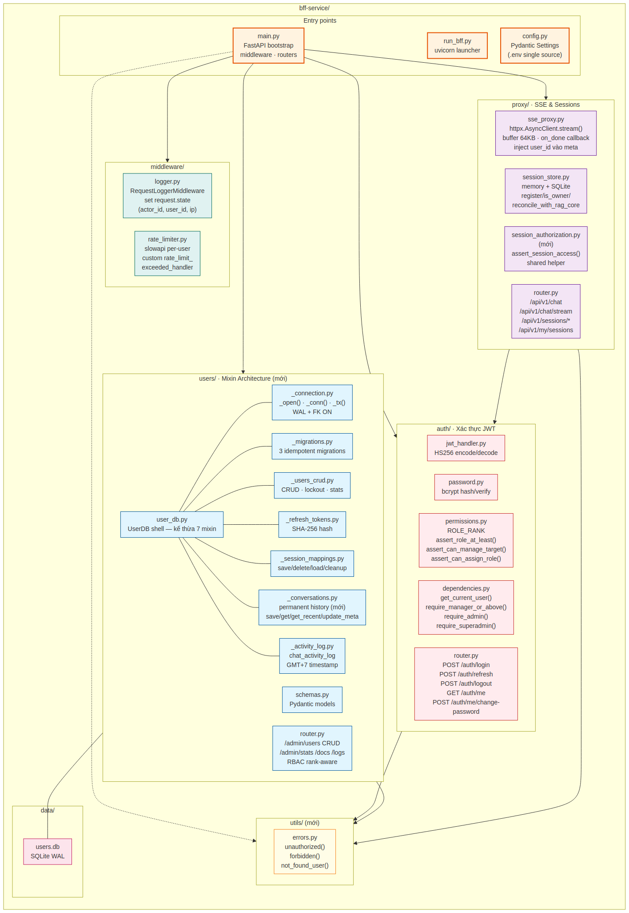
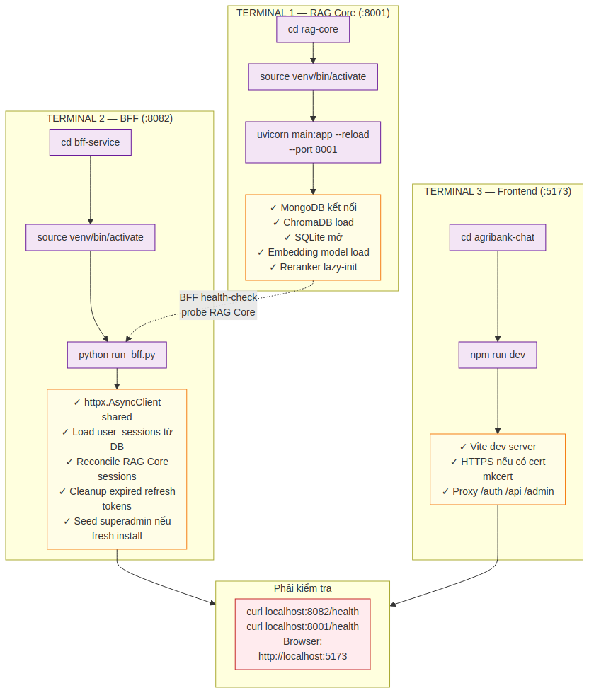
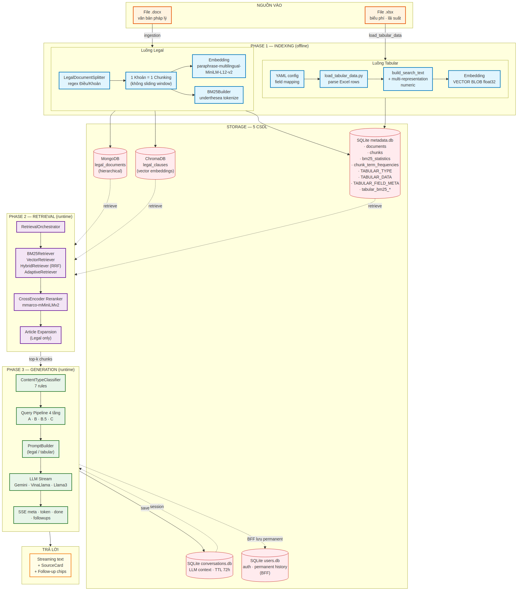
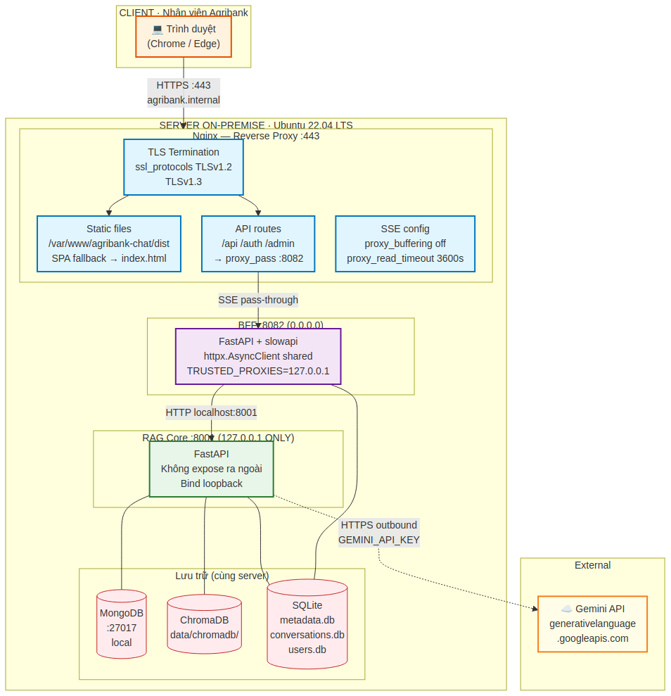

# PHẦN 1 - TỔNG QUAN HỆ THỐNG

## 1. Giới thiệu tài liệu

Tài liệu này mô tả toàn cảnh kiến trúc, thành phần và các luồng vận hành của hệ thống **RAG-Chatbot**  - một chatbot nội bộ tra cứu văn bản pháp luật, văn bản định chế và biểu phí, lãi suất dành cho cán bộ tác nghiệp tại Trung tâm Thanh toán. Đây là phần đầu tiên trong bộ tài liệu thiết kế gồm bốn phần, đóng vai trò giới thiệu chung để người đọc nhanh chóng định hình được bức tranh tổng thể trước khi đi sâu vào từng phân hệ ở các phần tiếp theo.

Đối tượng đọc gồm kỹ sư phần mềm tiếp nhận bàn giao hệ thống, chuyên viên vận hành và đào tạo viên phụ trách chuyển giao công nghệ. Mỗi khái niệm được giới thiệu kèm ngữ cảnh nghiệp vụ và lý do thiết kế (Why), do đó người đọc không cần kinh nghiệm trước với kiến trúc RAG vẫn có thể theo dõi được.

### Cấu trúc bộ tài liệu bốn phần

| Phần | Nội dung | Phạm vi chính |
|---|---|---|
| 1 | Tổng quan hệ thống | Bức tranh tổng thể - *tài liệu hiện tại* |
| 2 | RAG Core | Phase1 Indexing · Phase 2 Retrieval · Phase 3 Generation - toàn bộ logic AI |
| 3 | BFF Service | JWT, RBAC 4 tầng, rate limit, SSE proxy, permanent history, mixin architecture |
| 4 | Agribank-Chat (UI) + Phụ lục | React + Vite, Zustand, sseClient, Admin panel, glossary tổng hợp |

Các phần sau tham chiếu chéo ngược về Phần 1 này khi cần nhắc lại kiến trúc tổng, quy ước đặt tên hoặc chỉ số cổng. Phần 1 giữ vai trò là "bản đồ" xuyên suốt bộ tài liệu.

### Quy ước trình bày

- **Ngôn ngữ:** Tiếng Việt cho toàn bộ nội dung. Thuật ngữ kỹ thuật giữ nguyên tiếng Anh khi đó là tên thư viện, mô hình hoặc thuật ngữ chuyên ngành (RAG, BM25, JWT, SSE, embedding…). Mỗi thuật ngữ được giải nghĩa lần đầu xuất hiện và tổng hợp lại trong §12.
- **Code & file path:** Hiển thị bằng font `monospace`, ví dụ `bff-service/auth/permissions.py`.
- **Sơ đồ:** Đánh số theo định dạng `Hình M.N` trong đó M là số chương - sơ đồ Hình 5.1 là sơ đồ đầu tiên trong chương 5.
- **Phiên bản tham chiếu:** Tài liệu này phản ánh trạng thái codebase sau đợt refactor mới nhất (tháng 04/2026), bao gồm các nâng cấp: RBAC 4 tầng, Permanent Chat History, UserDB Mixin Architecture, Unified Dispatch mặc định bật.

---

## 2. Bối cảnh & Bài toán nghiệp vụ

### 2.1 Đặc thù nghiệp vụ pháp lý Agribank

Trung tâm Thanh toán Agribank quản lý một khối lượng lớn văn bản pháp lý nội bộ và liên quan: thông tư, quyết định, công văn, quy định nghiệp vụ ngân hàng… Tất cả đều cấu trúc theo chuẩn pháp quy Việt Nam với ba cấp phân cấp quen thuộc:

```
Văn bản (Thông tư / Nghị định / Quyết định)
└── Điều 1, Điều 2, ..., Điều N
    └── Khoản 1, Khoản 2, ...
        └── Điểm a), b), c) ...   (tuỳ Khoản có hoặc không)
```

Song song đó là **nhóm dữ liệu dạng bảng**: biểu phí dịch vụ (chuyển khoản, thẻ ATM, dịch vụ Internet Banking…), lãi suất cho vay, lãi suất tiền gửi. Các bảng này có thể chứa hàng trăm dòng mỗi sheet, cập nhật thường xuyên theo các Quyết định của Tổng giám đốc và tham chiếu trực tiếp đến số văn bản ban hành.

### 2.2 Bài toán đặt ra

Tra cứu thủ công gặp nhiều hạn chế:

- **Tốn thời gian** - tìm kiếm Ctrl+F trong từng tệp `.docx` riêng lẻ, dễ bỏ sót khi từ khoá diễn đạt khác nhau giữa văn bản.
- **Khó liên kết các quy định liên quan** - một câu hỏi nghiệp vụ có thể chạm tới điều khoản trong nhiều văn bản; người tra cứu thường chỉ xem được 1–2 văn bản trước khi từ bỏ.
- **Trích dẫn không chuẩn hoá** - người dùng ghi lại nội dung mà thiếu thông tin định danh (số văn bản, Điều, Khoản, ngày ban hành), gây khó khăn cho hậu kiểm và đối chiếu.
- **Dữ liệu biểu phí ở Excel rời rạc** - khó tổng hợp, so sánh nhanh giữa các loại sản phẩm/đối tượng khách hàng.

Yêu cầu đặt ra là một công cụ tra cứu hội thoại bằng tiếng Việt, **trả lời có căn cứ Điều/Khoản cụ thể** từ kho văn bản nội bộ, hỗ trợ cả hai loại dữ liệu (văn bản pháp lý và bảng biểu phí), triển khai trên hạ tầng nội bộ Agribank với tài nguyên CPU thông thường.

### 2.3 Giải pháp: Kiến trúc RAG

Hệ thống áp dụng kiến trúc **Retrieval-Augmented Generation (RAG)**: khi người dùng đặt câu hỏi, hệ thống không để mô hình ngôn ngữ (LLM) trả lời từ "trí nhớ" nội tại (để hạn chế hiện tượng ảo giác - hallucination), mà **truy xuất trước** các đoạn văn bản liên quan từ kho dữ liệu đã lập chỉ mục, sau đó ghép chúng vào câu lệnh (prompt) và yêu cầu LLM trả lời dựa trên ngữ cảnh đó. Trả lời được gắn kèm nguồn tham chiếu nên người dùng luôn kiểm chứng được.

**Ưu điểm chính của RAG áp dụng cho nghiệp vụ pháp lý:**

- **Trả lời có căn cứ** - mỗi câu trả lời đi kèm Điều/Khoản trong văn bản nguồn, cho phép nhân viên nhanh chóng kiểm chứng. Đây là yêu cầu cốt lõi của một hệ thống dùng trong môi trường ngân hàng có tính tuân thủ cao.
- **Cập nhật không cần huấn luyện lại mô hình** - thêm văn bản mới chỉ cần chạy pipeline ingest, không phải tinh chỉnh (fine-tune) LLM. Khi cơ quan quản lý nhà nước ban hành thông tư mới, chỉ mất vài phút để đưa vào hệ thống.
- **Kiểm soát thông tin** - LLM chỉ có thể nói những gì có trong kho văn bản; không thể "bịa" từ tập dữ liệu huấn luyện (training data). Nếu không tìm thấy nguồn, LLM được hướng dẫn nói rõ "không tìm thấy thông tin trong kho văn bản" thay vì đoán mò.
- **Chi phí thấp** - không cần hạ tầng GPU để chạy LLM. Hệ thống dùng API Gemini (cloud) hoặc mô hình nhỏ chạy CPU (VinaLlama, Llama 3) làm dự phòng (fallback).

**So sánh nhanh RAG và Fine-tuning:**

| Tiêu chí | RAG | Fine-tuning |
|---|---|---|
| Cập nhật văn bản mới | Vài phút (ingest) | Vài giờ–ngày (retrain) |
| Trích dẫn nguồn | Tự nhiên (truy ngược dữ liệu gốc) | Khó - mô hình có trí nhớ "mờ" |
| Hạ tầng | CPU đủ | Cần GPU |
| Tính tuân thủ ngân hàng | Cao (audit được) | Thấp (khó truy trách nhiệm) |
| Xử lý văn bản đã sửa đổi | Xoá + ingest mới | Phải retrain toàn bộ |

Tóm lại, **RAG là lựa chọn hợp lý duy nhất** cho bối cảnh Agribank: corpus tập trung (~500 văn bản pháp lý chuyên ngành), tần suất cập nhật cao, hạ tầng on-premise hạn chế GPU, yêu cầu tuân thủ kiểm toán bắt buộc.

---

## 3. Kiến trúc tổng thể - 3 tầng

Hệ thống được tách thành **ba phân hệ (tầng) độc lập**, triển khai cùng một máy chủ nhưng chạy như ba tiến trình khác nhau. Sự tách bạch này cho phép:

1. **Nâng cấp từng phân hệ mà không ảnh hưởng đến các phần còn lại** - ví dụ deploy phiên bản frontend mới không cần restart RAG Core (vốn tốn 30–60 giây do load embedding model).
2. **Phân định rõ ranh giới trách nhiệm khi gỡ lỗi** - log của mỗi phân hệ tách bạch, dễ truy vết.
3. **Thực thi nguyên tắc bảo mật tối thiểu đặc quyền** - tầng AI chỉ lắng nghe localhost, không thể bị truy cập trực tiếp từ mạng.
4. **Cô lập dependency** - mỗi phân hệ có virtualenv/node_modules riêng, tránh xung đột phiên bản (đặc biệt quan trọng giữa ML libraries nặng ở RAG Core và web frameworks nhẹ ở BFF).



*Hình 3.1 - Kiến trúc 3 tầng và các cơ sở dữ liệu hỗ trợ.*

### 3.1 Ba tầng và trách nhiệm

| Tầng | Phân hệ | Cổng | Trách nhiệm chính |
|:-:|---|:-:|---|
| 1 | `agribank-chat` (React + Vite) | 5173 | Giao diện người dùng, render streaming, quản lý state UI, xử lý JWT refresh, fetch-based SSE client (không dùng EventSource gốc vì không inject được Authorization header). |
| 2 | `bff-service` (FastAPI) | 8082 | **Backend-for-Frontend**: xác thực JWT, phân quyền RBAC 4 cấp, rate limiting per-user, proxy SSE, ownership session, lưu permanent history trong SQLite. Tầng giữ tất cả các vấn đề cross-cutting concerns. |
| 3 | `rag-core` (Python) | 8001 | Toàn bộ logic AI: parser tài liệu, chunking, embedding, BM25, vector search, rerank, LLM call, sinh câu trả lời. Bind chỉ trên loopback (`127.0.0.1`). |

### 3.2 Sáu nguyên tắc kiến trúc bất biến

Đây là những nguyên tắc **không được vi phạm** khi mở rộng hệ thống. Vi phạm bất kỳ nguyên tắc nào dưới đây đều là dấu hiệu thiết kế cần xem xét lại.

| # | Nguyên tắc | Lý do |
|:-:|---|---|
| **N1** | RAG Core chỉ bind `127.0.0.1` - không expose ra ngoài dưới bất kỳ hình thức nào. | RAG Core chứa logic nhạy cảm (truy vấn DB, gọi LLM với API key, không có tầng auth). BFF là cổng duy nhất phải qua xác thực. |
| **N2** | BFF là cổng duy nhất ra ngoài - mọi request từ frontend đều phải qua JWT. | Tập trung xác thực, phân quyền, rate limit vào một nơi. Không phải nhân bản logic auth ở RAG Core. Nếu cần thêm tính năng (audit, logging, OIDC…), chỉ sửa ở BFF. |
| **N3** | Frontend không bao giờ gọi RAG Core trực tiếp - phải qua BFF. | Tôn trọng N1 và N2. Đồng thời giúp BFF có thể cache, log, kiểm soát tốc độ. Frontend chỉ biết một URL duy nhất ra ngoài: BFF. |
| **N4** | Phase 3 gọi Phase 2 qua **import Python trực tiếp**, không HTTP. | Tiết kiệm overhead serialization JSON và connection pool. Phase 2 API `:8000` chỉ cần khi test retrieval độc lập, không khi vận hành chatbot thường ngày. |
| **N5** | Hai pipeline **Legal** (VB pháp lý) và **Tabular** (bảng dữ liệu) cách ly hoàn toàn - zero cross-contamination. | Legal query không bao giờ chạm `TABULAR_*` tables; tabular query không chạm MongoDB/ChromaDB. Tránh nhiễu điểm số khi BM25/Vector tính trên hai phân phối dữ liệu rất khác nhau. |
| **N6** | Fallback về `'legal'` khi không rõ - zero regression guarantee. | `ContentTypeClassifier` nghi ngờ thì luôn trả về `'legal'` (hành vi trước đây), bảo toàn các truy vấn pháp lý vốn đã hoạt động tốt. Rủi ro bất cân xứng: legal RAG trả "không tìm thấy" còn tabular RAG trả lời sai số liệu sẽ nguy hiểm hơn. |

### 3.3 Trao đổi giữa các tầng

| Từ → Đến | Giao thức | Định dạng | Ghi chú |
|---|---|---|---|
| Browser → Frontend (static) | HTTPS | HTML / JS / CSS | Qua Nginx ở production; Vite dev server ở development. |
| Frontend → BFF | HTTP/HTTPS + SSE | JSON + `text/event-stream` | Axios cho REST; **fetch-based SSE** (không dùng `EventSource`) để inject JWT header. |
| BFF → RAG Core | HTTP + SSE | JSON + `text/event-stream` | `httpx.AsyncClient().stream()` - **không phải** `.post()` - để không buffer cả response trước khi forward. Đây là một trong những bài học khó nhất khi triển khai SSE: dùng nhầm `.post()` → toàn bộ phản hồi bị giữ lại đến hết generation, frontend không thấy streaming. |
| RAG Core ↔ MongoDB | MongoDB wire | BSON | `pymongo`, có `tenacity` retry 3 lần khi network blip. |
| RAG Core ↔ ChromaDB | SQLite/HTTP | Native | **Embedded mode** (file-based), không cần server ChromaDB riêng. Đơn giản hoá vận hành. |
| RAG Core ↔ SQLite | Direct file | SQL | 3 file SQLite riêng biệt: `metadata.db`, `conversations.db` (RAG Core), `users.db` (BFF). Mỗi file có WAL mode để hỗ trợ concurrent reads. |
| RAG Core → Gemini | HTTPS | JSON | Outbound internet qua API `google-genai` - **lưu ý:** đây là SDK mới, không dùng `google-generativeai` cũ (đã deprecated). |

---

## 4. Công nghệ nền

Bảng dưới đây liệt kê các thư viện chính được dùng ở mỗi tầng, kèm phiên bản tối thiểu đã kiểm chứng hoạt động ổn định trong môi trường Agribank. Khi nâng cấp phiên bản, cần rà soát compatibility note ở cuối mỗi mục - đặc biệt với `bcrypt` (cố định `4.0.1` vì `passlib==1.7.4` không tương thích `bcrypt>=4.1`).

### 4.1 Phân hệ rag-core (Python)

| Thư viện | Phiên bản tối thiểu | Vai trò |
|---|---|---|
| `fastapi` | ≥ 0.111.0 | Framework REST API cho Phase 2 và Phase 3. |
| `uvicorn` | ≥ 0.29.0 | ASGI server chạy FastAPI. |
| `pydantic` | ≥ 2.0.0 | Validation toàn bộ schemas trong `shared/schemas.py`. |
| `chromadb` | ≥ 0.4.22 | Vector DB, dùng ở chế độ embedded (file-based), không cần ChromaDB server. |
| `sentence-transformers` | ≥ 2.3.1 | Embeddings (`paraphrase-multilingual-MiniLM-L12-v2`) + cross-encoder rerank (`mmarco-mMiniLMv2-L12-H384-v1`). |
| `pymongo` | ≥ 4.6.0 | Driver MongoDB cho `MongoDBManager`. Có retry tenacity. |
| `python-docx` | ≥ 1.1.0 | Parser `.docx` trong `legal_document_splitter.py`. |
| `langchain-community` | ≥ 0.0.20 | Loader `.pdf` (`PyPDFLoader`) và `.txt` fallback. Chỉ dùng cho ingest. |
| `cachetools` | ≥ 5.3.0 | `TTLCache` cho retrieval result, thread-safe. |
| `tenacity` | ≥ 8.2.0 | Retry logic cho MongoDB (3 lần, exponential backoff). |
| `google-genai` | ≥ 1.0.0 | **SDK mới - không dùng `google-generativeai` cũ** (deprecated, API khác). Gemini 2.5 Flash. |
| `llama-cpp-python` | ≥ 0.2.20 | Backend chạy `.gguf` LLM trên CPU (VinaLlama, Llama 3). Tuỳ chọn - chỉ cài nếu dùng LLM local. |
| `underthesea` | ≥ 6.0.0 | Tokenizer tiếng Việt cho BM25. Quan trọng - fallback regex `\w+` cho ra kết quả kém hơn rõ rệt. |
| `numpy` | ≥ 1.24.0 | `TabularVectorIndex` - matrix cosine search in-memory. |
| `openpyxl` | ≥ 3.1.0 | Đọc file Excel biểu phí/lãi suất trong `load_tabular_data.py`. |
| `pyyaml` | ≥ 6.0.1 | Load config YAML (`retrieval_config`, `generation_config`, mapping tabular). |

### 4.2 Phân hệ bff-service (Python)

| Thư viện | Phiên bản tối thiểu | Vai trò |
|---|---|---|
| `fastapi` | ≥ 0.111.0 | Framework API gateway. |
| `uvicorn[standard]` | ≥ 0.29.0 | ASGI server với HTTP/2 và WebSocket support. |
| `python-jose[cryptography]` | ≥ 3.3.0 | Encode/decode JWT HS256. |
| `passlib[bcrypt]` | == 1.7.4 | Hash mật khẩu bcrypt - wrapper Pythonic. |
| `bcrypt` | **== 4.0.1** | **Cố định phiên bản** - `passlib 1.7.4` không tương thích `bcrypt>=4.1` (lỗi `__about__` attribute). Đây là một gotcha kinh điển khi `pip install -U bcrypt` đột nhiên làm break login. |
| `python-multipart` | ≥ 0.0.9 | Parse form-data cho endpoint `/auth/login`. |
| `httpx` | ≥ 0.27.0 | Async HTTP client để proxy SSE đến RAG Core. **Bắt buộc dùng `.stream()`**, không `.post()`. |
| `slowapi` | ≥ 0.1.9 | Rate limiting dựa trên `limits` library. Per-user (key = `user:<user_id>`). |
| `pydantic-settings` | ≥ 2.2.0 | Cấu hình từ `.env`, single source of truth. |

### 4.3 Phân hệ agribank-chat (Node.js / React)

| Thư viện | Phiên bản | Vai trò |
|---|---|---|
| `react` | ^18.3.1 | UI framework. |
| `react-dom` | ^18.3.1 | DOM renderer. |
| `react-router-dom` | ^6.23.1 | Client-side routing + route guards (`ProtectedRoute`, `AdminRoute`). |
| `vite` | ^5.2.13 | Dev server + production bundler. Có HMR cực nhanh. |
| `@vitejs/plugin-react` | ^4.3.0 | JSX transform cho Vite. |
| `zustand` | ^4.5.2 | State management - `authStore`, `useSessionStore`, `toastStore`. **Không dùng Redux** - boilerplate quá nặng cho quy mô app này. |
| `axios` | ^1.7.2 | HTTP client có interceptors cho JWT auto-refresh. |
| `react-markdown` | ^10.1.0 | Render Markdown trong `MessageBubble`. Tự escape XSS. |
| `remark-gfm` | ^4.0.1 | GitHub Flavored Markdown (bảng, checkbox, strikethrough…). |
| `react-virtuoso` | ^4.18.4 | Virtualized list cho `MessageList` khi có nhiều turn - render mượt với hàng trăm tin nhắn. |

### 4.4 LLM Providers

Hệ thống hỗ trợ **3 provider LLM**, chuyển đổi qua key `llm.provider` trong `generation_config.yaml` mà không cần sửa code:

| Provider | Model | Yêu cầu | Tốc độ | Ghi chú |
|---|---|---|---|---|
| `gemini` | `gemini-2.5-flash` | `GEMINI_API_KEY` | Nhanh (<3s first token) | **Mặc định.** Dùng `google.genai` SDK mới. Có fallback model `gemini-2.0-flash` khi primary fail (HTTP 503/429/500), retry 3 lần với exponential backoff. Cửa sổ ngữ cảnh 1M token - có thể đưa cả trăm chunk vào prompt mà vẫn dư. |
| `vinallama` | `VinaLlama-7b-chat q5_0 .gguf` | RAM ≥ 16 GB, CPU-only | 5–12 phút/câu | **Fallback local hoàn toàn không cần internet.** Dùng `llama-cpp-python` - không mặc định cài. Phù hợp khi kết nối Internet đến Gemini bị gián đoạn hoặc khi yêu cầu nghiêm ngặt không gửi dữ liệu ra cloud. |
| `llama3` | `Llama-3.2-3B-Instruct-Q4_K_M.gguf` | RAM ≥ 8 GB, CPU-only | 2–4 phút/câu | Phương án trung gian - nhỏ hơn VinaLlama nên nhanh hơn, nhưng hỗ trợ tiếng Việt kém hơn một chút. |

> **Quyết định kiến trúc:** Mặc định Gemini vì cân bằng tốt giữa tốc độ, độ chính xác và chi phí (free tier 15 req/phút đủ cho ~100 user nội bộ). Fallback local được giữ để đáp ứng yêu cầu BCP - Business Continuity Plan.

---

## 5. Luồng end-to-end một câu hỏi



*Hình 5.1a - Ba giai đoạn đầu: tiếp nhận (xác thực JWT, rate limit, session), phân loại câu hỏi (ContentTypeClassifier 7 rules), Query Pipeline 4 tầng (Tầng A slot detection, B clarification, B.5 MongoDB direct fetch, C contextual condense).*



*Hình 5.1b - Ba giai đoạn cuối: retrieval (Phase 2 BM25+Vector+Rerank+Article Expansion), sinh prompt và streaming LLM qua SSE, lưu lịch sử vào BFF + RAG Core và sinh follow-up gợi ý.*

*Hình 5.1 - Sequence diagram một câu hỏi đi từ người dùng đến câu trả lời có trích dẫn.*

Sơ đồ trên thể hiện đầy đủ ~46 bước trong một lần hỏi-đáp, chia thành 6 giai đoạn rõ rệt được diễn giải dưới đây.

### 5.1 Giai đoạn 1 - Tiếp nhận và xác thực (bước 1–9)

Người dùng gõ câu hỏi vào ô input. Frontend gọi hàm React hook `useChat.sendMessage()` - không phải gửi `XMLHttpRequest` trực tiếp. Hook này đóng gói câu hỏi thành body JSON rồi gọi `sseClient.streamChat()` - một SSE client tuỳ chỉnh dùng `fetch` (không dùng `EventSource` gốc) vì `EventSource` không cho phép inject header `Authorization`.

Request đến BFF với header `Bearer <JWT>`. BFF thực hiện song song hai việc cực nhanh, không cần hỏi database:

- **Verify JWT** qua `python-jose` HS256 - trả 401 nếu hết hạn hoặc token không hợp lệ.
- **Check rate limit** qua `slowapi` theo `user_id` - trả 429 với header `Retry-After` nếu vượt ngưỡng (mặc định `20/minute` cho chat, `60/minute` cho các endpoint khác).

Nếu chưa có `session_id`, BFF gọi `POST /api/v1/sessions/new` trên RAG Core để cấp một UUID, sau đó đăng ký mapping `(user_id → session_id)` vào SQLite và memory store. Quy trình này được đặt **trước** khi forward câu hỏi - có chủ đích - nhằm đảm bảo ownership đã được ghi khi RAG Core bắt đầu xử lý. Nếu client ngắt kết nối giữa chừng streaming, session không bị "mồ côi" (không gắn với ai).

Nếu đã có `session_id`, BFF gọi `is_owner(user_id, session_id)` từ `SessionStore` - tra cứu O(1) trong memory map. Trả 403 nếu không phải chủ (admin/superadmin được bypass với audit log).

### 5.2 Giai đoạn 2 - Phân loại câu hỏi (bước 10–11)

Sau khi BFF forward sang RAG Core, bước đầu tiên là `ContentTypeClassifier.classify()` - hàm rule-based hoàn toàn, **không gọi LLM**, độ trễ ~0ms. Classifier có 7 rule theo thứ tự ưu tiên, first-match-wins, fallback về `'legal'` khi không rule nào khớp (đảm bảo zero regression cho các truy vấn pháp lý vốn đã hoạt động tốt trước khi có Tabular pipeline).

Kết quả là một `ClassificationResult` gồm:

- `content_type`: `'legal'` hoặc `'tabular'`.
- `confidence`: float trong khoảng `[0.60, 0.95]`.
- `matched_rule`: `'R1'`–`'R7'` (dùng để debug và thống kê).
- `type_tab_hint`: với tabular, gợi ý sub-type cụ thể (`PHI_CANHAN`, `PHI_TOCHUC`, `LAI_SUAT`…) để Phase 2 có thể filter sớm.

### 5.3 Giai đoạn 3 - Query Pipeline 4 tầng cho Legal (bước 12–18)

Nếu câu hỏi được phân loại Legal, `LegalGenerationHandler` chạy **bốn tầng xử lý trước khi retrieval** - một cải tiến quan trọng giúp giảm tải vector search và trả lời đúng tài liệu. Đây là điểm khác biệt then chốt so với một RAG pipeline thông thường:

- **Tầng A - Slot detection** (regex ~0ms): phát hiện `article_ref` (`'Điều 5'`), `clause_ref` (`'Khoản 2'`), `doc_refs` (tên văn bản cụ thể), `has_pronoun` (đại từ), `is_continuation` (câu tiếp nối), `is_comparison` (câu so sánh giữa các văn bản).

- **Tầng B - Clarification**: nếu người dùng nêu Điều/Khoản mà chưa nêu văn bản nào (`'Khoản 3 Điều 5 quy định gì?'` mà không có doc_ref), hệ thống hỏi lại trước khi retrieval. Giúp tránh trả nhầm Điều trùng số ở văn bản khác. **Tầng B.2 - Disambiguation** xử lý trường hợp tinh tế hơn: khi user hỏi `'Thông tư 39'` mà có ≥2 văn bản trùng số (ví dụ `39/2016/TT-NHNN` và `39/2024/TT-NHNN`), hệ thống không pick ngẫu nhiên mà liệt kê options và hỏi user chọn.

- **Tầng B.5 - MongoDB direct fetch**: khi đã biết chính xác Điều + tên văn bản, **bypass BM25/vector hoàn toàn** - fetch thẳng từ MongoDB. Lý do: một số Điều có thể không có chunks tốt trong SQLite BM25 (ví dụ Điều quá ngắn, ít từ khoá), nhưng có đầy đủ trong MongoDB. Có nhiều biến thể (B.5b, B.5c, B.5d) tuỳ ngữ cảnh history - chi tiết tại Phần 2 §3.

- **Tầng C - Contextual condense**: khi câu hỏi có đại từ (`'cái đó'`, `'nó'`…) hoặc tiếp nối (`'thì sao?'`), gọi LLM condense câu hỏi - biến `'Điều 6 thì sao?'` (sau câu hỏi về Điều 5 Thông tư 39) thành `'Điều 6 Thông tư 39 quy định gì?'`. Đây là tầng duy nhất cần LLM trong pipeline - các tầng A/B/B.5 đều regex.

Triết lý xuyên suốt: **regex giải quyết được thì không dùng LLM**. Tầng A+B+B.2+B.5 đều ~0ms latency, chỉ Tầng C tốn thêm 1 lần gọi LLM nhanh.

### 5.4 Giai đoạn 4 - Retrieval (bước 19–26)

**Với câu hỏi Legal**, Phase 2 chạy song song:

1. **BM25** (keyword, SQLite) - `BM25Retriever` trên các bảng `chunks`, `bm25_statistics`, `chunk_term_frequencies`. Tokenize tiếng Việt bằng `underthesea`, công thức Okapi BM25 với `k1=1.5`, `b=0.75`.
2. **Vector** (semantic, ChromaDB) - `VectorRetriever` query collection `legal_clauses` bằng cosine similarity. Embedding model `paraphrase-multilingual-MiniLM-L12-v2` cho ra vector 384 chiều.

Hai danh sách kết quả được hợp nhất bằng **Reciprocal Rank Fusion** với `k=60`:

```
RRF_score(d) = Σ 1 / (k + rank(d))
```

Sau đó **CrossEncoder reranker** (`mmarco-mMiniLMv2-L12-H384-v1`) chấm lại top-20 theo cặp `(query, chunk)` - chính xác hơn nhưng chậm hơn vì O(N) chứ không phải O(1) như cosine, nên đặt ở bước cuối thay vì áp dụng cho toàn corpus.

**Article Expansion** là bước quan trọng: top chunks thường chỉ là một Khoản đơn lẻ; hệ thống fetch toàn bộ Điều từ MongoDB (gồm tất cả Khoản của Điều đó) để đưa vào prompt - giúp LLM hiểu ngữ cảnh đầy đủ. Một Khoản tách rời Điều có thể vô nghĩa (ví dụ Khoản quy định "Trong trường hợp quy định tại Khoản 1…").

**Với câu hỏi Tabular**, Phase 2 chạy một luồng tương đương nhưng trên bảng `TABULAR_DATA` của SQLite: `TabularBM25Retriever` + `TabularVectorIndex` (in-memory NumPy matrix L2-normalized), hợp nhất bằng RRF. **Không có Article Expansion** vì mỗi dòng biểu phí đã là một đơn vị ngữ nghĩa độc lập - không có cấu trúc phân cấp như văn bản pháp lý.

### 5.5 Giai đoạn 5 - Sinh prompt và streaming LLM (bước 27–34)

`PromptBuilder.build_prompt()` trả về một **tuple ba phần tử** `(system_prompt, user_prompt, has_context)`:

- `system_prompt`: cố định, định nghĩa vai trò ("trợ lý pháp lý Agribank") và 5 quy tắc bắt buộc (luôn trích dẫn Điều/Khoản, không bịa, không suy đoán ngoài tài liệu, trả lời bằng tiếng Việt, ghi rõ thời điểm áp dụng với số liệu).
- `user_prompt`: ghép context block (các Điều đã retrieve, ưu tiên `article_text` đã expand) + history block (5 lượt gần nhất) + câu hỏi.
- `has_context`: `False` khi không tìm thấy chunk liên quan - prompt yêu cầu LLM trả lời rằng *"không tìm thấy thông tin trong kho văn bản"* - **ngăn LLM bịa**.

LLM generate ở chế độ streaming. Vì iterator của Gemini và VinaLlama đều **blocking**, RAG Core phải dùng `loop.run_in_executor()` + `asyncio.Queue` để đẩy từng token vào queue; coroutine chính `await queue.get()` rồi yield SSE token event. Nếu không dùng pattern này, FastAPI event loop sẽ bị block → toàn bộ service đứng.

RAG Core gửi ngay **`meta` event** đầu tiên (chứa `session_id`, `sources`, `content_type`), sau đó stream từng **`token` event** cho đến khi xong, đóng bằng **`done` event** với thời gian retrieval/generation và metadata `effective_sources` (sources đã filter theo citations thực sự).

### 5.6 Giai đoạn 6 - Lưu lịch sử và gửi follow-up (bước 35–46)

Trong khi forward stream về frontend, BFF đồng thời tích luỹ tokens trong buffer cục bộ. Khi nhận `done` event, BFF ghi **permanent history**: `user_msg` + `assistant_msg` + `sources` vào bảng `conversations` ở `users.db` (SQLite của BFF). Đây là **lớp lưu trữ vĩnh viễn** - sau 72h, context window ở RAG Core hết hạn (TTL), nhưng lịch sử vẫn hiển thị được trên sidebar frontend.

> **Tinh tế:** title của session được **lưu sớm ngay khi nhận `meta` event** (không đợi `done`). Lý do: nếu stream bị gián đoạn (client disconnect, Gemini timeout) trước khi `done` đến, ít nhất title vẫn được ghi → user không bị kẹt với session "Hội thoại mới" sau khi reload.

Nếu tính năng `followup_suggestions.enabled` bật (mặc định **tắt**), RAG Core gọi LLM lần nữa **sau `done`** (non-blocking - không chặn luồng chính) để sinh 3 gợi ý câu hỏi tiếp theo dựa vào câu hỏi gốc + câu trả lời. Stream về như event `followups`. Frontend render thành 3 chip buttons; click chip = gửi câu hỏi đó như một turn mới.

> **Quy tắc thiết kế:** Nếu followup fail (timeout, LLM error) → swallow exception, không ảnh hưởng câu trả lời chính đã `done`. Trải nghiệm chính của user không bao giờ bị block bởi tính năng phụ.

---

## 6. Hai pipeline song song - Content Type Dispatch

Một trong những quyết định kiến trúc quan trọng nhất của hệ thống là **chạy song song hai pipeline Legal và Tabular** với cơ chế điều phối dựa trên một biến duy nhất - `content_type`. Cơ chế này giúp:

- **(a)** Giữ nguyên luồng pháp lý đã chạy ổn định trước đây (zero regression).
- **(b)** Mở rộng sang loại dữ liệu mới (biểu phí, lãi suất, khuyến mãi…) mà không sửa core.
- **(c)** Đảm bảo **không có nhiễm chéo** điểm số hay routing (Nguyên tắc N5).

### 6.1 Bảy rule của ContentTypeClassifier

`shared/classifiers/query_classifier.py` - rule-based, regex tiếng Việt, ~0ms. Ưu tiên từ R1 xuống R7, **first-match-wins**:

| Rule | Điều kiện | Ví dụ query | Content Type | Confidence |
|:-:|---|---|:-:|:-:|
| R1 | Khớp pattern legal strong: `Điều \d+`, `Khoản \d+`, `'Thông tư số'`, `'Quyết định số'`, `'Nghị định số'`, `'Văn bản số'`, `'theo điều'`, `'căn cứ điều'`. | "Điều 5 Thông tư 39 quy định gì?" | **legal** | 0.95 |
| R2 | Khớp pattern tabular strong: `'biểu phí'`, `'mức phí'`, `'phí dịch vụ'`, `'phí chuyển khoản'`, `'phí ATM/SMS/Internet'`, `'lãi suất'`, `'lãi vay'`, `'lãi tiền gửi'`, `'ưu đãi lãi'`. | "Biểu phí chuyển khoản trong nước là bao nhiêu?" | **tabular** | 0.90 |
| R3 | Số tiền/phần trăm + pattern phí/lãi trong cùng câu. | "3% là mức lãi suất ưu đãi à?" | **tabular** | 0.80 |
| R4 | Cụm `'bao nhiêu'` + pattern phí/lãi. | "Phí quản lý tài khoản bao nhiêu?" | **tabular** | 0.82 |
| R5 | Từ so sánh (`'so sánh'`, `'khác nhau'`, `'cao hơn'`, `'rẻ hơn'`…) + pattern phí/lãi. | "So sánh phí chuyển khoản giữa các kênh." | **tabular** | 0.78 |
| R6 | Cụm lookup (`'tra cứu'`, `'xem phí'`, `'kiểm tra lãi'`…). | "Cho tôi tra cứu phí thẻ ATM của Agribank." | **tabular** | 0.75 |
| R7 | Fallback - không rule nào khớp. | "Thủ tục mở tài khoản cho doanh nghiệp." | **legal** | 0.60 |

**Điểm tinh tế:** R1 luôn ưu tiên cao nhất - **kể cả khi câu hỏi có chứa `'lãi suất'` mà vẫn có `'Thông tư 39'`** thì sẽ đi luồng Legal. Điều này đúng về mặt nghiệp vụ: khi người dùng nêu đích danh văn bản, họ đang hỏi về **nội dung văn bản đó**, không phải tra cứu số liệu cụ thể.

Ngoài `content_type`, classifier còn trả về `type_tab_hint` (ví dụ `PHI_CANHAN`, `PHI_TOCHUC`, `LAI_SUAT`) - gợi ý sub-type để Phase 2 filter theo loại biểu phí cụ thể khi classifier đủ tự tin (`confidence ≥ 0.80`).

### 6.2 Sơ đồ dispatch logic



*Hình 6.1 - ContentTypeClassifier và hai chế độ dispatch (Legacy vs Unified).*

### 6.3 Hai chế độ dispatch

Hệ thống hỗ trợ **hai chế độ dispatch**, chuyển đổi qua flag `unified_dispatch.enabled` trong `generation_config.yaml`. Trong codebase hiện tại, **mặc định đã chuyển sang `true` (Unified)** - chế độ Legacy được giữ lại làm phương án fallback đối chiếu an toàn.

#### Chế độ Legacy (mutual-exclusive - cũ)

Classifier quyết định `content_type` một chiều. Nếu là `legal`, **chỉ retrieval Legal**; nếu là `tabular`, **chỉ retrieval Tabular**. Không có cơ chế "second chance".

- **Ưu điểm:** Nhanh, đơn giản, đã chạy ổn định trong giai đoạn đầu phát triển.
- **Nhược điểm:** Phụ thuộc hoàn toàn vào độ chính xác của classifier - nếu classifier đoán sai R7 cho một câu thực ra là tabular, câu hỏi sẽ **không bao giờ đến được** bảng biểu phí.

#### Chế độ Unified dispatch (mặc định hiện tại)

Chạy song song **cả hai retrieval** (Legal + Tabular) qua `ThreadPoolExecutor` 2 workers, hợp nhất thành một **pool thống nhất**, sau đó dùng `CrossEncoder` reranker chấm điểm đồng bộ trên cả pool, và dispatch handler theo **`top-1` content_type sau rerank**.

Logic trong `GenerationOrchestrator._answer_unified()` (rút gọn):

```python
# generation_orchestrator.py - _answer_unified (rút gọn)
unified_results, retrieval_ms = self._run_unified_retrieval(question, classifier_ct)

# Dispatch dựa trên top-1 sau khi đã rerank merged pool
top1_ct = unified_results[0].metadata.get('content_type', 'legal')

if top1_ct == 'tabular' and self._tabular_handler:
    return self._tabular_handler.answer_with_results(
        question=question, session_id=session_id,
        pre_retrieved_results=unified_results,
        retrieval_time_ms=retrieval_ms,
        **kwargs,
    )
return self._legal_handler.answer_with_results(...)
```

- **Ưu điểm:** Classifier chỉ cần đoán đúng sơ bộ (để filter `type_tab_hint`), quyết định cuối phụ thuộc vào reranker - mô hình cross-encoder thường chính xác hơn rule-based đáng kể. Câu hỏi `"Điều 12 quy định phí chuyển khoản bao nhiêu?"` (R1 route sang legal) vẫn có thể được trả lời bằng dữ liệu tabular nếu top-1 sau rerank là một row biểu phí.
- **Nhược điểm:** Tốn thêm thời gian chạy song song hai retrieval; đòi hỏi reranker bật (nếu tắt, hệ thống tự fallback về legacy không downtime).

> **Quyết định kiến trúc:** Sau khi đo đạc trên dataset thực tế, Unified dispatch tăng độ chính xác 12–18% với độ trễ tăng không đáng kể (~150ms) → đã chuyển làm mặc định.

---

## 7. Cấu trúc mã nguồn

Toàn bộ dự án là một **monorepo** chia ba thư mục con tương ứng ba phân hệ. Mỗi phân hệ có môi trường ảo riêng (`virtualenv` hoặc `node_modules`), `requirements.txt`/`package.json` riêng và **có thể được mở trong một instance IDE độc lập**. Điều này giúp khi làm việc với một phân hệ, IDE không phải index toàn bộ ~18k dòng code của cả hệ thống - vốn đặc biệt nặng do RAG Core import nhiều thư viện ML.

### 7.1 Cây thư mục tổng thể

```
RAG-SQLite/
├── CLAUDE.md / README.md / SKILL.md          ← Hướng dẫn tổng hệ thống
├── nginx/agribank.conf                        ← Reverse proxy + SSL termination
├── UPGRADE/                                   ← Ghi chú nâng cấp (không deploy)
│
├── rag-core/                                  ← Phân hệ AI (Python, :8001)
│   ├── shared/                                ← Config, schemas, db_managers, classifiers
│   ├── phase1_indexing/                       ← Parse + chunk + embed + BM25 (offline)
│   ├── phase2_retrieval/                      ← BM25 + Vector + Hybrid + Rerank (runtime)
│   ├── phase3_generation/                     ← Query Pipeline + LLM + SSE (runtime)
│   │   ├── core/                              ← Orchestrator, handlers, prompt builders
│   │   │   ├── handlers/                      ← legal_handler.py, tabular_handler.py
│   │   │   └── llm/                           ← gemini_llm.py, vinallama_llm.py, llama3_llm.py
│   │   ├── api/main.py                        ← FastAPI endpoints
│   │   └── configs/generation_config.yaml
│   ├── scripts/                               ← setup, rebuild, migrate, stage0 snapshot
│   └── data/                                  ← chromadb/, metadata.db, conversations.db
│
├── bff-service/                               ← API gateway (Python, :8082)
│   ├── auth/                                  ← JWT, refresh, dependencies, permissions
│   │   ├── jwt_handler.py
│   │   ├── password.py
│   │   ├── permissions.py                     ← (mới) ROLE_RANK + assert helpers
│   │   ├── dependencies.py                    ← FastAPI Depends
│   │   └── router.py                          ← /auth/login /refresh /logout /me ...
│   ├── users/                                 ← UserDB Mixin Architecture (refactored)
│   │   ├── user_db.py                         ← shell kế thừa 7 mixin
│   │   ├── _connection.py                     ← _open() WAL + FK ON
│   │   ├── _migrations.py                     ← 3 idempotent migrations
│   │   ├── _users_crud.py                     ← CRUD, lockout, stats
│   │   ├── _refresh_tokens.py                 ← SHA-256 hash
│   │   ├── _session_mappings.py               ← save/delete/load/cleanup
│   │   ├── _conversations.py                  ← (mới) permanent history
│   │   ├── _activity_log.py                   ← chat_activity_log GMT+7
│   │   ├── schemas.py
│   │   └── router.py                          ← /admin/users + /admin/stats /docs /logs
│   ├── proxy/                                 ← SSE proxy + session ownership
│   │   ├── sse_proxy.py                       ← httpx.stream() + buffer 64KB
│   │   ├── session_store.py                   ← memory + SQLite
│   │   ├── session_authorization.py           ← (mới) shared assert_session_access()
│   │   └── router.py                          ← /api/v1/chat /sessions /my/sessions
│   ├── middleware/                            ← Rate limiter + request logger
│   ├── utils/errors.py                        ← (mới) unauthorized/forbidden/not_found_user
│   ├── config.py / main.py / run_bff.py
│   └── data/users.db
│
└── agribank-chat/                             ← Frontend (React + Vite, :5173)
    ├── src/
    │   ├── pages/                             ← LoginPage, ChatPage, AdminPage
    │   ├── components/
    │   │   ├── chat/                          ← MessageList, MessageBubble, SourceCard, InputBar, StreamingDot
    │   │   ├── sidebar/                       ← SessionList, SessionItem
    │   │   ├── admin/                         ← UserTable, StatsPanel
    │   │   └── ui/                            ← Toaster, Modal, Pagination, RoleBadge, ChangePasswordModal, ErrorBoundary
    │   ├── hooks/                             ← useAuth, useChat, useSessions, useApiMutation, useForm, usePaginatedResource
    │   ├── services/                          ← api.js (axios), sseClient.js (fetch-SSE)
    │   ├── store/                             ← authStore, toastStore (Zustand)
    │   ├── constants/                         ← roles.js (ROLE_RANK), index.js (PAGE_SIZES)
    │   └── utils/                             ← apiErrors, sessionNormalizers, time
    ├── vite.config.js                         ← Proxy dev + HTTPS auto-detect (mkcert)
    └── package.json
```

### 7.2 Cấu trúc module chi tiết của rag-core



*Hình 7.1a - Ba phase chính của rag-core: Phase 1 Indexing (offline), Phase 2 Retrieval (runtime), Phase 3 Generation (runtime). Phase 3 import Phase 2 trực tiếp qua module Python (Nguyên tắc N4), không qua HTTP.*



*Hình 7.1b - Bốn nhóm scripts ops: setup database/models, migration & tabular, rebuild index (BM25/adaptive_keywords/search_text), verify & regression. Tất cả import `shared/` và tác động lên các store.*

*Hình 7.1 - Cấu trúc module rag-core và các phụ thuộc.*

**Điểm then chốt: Phase 3 import trực tiếp Phase 2 qua module Python (không gọi HTTP).** Điều này có ý nghĩa thực tế: khi chạy chatbot, **không cần khởi động Phase 2 API `:8000`** - nó chỉ cần khi test retrieval độc lập.

Module `shared/` được cả ba phase và scripts import chung - chứa những thứ dùng mọi nơi:

- `config.py` - `UnifiedRAGConfig` từ `.env`.
- `schemas.py` - Pydantic models (`RetrievalQuery`, `RetrievalResult`, `LegalDocumentSchema`, …).
- `db_managers/` - wrappers cho MongoDB/Chroma/SQLite, có retry tenacity.
- `bm25_builder.py` - tham số hoá theo `(stats_table, freq_table)` để dùng cho cả Legal và Tabular.
- `classifiers/query_classifier.py` - `ContentTypeClassifier` 7 rules.
- `tabular_vector_index.py` - NumPy matrix in-memory với hot-reload signal file.
- `query_analyzer.py` - extract numeric/temporal entity, `aggregation_intent` cho Tabular.

### 7.3 Cấu trúc module chi tiết của bff-service

`bff-service` đã trải qua một đợt refactor lớn: chuyển từ `user_db.py` monolithic (~800 dòng trong 1 file) sang **kiến trúc Mixin** với 7 file riêng, mỗi file phụ trách một nhóm chức năng.



*Hình 7.2 - Cấu trúc module bff-service. UserDB là một shell kế thừa 7 mixin class - mỗi mixin một file riêng.*

**Pattern quan trọng - UserDB Mixin:**

```python
# users/user_db.py
class UserDB(
    _ConnectionMixin,      # _connection.py - _open(), _conn(), _tx()
    _MigrationsMixin,      # _migrations.py - 3 idempotent migrations
    _UsersCrudMixin,       # _users_crud.py - CRUD users, lockout, stats
    _RefreshTokensMixin,   # _refresh_tokens.py - SHA-256 hash
    _SessionMappingsMixin, # _session_mappings.py - ownership map
    _ConversationsMixin,   # _conversations.py - permanent history (mới)
    _ActivityLogMixin,     # _activity_log.py - chat_activity_log
):
    def __init__(self, db_path):
        # Chạy migrations với raw connection riêng (executescript() tự issue COMMIT)
        _raw = sqlite3.connect(self._db_path, timeout=10)
        self._migrate_role_constraint(_raw)
        self._migrate_fix_broken_fk(_raw)
        self._migrate_user_sessions_v2(_raw)
        _raw.commit(); _raw.close()
        self._init_schema()
        self._seed_default_admin()
```

Ngoài ra có 3 file mới được tách riêng để tránh circular import và dùng chung:

- **`auth/permissions.py`** - `ROLE_RANK = {"user":1, "manager":2, "admin":3, "superadmin":4}` cùng các hàm `assert_role_at_least()`, `assert_can_manage_target()`, `assert_can_assign_role()`. Tách khỏi `dependencies.py` vì `dependencies.py` cần `from passlib import` còn `permissions.py` thì không - tách giúp test unit dễ hơn.
- **`proxy/session_authorization.py`** - `assert_session_access(user, session_id, store, admin_bypass_role)` shared helper, dùng trong `get_session()` và `delete_session()`.
- **`utils/errors.py`** - factory `unauthorized()`, `forbidden()`, `not_found_user()` để không phải hardcode status code và tiếng Việt error message ở nhiều nơi.

### 7.4 Bảng mô tả từng thư mục con

| Thư mục | Vai trò | File then chốt |
|---|---|---|
| `rag-core/shared/` | Config, schemas, DB managers, classifiers - dùng chung 3 phase | `config.py` · `schemas.py` · `db_managers/` · `bm25_builder.py` · `classifiers/query_classifier.py` |
| `rag-core/phase1_indexing/` | Pipeline ingest offline - parse `.docx`, chunk, embed, BM25 | `ingestion.py` · `lib/legal_document_splitter.py` · `verify_phase1.py` |
| `rag-core/phase2_retrieval/` | Retrieval runtime - BM25 + Vector + Hybrid RRF + Rerank | `src/orchestrator.py` · `src/retrievers/*.py` |
| `rag-core/phase3_generation/` | Generation runtime - Query Pipeline 4 tầng, LLM, SSE | `core/generation_orchestrator.py` · `core/handlers/*.py` · `api/main.py` |
| `rag-core/scripts/` | Ops scripts - setup, migrate, rebuild BM25, Stage 0 snapshot | `setup_database.py` · `migrate_add_tabular_tables.py` · `load_tabular_data.py` |
| `bff-service/auth/` | Xác thực JWT, refresh, change-password, brute-force protection | `router.py` · `jwt_handler.py` · `dependencies.py` · `permissions.py` |
| `bff-service/users/` | CRUD users, permanent chat history, admin endpoints RBAC-aware | `user_db.py` (shell) · `_*.py` (7 mixin) · `router.py` |
| `bff-service/proxy/` | SSE proxy đến RAG Core, session ownership map memory+SQLite | `sse_proxy.py` · `session_store.py` · `session_authorization.py` · `router.py` |
| `bff-service/middleware/` | Rate limiter slowapi, request logger (set `user_id` vào `request.state`) | `rate_limiter.py` · `logger.py` |
| `bff-service/utils/` | Shared error helpers - factory `HTTPException` | `errors.py` |
| `agribank-chat/src/pages/` | 3 trang chính - `LoginPage`, `ChatPage`, `AdminPage` | `ChatPage.jsx` · `AdminPage.jsx` · `LoginPage.jsx` |
| `agribank-chat/src/components/` | UI components theo domain - chat, sidebar, admin, ui | `chat/MessageBubble.jsx` · `chat/SourceCard.jsx` · `sidebar/SessionList.jsx` |
| `agribank-chat/src/hooks/` | Custom hooks - auth, chat, sessions + 3 hook tổng quát mới | `useAuth.js` · `useChat.js` · `useSessions.js` · `useApiMutation.js` · `useForm.js` · `usePaginatedResource.js` |
| `agribank-chat/src/services/` | Axios có interceptor JWT + SSE client fetch-based | `api.js` · `sseClient.js` |
| `agribank-chat/src/utils/` | Utilities tập trung | `apiErrors.js` · `sessionNormalizers.js` · `time.js` |

---

## 8. Môi trường & Cấu hình

Hệ thống tách cấu hình thành **ba file `.env`** (mỗi phân hệ một file) và **hai file YAML** (chỉ ở `rag-core`). Nguyên tắc:

- Những thứ thay đổi **theo môi trường** (dev/staging/prod) - connection string, secret key, API key, port → nằm ở `.env`.
- Những thứ thay đổi **theo nghiệp vụ** (tham số retrieval, prompt templates, feature flag) → nằm ở YAML.

### 8.1 Ba file .env

#### `rag-core/.env`

| Biến | Bắt buộc | Mô tả |
|---|:-:|---|
| `MONGODB_URI` | ✓ | Connection string MongoDB. Local hoặc Atlas. |
| `MONGODB_DATABASE` | ✓ | Mặc định `legal_documents_db`. |
| `MONGODB_COLLECTION` | ✓ | Mặc định `legal_documents`. |
| `MONGODB_MODE` | - | `atlas` hoặc `local`. Mặc định `atlas` - chỉ để báo cho `sync_mongodb.py` biết nguồn. **Hệ thống đã hỗ trợ chế độ `local` từ đợt refactor mới nhất** - phù hợp triển khai on-premise hoàn toàn. |
| `MONGODB_LOCAL_URI` | - | Chỉ cần nếu chạy `sync_mongodb.py` để copy từ Atlas về local. |
| `GEMINI_API_KEY` | ✓ | Key từ aistudio.google.com/apikey. Free tier 15 req/phút. |
| `EMBEDDING_LOCAL_MODEL_PATH` | - | Đường dẫn đến folder đã download trước - tránh HF download khi offline. |
| `ANONYMIZED_TELEMETRY` | - | `false` - tắt ChromaDB PostHog telemetry (môi trường ngân hàng nội bộ). |
| `SQLITE_DB_PATH` | - | Mặc định `./data/metadata.db`. |
| `LOG_LEVEL` | - | `INFO` (mặc định). |

#### `bff-service/.env`

| Biến | Bắt buộc | Mô tả |
|---|:-:|---|
| `JWT_SECRET_KEY` | ✓ | ≥ 32 ký tự. Dùng `openssl rand -hex 32` để sinh. **Validator** trong `config.py` cảnh báo nếu < 32 ký tự hoặc dùng giá trị mặc định. |
| `JWT_ACCESS_TOKEN_EXPIRE_MINUTES` | - | Mặc định `30` phút. |
| `JWT_REFRESH_TOKEN_EXPIRE_DAYS` | - | Mặc định `7` ngày. |
| `RAG_CORE_BASE_URL` | ✓ | `http://localhost:8001` (luôn localhost do nguyên tắc N1). |
| `RAG_CORE_TIMEOUT` | - | `120` (giây). Tăng lên `300+` khi dùng VinaLlama (5–12 phút/câu). |
| `CORS_ORIGINS` | ✓ | `http://localhost:5173` (dev HTTP) hoặc `https://localhost:5173` (dev HTTPS với mkcert) hoặc `https://agribank.internal` (prod). |
| `TRUSTED_PROXIES` | - | `127.0.0.1` khi có Nginx. **Bắt buộc** trong production - nếu trống, BFF không trust header `X-Forwarded-For` → mọi user chung một bucket rate limit. |
| `RATE_LIMIT_CHAT` | - | Mặc định `20/minute` per user. |
| `RATE_LIMIT_DEFAULT` | - | Mặc định `60/minute` per user cho các endpoint non-chat. |
| `BFF_HOST` / `BFF_PORT` | - | Mặc định `0.0.0.0:8082`. |
| `BFF_RELOAD` | - | **Chỉ bật ở dev**. Uvicorn tự restart làm session reconcile chạy lại nhiều lần - gây loop gây xoá toàn bộ user_sessions trong một số trường hợp edge. |

#### `agribank-chat/.env.local`

| Biến | Mô tả |
|---|---|
| `VITE_BFF_URL` | **Để trống khi dev** → Vite proxy tự forward `/auth`, `/api`, `/admin` đến `:8082`. Set URL đầy đủ khi frontend và BFF khác domain ở production. |

### 8.2 Hai file YAML cốt lõi

#### `phase2_retrieval/configs/retrieval_config.yaml`

Chứa tham số cho:

- **BM25** (`k1=1.5`, `b=0.75`, tokenizer underthesea, remove_stopwords).
- **Vector** (`distance_metric`, `top_k`, `similarity_threshold=0.3`).
- **Hybrid** (`fusion_method=rrf`, `rrf_k=60`, hoặc `weighted` với `α=0.7`).
- **CrossEncoder reranker** (enable, model_name, device, `input_k=20`, `output_k=10`).
- **TTL Cache** (`enabled=true`, `ttl_seconds=300`, `maxsize=500`).
- **Post-processing** (`min_score=0.35`, `max_final_results=5`, `max_article_tokens=1500`).

Cần **restart RAG Core** sau khi sửa.

#### `phase3_generation/configs/generation_config.yaml`

Các block cấu hình chính và flag quan trọng:

| Key | Mặc định | Ý nghĩa |
|---|:-:|---|
| `llm.provider` | `gemini` | `gemini` / `vinallama` / `llama3`. |
| `retrieval.top_k` | 8 | Số chunks Legal đưa vào prompt. |
| `retrieval.tabular_top_k` | 10 | Số rows Tabular đưa vào prompt. |
| `retrieval.strategy` | `adaptive` | `vector` / `keyword` / `hybrid` / `adaptive`. |
| `retrieval.enable_rerank` | `true` | Bật cross-encoder rerank mặc định. |
| `contextual_condensation.enabled` | `true` | Tầng C - LLM condense câu có đại từ/tiếp nối. |
| `followup_suggestions.enabled` | `false` | Sinh 3 gợi ý sau khi trả lời (bật khi Tầng C ổn định). |
| `query_rewriting.enabled` | `true` | Multi-query expansion (4 variants) + RRF merge. |
| `query_rewriting.variant_strategy` | `hybrid` | **Không dùng `adaptive`** - variant LLM thường chứa số văn bản → adaptive route nhầm sang `keyword` → BM25 trả empty. |
| `adaptive_enhancement.enabled` | `false` | Auto boost top_k cho câu mơ hồ. |
| **`unified_dispatch.enabled`** | **`true`** | **Mặc định Unified.** Bật parallel dispatch + rerank merged pool. Đặt `false` để chuyển sang Legacy mutual-exclusive. |
| `tabular.field_aware_prompt.enabled` | `true` | P1 - labels đọc từ `TABULAR_FIELD_META` thay vì hard-code. |
| `tabular.type_tab_filter.enabled` | `true` | P2 - filter theo `type_tab` khi classifier confidence ≥ 0.80. |
| `tabular.query_analyzer.enabled` | `true` | P3 - extract numeric/temporal entity, `aggregation_intent`. |
| `tabular.aggregation.enabled` | `true` | P5 - build markdown table cho `COMPARE`/`MIN`/`MAX`/`LIST_ALL`. |
| **`tabular.min_score`** | **`0.005`** | P5 - confidence gate: `score < 0.005` → no-context prompt. **Đã giảm từ `0.30`** sau khi đo phân phối RRF score thực tế (max ~0.033). |
| `score_calibration.enabled` | `false` | Lọc kết quả có score < `drop_below_fraction × best`. |

---

## 9. Vận hành - Khởi động 3 service

Ba tiến trình phải chạy đồng thời. **Thứ tự quan trọng**: RAG Core phải chạy trước vì BFF health-check sẽ probe nó khi startup. Nếu BFF khởi động trước, nó vẫn chạy được nhưng trạng thái health sẽ là `"rag_core: unreachable"` cho đến khi RAG Core lên.



*Hình 9.1 - Thứ tự khởi động ba service.*

### 9.1 Terminal 1 - RAG Core (:8001)

```bash
cd rag-core/phase3_generation/api
source ../../../venv/bin/activate
uvicorn main:app --reload --port 8001

# Hoặc dùng entry-point đóng gói sẵn:
cd rag-core
python run_core.py --reload
```

Khi RAG Core khởi động thành công sẽ thấy log xác nhận:

- ✓ MongoDB kết nối OK (timeout 5s).
- ✓ ChromaDB load thành công (collection `legal_clauses` tồn tại).
- ✓ SQLite mở (`metadata.db`, `conversations.db`).
- ✓ Embedding model load (lần đầu có thể tốn 30–60 giây download từ HuggingFace; lần sau dùng cache local).
- ✓ Reranker **lazy-init** (chỉ load khi có request đầu tiên với `enable_rerank=True` - tiết kiệm RAM khi idle).

### 9.2 Terminal 2 - BFF Service (:8082)

```bash
cd bff-service
source venv/bin/activate
python run_bff.py

# Hoặc trực tiếp với uvicorn:
uvicorn main:app --host 0.0.0.0 --port 8082 --reload
```

BFF startup log cho thấy:

1. **Tạo shared `httpx.AsyncClient`** (dùng cho toàn bộ SSE proxy, tránh tạo mới mỗi request - tiết kiệm TCP handshake).
2. **`UserDB.__init__()`** chạy migration chain (idempotent):
   - `_migrate_role_constraint` - rebuild `users` table với role constraint đúng (4 tầng).
   - `_migrate_fix_broken_fk` - phát hiện và rebuild các bảng có dangling FK.
   - `_migrate_user_sessions_v2` - thêm `title` và `updated_at` vào `user_sessions`.
3. **Cleanup expired refresh tokens** - `DELETE WHERE revoked = 1`.
4. **Load `user_sessions` từ SQLite vào memory** (`SessionStore.load_from_db()`).
5. **Reconcile với RAG Core** - `GET /api/v1/sessions` trên RAG Core, xoá mappings stale, recover mappings bị mất do BFF restart. Non-fatal nếu RAG Core không phản hồi.
6. Nếu là lần đầu (DB trống), **tự tạo tài khoản `superadmin`** với mật khẩu ngẫu nhiên 16 ký tự, in ra log một lần duy nhất.

> **Conservative cleanup:** Khi `cleanup_stale_session_mappings(active_ids)` nhận `active_ids=[]` (RAG Core trả 0 sessions sau khi vừa restart), **bỏ qua cleanup hoàn toàn** thay vì `DELETE FROM user_sessions`. Tránh xoá nhầm khi RAG Core vừa khởi động lại.

### 9.3 Terminal 3 - Frontend (:5173)

```bash
cd agribank-chat
npm run dev

# Để bật HTTPS cho dev (tuỳ chọn, giải quyết một số quirk trình duyệt):
mkcert -install
mkcert localhost 127.0.0.1
# vite.config.js tự phát hiện cert và chuyển HTTPS
# Sau đó đổi CORS_ORIGINS=https://localhost:5173 trong bff-service/.env
```

### 9.4 Health check nhanh

```bash
# BFF
curl http://localhost:8082/health
# → {"bff":"healthy","rag_core":"healthy","rag_core_url":"http://localhost:8001"}

# RAG Core trực tiếp (bypass BFF)
curl http://localhost:8001/health
# → {"status":"healthy","llm_provider":"gemini","chunks_indexed":12453, ...}

# Test 1 câu trả lời bypass BFF (dev only)
curl -X POST http://localhost:8001/api/v1/chat/stream \
    -H "Content-Type: application/json" \
    -d '{"question": "Điều kiện vay vốn tín dụng?", "session_id": "test-001"}'
```

### 9.5 Ports & ghi chú quan trọng

| Port | Service | Ghi chú |
|:-:|---|---|
| 5173 | Frontend dev (Vite) | HTTPS nếu có mkcert cert. |
| 8000 | Phase 2 Retrieval API | **Không cần chạy trong vận hành thường ngày** - chỉ cho test retrieval độc lập. Phase 3 import Phase 2 trực tiếp qua module Python (Nguyên tắc N4). |
| 8001 | RAG Core API (Phase 3) | **127.0.0.1 only** - Nguyên tắc N1. |
| 8080 | (đã tránh) | **Không dùng** - bị EnterpriseDB/Postgres chiếm trên nhiều máy server doanh nghiệp. |
| 8082 | BFF Service | Public-facing API qua Nginx. |
| 27017 | MongoDB local | Chỉ khi `MONGODB_MODE=local`. |
| 443 | Nginx (production) | TLS termination. |
| 80 | Nginx (production) | Redirect 301 → HTTPS. |

---

## 10. Vòng đời dữ liệu

Dữ liệu đi qua **ba giai đoạn rõ rệt**:

1. **Indexing** (offline, chạy một lần khi nạp tài liệu mới).
2. **Storage** (lưu trữ trong 5 CSDL).
3. **Retrieval + Generation** (runtime, chạy mỗi khi có câu hỏi).

Sơ đồ dưới đây cho thấy cách **hai pipeline Legal và Tabular** chia sẻ một số CSDL nhưng giữ bảng và collection tách biệt - không có nhiễm chéo (Nguyên tắc N5).



*Hình 10.1 - Vòng đời dữ liệu qua ba phase cho cả hai pipeline Legal và Tabular.*

### 10.1 Năm cơ sở dữ liệu và vai trò

| CSDL | Thuộc tầng | Nội dung lưu trữ |
|---|---|---|
| **MongoDB** | RAG Core | **Legal only.** Lưu hierarchical structure `Văn bản → Điều → Khoản → Điểm`. Dùng cho Article Expansion (Phase 2) và Tầng B.5 MongoDB direct fetch (Phase 3). |
| **ChromaDB** (file-based) | RAG Core | **Legal only.** Collection `legal_clauses` chứa vector embeddings (dim 384) của từng chunk. |
| **SQLite: `metadata.db`** | RAG Core | **Cả hai pipeline.** Bảng Legal: `documents`, `chunks`, `bm25_statistics`, `chunk_term_frequencies`, `adaptive_keywords`. Bảng Tabular: `TABULAR_TYPE_REGISTRY`, `TABULAR_FIELD_META`, `TABULAR_DATA`, `tabular_bm25_statistics`, `tabular_term_frequencies`, `tabular_ingestion_log`, `query_classification_log`. |
| **SQLite: `conversations.db`** | RAG Core | LLM context window - **TTL 72h**. Không phải permanent history - khi expire, BFF vẫn có lịch sử để hiển thị. |
| **SQLite: `users.db`** | BFF | Auth (`users`, `refresh_tokens`), session ownership (`user_sessions`), **permanent chat history** (bảng `conversations`), admin analytics (`chat_activity_log`). |

> **Tinh tế của mô hình 2 lớp lịch sử:** RAG Core giữ lịch sử ngắn hạn để build prompt (LLM context); BFF giữ lịch sử dài hạn để hiển thị sidebar và audit. Khi RAG Core restart đột ngột (deploy, crash), BFF vẫn còn nguyên lịch sử - người dùng tiếp tục chat, RAG Core tự tạo lại session với cùng `session_id` (idempotent `create_session_with_id`), context fresh, sidebar UI không bị ảnh hưởng. Đây là một biểu hiện của *"graceful degradation"* mà các thiết kế đơn lớp thường bỏ qua.

### 10.2 Nguyên tắc "1 Khoản = 1 chunk"

Đây là quyết định chunking đặc trưng cho nghiệp vụ pháp lý Việt Nam và **không được thay đổi** thành sliding window hay overlap chunking. Lý do: mỗi Khoản là một đơn vị ngữ nghĩa hoàn chỉnh trong luật pháp - cắt khúc ngẫu nhiên sẽ phá vỡ ngữ cảnh và khiến trích dẫn không còn chính xác ở cấp Khoản.

```
Văn bản pháp luật
└── Điều 1 (Article)
    ├── Khoản 1 (Clause)   ← 1 chunk trong ChromaDB/SQLite
    ├── Khoản 2            ← 1 chunk
    └── Khoản 3            ← 1 chunk
```

Khi retrieve, hệ thống tìm chunk → expand ngược lên toàn bộ Điều (từ MongoDB) → đưa vào prompt. Điều này đảm bảo ngữ cảnh pháp lý đầy đủ trong khi vẫn giữ độ chi tiết retrieval ở cấp Khoản.

**Trường hợp đặc biệt:** Nếu một Điều **không có Khoản nào** (chỉ có nội dung dạng đoạn văn liền mạch), toàn bộ nội dung Điều được đưa vào 1 chunk duy nhất với `clause_number = "1"` để đảm bảo tính nhất quán schema.

### 10.3 Chiến lược phiên bản tài liệu

Hệ thống **không lưu nhiều phiên bản** của cùng một văn bản. Khi có thông tư sửa đổi bổ sung, quy trình nghiệp vụ là:

1. **Biên tập viên hợp nhất thủ công** nội dung mới vào file gốc bên ngoài hệ thống (Word/Office).
2. **Chạy lại `phase1_indexing/ingestion.py`** - checksum MD5 của file mới sẽ khác file cũ, hệ thống tự phát hiện qua `get_document_by_checksum()`.
3. **Pre-delete bản cũ** - gọi `delete_document_from_all_dbs()` để xoá sạch trên cả 3 DB (MongoDB, ChromaDB, SQLite) **trước khi** ghi mới - tránh trạng thái mixed old/new data.
4. **Ingest mới** - chạy đầy đủ pipeline 7 bước.

**Chỉ một phiên bản "hiện hành" tồn tại tại một thời điểm.** Nếu cần audit lịch sử thay đổi văn bản, dùng version control bên ngoài (Git LFS, SVN) cho thư mục `data/uploads/`.

### 10.4 Chuẩn hoá văn bản khi embedding

Chunk được chuẩn hoá trước khi sinh embedding (`clause_content` - bỏ dấu câu dư, normalize Unicode, lowercase). Tuy nhiên **bản gốc** (`original_content`) vẫn được giữ nguyên không đổi để hiển thị trong câu trả lời - đảm bảo người dùng thấy đúng từ ngữ của văn bản pháp lý, không phải bản đã normalize.

```
chunk = {
    'text':           clause.clause_content,    ← đã normalize, dùng BM25 + embedding
    'original_text':  clause.original_content,  ← gốc, dùng hiển thị
    ...
}
```

**Lý do chuẩn hoá ở vế embedding:** Mô hình `paraphrase-multilingual-MiniLM-L12-v2` được train với text lowercase. Nếu query không lowercase nhưng corpus đã lowercase → cosine similarity giảm đáng kể.

### 10.5 Lịch sử hội thoại 2 lớp

Như đề cập tại §10.1, lịch sử hội thoại tồn tại ở **hai vị trí**:

| Lớp | DB | TTL | Mục đích |
|---|---|:-:|---|
| Ngắn hạn | `conversations.db` (RAG Core) | **72 giờ** (lazy delete) | Phục vụ LLM context window đa lượt - chỉ giữ những phiên còn "active". |
| Dài hạn | `users.db.conversations` (BFF) | **Vĩnh viễn** | Hiển thị sidebar, audit log, fetch_history khi RAG Core mất session. |

**Cơ chế `fetch_history`:** Khi user mở lại một session cũ (>72h), `useSessionStore.needsHistoryRestore = true`. `useChat.sendMessage()` thêm `fetch_history: true` vào payload. BFF gọi `db.get_recent_messages(session_id, n=6)` (3 turn = 6 messages), inject vào payload sang RAG Core như `conversation_history` → RAG Core seed lại context cho LLM mà không cần biết lịch sử dài hạn nằm ở đâu.

---

## 11. Triển khai production

Hệ thống triển khai trên **một máy chủ on-premise duy nhất** đặt trong mạng nội bộ Agribank. Không có internet-facing ngoại trừ outbound gọi Gemini API. Nginx đóng vai trò reverse proxy, TLS termination và static file server.



*Hình 11.1 - Topology triển khai production trên server on-premise Ubuntu 22.04 LTS.*

### 11.1 Các thành phần trên server

- **Nginx :443** - TLS termination (TLSv1.2, TLSv1.3), serve static file frontend từ `/var/www/agribank-chat/dist`, proxy `/auth` `/api` `/admin` đến BFF.
- **BFF :8082** - bind `0.0.0.0`, nhận request từ Nginx. `TRUSTED_PROXIES=127.0.0.1` để trust header `X-Forwarded-For` chỉ từ Nginx.
- **RAG Core :8001** - bind `127.0.0.1` only, **không bao giờ expose** ra ngoài server (Nguyên tắc N1).
- **MongoDB :27017** - local, không cần Atlas trong triển khai on-premise (`MONGODB_MODE=local`).
- **ChromaDB & SQLite** - file-based, nằm chung folder `rag-core/data/`.

### 11.2 Nginx config trọng tâm (trích)

```nginx
server {
    listen 443 ssl http2;
    server_name agribank.internal;

    ssl_certificate     /etc/letsencrypt/live/agribank.internal/fullchain.pem;
    ssl_certificate_key /etc/letsencrypt/live/agribank.internal/privkey.pem;
    ssl_protocols       TLSv1.2 TLSv1.3;

    add_header Strict-Transport-Security "max-age=31536000; includeSubDomains" always;

    # API routes → BFF
    location ~ ^/(api|auth|admin) {
        proxy_pass http://127.0.0.1:8082;
        proxy_set_header Host              $host;
        proxy_set_header X-Real-IP         $remote_addr;
        proxy_set_header X-Forwarded-For   $proxy_add_x_forwarded_for;
        proxy_set_header X-Forwarded-Proto $scheme;

        # SSE streaming - quan trọng:
        proxy_http_version 1.1;
        proxy_set_header   Connection "";
        proxy_read_timeout 3600s;       # 1 giờ - tránh timeout giữa các token
        proxy_send_timeout 3600s;
        proxy_buffering    off;         # BẮT BUỘC cho SSE
    }

    # Frontend SPA fallback
    location / {
        root /var/www/agribank-chat/dist;
        try_files $uri $uri/ /index.html;
    }
}
```

**Ba dòng quan trọng cho SSE:**

- `proxy_http_version 1.1` - SSE cần HTTP/1.1 keep-alive.
- `proxy_buffering off` - **nếu bật** (mặc định Nginx là `on`), Nginx sẽ đợi hết stream rồi mới forward → frontend không thấy token từng cái một.
- `proxy_read_timeout 3600s` - SSE có thể chậm giữa các token với VinaLlama (5–12 phút/câu); timeout mặc định 60s sẽ cắt kết nối giữa chừng.

### 11.3 Yêu cầu phần cứng

| Thành phần | Tối thiểu | Khuyến nghị |
|---|---|---|
| CPU | 4 cores | 8 cores |
| RAM | 8 GB (Gemini) | 16 GB (nếu dùng VinaLlama/Llama3 local) |
| Disk | 5 GB | 20 GB (cho phép tăng trưởng tài liệu + log) |
| GPU | Không bắt buộc | Không cần - hệ thống chạy được CPU-only |
| OS | Ubuntu 22.04 LTS | Ubuntu 22.04 LTS hoặc RHEL 9 |
| Node.js | 18 | 20 LTS |
| Python | 3.10 | 3.11 |

**Phân bổ dung lượng đĩa điển hình:**

```
/data/users.db                  ~ 50–200 MB    (~100 user, history vĩnh viễn)
/data/metadata.db               ~ 500 MB–2 GB  (~50K chunks + BM25)
/data/conversations.db          < 100 MB       (TTL 72h)
/data/chromadb/                 ~ 200 MB–1 GB  (50K × 384-dim float32)
/data/uploads/                  ~ 1–5 GB       (~500 .docx + .xlsx)
/models/                        ~ 1 GB         (embedding 420 MB + reranker 490 MB)
/models/vinallama-7b-chat.gguf  ~ 4.5 GB       (tuỳ chọn fallback)
/logs/                          < 500 MB       (rotate hàng tuần)
```

**Chiến lược backup:**

- `users.db`: copy file mỗi đêm (file < 200 MB), giữ lịch sử 30 ngày. Dữ liệu quan trọng nhất.
- `metadata.db` + `chromadb/`: backup hàng tuần (sau mỗi đợt ingest văn bản mới).
- MongoDB: `mongodump` định kỳ.
- `data/uploads/`: backup vào version control hoặc rsync sang máy thứ hai.

---

## 12. Thuật ngữ & từ viết tắt

Bảng tổng hợp các thuật ngữ kỹ thuật và nghiệp vụ xuất hiện xuyên suốt bộ tài liệu. Khi đọc các Phần 2–4, tra cứu nhanh ở đây nếu gặp thuật ngữ không rõ.

### 12.1 Thuật ngữ kỹ thuật RAG / AI

| Thuật ngữ | Giải nghĩa |
|---|---|
| **RAG** | Retrieval-Augmented Generation - kiến trúc LLM trả lời dựa trên tài liệu đã retrieve, không từ trí nhớ nội tại. |
| **Chunk** | Đơn vị văn bản nhỏ nhất để lập chỉ mục. Hệ thống này: **1 Khoản = 1 chunk**. |
| **Embedding** | Vector số thực ~384 chiều biểu diễn ngữ nghĩa của chunk. Sinh bởi `sentence-transformers`. |
| **Vector search** | Tìm kiếm theo độ tương tự cosine giữa query embedding và chunks. Mang nghĩa **ngữ nghĩa**. |
| **BM25** | Okapi BM25 - xếp hạng keyword dựa trên TF-IDF có saturation. Mang nghĩa **từ khoá**. |
| **Hybrid retrieval** | Kết hợp Vector + BM25, thường qua RRF. |
| **RRF** | Reciprocal Rank Fusion - công thức `1/(k+rank)` với `k=60`. Hợp nhất nhiều bảng xếp hạng thành một. |
| **MMR** | Maximal Marginal Relevance - lọc kết quả vừa relevant vừa đa dạng, tránh trùng nội dung. Hiện tắt mặc định. |
| **Cross-encoder** | Mô hình chấm điểm cặp `(query, document)` - chính xác hơn vector cosine, nhưng chậm O(N). Dùng cho rerank. |
| **Rerank** | Bước chấm lại top-K kết quả sau retrieval ban đầu bằng cross-encoder. |
| **HyDE** | Hypothetical Document Embeddings - dùng LLM sinh "câu trả lời giả thuyết" rồi embed nó thay query. **Hiện disabled** trong hệ thống (giữ stub với re-enablement criteria). |
| **Article Expansion** | Sau retrieval, fetch toàn bộ Điều từ MongoDB (tất cả Khoản) - đưa vào prompt để LLM hiểu ngữ cảnh đủ. |
| **Query rewriting** | Multi-query expansion - LLM/rule viết lại query thành 4 biến thể, retrieval mỗi biến thể rồi RRF merge. |
| **Condensation** | LLM viết lại câu hỏi có đại từ/tiếp nối dựa vào history. `'Điều 6 thì sao?'` → `'Điều 6 Thông tư 39 quy định gì?'`. |
| **Slot detection** | Regex phát hiện Điều, Khoản, tên văn bản, đại từ, tiếp nối - dùng để quyết định nhánh xử lý (clarification / condense / direct fetch). |
| **Disambiguation** | Khi ≥2 văn bản trùng số, hỏi user chọn thay vì pick ngẫu nhiên. Tầng B.2. |
| **Saga pattern** | Compensating transaction cho ingestion 3 store. Rollback ngược ChromaDB → SQLite → MongoDB nếu bước nào fail. |

### 12.2 Thuật ngữ nghiệp vụ

| Thuật ngữ | Giải nghĩa |
|---|---|
| **Điều** | Cấp tổ chức cao nhất trong văn bản pháp lý Việt Nam. Mỗi Điều có số hiệu (1, 2, 3...) và thường có tiêu đề. |
| **Khoản** | Cấp con của Điều. Ký hiệu `1.`, `2.`, `3.`. Mỗi Khoản có thể tự có Điểm con. |
| **Điểm** | Cấp con của Khoản. Ký hiệu `a)`, `b)`, `c)`. |
| **Văn bản pháp lý** | Thông tư, Nghị định, Quyết định, Công văn, Pháp lệnh, Chỉ thị, Luật - các loại văn bản quy phạm pháp luật Việt Nam. |
| **Số văn bản** | Định danh duy nhất của một văn bản, dạng `<số>/<năm>/<loại>-<cơ quan ban hành>`, ví dụ `39/2016/TT-NHNN`. |
| **Biểu phí** | Bảng danh mục các loại phí dịch vụ và mức thu. Nguồn từ Quyết định của Tổng giám đốc Agribank. |
| **TYPE_TAB** | Loại dữ liệu tabular. Hiện có: `PHI` (biểu phí), `LAI_SUAT` (lãi suất). Mỗi TYPE có schema fields riêng định nghĩa trong YAML. |
| **CODE_TAB** | Mã định danh duy nhất của một dòng tabular (ví dụ `PHI_001`, `LAI_SUAT_042`). |
| **Domain code** | Mã lĩnh vực 2–4 chữ phân loại văn bản pháp lý: `TD` (Tín dụng), `TC` (Tài chính), `THUE`, `LD` (Lao động), `BH` (Bảo hiểm), `TT` (Thanh toán), `TM` (Thương mại), `CNTT`, `KHAC`. |
| **KHCN / KHTC / TCTD** | Khách hàng cá nhân / Khách hàng tổ chức / Tổ chức tín dụng - phân loại đối tượng áp dụng biểu phí. |
| **NHNN** | Ngân hàng Nhà nước Việt Nam - cơ quan ban hành các Thông tư về hoạt động ngân hàng. |

### 12.3 Từ viết tắt kỹ thuật

| Viết tắt | Đầy đủ | Ghi chú |
|:-:|---|---|
| **SSE** | Server-Sent Events | HTTP streaming đơn hướng. Dùng cho streaming LLM token. |
| **JWT** | JSON Web Token | Token xác thực. Hệ thống dùng HS256 (symmetric). |
| **HS256** | HMAC-SHA256 | Thuật toán ký JWT. Dùng chung `JWT_SECRET_KEY`. |
| **RBAC** | Role-Based Access Control | 4 cấp: `user`, `manager`, `admin`, `superadmin`. |
| **BFF** | Backend-for-Frontend | Pattern gateway riêng cho frontend, tách khỏi service AI chính. |
| **CORS** | Cross-Origin Resource Sharing | HTTP header cho phép browser gọi domain khác. |
| **TTL** | Time-To-Live | Thời gian sống của cache / session (72h cho LLM context). |
| **WAL** | Write-Ahead Logging | SQLite mode hỗ trợ concurrent reads. |
| **EAV** | Entity-Attribute-Value | Schema pattern cho dữ liệu heterogeneous - Tabular dùng EAV-lite. |
| **FK** | Foreign Key | `PRAGMA foreign_keys=ON` bật để enforce cascade delete. |
| **SPA** | Single-Page Application | Frontend React, router client-side. |
| **TLS** | Transport Layer Security | v1.2 và v1.3 được bật ở Nginx. |
| **HMR** | Hot Module Replacement | Vite dev server tính năng - sửa code tự reload module. |
| **DXA** | (đơn vị Word) | 1440 DXA = 1 inch - dùng trong cấu hình bảng/page size. |
| **SDK** | Software Development Kit | Bộ thư viện chính thức để truy cập một API. |
| **OIDC** | OpenID Connect | Chuẩn auth dựa trên OAuth 2.0 - chưa triển khai (future). |

---

> **Hết Phần 1 - Tổng quan hệ thống.** Phần 2 sẽ đi sâu vào RAG Core: Phase 1 Indexing (parser, chunking, embedding, BM25, Saga pattern), Phase 2 Retrieval (4 chiến lược: Vector, BM25, Hybrid, Adaptive; reranker; Article Expansion; Tabular retrieval), và Phase 3 Generation (Query Pipeline 4 tầng A/B/B.5/C, ContentTypeClassifier, dispatch logic, LLM backends, SSE event format).
