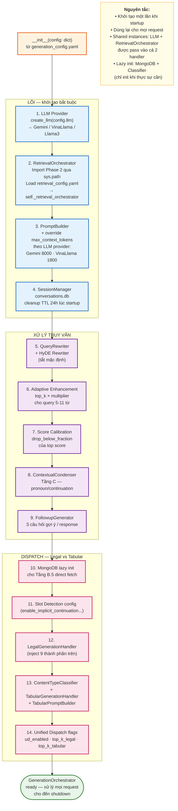

```mermaid
flowchart TB
    START["__init__(config: dict)<br/>từ generation_config.yaml"]

    subgraph CORE["LÕI — khởi tạo bắt buộc"]
        C1["1. LLM Provider<br/>create_llm(config.llm)<br/>→ Gemini / VinaLlama / Llama3"]
        C2["2. RetrievalOrchestrator<br/>Import Phase 2 qua sys.path<br/>Load retrieval_config.yaml<br/>→ self._retrieval_orchestrator"]
        C3["3. PromptBuilder<br/>+ override max_context_tokens<br/>theo LLM provider:<br/>Gemini 8000 · VinaLlama 1800"]
        C4["4. SessionManager<br/>conversations.db<br/>cleanup TTL 24h lúc startup"]
    end

    subgraph QUERY["XỬ LÝ TRUY VẤN"]
        Q5["5. QueryRewriter<br/>+ HyDE Rewriter<br/>(tắt mặc định)"]
        Q6["6. Adaptive Enhancement<br/>top_k × multiplier<br/>cho query 5-11 từ"]
        Q7["7. Score Calibration<br/>drop_below_fraction<br/>của top score"]
        Q8["8. ContextualCondenser<br/>Tầng C — pronoun/continuation"]
        Q9["9. FollowupGenerator<br/>3 câu hỏi gợi ý / response"]
    end

    subgraph DISPATCH["DISPATCH — Legal vs Tabular"]
        D10["10. MongoDB lazy init<br/>cho Tầng B.5 direct fetch"]
        D11["11. Slot Detection config<br/>(enable_implicit_continuation...)"]
        D12["12. LegalGenerationHandler<br/>(inject 9 thành phần trên)"]
        D13["13. ContentTypeClassifier<br/>+ TabularGenerationHandler<br/>+ TabularPromptBuilder"]
        D14["14. Unified Dispatch flags<br/>ud_enabled · top_k_legal · top_k_tabular"]
    end

    DONE(["GenerationOrchestrator<br/>ready — xử lý mọi request<br/>cho đến shutdown"])

    START --> C1
    C1 --> C2 --> C3 --> C4
    C4 --> Q5 --> Q6 --> Q7 --> Q8 --> Q9
    Q9 --> D10 --> D11 --> D12 --> D13 --> D14
    D14 --> DONE

    NOTE["<b>Nguyên tắc:</b><br/>• Khởi tạo một lần khi startup<br/>• Dùng lại cho mọi request<br/>• Shared instances: LLM + RetrievalOrchestrator<br/>  được pass vào cả 2 handler<br/>• Lazy init: MongoDB + Classifier<br/>  (chỉ init khi thực sự cần)"]

    classDef startNode fill:#fff3e0,stroke:#e65100,stroke-width:2px
    classDef coreNode fill:#e3f2fd,stroke:#1565c0,stroke-width:2px
    classDef queryNode fill:#f3e5f5,stroke:#6a1b9a,stroke-width:2px
    classDef dispatchNode fill:#fce4ec,stroke:#c2185b,stroke-width:2px
    classDef noteNode fill:#fffde7,stroke:#f9a825,stroke-width:1px
    classDef doneNode fill:#e8f5e9,stroke:#2e7d32,stroke-width:2px
    class START startNode
    class C1,C2,C3,C4 coreNode
    class Q5,Q6,Q7,Q8,Q9 queryNode
    class D10,D11,D12,D13,D14 dispatchNode
    class NOTE noteNode
    class DONE doneNode
```