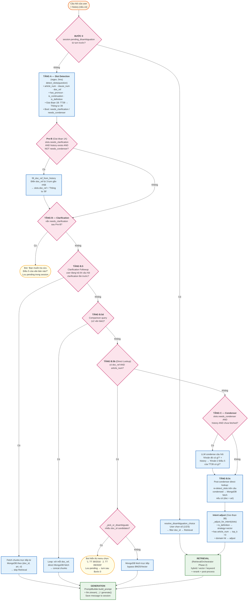

```mermaid
flowchart TB
    Q(["Câu hỏi của user<br/>+ history (nếu có)"])

    BU0{"<b>BƯỚC 0</b><br/>session.pending_disambiguation<br/>từ turn trước?"}
    BU0A["resolve_disambiguation_choice<br/>User chọn số (1/2/3)<br/>→ filter doc_id → Retrieval"]

    TA["<b>TẦNG A — Slot Detection</b> (regex, 0ms)<br/>detect_slots(question)<br/>• article_num · clause_num · doc_ref<br/>• has_pronoun · is_continuation · is_definition<br/>• Giai đoạn 1B: TT39 → Thông tư 39<br/>• Bool: needs_clarification / needs_condenser"]

    PRE_B{"<b>Pre-B</b> (Giai đoạn 1A)<br/>slots.needs_clarification<br/>AND history exists AND<br/>NOT needs_condenser?"}
    PRE_B1["fill_doc_ref_from_history<br/>Điền doc_ref từ 3 turn gần nhất<br/>→ slots.doc_ref = 'Thông tư 39'"]

    TB{"<b>TẦNG B — Clarification</b><br/>vẫn needs_clarification<br/>sau Pre-B?"}
    TB1(["Bot: 'Bạn muốn tra cứu<br/>Điều 5 của văn bản nào?'<br/>Lưu pending trong session"])

    TB5{"<b>TẦNG B.5</b><br/>Clarification Followup<br/>user đang trả lời câu hỏi<br/>clarification lần trước?"}
    TB5_CHUNKS["Fetch chunks trực tiếp từ<br/>MongoDB theo (doc_id, art, cl)<br/>→ skip Retrieval"]

    TB5D{"<b>TẦNG B.5d</b><br/>Comparison query<br/>(≥2 văn bản)?"}
    TB5D1["Loop: với mỗi doc_ref,<br/>direct MongoDB fetch<br/>→ concat chunks"]

    TB5B{"<b>TẦNG B.5b</b> (Direct Lookup)<br/>có doc_ref AND article_num?"}
    TB5B_MULTI{"_pick_or_disambiguate<br/>nhiều doc_id candidates?"}
    TB5B_DISAMBIG(["Bot hiển thị menu chọn:<br/>'1. TT 39/2016 · 2. TT 39/2020'<br/>Lưu pending → turn sau Bước 0"])
    TB5B_FETCH["MongoDB fetch trực tiếp<br/>bypass BM25/Vector"]

    TC{"<b>TẦNG C — Condenser</b><br/>slots.needs_condenser AND<br/>history AND chưa fetched?"}
    TC1["LLM condense câu hỏi:<br/>'Khoản đó có gì?' +<br/>history → 'Khoản 2 Điều 5<br/>của TT39 có gì?'"]

    TB5C["<b>TẦNG B.5c</b><br/>Post-condenser direct lookup:<br/>re-detect_slots trên câu<br/>condensed → MongoDB fetch<br/>nếu có (doc + art)"]

    INTENT["<b>Intent adjust</b> (Giai đoạn 3B)<br/>_adjust_for_intent(slots)<br/>• is_definition → strategy=vector<br/>• has article_num → top_k +3<br/>• domain hit → adjust"]

    RETRIEVAL["<b>RETRIEVAL</b><br/>(RetrievalOrchestrator Phase 2)<br/>hybrid / vector / keyword<br/>+ rerank + post-process"]

    GEN["<b>GENERATION</b><br/>PromptBuilder.build_prompt<br/>+ llm.stream(...) / generate()<br/>Save message to session"]

    Q --> BU0
    BU0 -->|Có| BU0A
    BU0A --> RETRIEVAL
    BU0 -->|Không| TA
    TA --> PRE_B
    PRE_B -->|Có| PRE_B1
    PRE_B1 --> TB
    PRE_B -->|Không| TB
    TB -->|Có| TB1
    TB -->|Không| TB5
    TB5 -->|Có| TB5_CHUNKS
    TB5_CHUNKS --> GEN
    TB5 -->|Không| TB5D
    TB5D -->|Có| TB5D1
    TB5D1 --> GEN
    TB5D -->|Không| TB5B
    TB5B -->|Có| TB5B_MULTI
    TB5B_MULTI -->|Có| TB5B_DISAMBIG
    TB5B_MULTI -->|Không| TB5B_FETCH
    TB5B_FETCH --> GEN
    TB5B -->|Không| TC
    TC -->|Có| TC1
    TC1 --> TB5C
    TC -->|Không| TB5C
    TB5C --> INTENT
    INTENT --> RETRIEVAL
    RETRIEVAL --> GEN

    classDef queryNode fill:#fff3e0,stroke:#e65100,stroke-width:2px
    classDef decisionNode fill:#fce4ec,stroke:#c2185b,stroke-width:2px
    classDef processNode fill:#e3f2fd,stroke:#1565c0,stroke-width:2px
    classDef clarifyNode fill:#fffde7,stroke:#f9a825,stroke-width:2px
    classDef finalNode fill:#e8f5e9,stroke:#2e7d32,stroke-width:2px
    class Q queryNode
    class BU0,PRE_B,TB,TB5,TB5D,TB5B,TB5B_MULTI,TC decisionNode
    class TA,BU0A,PRE_B1,TB5_CHUNKS,TB5D1,TB5B_FETCH,TC1,TB5C,INTENT processNode
    class TB1,TB5B_DISAMBIG clarifyNode
    class RETRIEVAL,GEN finalNode
```