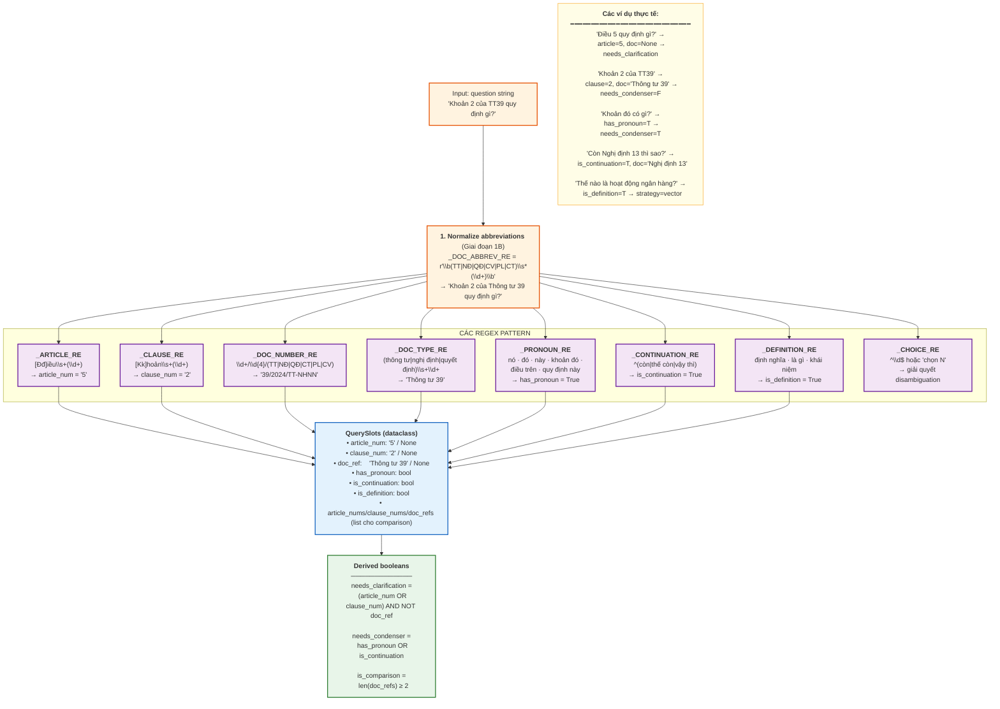

```mermaid
flowchart TB
    INPUT["Input: question string<br/>'Khoản 2 của TT39 quy định gì?'"]

    NORMALIZE["<b>1. Normalize abbreviations</b> (Giai đoạn 1B)<br/>_DOC_ABBREV_RE = r'\\b(TT|NĐ|QĐ|CV|PL|CT)\\s*(\\d+)\\b'<br/>→ 'Khoản 2 của Thông tư 39 quy định gì?'"]

    subgraph REGEX["CÁC REGEX PATTERN"]
        R1["<b>_ARTICLE_RE</b><br/>[Đđ]iều\\s+(\\d+)<br/>→ article_num = '5'"]
        R2["<b>_CLAUSE_RE</b><br/>[Kk]hoản\\s+(\\d+)<br/>→ clause_num = '2'"]
        R3["<b>_DOC_NUMBER_RE</b><br/>\\d+/\\d{4}/(TT|NĐ|QĐ|CT|PL|CV)<br/>→ '39/2024/TT-NHNN'"]
        R4["<b>_DOC_TYPE_RE</b><br/>(thông tư|nghị định|quyết định)\\s+\\d+<br/>→ 'Thông tư 39'"]
        R5["<b>_PRONOUN_RE</b><br/>nó · đó · này · khoản đó ·<br/>điều trên · quy định này<br/>→ has_pronoun = True"]
        R6["<b>_CONTINUATION_RE</b><br/>^(còn|thế còn|vậy thì)<br/>→ is_continuation = True"]
        R7["<b>_DEFINITION_RE</b><br/>định nghĩa · là gì · khái niệm<br/>→ is_definition = True"]
        R8["<b>_CHOICE_RE</b><br/>^\\d$ hoặc 'chọn N'<br/>→ giải quyết disambiguation"]
    end

    RESULT["<b>QuerySlots (dataclass)</b><br/>• article_num: '5' / None<br/>• clause_num: '2' / None<br/>• doc_ref:    'Thông tư 39' / None<br/>• has_pronoun: bool<br/>• is_continuation: bool<br/>• is_definition: bool<br/>• article_nums/clause_nums/doc_refs (list cho comparison)"]

    DERIVED["<b>Derived booleans</b><br/>─────────────<br/>needs_clarification =<br/>  (article_num OR clause_num) AND NOT doc_ref<br/><br/>needs_condenser =<br/>  has_pronoun OR is_continuation<br/><br/>is_comparison =<br/>  len(doc_refs) ≥ 2"]

    INPUT --> NORMALIZE
    NORMALIZE --> R1
    NORMALIZE --> R2
    NORMALIZE --> R3
    NORMALIZE --> R4
    NORMALIZE --> R5
    NORMALIZE --> R6
    NORMALIZE --> R7
    NORMALIZE --> R8
    R1 --> RESULT
    R2 --> RESULT
    R3 --> RESULT
    R4 --> RESULT
    R5 --> RESULT
    R6 --> RESULT
    R7 --> RESULT
    RESULT --> DERIVED

    EX["<b>Các ví dụ thực tế:</b><br/>━━━━━━━━━━━━━━━━━━━━━━━━━━━━━<br/>'Điều 5 quy định gì?' →<br/>  article=5, doc=None → needs_clarification<br/><br/>'Khoản 2 của TT39' →<br/>  clause=2, doc='Thông tư 39' → needs_condenser=F<br/><br/>'Khoản đó có gì?' →<br/>  has_pronoun=T → needs_condenser=T<br/><br/>'Còn Nghị định 13 thì sao?' →<br/>  is_continuation=T, doc='Nghị định 13'<br/><br/>'Thế nào là hoạt động ngân hàng?' →<br/>  is_definition=T → strategy=vector"]

    classDef inputNode fill:#fff3e0,stroke:#e65100,stroke-width:2px
    classDef regexNode fill:#f3e5f5,stroke:#6a1b9a,stroke-width:2px
    classDef resultNode fill:#e3f2fd,stroke:#1565c0,stroke-width:2px
    classDef derivedNode fill:#e8f5e9,stroke:#2e7d32,stroke-width:2px
    classDef exNode fill:#fffde7,stroke:#f9a825,stroke-width:1px
    class INPUT,NORMALIZE inputNode
    class R1,R2,R3,R4,R5,R6,R7,R8 regexNode
    class RESULT resultNode
    class DERIVED derivedNode
    class EX exNode
```