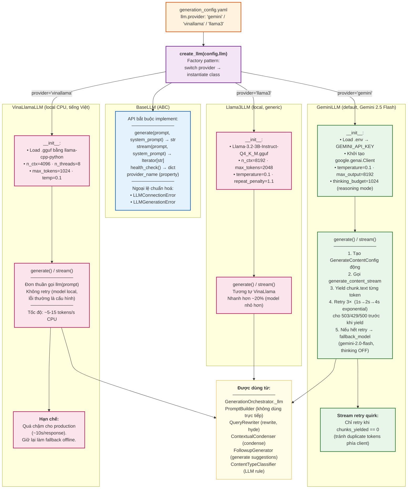

```mermaid
flowchart TB
    CONFIG["generation_config.yaml<br/>llm.provider: 'gemini' / 'vinallama' / 'llama3'"]

    FACTORY["<b>create_llm(config.llm)</b><br/>Factory pattern:<br/>switch provider → instantiate class"]

    subgraph BASE["BaseLLM (ABC)"]
        BASE_API["API bắt buộc implement:<br/>─────────────<br/>generate(prompt, system_prompt) → str<br/>stream(prompt, system_prompt) → Iterator[str]<br/>health_check() → dict<br/>provider_name (property)<br/>─────────────<br/>Ngoại lệ chuẩn hoá:<br/>• LLMConnectionError<br/>• LLMGenerationError"]
    end

    subgraph GEMINI["GeminiLLM (default, Gemini 2.5 Flash)"]
        G_INIT["__init__:<br/>• Load .env → GEMINI_API_KEY<br/>• Khởi tạo google.genai.Client<br/>• temperature=0.1 · max_output=8192<br/>• thinking_budget=1024 (reasoning mode)"]
        G_GEN["generate() / stream()<br/>─────────────<br/>1. Tạo GenerateContentConfig động<br/>2. Gọi generate_content_stream<br/>3. Yield chunk.text từng token<br/>4. Retry 3×  (1s→2s→4s exponential)<br/>   cho 503/429/500 trước khi yield<br/>5. Nếu hết retry → fallback_model<br/>   (gemini-2.0-flash, thinking OFF)"]
        G_STREAM_NOTE["<b>Stream retry quirk:</b><br/>Chỉ retry khi chunks_yielded == 0<br/>(tránh duplicate tokens phía client)"]
    end

    subgraph VINA["VinaLlamaLLM (local CPU, tiếng Việt)"]
        V_INIT["__init__:<br/>• Load .gguf bằng llama-cpp-python<br/>• n_ctx=4096 · n_threads=8<br/>• max_tokens=1024 · temp=0.1"]
        V_GEN["generate() / stream()<br/>─────────────<br/>Đơn thuần gọi llm(prompt)<br/>Không retry (model local,<br/>lỗi thường là cấu hình)<br/>─────────────<br/>Tốc độ: ~5-15 tokens/s CPU"]
        V_NOTE["<b>Hạn chế:</b><br/>Quá chậm cho production<br/>(~10s/response).<br/>Giữ lại làm fallback offline."]
    end

    subgraph LLAMA["Llama3LLM (local, generic)"]
        L_INIT["__init__:<br/>• Llama-3.2-3B-Instruct-Q4_K_M.gguf<br/>• n_ctx=8192 · max_tokens=2048<br/>• temperature=0.1 · repeat_penalty=1.1"]
        L_GEN["generate() / stream()<br/>Tương tự VinaLlama<br/>Nhanh hơn ~20% (model nhỏ hơn)"]
    end

    USE["<b>Được dùng từ:</b><br/>─────────────<br/>GenerationOrchestrator._llm<br/>PromptBuilder (không dùng trực tiếp)<br/>QueryRewriter (rewrite, hyde)<br/>ContextualCondenser (condense)<br/>FollowupGenerator (generate suggestions)<br/>ContentTypeClassifier (LLM rule)"]

    CONFIG --> FACTORY
    FACTORY --> BASE_API
    FACTORY -->|provider='gemini'| G_INIT
    FACTORY -->|provider='vinallama'| V_INIT
    FACTORY -->|provider='llama3'| L_INIT
    G_INIT --> G_GEN
    G_GEN --> G_STREAM_NOTE
    V_INIT --> V_GEN
    V_GEN --> V_NOTE
    L_INIT --> L_GEN
    G_GEN --> USE
    V_GEN --> USE
    L_GEN --> USE

    classDef configNode fill:#fff3e0,stroke:#e65100,stroke-width:2px
    classDef factoryNode fill:#f3e5f5,stroke:#6a1b9a,stroke-width:2px
    classDef baseNode fill:#e3f2fd,stroke:#1565c0,stroke-width:2px
    classDef geminiNode fill:#e8f5e9,stroke:#2e7d32,stroke-width:2px
    classDef vinaNode fill:#fce4ec,stroke:#c2185b,stroke-width:2px
    classDef useNode fill:#fffde7,stroke:#f9a825,stroke-width:1px
    class CONFIG configNode
    class FACTORY factoryNode
    class BASE_API baseNode
    class G_INIT,G_GEN,G_STREAM_NOTE geminiNode
    class V_INIT,V_GEN,V_NOTE vinaNode
    class L_INIT,L_GEN vinaNode
    class USE useNode
```