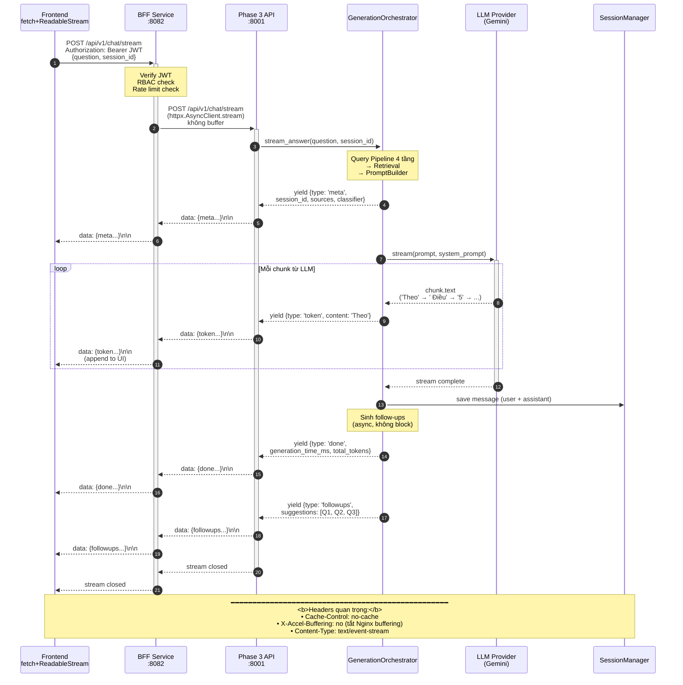

```mermaid
sequenceDiagram
    autonumber
    participant FE as Frontend<br/>fetch+ReadableStream
    participant BFF as BFF Service<br/>:8082
    participant P3 as Phase 3 API<br/>:8001
    participant ORCH as GenerationOrchestrator
    participant LLM as LLM Provider<br/>(Gemini)
    participant SESS as SessionManager

    FE->>+BFF: POST /api/v1/chat/stream<br/>Authorization: Bearer JWT<br/>{question, session_id}
    Note over BFF: Verify JWT<br/>RBAC check<br/>Rate limit check
    BFF->>+P3: POST /api/v1/chat/stream<br/>(httpx.AsyncClient.stream)<br/>không buffer

    P3->>+ORCH: stream_answer(question, session_id)
    Note over ORCH: Query Pipeline 4 tầng<br/>→ Retrieval<br/>→ PromptBuilder

    ORCH-->>P3: yield {type: 'meta',<br/>session_id, sources, classifier}
    P3-->>BFF: data: {meta...}\n\n
    BFF-->>FE: data: {meta...}\n\n

    ORCH->>+LLM: stream(prompt, system_prompt)
    loop Mỗi chunk từ LLM
        LLM-->>ORCH: chunk.text<br/>('Theo' → ' Điều' → '5' → ...)
        ORCH-->>P3: yield {type: 'token', content: 'Theo'}
        P3-->>BFF: data: {token...}\n\n
        BFF-->>FE: data: {token...}\n\n<br/>(append to UI)
    end
    LLM-->>-ORCH: stream complete

    ORCH->>SESS: save message (user + assistant)
    Note over ORCH: Sinh follow-ups<br/>(async, không block)

    ORCH-->>P3: yield {type: 'done',<br/>generation_time_ms, total_tokens}
    P3-->>BFF: data: {done...}\n\n
    BFF-->>FE: data: {done...}\n\n

    ORCH-->>P3: yield {type: 'followups',<br/>suggestions: [Q1, Q2, Q3]}
    P3-->>BFF: data: {followups...}\n\n
    BFF-->>FE: data: {followups...}\n\n

    P3-->>-BFF: stream closed
    BFF-->>-FE: stream closed

    Note over FE,SESS: ━━━━━━━━━━━━━━━━━━━━━━━━━━━━━━━━━━━━━━━━━━━━━━━━━━<br/><b>Headers quan trọng:</b><br/>• Cache-Control: no-cache<br/>• X-Accel-Buffering: no (tắt Nginx buffering)<br/>• Content-Type: text/event-stream
```