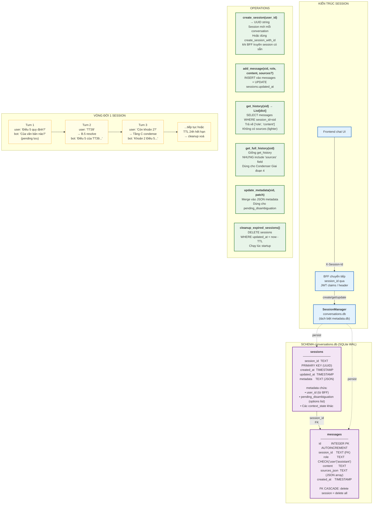

```mermaid
flowchart TB
    subgraph ARCH["KIẾN TRÚC SESSION"]
        CLIENT["Frontend chat UI"]
        BFF_SESS["BFF chuyển tiếp<br/>session_id qua<br/>JWT claims / header"]
        SESS_MGR["<b>SessionManager</b><br/>conversations.db<br/>(tách biệt metadata.db)"]

        CLIENT -->|"X-Session-Id"| BFF_SESS
        BFF_SESS -->|"create/get/update"| SESS_MGR
    end

    subgraph SCHEMA["SCHEMA conversations.db (SQLite WAL)"]
        direction TB

        T_SESS["<b>sessions</b><br/>─────────────<br/>session_id  TEXT PRIMARY KEY (UUID)<br/>created_at  TIMESTAMP<br/>updated_at  TIMESTAMP<br/>metadata    TEXT (JSON)<br/><br/>metadata chứa:<br/>• user_id (từ BFF)<br/>• pending_disambiguation (options list)<br/>• Các context_state khác"]

        T_MSG["<b>messages</b><br/>─────────────<br/>id            INTEGER PK AUTOINCREMENT<br/>session_id    TEXT (FK)<br/>role          TEXT CHECK('user'|'assistant')<br/>content       TEXT<br/>sources_json  TEXT (JSON array)<br/>created_at    TIMESTAMP<br/><br/>FK CASCADE: delete session = delete all"]

        T_SESS -->|"session_id<br/>FK"| T_MSG
    end

    subgraph OPS["OPERATIONS"]
        O1["<b>create_session(user_id)</b><br/>→ UUID string<br/>Session mới mỗi conversation<br/>Hoặc dùng create_session_with_id<br/>khi BFF truyền session có sẵn"]

        O2["<b>add_message(sid, role, content, sources?)</b><br/>INSERT vào messages<br/>+ UPDATE sessions.updated_at"]

        O3["<b>get_history(sid) → List[dict]</b><br/>SELECT messages WHERE session_id=sid<br/>Trả về ['role', 'content']<br/>Không có sources (lighter)"]

        O4["<b>get_full_history(sid)</b><br/>Giống get_history<br/>NHƯNG include 'sources' field<br/>Dùng cho Condenser Giai đoạn 4"]

        O5["<b>update_metadata(sid, patch)</b><br/>Merge vào JSON metadata<br/>Dùng cho pending_disambiguation"]

        O6["<b>cleanup_expired_sessions()</b><br/>DELETE sessions<br/>WHERE updated_at < now - TTL<br/>Chạy lúc startup"]
    end

    subgraph LIFE["VÒNG ĐỜI 1 SESSION"]
        direction LR
        L1["Turn 1<br/>user: 'Điều 5 quy định?'<br/>bot: 'Của văn bản nào?'<br/>(pending lưu)"]
        L2["Turn 2<br/>user: 'TT39'<br/>→ B.5 resolve<br/>bot: 'Điều 5 của TT39...'"]
        L3["Turn 3<br/>user: 'Còn khoản 2?'<br/>→ Tầng C condense<br/>bot: 'Khoản 2 Điều 5...'"]
        L4["...tiếp tục hoặc<br/>TTL 24h hết hạn<br/>→ cleanup xoá"]
        L1 --> L2 --> L3 --> L4
    end

    SESS_MGR -.->|persist| T_SESS
    SESS_MGR -.->|persist| T_MSG

    classDef archNode fill:#e3f2fd,stroke:#1565c0,stroke-width:2px
    classDef schemaNode fill:#f3e5f5,stroke:#6a1b9a,stroke-width:2px
    classDef opsNode fill:#e8f5e9,stroke:#2e7d32,stroke-width:2px
    classDef lifeNode fill:#fffde7,stroke:#f9a825,stroke-width:1px
    class CLIENT,BFF_SESS,SESS_MGR archNode
    class T_SESS,T_MSG schemaNode
    class O1,O2,O3,O4,O5,O6 opsNode
    class L1,L2,L3,L4 lifeNode
```