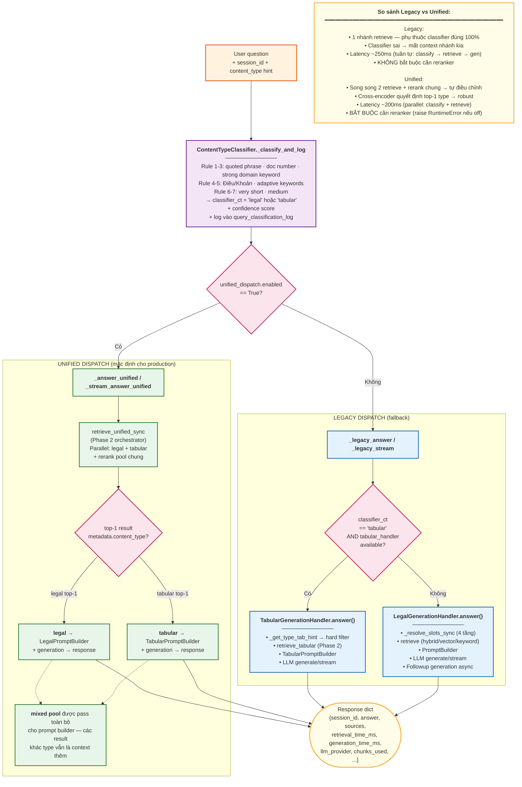

```mermaid
flowchart TB
    Q["User question<br/>+ session_id + content_type hint"]

    CLS["<b>ContentTypeClassifier._classify_and_log</b><br/>─────────────<br/>Rule 1-3: quoted phrase · doc number · strong domain keyword<br/>Rule 4-5: Điều/Khoản · adaptive keywords<br/>Rule 6-7: very short · medium<br/>→ classifier_ct = 'legal' hoặc 'tabular'<br/>+ confidence score<br/>+ log vào query_classification_log"]

    DISP_SWITCH{"unified_dispatch.enabled<br/>== True?"}

    subgraph UNIFIED["UNIFIED DISPATCH (mặc định cho production)"]
        U1["<b>_answer_unified / _stream_answer_unified</b>"]
        U2["retrieve_unified_sync<br/>(Phase 2 orchestrator)<br/>Parallel: legal + tabular<br/>+ rerank pool chung"]
        U3{"top-1 result<br/>metadata.content_type?"}
        U4["<b>legal</b> → LegalPromptBuilder<br/>+ generation → response"]
        U5["<b>tabular</b> → TabularPromptBuilder<br/>+ generation → response"]
        U6["<b>mixed pool</b> được pass toàn bộ<br/>cho prompt builder — các result<br/>khác type vẫn là context thêm"]
        U1 --> U2 --> U3
        U3 -->|legal top-1| U4
        U3 -->|tabular top-1| U5
        U4 -.-> U6
        U5 -.-> U6
    end

    subgraph LEGACY["LEGACY DISPATCH (fallback)"]
        L1["<b>_legacy_answer / _legacy_stream</b>"]
        L2{"classifier_ct<br/>== 'tabular'<br/>AND tabular_handler<br/>available?"}
        L3["<b>TabularGenerationHandler.answer()</b><br/>─────────────<br/>• _get_type_tab_hint → hard filter<br/>• retrieve_tabular (Phase 2)<br/>• TabularPromptBuilder<br/>• LLM generate/stream"]
        L4["<b>LegalGenerationHandler.answer()</b><br/>─────────────<br/>• _resolve_slots_sync (4 tầng)<br/>• retrieve (hybrid/vector/keyword)<br/>• PromptBuilder<br/>• LLM generate/stream<br/>• Followup generation async"]
        L1 --> L2
        L2 -->|Có| L3
        L2 -->|Không| L4
    end

    RESP(["Response dict<br/>{session_id, answer, sources,<br/>retrieval_time_ms, generation_time_ms,<br/>llm_provider, chunks_used, ...}"])

    Q --> CLS
    CLS --> DISP_SWITCH
    DISP_SWITCH -->|Có| U1
    DISP_SWITCH -->|Không| L1
    U4 --> RESP
    U5 --> RESP
    L3 --> RESP
    L4 --> RESP

    COMPARE["<b>So sánh Legacy vs Unified:</b><br/>━━━━━━━━━━━━━━━━━━━━━━━━━━━━━━━━━━━━━━━━━━━━━━━━━━━<br/>Legacy:<br/>• 1 nhánh retrieve — phụ thuộc classifier đúng 100%<br/>• Classifier sai → mất context nhánh kia<br/>• Latency ~250ms (tuần tự: classify → retrieve → gen)<br/>• KHÔNG bắt buộc cần reranker<br/><br/>Unified:<br/>• Song song 2 retrieve + rerank chung → tự điều chỉnh<br/>• Cross-encoder quyết định top-1 type → robust<br/>• Latency ~200ms (parallel: classify + retrieve)<br/>• BẮT BUỘC cần reranker (raise RuntimeError nếu off)"]

    classDef queryNode fill:#fff3e0,stroke:#e65100,stroke-width:2px
    classDef clsNode fill:#f3e5f5,stroke:#6a1b9a,stroke-width:2px
    classDef switchNode fill:#fce4ec,stroke:#c2185b,stroke-width:2px
    classDef unifiedNode fill:#e8f5e9,stroke:#2e7d32,stroke-width:2px
    classDef legacyNode fill:#e3f2fd,stroke:#1565c0,stroke-width:2px
    classDef respNode fill:#fffde7,stroke:#f9a825,stroke-width:2px
    class Q queryNode
    class CLS clsNode
    class DISP_SWITCH,U3,L2 switchNode
    class U1,U2,U4,U5,U6 unifiedNode
    class L1,L3,L4 legacyNode
    class RESP,COMPARE respNode
```