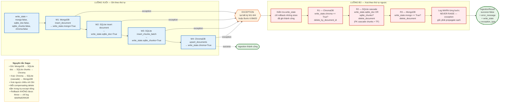

```mermaid
flowchart LR
    subgraph FORWARD["LUỒNG XUÔI — Ghi theo thứ tự"]
        direction TB
        F1["write_state = <br/>mongo:false, sqlite_doc:false,<br/>sqlite_chunks:false, chroma:false"]
        F2["W1: MongoDB insert_document<br/>→ write_state.mongo=True"]
        F3["W2: SQLite insert document<br/>→ write_state.sqlite_doc=True"]
        F4["W3: SQLite insert_chunks_batch<br/>→ write_state.sqlite_chunks=True"]
        F5["W4: ChromaDB upsert_documents<br/>→ write_state.chroma=True"]
        F1 --> F2 --> F3 --> F4 --> F5
    end

    EXC{{"EXCEPTION<br/>tại bất kỳ W1-W4<br/>hoặc Bước 6 BM25"}}

    subgraph COMPENSATE["LUỒNG BÙ — Xoá theo thứ tự ngược"]
        direction TB
        C0["Kiểm tra write_state<br/>chỉ rollback những store<br/>đã ghi thành công"]
        C1["R1 — ChromaDB<br/>write_state.chroma == True?<br/>delete_by_document_id"]
        C2["R2 — SQLite cascade<br/>write_state.sqlite_doc OR sqlite_chunks?<br/>delete_document<br/>(FK cascade chunks + TF)"]
        C3["R3 — MongoDB<br/>write_state.mongo == True?<br/>delete_document"]
        C4["Log WARN từng bước<br/>NEVER RAISE — exception<br/>gốc phải propagate sạch"]
        C0 --> C1 --> C2 --> C3 --> C4
    end

    RESULT(["IngestionResult<br/>success=false<br/>+ error_message<br/>+ write_state<br/>+ exception_type"])

    F5 -.->|success| OK(["Ingestion thành công"])
    F2 -->|exception| EXC
    F3 -->|exception| EXC
    F4 -->|exception| EXC
    F5 -->|exception| EXC
    EXC --> C0
    C4 --> RESULT

    NOTE["<b>Nguyên tắc Saga:</b><br/>• Ghi: MongoDB → SQLite doc → SQLite chunks → Chroma<br/>• Xoá: Chroma → SQLite (cascade) → MongoDB<br/>• Xoá ngược chiều với Ghi<br/>• Mỗi compensating delete nằm trong try-except riêng<br/>• Rollback KHÔNG được throw — chỉ log WARN/ERROR"]

    classDef forwardNode fill:#e3f2fd,stroke:#1565c0,stroke-width:2px
    classDef compensateNode fill:#ffebee,stroke:#c62828,stroke-width:2px
    classDef exceptionNode fill:#fff3e0,stroke:#e65100,stroke-width:2px
    classDef resultNode fill:#e8f5e9,stroke:#2e7d32,stroke-width:2px
    classDef noteNode fill:#fffde7,stroke:#f9a825,stroke-width:1px
    class F1,F2,F3,F4,F5 forwardNode
    class C0,C1,C2,C3,C4 compensateNode
    class EXC exceptionNode
    class RESULT,OK resultNode
    class NOTE noteNode
```