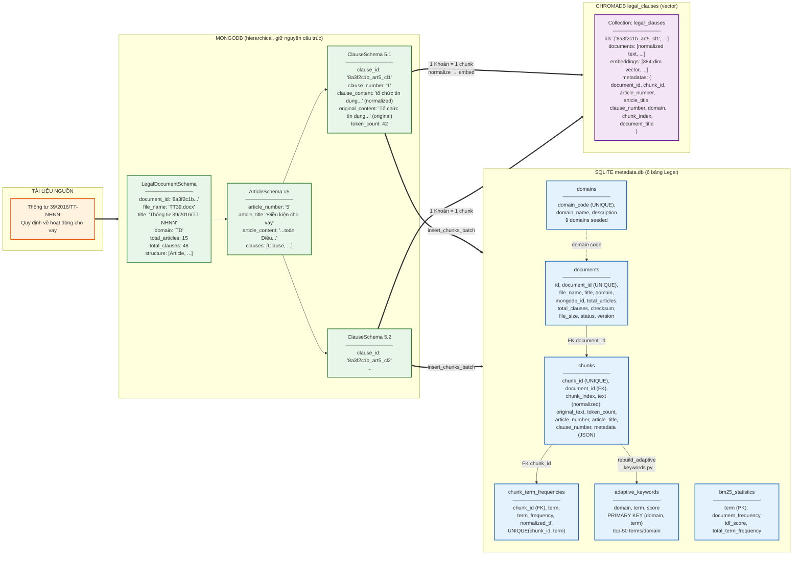

```mermaid
flowchart LR
    subgraph SRC["TÀI LIỆU NGUỒN"]
        T["Thông tư 39/2016/TT-NHNN<br/>Quy định về hoạt động cho vay"]
    end

    subgraph MONGO["MONGODB (hierarchical, giữ nguyên cấu trúc)"]
        direction TB
        DOC["LegalDocumentSchema<br/>─────────────<br/>document_id: '8a3f2c1b...'<br/>file_name: 'TT39.docx'<br/>title: 'Thông tư 39/2016/TT-NHNN'<br/>domain: 'TD'<br/>total_articles: 15<br/>total_clauses: 48<br/>structure: [Article, ...]"]
        A1["ArticleSchema #5<br/>─────────────<br/>article_number: '5'<br/>article_title: 'Điều kiện cho vay'<br/>article_content: '...toàn Điều...'<br/>clauses: [Clause, ...]"]
        CL1["ClauseSchema 5.1<br/>─────────────<br/>clause_id: '8a3f2c1b_art5_cl1'<br/>clause_number: '1'<br/>clause_content: 'tổ chức tín dụng...' (normalized)<br/>original_content: 'Tổ chức tín dụng...' (original)<br/>token_count: 42"]
        CL2["ClauseSchema 5.2<br/>─────────────<br/>clause_id: '8a3f2c1b_art5_cl2'<br/>..."]
        DOC --> A1
        A1 --> CL1
        A1 --> CL2
    end

    subgraph SQLITE["SQLITE metadata.db (6 bảng Legal)"]
        direction TB
        SQ1["documents<br/>─────────────<br/>id, document_id (UNIQUE),<br/>file_name, title, domain,<br/>mongodb_id, total_articles,<br/>total_clauses, checksum,<br/>file_size, status, version"]
        SQ2["chunks<br/>─────────────<br/>chunk_id (UNIQUE), document_id (FK),<br/>chunk_index, text (normalized),<br/>original_text, token_count,<br/>article_number, article_title,<br/>clause_number, metadata (JSON)"]
        SQ3["bm25_statistics<br/>─────────────<br/>term (PK), document_frequency,<br/>idf_score, total_term_frequency"]
        SQ4["chunk_term_frequencies<br/>─────────────<br/>chunk_id (FK), term,<br/>term_frequency, normalized_tf,<br/>UNIQUE(chunk_id, term)"]
        SQ5["domains<br/>─────────────<br/>domain_code (UNIQUE),<br/>domain_name, description<br/>9 domains seeded"]
        SQ6["adaptive_keywords<br/>─────────────<br/>domain, term, score<br/>PRIMARY KEY (domain, term)<br/>top-50 terms/domain"]
        SQ1 -->|"FK document_id"| SQ2
        SQ2 -->|"FK chunk_id"| SQ4
        SQ5 -.->|domain code| SQ1
        SQ2 -->|"rebuild_adaptive<br/>_keywords.py"| SQ6
    end

    subgraph CHROMA["CHROMADB legal_clauses (vector)"]
        direction TB
        CH["Collection: legal_clauses<br/>─────────────<br/>ids: ['8a3f2c1b_art5_cl1', ...]<br/>documents: [normalized text, ...]<br/>embeddings: [384-dim vector, ...]<br/>metadatas: {<br/>  document_id, chunk_id,<br/>  article_number, article_title,<br/>  clause_number, domain,<br/>  chunk_index, document_title<br/>}"]
    end

    T ==> MONGO
    CL1 ==>|"1 Khoản = 1 chunk<br/>normalize → embed"| CHROMA
    CL2 ==>|"1 Khoản = 1 chunk"| CHROMA
    CL1 ==>|"insert_chunks_batch"| SQLITE
    CL2 ==>|"insert_chunks_batch"| SQLITE

    classDef srcNode fill:#fff3e0,stroke:#e65100,stroke-width:2px
    classDef mongoNode fill:#e8f5e9,stroke:#2e7d32,stroke-width:2px
    classDef sqliteNode fill:#e3f2fd,stroke:#1565c0,stroke-width:2px
    classDef chromaNode fill:#f3e5f5,stroke:#6a1b9a,stroke-width:2px
    class T srcNode
    class DOC,A1,CL1,CL2 mongoNode
    class SQ1,SQ2,SQ3,SQ4,SQ5,SQ6 sqliteNode
    class CH chromaNode
```