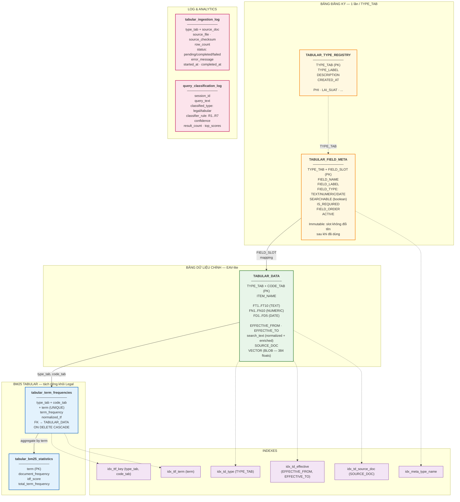

```mermaid
flowchart TB
    subgraph REG["BẢNG ĐĂNG KÝ — 1 lần / TYPE_TAB"]
        direction LR
        T1["<b>TABULAR_TYPE_REGISTRY</b><br/>─────────────<br/>TYPE_TAB (PK)<br/>TYPE_LABEL<br/>DESCRIPTION<br/>CREATED_AT<br/><br/>PHI · LAI_SUAT · ..."]
        T2["<b>TABULAR_FIELD_META</b><br/>─────────────<br/>TYPE_TAB + FIELD_SLOT (PK)<br/>FIELD_NAME<br/>FIELD_LABEL<br/>FIELD_TYPE: TEXT/NUMERIC/DATE<br/>SEARCHABLE (boolean)<br/>IS_REQUIRED<br/>FIELD_ORDER<br/>ACTIVE<br/><br/>Immutable: slot không đổi tên<br/>sau khi đã dùng"]
        T1 -.->|"TYPE_TAB"| T2
    end

    subgraph DATA["BẢNG DỮ LIỆU CHÍNH — EAV-lite"]
        direction TB
        T3["<b>TABULAR_DATA</b><br/>─────────────<br/>TYPE_TAB + CODE_TAB (PK)<br/>ITEM_NAME<br/><br/>FT1..FT10 (TEXT)<br/>FN1..FN10 (NUMERIC)<br/>FD1..FD5 (DATE)<br/><br/>EFFECTIVE_FROM · EFFECTIVE_TO<br/>search_text (normalized + enriched)<br/>SOURCE_DOC<br/>VECTOR (BLOB — 384 floats)"]
    end

    subgraph BM25["BM25 TABULAR — tách riêng khỏi Legal"]
        direction LR
        T4["<b>tabular_term_frequencies</b><br/>─────────────<br/>type_tab + code_tab<br/>+ term (UNIQUE)<br/>term_frequency<br/>normalized_tf<br/>FK → TABULAR_DATA<br/>ON DELETE CASCADE"]
        T5["<b>tabular_bm25_statistics</b><br/>─────────────<br/>term (PK)<br/>document_frequency<br/>idf_score<br/>total_term_frequency"]
    end

    subgraph LOG["LOG & ANALYTICS"]
        direction LR
        T6["<b>tabular_ingestion_log</b><br/>─────────────<br/>type_tab + source_doc<br/>source_file · source_checksum<br/>row_count<br/>status: pending/completed/failed<br/>error_message<br/>started_at · completed_at"]
        T7["<b>query_classification_log</b><br/>─────────────<br/>session_id<br/>query_text<br/>classified_type: legal/tabular<br/>classifier_rule: R1..R7<br/>confidence<br/>result_count · top_scores"]
    end

    T2 -->|"FIELD_SLOT<br/>mapping"| T3
    T3 -->|"type_tab, code_tab"| T4
    T4 -->|"aggregate by term"| T5

    subgraph IDX["INDEXES"]
        I1["idx_td_type (TYPE_TAB)"]
        I2["idx_td_effective<br/>(EFFECTIVE_FROM, EFFECTIVE_TO)"]
        I3["idx_td_source_doc (SOURCE_DOC)"]
        I4["idx_meta_type_name"]
        I5["idx_ttf_key (type_tab, code_tab)"]
        I6["idx_ttf_term (term)"]
    end

    T3 -.-> I1
    T3 -.-> I2
    T3 -.-> I3
    T2 -.-> I4
    T4 -.-> I5
    T4 -.-> I6

    classDef regNode fill:#fff8e1,stroke:#f57c00,stroke-width:2px
    classDef dataNode fill:#e8f5e9,stroke:#2e7d32,stroke-width:2px
    classDef bm25Node fill:#e3f2fd,stroke:#1565c0,stroke-width:2px
    classDef logNode fill:#fce4ec,stroke:#c2185b,stroke-width:2px
    classDef idxNode fill:#f3e5f5,stroke:#6a1b9a,stroke-width:1px
    class T1,T2 regNode
    class T3 dataNode
    class T4,T5 bm25Node
    class T6,T7 logNode
    class I1,I2,I3,I4,I5,I6 idxNode
```