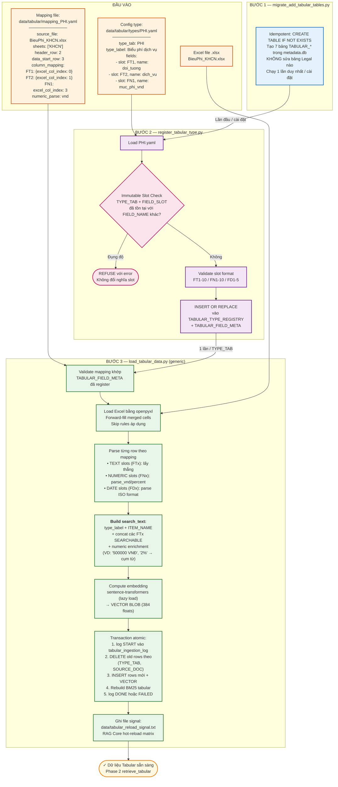

```mermaid
flowchart TB
    subgraph INPUT["ĐẦU VÀO"]
        I1["Excel file .xlsx<br/>BieuPhi_KHCN.xlsx"]
        I2["Config type:<br/>data/tabular/types/PHI.yaml<br/>─────────────<br/>type_tab: PHI<br/>type_label: Biểu phí dịch vụ<br/>fields:<br/>  - slot: FT1, name: doi_tuong<br/>  - slot: FT2, name: dich_vu<br/>  - slot: FN1, name: muc_phi_vnd"]
        I3["Mapping file:<br/>data/tabular/mapping_PHI.yaml<br/>─────────────<br/>source_file: BieuPhi_KHCN.xlsx<br/>sheets: ['KHCN']<br/>header_row: 2<br/>data_start_row: 3<br/>column_mapping:<br/>  FT1: {excel_col_index: 0}<br/>  FT2: {excel_col_index: 1}<br/>  FN1:<br/>    excel_col_index: 3<br/>    numeric_parse: vnd"]
    end

    subgraph S1["BƯỚC 1 — migrate_add_tabular_tables.py"]
        M1["Idempotent: CREATE TABLE IF NOT EXISTS<br/>Tạo 7 bảng TABULAR_* trong metadata.db<br/>KHÔNG sửa bảng Legal nào<br/>Chạy 1 lần duy nhất / cài đặt"]
    end

    subgraph S2["BƯỚC 2 — register_tabular_type.py"]
        R1["Load PHI.yaml"]
        R2{"Immutable Slot Check<br/>TYPE_TAB + FIELD_SLOT<br/>đã tồn tại với FIELD_NAME khác?"}
        R3(["REFUSE với error<br/>Không đổi nghĩa slot"])
        R4["Validate slot format<br/>FT1-10 / FN1-10 / FD1-5"]
        R5["INSERT OR REPLACE<br/>vào TABULAR_TYPE_REGISTRY<br/>+ TABULAR_FIELD_META"]
        R1 --> R2
        R2 -->|Đụng độ| R3
        R2 -->|Không| R4
        R4 --> R5
    end

    subgraph S3["BƯỚC 3 — load_tabular_data.py (generic)"]
        L0["Validate mapping khớp<br/>TABULAR_FIELD_META đã register"]
        L1["Load Excel bằng openpyxl<br/>Forward-fill merged cells<br/>Skip rules áp dụng"]
        L2["Parse từng row theo mapping<br/>• TEXT slots (FTx): lấy thẳng<br/>• NUMERIC slots (FNx): parse_vnd/percent<br/>• DATE slots (FDx): parse ISO format"]
        L3["<b>Build search_text:</b><br/>type_label + ITEM_NAME<br/>+ concat các FTx SEARCHABLE<br/>+ numeric enrichment<br/>(VD: '500000 VNĐ', '2%' → cụm từ)"]
        L4["Compute embedding<br/>sentence-transformers (lazy load)<br/>→ VECTOR BLOB (384 floats)"]
        L5["Transaction atomic:<br/>1. log START vào tabular_ingestion_log<br/>2. DELETE old rows theo<br/>   (TYPE_TAB, SOURCE_DOC)<br/>3. INSERT rows mới + VECTOR<br/>4. Rebuild BM25 tabular<br/>5. log DONE hoặc FAILED"]
        L6["Ghi file signal:<br/>data/tabular_reload_signal.txt<br/>RAG Core hot-reload matrix"]
        L0 --> L1 --> L2 --> L3 --> L4 --> L5 --> L6
    end

    I1 --> L1
    I2 --> R1
    I3 --> L0
    M1 -->|"Lần đầu / cài đặt"| R1
    R5 -->|"1 lần / TYPE_TAB"| L0
    L6 --> DONE(["✓ Dữ liệu Tabular sẵn sàng<br/>Phase 2 retrieve_tabular"])

    classDef inputNode fill:#fff3e0,stroke:#e65100,stroke-width:2px
    classDef s1Node fill:#e3f2fd,stroke:#1565c0,stroke-width:2px
    classDef s2Node fill:#f3e5f5,stroke:#6a1b9a,stroke-width:2px
    classDef s3Node fill:#e8f5e9,stroke:#2e7d32,stroke-width:2px
    classDef decisionNode fill:#fce4ec,stroke:#c2185b,stroke-width:2px
    classDef doneNode fill:#fff8e1,stroke:#f57c00,stroke-width:2px
    class I1,I2,I3 inputNode
    class M1 s1Node
    class R1,R4,R5 s2Node
    class R2,R3 decisionNode
    class L0,L1,L2,L3,L4,L5,L6 s3Node
    class DONE doneNode
```