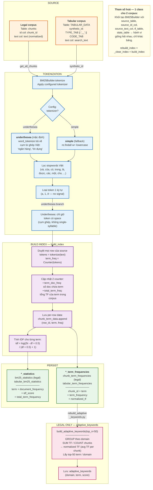

```mermaid
flowchart TB
    subgraph INPUT["SOURCE"]
        direction LR
        SRC1["<b>Legal corpus</b><br/>Table: chunks<br/>id col: chunk_id<br/>text col: text (normalized)"]
        SRC2["<b>Tabular corpus</b><br/>Table: TABULAR_DATA<br/>synthetic_id:<br/>TYPE_TAB || '__' || CODE_TAB<br/>text col: search_text"]
    end

    subgraph TOK["TOKENIZATION"]
        direction TB
        T1["BM25Builder.tokenize<br/>Apply configured tokenizer"]
        T2{"Config:<br/>tokenizer?"}
        T3["<b>underthesea</b> (mặc định)<br/>word_tokenize trả về<br/>cụm từ ghép Việt:<br/>'ngân hàng', 'tín dụng'"]
        T4["<b>simple</b> (fallback)<br/>re.findall w+ lowercase"]
        T5["Lọc stopwords Việt<br/>(và, của, có, trong, là,<br/>được, các, một, cho, ...)"]
        T6["Loại token 1 ký tự<br/>(a, 1, ở — no signal)"]
        T7["Underthesea: chỉ giữ<br/>token có space<br/>(cụm ghép, không single-syllable)"]
        T1 --> T2
        T2 -->|underthesea| T3
        T2 -->|simple| T4
        T3 --> T5
        T4 --> T5
        T5 --> T6
        T6 -->|underthesea branch| T7
    end

    subgraph BUILD["BUILD INDEX — build_index"]
        direction TB
        B1["Duyệt mọi row của source<br/>tokens = tokenize(text)<br/>term_freq = Counter(tokens)"]
        B2["Cập nhật 2 counter:<br/>• term_doc_freq: <br/>  số doc chứa term<br/>• total_term_freq:<br/>  tổng TF của term trong corpus"]
        B3["Lưu per-row data:<br/>chunk_term_data.append<br/>(row_id, term, freq)"]
        B4["Tính IDF cho từng term:<br/>idf = log((N - df + 0.5)<br/>           / (df + 0.5) + 1)"]
        B1 --> B2 --> B3 --> B4
    end

    subgraph STORE["PERSIST"]
        direction LR
        P1["<b>*_statistics</b><br/>bm25_statistics (legal)<br/>tabular_bm25_statistics<br/>─────────────<br/>term + document_frequency<br/>+ idf_score<br/>+ total_term_frequency"]
        P2["<b>*_term_frequencies</b><br/>chunk_term_frequencies (legal)<br/>tabular_term_frequencies<br/>─────────────<br/>chunk_id + term<br/>+ term_frequency<br/>+ normalized_tf"]
    end

    subgraph ADAPTIVE["LEGAL ONLY — adaptive_keywords"]
        A1["build_adaptive_keywords(top_n=50)<br/>─────────────<br/>GROUP theo domain<br/>SUM TF / COUNT chunks<br/>→ normalized TF (avg TF per chunk)<br/>Lấy top-50 term / domain"]
        A2["Lưu: adaptive_keywords<br/>(domain, term, score)"]
        A1 --> A2
    end

    SRC1 -->|"get_all_chunks"| T1
    SRC2 -->|"synthetic_id"| T1
    T7 --> B1
    B4 --> P1
    B3 --> P2
    P2 -->|"rebuild_adaptive<br/>_keywords.py"| A1

    NOTE["<b>Tham số hoá — 1 class cho 2 corpus:</b><br/>Khởi tạo BM25Builder với<br/>source_table, source_id_col,<br/>source_text_col, tf_table,<br/>stats_table → hành vi<br/>giống hệt nhau, chỉ khác bảng.<br/><br/>rebuild_index = _clear_index + build_index"]

    classDef srcNode fill:#fff3e0,stroke:#e65100,stroke-width:2px
    classDef tokNode fill:#e3f2fd,stroke:#1565c0,stroke-width:2px
    classDef buildNode fill:#f3e5f5,stroke:#6a1b9a,stroke-width:2px
    classDef storeNode fill:#e8f5e9,stroke:#2e7d32,stroke-width:2px
    classDef adaptiveNode fill:#fce4ec,stroke:#c2185b,stroke-width:2px
    classDef noteNode fill:#fffde7,stroke:#f9a825,stroke-width:1px
    class SRC1,SRC2 srcNode
    class T1,T3,T4,T5,T6,T7 tokNode
    class T2 tokNode
    class B1,B2,B3,B4 buildNode
    class P1,P2 storeNode
    class A1,A2 adaptiveNode
    class NOTE noteNode
```