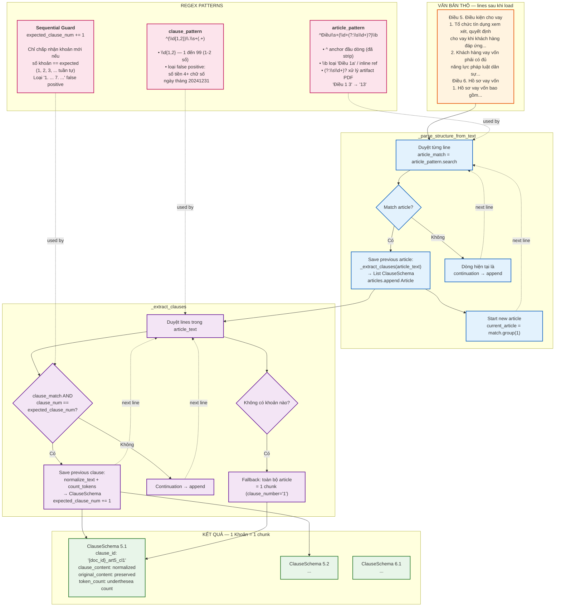

```mermaid
flowchart TB
    subgraph RAW["VĂN BẢN THÔ — lines sau khi load"]
        R["Điều 5. Điều kiện cho vay<br/>1. Tổ chức tín dụng xem xét, quyết định<br/>cho vay khi khách hàng đáp ứng...<br/>2. Khách hàng vay vốn phải có đủ<br/>năng lực pháp luật dân sự...<br/>Điều 6. Hồ sơ vay vốn<br/>1. Hồ sơ vay vốn bao gồm..."]
    end

    subgraph REGEX["REGEX PATTERNS"]
        direction TB
        P1["<b>article_pattern</b><br/>^Điều\\s+(\\d+(?:\\s\\d+)?)\\b<br/><br/>• ^ anchor đầu dòng (đã strip)<br/>• \\b loại 'Điều 1a' / inline ref<br/>• (?:\\s\\d+)? xử lý artifact PDF<br/>  'Điều 1 3' → '13'"]
        P2["<b>clause_pattern</b><br/>^(\\d{1,2})\\.\\s+(.+)<br/><br/>• \\d{1,2} — 1 đến 99 (1-2 số)<br/>• loại false positive:<br/>  số tiền 4+ chữ số<br/>  ngày tháng 20241231"]
        P3["<b>Sequential Guard</b><br/>expected_clause_num += 1<br/><br/>Chỉ chấp nhận khoản mới nếu<br/>số khoản == expected<br/>(1, 2, 3, ... tuần tự)<br/>Loại '1. ... 7. ...' false positive"]
    end

    subgraph PARSE["_parse_structure_from_text"]
        D1["Duyệt từng line<br/>article_match = article_pattern.search"]
        D2{"Match article?"}
        D3["Save previous article:<br/>_extract_clauses(article_text)<br/>→ List ClauseSchema<br/>articles.append Article"]
        D4["Start new article<br/>current_article = match.group(1)"]
        D5["Dòng hiện tại là<br/>continuation → append"]

        D1 --> D2
        D2 -->|Có| D3
        D2 -->|Không| D5
        D3 --> D4
        D4 -.->|next line| D1
        D5 -.->|next line| D1
    end

    subgraph CLAUSES["_extract_clauses"]
        E1["Duyệt lines trong article_text"]
        E2{"clause_match AND<br/>clause_num ==<br/>expected_clause_num?"}
        E3["Save previous clause:<br/>normalize_text + count_tokens<br/>→ ClauseSchema<br/>expected_clause_num += 1"]
        E4["Continuation → append"]
        E5{"Không có khoản nào?"}
        E6["Fallback: toàn bộ article<br/>= 1 chunk (clause_number='1')"]
        E1 --> E2
        E2 -->|Có| E3
        E2 -->|Không| E4
        E3 -.->|next line| E1
        E4 -.->|next line| E1
        E1 --> E5
        E5 -->|Có| E6
    end

    subgraph OUT["KẾT QUẢ — 1 Khoản = 1 chunk"]
        direction LR
        O1["ClauseSchema 5.1<br/>clause_id: '{doc_id}_art5_cl1'<br/>clause_content: normalized<br/>original_content: preserved<br/>token_count: underthesea count"]
        O2["ClauseSchema 5.2<br/>..."]
        O3["ClauseSchema 6.1<br/>..."]
    end

    R --> D1
    D3 --> E1
    E3 --> O1
    E3 --> O2
    E6 --> O1

    P1 -.->|used by| D1
    P2 -.->|used by| E1
    P3 -.->|used by| E2

    classDef rawNode fill:#fff3e0,stroke:#e65100,stroke-width:2px
    classDef regexNode fill:#fce4ec,stroke:#c2185b,stroke-width:2px
    classDef parseNode fill:#e3f2fd,stroke:#1565c0,stroke-width:2px
    classDef clauseNode fill:#f3e5f5,stroke:#6a1b9a,stroke-width:2px
    classDef outNode fill:#e8f5e9,stroke:#2e7d32,stroke-width:2px
    class R rawNode
    class P1,P2,P3 regexNode
    class D1,D3,D4,D5 parseNode
    class D2 parseNode
    class E1,E3,E4,E6 clauseNode
    class E2,E5 clauseNode
    class O1,O2,O3 outNode
```