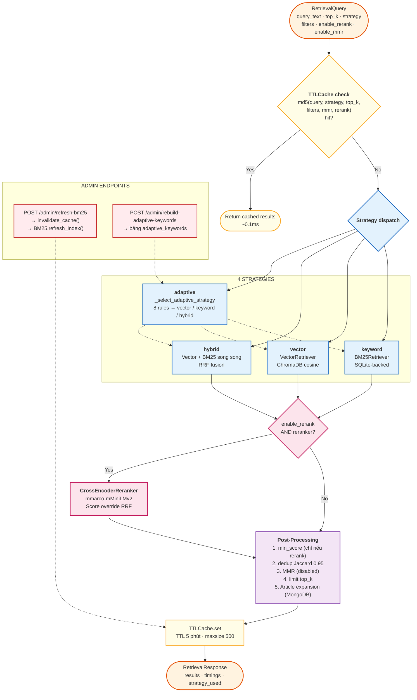

```mermaid
flowchart TB
    QUERY([RetrievalQuery<br/>query_text · top_k · strategy<br/>filters · enable_rerank · enable_mmr])

    CACHE_CHECK{"<b>TTLCache check</b><br/>md5(query, strategy, top_k,<br/>filters, mmr, rerank)<br/>hit?"}
    CACHE_HIT([Return cached results<br/>~0.1ms])

    STRATEGY_DISPATCH{"<b>Strategy dispatch</b>"}

    subgraph STRATEGIES["4 STRATEGIES"]
        ADAPTIVE["<b>adaptive</b><br/>_select_adaptive_strategy<br/>8 rules → vector / keyword / hybrid"]
        HYBRID["<b>hybrid</b><br/>Vector + BM25 song song<br/>RRF fusion"]
        VECTOR["<b>vector</b><br/>VectorRetriever<br/>ChromaDB cosine"]
        KEYWORD["<b>keyword</b><br/>BM25Retriever<br/>SQLite-backed"]
    end

    POSTPROC["<b>Post-Processing</b><br/>1. min_score (chỉ nếu rerank)<br/>2. dedup Jaccard 0.95<br/>3. MMR (disabled)<br/>4. limit top_k<br/>5. Article expansion (MongoDB)"]

    RERANK_BLOCK{"enable_rerank<br/>AND reranker?"}
    RERANK["<b>CrossEncoderReranker</b><br/>mmarco-mMiniLMv2<br/>Score override RRF"]

    CACHE_STORE["TTLCache.set<br/>TTL 5 phút · maxsize 500"]

    RESULT([RetrievalResponse<br/>results · timings · strategy_used])

    subgraph ADMIN["ADMIN ENDPOINTS"]
        REFRESH["POST /admin/refresh-bm25<br/>→ invalidate_cache()<br/>→ BM25.refresh_index()"]
        REBUILD["POST /admin/rebuild-adaptive-keywords<br/>→ bảng adaptive_keywords"]
    end

    QUERY --> CACHE_CHECK
    CACHE_CHECK -->|Yes| CACHE_HIT
    CACHE_CHECK -->|No| STRATEGY_DISPATCH

    STRATEGY_DISPATCH --> ADAPTIVE
    STRATEGY_DISPATCH --> HYBRID
    STRATEGY_DISPATCH --> VECTOR
    STRATEGY_DISPATCH --> KEYWORD

    ADAPTIVE -.-> HYBRID
    ADAPTIVE -.-> VECTOR
    ADAPTIVE -.-> KEYWORD

    HYBRID --> RERANK_BLOCK
    VECTOR --> RERANK_BLOCK
    KEYWORD --> RERANK_BLOCK

    RERANK_BLOCK -->|Yes| RERANK
    RERANK_BLOCK -->|No| POSTPROC
    RERANK --> POSTPROC

    POSTPROC --> CACHE_STORE
    CACHE_STORE --> RESULT

    REFRESH -.-> CACHE_STORE
    REBUILD -.-> ADAPTIVE

    classDef queryNode fill:#fff3e0,stroke:#e65100,stroke-width:2px
    classDef cacheNode fill:#fffde7,stroke:#f9a825,stroke-width:2px
    classDef stratNode fill:#e3f2fd,stroke:#1565c0,stroke-width:2px
    classDef postNode fill:#f3e5f5,stroke:#6a1b9a,stroke-width:2px
    classDef rerankNode fill:#fce4ec,stroke:#c2185b,stroke-width:2px
    classDef resultNode fill:#e8f5e9,stroke:#2e7d32,stroke-width:2px
    classDef adminNode fill:#ffebee,stroke:#c62828,stroke-width:2px
    class QUERY,RESULT queryNode
    class CACHE_CHECK,CACHE_HIT,CACHE_STORE cacheNode
    class STRATEGY_DISPATCH,ADAPTIVE,HYBRID,VECTOR,KEYWORD stratNode
    class POSTPROC postNode
    class RERANK_BLOCK,RERANK rerankNode
    class REFRESH,REBUILD adminNode
```