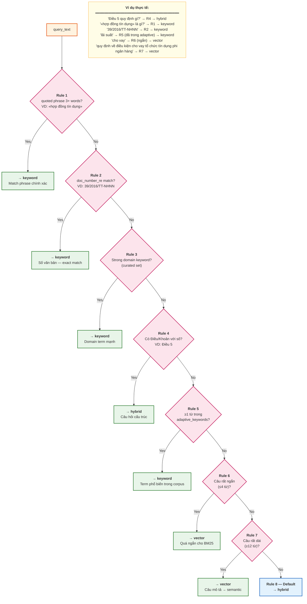

```mermaid
flowchart TB
    Q["query_text"]

    R1{"<b>Rule 1</b><br/>quoted phrase 3+ words?<br/>VD: «hợp đồng tín dụng»"}
    R1Y["→ <b>keyword</b><br/>Match phrase chính xác"]

    R2{"<b>Rule 2</b><br/>doc_number_re match?<br/>VD: 39/2016/TT-NHNN"}
    R2Y["→ <b>keyword</b><br/>Số văn bản — exact match"]

    R3{"<b>Rule 3</b><br/>Strong domain keyword?<br/>(curated set)"}
    R3Y["→ <b>keyword</b><br/>Domain term mạnh"]

    R4{"<b>Rule 4</b><br/>Có Điều/Khoản với số?<br/>VD: Điều 5"}
    R4Y["→ <b>hybrid</b><br/>Câu hỏi cấu trúc"]

    R5{"<b>Rule 5</b><br/>≥1 từ trong<br/>adaptive_keywords?"}
    R5Y["→ <b>keyword</b><br/>Term phổ biến trong corpus"]

    R6{"<b>Rule 6</b><br/>Câu rất ngắn<br/>(≤4 từ)?"}
    R6Y["→ <b>vector</b><br/>Quá ngắn cho BM25"]

    R7{"<b>Rule 7</b><br/>Câu rất dài<br/>(≥12 từ)?"}
    R7Y["→ <b>vector</b><br/>Câu mô tả → semantic"]

    R8["<b>Rule 8 — Default</b><br/>→ <b>hybrid</b>"]

    EXAMPLES["<b>Ví dụ thực tế:</b><br/>━━━━━━━━━━━━━━━━━━━━━━━━━━━━━━━━━━━━━<br/>'Điều 5 quy định gì?' → R4 → hybrid<br/>'«hợp đồng tín dụng» là gì?' → R1 → keyword<br/>'39/2016/TT-NHNN' → R2 → keyword<br/>'lãi suất' → R5 (đã trong adaptive) → keyword<br/>'cho vay' → R6 (ngắn) → vector<br/>'quy định về điều kiện cho vay tổ chức tín dụng phi ngân hàng' → R7 → vector"]

    Q --> R1
    R1 -->|Yes| R1Y
    R1 -->|No| R2
    R2 -->|Yes| R2Y
    R2 -->|No| R3
    R3 -->|Yes| R3Y
    R3 -->|No| R4
    R4 -->|Yes| R4Y
    R4 -->|No| R5
    R5 -->|Yes| R5Y
    R5 -->|No| R6
    R6 -->|Yes| R6Y
    R6 -->|No| R7
    R7 -->|Yes| R7Y
    R7 -->|No| R8

    classDef qNode fill:#fff3e0,stroke:#e65100,stroke-width:2px
    classDef ruleNode fill:#fce4ec,stroke:#c2185b,stroke-width:2px
    classDef yesNode fill:#e8f5e9,stroke:#2e7d32,stroke-width:2px
    classDef defaultNode fill:#e3f2fd,stroke:#1565c0,stroke-width:2px
    classDef exNode fill:#fffde7,stroke:#f9a825,stroke-width:1px
    class Q qNode
    class R1,R2,R3,R4,R5,R6,R7 ruleNode
    class R1Y,R2Y,R3Y,R4Y,R5Y,R6Y,R7Y yesNode
    class R8 defaultNode
    class EXAMPLES exNode
```