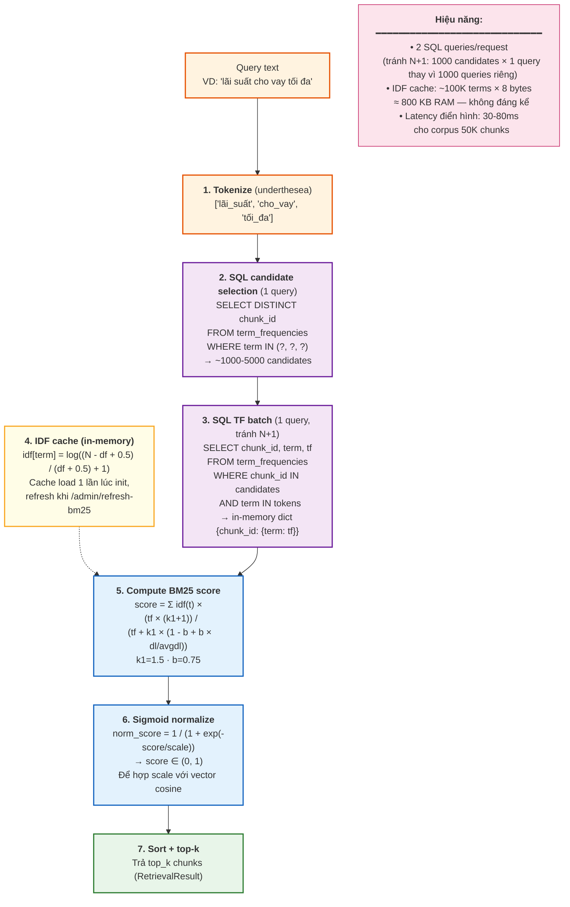

```mermaid
flowchart TB
    QUERY["Query text<br/>VD: 'lãi suất cho vay tối đa'"]

    TOK["<b>1. Tokenize</b> (underthesea)<br/>['lãi_suất', 'cho_vay', 'tối_đa']"]

    SQL_CAND["<b>2. SQL candidate selection</b> (1 query)<br/>SELECT DISTINCT chunk_id<br/>FROM term_frequencies<br/>WHERE term IN (?, ?, ?)<br/>→ ~1000-5000 candidates"]

    SQL_TF["<b>3. SQL TF batch</b> (1 query, tránh N+1)<br/>SELECT chunk_id, term, tf<br/>FROM term_frequencies<br/>WHERE chunk_id IN candidates<br/>  AND term IN tokens<br/>→ in-memory dict {chunk_id: {term: tf}}"]

    IDF["<b>4. IDF cache (in-memory)</b><br/>idf[term] = log((N - df + 0.5) / (df + 0.5) + 1)<br/>Cache load 1 lần lúc init,<br/>refresh khi /admin/refresh-bm25"]

    SCORE["<b>5. Compute BM25 score</b><br/>score = Σ idf(t) ×<br/>  (tf × (k1+1)) /<br/>  (tf + k1 × (1 - b + b × dl/avgdl))<br/>k1=1.5 · b=0.75"]

    SIG["<b>6. Sigmoid normalize</b><br/>norm_score = 1 / (1 + exp(-score/scale))<br/>→ score ∈ (0, 1)<br/>Để hợp scale với vector cosine"]

    SORT["<b>7. Sort + top-k</b><br/>Trả top_k chunks (RetrievalResult)"]

    NOTE["<b>Hiệu năng:</b><br/>━━━━━━━━━━━━━━━━━━━━━━━━━━━━━<br/>• 2 SQL queries/request<br/>  (tránh N+1: 1000 candidates × 1 query<br/>   thay vì 1000 queries riêng)<br/>• IDF cache: ~100K terms × 8 bytes<br/>  ≈ 800 KB RAM — không đáng kể<br/>• Latency điển hình: 30-80ms<br/>  cho corpus 50K chunks"]

    QUERY --> TOK
    TOK --> SQL_CAND
    SQL_CAND --> SQL_TF
    IDF -.-> SCORE
    SQL_TF --> SCORE
    SCORE --> SIG
    SIG --> SORT

    classDef inputNode fill:#fff3e0,stroke:#e65100,stroke-width:2px
    classDef processNode fill:#e3f2fd,stroke:#1565c0,stroke-width:2px
    classDef sqlNode fill:#f3e5f5,stroke:#6a1b9a,stroke-width:2px
    classDef cacheNode fill:#fffde7,stroke:#f9a825,stroke-width:2px
    classDef outNode fill:#e8f5e9,stroke:#2e7d32,stroke-width:2px
    classDef noteNode fill:#fce4ec,stroke:#c2185b,stroke-width:1px
    class QUERY,TOK inputNode
    class SQL_CAND,SQL_TF sqlNode
    class IDF cacheNode
    class SCORE,SIG processNode
    class SORT outNode
    class NOTE noteNode
```