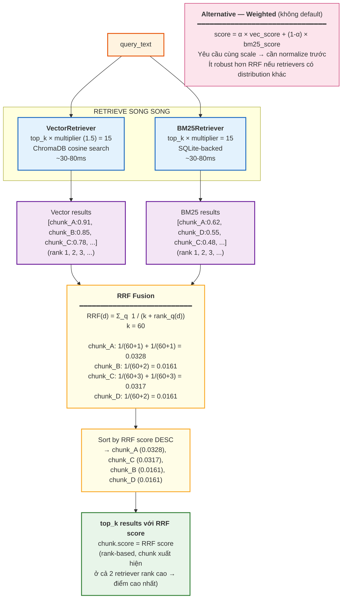

```mermaid
flowchart TB
    QUERY["query_text"]

    subgraph PARALLEL["RETRIEVE SONG SONG"]
        VEC["<b>VectorRetriever</b><br/>top_k × multiplier (1.5) = 15<br/>ChromaDB cosine search<br/>~30-80ms"]
        BM25_R["<b>BM25Retriever</b><br/>top_k × multiplier = 15<br/>SQLite-backed<br/>~30-80ms"]
    end

    VEC_RES["Vector results<br/>[chunk_A:0.91, chunk_B:0.85, chunk_C:0.78, ...]<br/>(rank 1, 2, 3, ...)"]
    BM25_RES["BM25 results<br/>[chunk_A:0.62, chunk_D:0.55, chunk_C:0.48, ...]<br/>(rank 1, 2, 3, ...)"]

    RRF["<b>RRF Fusion</b><br/>━━━━━━━━━━━━━━━━━━━━━━━━━━━<br/>RRF(d) = Σ_q  1 / (k + rank_q(d))<br/>k = 60<br/><br/>chunk_A: 1/(60+1) + 1/(60+1) = 0.0328<br/>chunk_B: 1/(60+2) = 0.0161<br/>chunk_C: 1/(60+3) + 1/(60+3) = 0.0317<br/>chunk_D: 1/(60+2) = 0.0161"]

    SORT["Sort by RRF score DESC<br/>→ chunk_A (0.0328), chunk_C (0.0317),<br/>   chunk_B (0.0161), chunk_D (0.0161)"]

    OUTPUT["<b>top_k results với RRF score</b><br/>chunk.score = RRF score<br/>(rank-based, chunk xuất hiện<br/>ở cả 2 retriever rank cao → điểm cao nhất)"]

    WEIGHTED["<b>Alternative — Weighted</b> (không default)<br/>━━━━━━━━━━━━━━━━━━━━━━━━━━━━━━━<br/>score = α × vec_score + (1-α) × bm25_score<br/>Yêu cầu cùng scale → cần normalize trước<br/>Ít robust hơn RRF nếu retrievers có distribution khác"]

    QUERY --> VEC
    QUERY --> BM25_R
    VEC --> VEC_RES
    BM25_R --> BM25_RES
    VEC_RES --> RRF
    BM25_RES --> RRF
    RRF --> SORT
    SORT --> OUTPUT

    classDef queryNode fill:#fff3e0,stroke:#e65100,stroke-width:2px
    classDef retrieverNode fill:#e3f2fd,stroke:#1565c0,stroke-width:2px
    classDef resultNode fill:#f3e5f5,stroke:#6a1b9a,stroke-width:2px
    classDef rrfNode fill:#fffde7,stroke:#f9a825,stroke-width:2px
    classDef outNode fill:#e8f5e9,stroke:#2e7d32,stroke-width:2px
    classDef altNode fill:#fce4ec,stroke:#c2185b,stroke-width:1px
    class QUERY queryNode
    class VEC,BM25_R retrieverNode
    class VEC_RES,BM25_RES resultNode
    class RRF,SORT rrfNode
    class OUTPUT outNode
    class WEIGHTED altNode
```