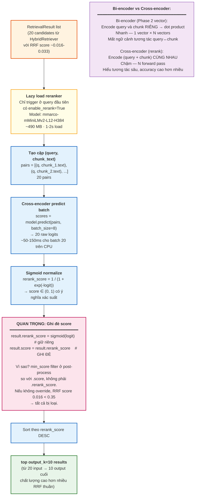

```mermaid
flowchart TB
    INPUT["RetrievalResult list<br/>(20 candidates từ HybridRetriever<br/>với RRF score ~0.016-0.033)"]

    LAZY["<b>Lazy load reranker</b><br/>Chỉ trigger ở query đầu tiên<br/>có enable_rerank=True<br/>Model: mmarco-mMiniLMv2-L12-H384<br/>~490 MB · 1-2s load"]

    PAIR["<b>Tạo cặp (query, chunk_text)</b><br/>pairs = [(q, chunk_1.text),<br/>          (q, chunk_2.text), ...]<br/>20 pairs"]

    BATCH["<b>Cross-encoder predict batch</b><br/>scores = model.predict(pairs, batch_size=8)<br/>→ 20 raw logits<br/>~50-150ms cho batch 20 trên CPU"]

    SIG["<b>Sigmoid normalize</b><br/>rerank_score = 1 / (1 + exp(-logit))<br/>→ score ∈ (0, 1) có ý nghĩa xác suất"]

    OVERRIDE["<b>QUAN TRỌNG: Ghi đè score</b><br/>━━━━━━━━━━━━━━━━━━━━━━━━━━━<br/>result.rerank_score = sigmoid(logit)  # giữ riêng<br/>result.score = result.rerank_score    # GHI ĐÈ<br/><br/>Vì sao? min_score filter ở post-process<br/>so với .score, không phải .rerank_score.<br/>Nếu không override, RRF score 0.016 < 0.35<br/>→ tất cả bị loại."]

    SORT["Sort theo rerank_score DESC"]

    OUTPUT["<b>top output_k=10 results</b><br/>(từ 20 input → 10 output cuối<br/>chất lượng cao hơn nhiều RRF thuần)"]

    NOTE["<b>Bi-encoder vs Cross-encoder:</b><br/>━━━━━━━━━━━━━━━━━━━━━━━━━━━━━━━━━━━<br/>Bi-encoder (Phase 2 vector):<br/>  Encode query và chunk RIÊNG → dot product<br/>  Nhanh — 1 vector × N vectors<br/>  Mất ngữ cảnh tương tác query↔chunk<br/><br/>Cross-encoder (rerank):<br/>  Encode (query + chunk) CÙNG NHAU<br/>  Chậm — N forward pass<br/>  Hiểu tương tác sâu, accuracy cao hơn nhiều"]

    INPUT --> LAZY
    LAZY --> PAIR
    PAIR --> BATCH
    BATCH --> SIG
    SIG --> OVERRIDE
    OVERRIDE --> SORT
    SORT --> OUTPUT

    classDef inputNode fill:#fff3e0,stroke:#e65100,stroke-width:2px
    classDef lazyNode fill:#fffde7,stroke:#f9a825,stroke-width:2px
    classDef processNode fill:#e3f2fd,stroke:#1565c0,stroke-width:2px
    classDef criticalNode fill:#fce4ec,stroke:#c2185b,stroke-width:2px
    classDef outNode fill:#e8f5e9,stroke:#2e7d32,stroke-width:2px
    classDef noteNode fill:#f3e5f5,stroke:#6a1b9a,stroke-width:1px
    class INPUT inputNode
    class LAZY lazyNode
    class PAIR,BATCH,SIG,SORT processNode
    class OVERRIDE criticalNode
    class OUTPUT outNode
    class NOTE noteNode
```