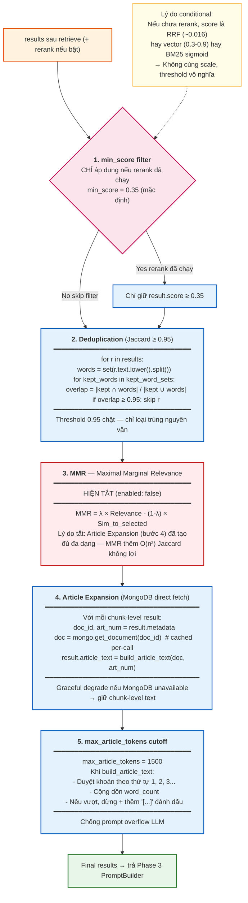

```mermaid
flowchart TB
    INPUT["results sau retrieve (+ rerank nếu bật)"]

    STEP1{"<b>1. min_score filter</b><br/>CHỈ áp dụng nếu rerank đã chạy<br/>min_score = 0.35 (mặc định)"}
    STEP1_NOTE["Lý do conditional:<br/>Nếu chưa rerank, score là RRF (~0.016)<br/>hay vector (0.3-0.9) hay BM25 sigmoid<br/>→ Không cùng scale, threshold vô nghĩa"]
    STEP1_OUT["Chỉ giữ result.score ≥ 0.35"]

    STEP2["<b>2. Deduplication</b> (Jaccard ≥ 0.95)<br/>━━━━━━━━━━━━━━━━━━━━━━━━━━━━━━━━━<br/>for r in results:<br/>  words = set(r.text.lower().split())<br/>  for kept_words in kept_word_sets:<br/>    overlap = |kept ∩ words| / |kept ∪ words|<br/>    if overlap ≥ 0.95: skip r<br/>━━━━━━━━━━━━━━━━━━━━━━━━━━━━━━━━━<br/>Threshold 0.95 chặt — chỉ loại trùng nguyên văn"]

    STEP3["<b>3. MMR</b> — Maximal Marginal Relevance<br/>━━━━━━━━━━━━━━━━━━━━━━━━━━━━━━━━━<br/>HIỆN TẮT (enabled: false)<br/>━━━━━━━━━━━━━━━━━━━━━━━━━━━━━━━━━<br/>MMR = λ × Relevance - (1-λ) × Sim_to_selected<br/>Lý do tắt: Article Expansion (bước 4) đã tạo<br/>đủ đa dạng — MMR thêm O(n²) Jaccard không lợi"]

    STEP4["<b>4. Article Expansion</b> (MongoDB direct fetch)<br/>━━━━━━━━━━━━━━━━━━━━━━━━━━━━━━━━━━━━━<br/>Với mỗi chunk-level result:<br/>  doc_id, art_num = result.metadata<br/>  doc = mongo.get_document(doc_id)  # cached per-call<br/>  result.article_text = build_article_text(doc, art_num)<br/>━━━━━━━━━━━━━━━━━━━━━━━━━━━━━━━━━━━━━<br/>Graceful degrade nếu MongoDB unavailable<br/>→ giữ chunk-level text"]

    STEP5["<b>5. max_article_tokens cutoff</b><br/>━━━━━━━━━━━━━━━━━━━━━━━━━━━━━━━━━<br/>max_article_tokens = 1500<br/>Khi build_article_text:<br/>  - Duyệt khoản theo thứ tự 1, 2, 3...<br/>  - Cộng dồn word_count<br/>  - Nếu vượt, dừng + thêm '[...]' đánh dấu<br/>━━━━━━━━━━━━━━━━━━━━━━━━━━━━━━━━━<br/>Chống prompt overflow LLM"]

    OUTPUT["Final results → trả Phase 3 PromptBuilder"]

    INPUT --> STEP1
    STEP1 -->|Yes rerank đã chạy| STEP1_OUT
    STEP1 -->|No skip filter| STEP2
    STEP1_NOTE -.-> STEP1
    STEP1_OUT --> STEP2
    STEP2 --> STEP3
    STEP3 --> STEP4
    STEP4 --> STEP5
    STEP5 --> OUTPUT

    classDef inputNode fill:#fff3e0,stroke:#e65100,stroke-width:2px
    classDef stepNode fill:#e3f2fd,stroke:#1565c0,stroke-width:2px
    classDef condNode fill:#fce4ec,stroke:#c2185b,stroke-width:2px
    classDef noteNode fill:#fffde7,stroke:#f9a825,stroke-width:1px
    classDef disabledNode fill:#ffebee,stroke:#c62828,stroke-width:2px
    classDef outNode fill:#e8f5e9,stroke:#2e7d32,stroke-width:2px
    class INPUT inputNode
    class STEP1 condNode
    class STEP1_NOTE noteNode
    class STEP1_OUT,STEP2,STEP4,STEP5 stepNode
    class STEP3 disabledNode
    class OUTPUT outNode
```