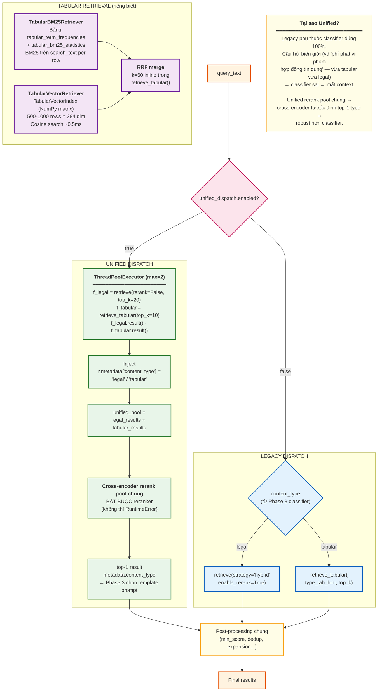

```mermaid
flowchart TB
    QUERY["query_text"]

    DISPATCH{"unified_dispatch.enabled?"}

    subgraph TABULAR_BRANCH["TABULAR RETRIEVAL (riêng biệt)"]
        TAB_BM25["<b>TabularBM25Retriever</b><br/>Bảng tabular_term_frequencies<br/>+ tabular_bm25_statistics<br/>BM25 trên search_text per row"]
        TAB_VEC["<b>TabularVectorRetriever</b><br/>TabularVectorIndex (NumPy matrix)<br/>500-1000 rows × 384 dim<br/>Cosine search ~0.5ms"]
        TAB_RRF["<b>RRF merge</b><br/>k=60 inline trong<br/>retrieve_tabular()"]
        TAB_BM25 --> TAB_RRF
        TAB_VEC --> TAB_RRF
    end

    subgraph LEGACY["LEGACY DISPATCH"]
        LEGACY_DISP{"content_type<br/>(từ Phase 3 classifier)"}
        LEGAL_RET["retrieve(strategy='hybrid'<br/>enable_rerank=True)"]
        TAB_RET_LEGACY["retrieve_tabular(<br/>type_tab_hint, top_k)"]
        LEGACY_DISP -->|legal| LEGAL_RET
        LEGACY_DISP -->|tabular| TAB_RET_LEGACY
    end

    subgraph UNIFIED["UNIFIED DISPATCH"]
        UNI_PARALLEL["<b>ThreadPoolExecutor (max=2)</b><br/>━━━━━━━━━━━━━━━━━━━━━━━<br/>f_legal = retrieve(rerank=False, top_k=20)<br/>f_tabular = retrieve_tabular(top_k=10)<br/>f_legal.result() · f_tabular.result()"]
        UNI_INJECT["Inject<br/>r.metadata['content_type'] =<br/>  'legal' / 'tabular'"]
        UNI_POOL["unified_pool =<br/>legal_results + tabular_results"]
        UNI_RERANK["<b>Cross-encoder rerank pool chung</b><br/>BẮT BUỘC reranker<br/>(không thì RuntimeError)"]
        UNI_TOP1["top-1 result<br/>metadata.content_type<br/>→ Phase 3 chọn template prompt"]
        UNI_PARALLEL --> UNI_INJECT
        UNI_INJECT --> UNI_POOL
        UNI_POOL --> UNI_RERANK
        UNI_RERANK --> UNI_TOP1
    end

    POSTPROC["Post-processing chung<br/>(min_score, dedup, expansion...)"]

    OUTPUT["Final results"]

    NOTE["<b>Tại sao Unified?</b><br/>━━━━━━━━━━━━━━━━━━━━━━━━━━━<br/>Legacy phụ thuộc classifier đúng 100%.<br/>Câu hỏi biên giới (vd 'phí phạt vi phạm<br/>hợp đồng tín dụng' — vừa tabular vừa legal)<br/>→ classifier sai → mất context.<br/><br/>Unified rerank pool chung →<br/>cross-encoder tự xác định top-1 type →<br/>robust hơn classifier."]

    QUERY --> DISPATCH
    DISPATCH -->|true| UNI_PARALLEL
    DISPATCH -->|false| LEGACY_DISP
    UNI_TOP1 --> POSTPROC
    LEGAL_RET --> POSTPROC
    TAB_RET_LEGACY --> POSTPROC
    POSTPROC --> OUTPUT

    classDef queryNode fill:#fff3e0,stroke:#e65100,stroke-width:2px
    classDef dispNode fill:#fce4ec,stroke:#c2185b,stroke-width:2px
    classDef tabNode fill:#f3e5f5,stroke:#6a1b9a,stroke-width:2px
    classDef legacyNode fill:#e3f2fd,stroke:#1565c0,stroke-width:2px
    classDef uniNode fill:#e8f5e9,stroke:#2e7d32,stroke-width:2px
    classDef postNode fill:#fffde7,stroke:#f9a825,stroke-width:2px
    classDef outNode fill:#fff3e0,stroke:#e65100,stroke-width:2px
    classDef noteNode fill:#fffde7,stroke:#f9a825,stroke-width:1px
    class QUERY,OUTPUT queryNode
    class DISPATCH dispNode
    class TAB_BM25,TAB_VEC,TAB_RRF tabNode
    class LEGACY_DISP,LEGAL_RET,TAB_RET_LEGACY legacyNode
    class UNI_PARALLEL,UNI_INJECT,UNI_POOL,UNI_RERANK,UNI_TOP1 uniNode
    class POSTPROC postNode
    class NOTE noteNode
```