# PHẦN 2 — RAG CORE

## 1. Giới thiệu Phần 2

Phần này đi sâu vào phân hệ **`rag-core`** — trái tim AI của hệ thống RAG-Chatbot Pháp lý Agribank. Đây là phân hệ phức tạp nhất trong ba phân hệ, chiếm phần lớn logic nghiệp vụ và là nơi xử lý toàn bộ pipeline từ "đưa văn bản vào kho" cho đến "sinh câu trả lời có trích dẫn".

Phân hệ `rag-core` được tổ chức thành **ba phase độc lập**, mỗi phase phụ trách một giai đoạn riêng biệt trong vòng đời của tri thức:

| Phase | Tên | Vai trò | Khi nào chạy |
|:-:|---|---|---|
| **1** | **Indexing** | Đọc văn bản → phân tích cấu trúc → lưu vào 5 CSDL → xây BM25 index | **Offline** — khi nạp tài liệu mới (vài phút/file) |
| **2** | **Retrieval** | Tìm kiếm chunk liên quan với câu hỏi qua BM25 + Vector + Rerank + Article Expansion | **Runtime** — mỗi lần có câu hỏi |
| **3** | **Generation** | Phân loại câu hỏi → xây prompt → gọi LLM → stream SSE về BFF | **Runtime** — mỗi lần có câu hỏi |

Việc tách 3 phase độc lập đem lại nhiều lợi ích kỹ thuật:

- **Phase 1 chạy hoàn toàn offline** — không ảnh hưởng đến server đang phục vụ truy vấn. Có thể chạy đêm khuya, máy khác, hay container build.
- **Phase 2 và Phase 3 cùng chạy runtime** nhưng tách biệt rõ ràng — Phase 2 chỉ có nhiệm vụ "tìm thông tin", Phase 3 chỉ có nhiệm vụ "trả lời". Tách biệt giúp test riêng từng phase, debug dễ hơn.
- **Phase 3 import Phase 2 trực tiếp qua module Python** (không qua HTTP) — tiết kiệm overhead serialization và connection pool. Đây là Nguyên tắc N4 được nhắc tại Phần 1 §3.2.

Bộ khung tổng thể của 3 phase đã được trình bày ở **Phần 1 §1.6** (sequence diagram E2E). Phần 2 này sẽ "mở hộp" từng phase, giải thích chi tiết các thành phần con, các quyết định thiết kế (ADR), và các đường edge-case mà người mới tiếp nhận hệ thống dễ bỏ qua.

### Quy ước ký hiệu trong Phần 2

- `Tên file` viết bằng `monospace`, ví dụ `phase1_indexing/ingestion.py`.
- Hình vẽ đánh số theo `Hình P.N` trong đó `P` là chương trong Phần 2 (2, 3, hoặc 4 tương ứng Phase 1/2/3) và `N` là thứ tự sơ đồ.
- Code snippet được lược bỏ phần boilerplate (imports, docstring) chỉ giữ logic nghiệp vụ then chốt.

---

## 2. Phase 1 — Indexing

### 2.1 Tổng quan Phase 1

Phase 1 chịu trách nhiệm **nhập liệu (ingestion)** tài liệu vào hệ thống RAG. Đây là phase duy nhất chạy **offline** — chỉ kích hoạt khi có file mới cần ingest, hoặc khi cần rebuild lại BM25 index sau một đợt thêm/sửa nhiều file.

Phase 1 gồm **hai pipeline song song và độc lập** — phục vụ hai loại dữ liệu rất khác nhau về cấu trúc:

#### 2.1.1 Pipeline Legal — Văn bản pháp lý có cấu trúc phân cấp

Pipeline Legal xử lý văn bản pháp lý có cấu trúc phân cấp `Văn bản → Điều → Khoản → Điểm`. Mỗi tệp đầu vào có thể là `.docx`, `.pdf`, hoặc `.txt`, được parse bằng regex để tách cấu trúc cấp độ ba này. Mỗi Khoản cuối cùng được lưu vào **3 store khác nhau**: MongoDB (cấu trúc phân cấp), ChromaDB (vector embedding), và SQLite (chunks + BM25 statistics).

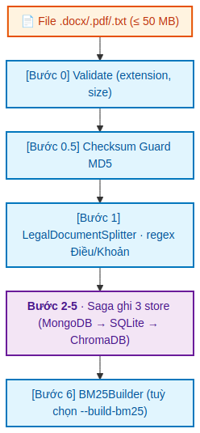

*Hình 2.1a — Pipeline Legal: file `.docx`/`.pdf`/`.txt` đi qua 7 bước (Bước 0 đến Bước 6), kết thúc ở 3 store (MongoDB, SQLite, ChromaDB) cộng với BM25 index. Checksum guard ở Bước 0.5 cho phép skip toàn bộ pipeline khi file không thay đổi.*

#### 2.1.2 Pipeline Tabular — Dữ liệu dạng bảng

Pipeline Tabular xử lý dữ liệu dạng bảng từ Excel — biểu phí, biểu lãi suất, biểu khuyến mãi. Cấu trúc phẳng (mỗi row = một hạng mục độc lập), không phân cấp. Toàn bộ pipeline Tabular nằm gọn trong **một SQLite file duy nhất** (`metadata.db`) với 7 bảng `TABULAR_*`. Vector embedding được lưu trực tiếp dưới dạng `BLOB` trong cùng bảng dữ liệu thay vì stand-up một collection ChromaDB riêng — phù hợp với khối lượng dữ liệu nhỏ (thường vài trăm đến ~1000 row).

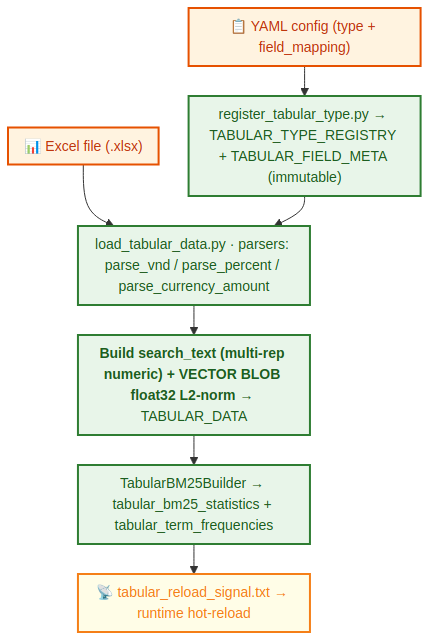

*Hình 2.1b — Pipeline Tabular: hai nguồn input (YAML định nghĩa type + Excel chứa data) hội tụ tại `load_tabular_data.py`, sau đó qua các bước build search_text + vector embedding rồi ghi vào TABULAR_DATA. File `tabular_reload_signal.txt` cuối cùng cho phép server runtime tự reload mà không cần restart.*

#### 2.1.3 Thành phần chính của Phase 1

| Thành phần | File | Vai trò |
|---|---|---|
| `DocumentIngestionPipeline` | `phase1_indexing/ingestion.py` | Class điều phối toàn bộ Legal pipeline 7 bước. Khởi tạo một lần, tái sử dụng cho nhiều file. |
| `LegalDocumentSplitter` | `phase1_indexing/lib/legal_document_splitter.py` | Parser văn bản pháp lý theo cấu trúc Điều > Khoản. Hỗ trợ `.docx`, `.pdf`, `.txt`. |
| `BM25Builder` | `shared/bm25_builder.py` | Builder BM25 index. **Tham số hoá theo `(stats_table, freq_table)`** để dùng được cho cả Legal và Tabular. |
| `register_tabular_type.py` | `scripts/` | Đọc YAML config → ghi `TABULAR_TYPE_REGISTRY` + `TABULAR_FIELD_META`. |
| `load_tabular_data.py` | `scripts/` | Đọc Excel + YAML mapping → ghi từng row vào `TABULAR_DATA` (kèm vector embedding). |
| `migrate_add_tabular_tables.py` | `scripts/` | Migration script tạo 7 bảng Tabular (idempotent — `CREATE TABLE IF NOT EXISTS`). |
| `verify_phase1.py` | `phase1_indexing/` | Verify dữ liệu trong cả 3 store sau ingest — đếm count, check chéo `chunk_id`. |

### 2.2 Legal Pipeline — Bảy bước Saga

Pipeline Legal là chuỗi 7 bước (đánh số 0 đến 6) thực thi tuần tự cho mỗi file đầu vào. Vì pipeline ghi vào 3 store khác nhau (MongoDB, SQLite, ChromaDB) mà không có distributed transaction thực sự, hệ thống áp dụng **Saga pattern** với compensating transaction để đảm bảo tính toàn vẹn.

#### 2.2.1 Bước 0 — Validate

Hàm `validate_ingestion_file(file_path)` kiểm tra ba điều kiện:

- File phải tồn tại và là regular file (không phải symlink, directory, device).
- Extension phải thuộc `{.docx, .txt, .pdf}`.
- Kích thước ≤ 50 MB.

File không pass sẽ raise `ValueError` ngay, không tốn thời gian parse.

#### 2.2.2 Bước 0.5 — Checksum Guard (tránh re-ingest)

Đây là một trong những bước quan trọng nhất về mặt vận hành: tránh re-ingest file không thay đổi.

```python
file_info = extract_file_info(file_path)            # MD5, size, abs_path
existing = sqlite_mgr.get_document_by_checksum(file_info['checksum'])
if existing:
    return IngestionResult(skipped=True, ...)        # Bỏ qua toàn bộ các bước còn lại
```

Khi chạy batch ingest hàng ngày (cron job), 99% file trong `data/uploads/` không thay đổi — checksum guard giúp bỏ qua chúng trong vài mili giây. Chỉ những file có nội dung mới thực sự (checksum khác) mới chạy tiếp Bước 1.

#### 2.2.3 Bước 1 — Parse document

```python
doc_schema = splitter.parse_document(file_path, domain, title)
doc_schema = splitter.update_clause_ids(doc_schema)
```

Splitter tự động phát hiện định dạng file:

- `.docx`: dùng `python-docx` đọc từng paragraph.
- `.pdf`: dùng `PyPDFLoader` của `langchain-community`.
- `.txt`: thử lần lượt các encoding `utf-8` → `latin-1` → `cp1252` → `iso-8859-1` để tránh lỗi `UnicodeDecodeError`.

**Regex nhận diện cấu trúc** (cố định trong code, không cấu hình được):

```python
# Nhận diện Điều — xử lý cả artifact PDF "Điều 1 3" → article_number = "13"
article_pattern = re.compile(r'^Điều\s+(\d+(?:\s\d+)?)\b', re.IGNORECASE)

# Nhận diện Khoản — \d{1,2} giới hạn 1-2 chữ số để tránh false positive
# với số tiền (4+ chữ số) và ngày tháng
clause_pattern = re.compile(r'^(\d{1,2})\.\s+(.+)')
```

**Sequential guard trong `_extract_clauses`:** Một bug rất khó debug nếu thiếu — biến `expected_clause_num` (bắt đầu = 1) chỉ chấp nhận một Khoản mới khi số Khoản **đúng bằng** giá trị mong đợi tiếp theo. Ví dụ: nếu trong Khoản 1 có dòng `"3. Cấp độ 3"`, regex sẽ match nhưng vì `expected_clause_num = 2` chứ không phải `3`, dòng đó được coi là **nội dung tiếp tục của Khoản 1** thay vì Khoản mới. Nếu không có guard này, chunking sẽ tạo ra "Khoản 3" giả ngay giữa Khoản 1 → sai cấu trúc.

**Chiến lược chunking — bất biến quan trọng:** **1 Khoản = 1 chunk.** Không sliding window, không overlap. Lý do đã được bàn ở Phần 1 §10.2: mỗi Khoản là một đơn vị ngữ nghĩa hoàn chỉnh trong luật pháp Việt Nam. Nếu Điều không có Khoản nào (chỉ là một đoạn văn liền mạch), toàn bộ nội dung Điều được đưa vào 1 chunk duy nhất với `clause_number = "1"` để giữ nhất quán schema.

**Trích xuất tiêu đề (`_extract_title_from_text`):** Thuật toán 5 cấp ưu tiên để có được tiêu đề đẹp dạng `"Thông tư 64/2024/TT-NHNN"`:

1. Tìm đồng thời `doc_type` (dòng khớp `^THÔNG TƯ|NGHỊ ĐỊNH|...`) và `doc_number` (dòng khớp `^Số\s*:\s*(.+)`) → ghép `"{DocType} {number}"`. Số được chuẩn hoá: loại bỏ khoảng trắng thừa giữa các ký tự (artifact PDF `"15  /2024/..."` → `"15/2024/..."`).
2. **Fallback 1:** Tìm được `doc_type` nhưng không có `doc_number` → ghép với mô tả ngay sau.
3. **Fallback 2:** Dòng bắt đầu bằng từ khoá pháp lý kèm mô tả (regex `^THÔNG TƯ\s+.*`) trong 10 dòng đầu.
4. **Fallback 3:** Dòng có độ dài 10–200 ký tự trong 5 dòng đầu, không phải tiêu đề Điều.
5. **Fallback 4:** Dùng tên file (stem).

Tham số `title` (truyền qua CLI `--title`) sẽ **bỏ qua hoàn toàn `_extract_title_from_text()`** — hữu ích khi tự động hoá ingest từ một danh mục văn bản đã chuẩn hoá tên.

**Re-ingestion pre-delete guard:** Sau khi parse, pipeline kiểm tra `sqlite_mgr.get_document(document_id)`. Nếu tìm thấy (file có nội dung mới nhưng cùng tên → cùng `document_id`), gọi `delete_document_from_all_dbs()` để xoá sạch cả 3 store **trước khi ghi mới** — tránh trạng thái mixed old/new data.

#### 2.2.4 Bước 2–5 — Ghi vào ba store

| Bước | Store | Hàm | Nội dung |
|:-:|---|---|---|
| 2 | MongoDB | `mongo_mgr.insert_document(doc_schema)` | Toàn bộ `LegalDocumentSchema` (cấu trúc phân cấp `articles[].clauses[]`). Trả về `mongo_id` (ObjectId). |
| 3 | SQLite (`documents`) | `sqlite_mgr.insert_document_meta(...)` | Metadata: `document_id`, `mongodb_id`, `total_articles`, `total_clauses`, `file_path`, `file_size`, `checksum`, `domain`. |
| 4 | SQLite (`chunks`) | `sqlite_mgr.insert_chunks_batch(chunks)` | Batch insert tất cả Khoản — mỗi Khoản 1 row với `text` (đã normalize) và `original_text` (gốc). |
| 5 | ChromaDB | `chroma_mgr.upsert_documents(ids, docs, metadatas)` | Vector embeddings collection `legal_clauses`. Dùng `upsert` (không phải `insert`) để tránh lỗi duplicate khi re-ingest. |

**Bước 4 — Schema chunks:** Mỗi Khoản trở thành một row:

```python
chunk = {
    'chunk_id':       clause.clause_id,        # khoá duy nhất {doc_id}_art{N}_cl{M}
    'document_id':    doc_schema.document_id,
    'chunk_index':    chunk_idx,                # thứ tự trong document
    'text':           clause.clause_content,    # text đã normalize (BM25/embedding)
    'original_text':  clause.original_content, # text gốc (để hiển thị)
    'token_count':    clause.token_count,
    'article_number': article.article_number,
    'article_title':  article.article_title,
    'clause_number':  clause.clause_number,
    'metadata':       {'domain': ..., 'document_title': ...}  # JSON string
}
```

Tách `text` (đã normalize) và `original_text` là quyết định quan trọng: BM25 và embedding cần text đã lowercase + chuẩn hoá Unicode để cải thiện matching, nhưng khi hiển thị câu trả lời cho người dùng, phải dùng đúng từ ngữ gốc của văn bản pháp lý. Hai cột tách biệt giúp giải quyết vấn đề này mà không cần normalize lại runtime.

**Bước 5 — Embedding model:** `sentence-transformers/paraphrase-multilingual-MiniLM-L12-v2` (~420 MB, hỗ trợ tiếng Việt). Lần đầu tải xuống từ HuggingFace; lần sau dùng cache local. Có thể trỏ sang model đã download trước qua `EMBEDDING_LOCAL_MODEL_PATH` để tránh phụ thuộc Internet khi setup máy mới.

#### 2.2.5 Bước 6 — Xây BM25 index (tuỳ chọn)

Chỉ chạy nếu `--build-bm25` được truyền vào CLI hoặc `auto_build_bm25=True`.

```
score(q, d) = Σ IDF(t) × [tf(t,d) × (k1+1)] / [tf(t,d) + k1×(1 - b + b×|d|/avgdl)]
```

Tham số `k1=1.5`, `b=0.75` — giá trị mặc định Okapi. IDF dùng công thức:

```
IDF(t) = log( (N - df(t) + 0.5) / (df(t) + 0.5) + 1 )
```

Quy trình `build_index()`:
1. Lấy toàn bộ chunks từ SQLite.
2. Tokenize từng chunk bằng `underthesea` (tiếng Việt) — nếu thư viện không cài, fallback `re.findall(r'\w+', text.lower())`.
3. Đếm TF per term per chunk, DF per term toàn corpus.
4. Tính IDF scores.
5. Batch ghi vào `bm25_statistics` và `chunk_term_frequencies`.

> **Best practice:** Khi ingest nhiều file batch, **không build BM25 sau mỗi file** (tốn kém). Thay vào đó: ingest tất cả file không có `--build-bm25`, sau đó chạy `python scripts/rebuild_bm25.py` một lần duy nhất.

#### 2.2.6 Saga Pattern — Atomic Ingestion

Vì 3 store (MongoDB/SQLite/ChromaDB) là các hệ thống độc lập không hỗ trợ distributed transaction, pipeline áp dụng **Saga pattern** với compensating transaction:

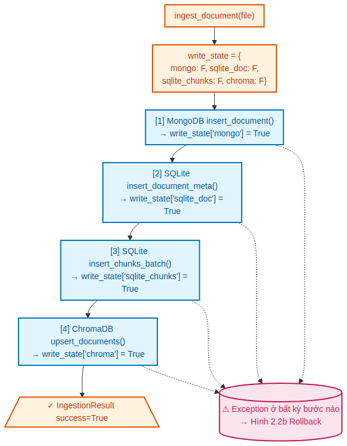

*Hình 2.2a — Happy path: 4 bước ghi tuần tự (MongoDB → SQLite documents → SQLite chunks → ChromaDB), mỗi bước đặt write_state[X] = True ngay sau khi thành công. Exception ở bất kỳ bước nào trigger flow rollback (Hình 2.2b).*

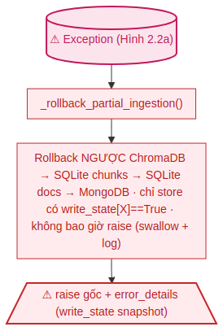

*Hình 2.2b — Khi exception xảy ra, `_rollback_partial_ingestion()` xoá ngược thứ tự (ChromaDB → SQLite chunks → SQLite docs → MongoDB), chỉ với những store đã ghi (write_state[X] == True). Bất biến quan trọng: rollback không bao giờ raise — exception trong rollback bị swallow + log để exception gốc bay ra.*

**Cơ chế `write_state` tracker:**

```python
write_state = {
    'mongo':         False,
    'sqlite_doc':    False,
    'sqlite_chunks': False,
    'chroma':        False
}
```

Mỗi flag được set `True` **ngay sau** khi lệnh write thành công. Nếu exception xảy ra ở bước nào, flag tương ứng vẫn `False`.

**Rollback tự động khi thất bại:**

Khi bất kỳ bước nào raise exception, `except` block gọi `_rollback_partial_ingestion()` — xoá ngược theo thứ tự **ChromaDB → SQLite chunks → SQLite documents → MongoDB**, chỉ với những store đã được ghi (`write_state[...] == True`).

| Failure scenario | Rollback actions |
|---|---|
| MongoDB fails | (no rollback — nothing was written) |
| SQLite documents fails after Mongo | Delete MongoDB only |
| SQLite chunks fails after both | Delete SQLite documents row + Delete MongoDB |
| ChromaDB fails after all three | Delete ChromaDB + SQLite chunks + SQLite documents + MongoDB |

**Quan trọng — Bất biến của rollback:** `_rollback_partial_ingestion()` **không bao giờ raise** — mọi exception trong rollback được swallow + log để exception gốc truyền ra caller. `error_details` trong `IngestionResult` bao gồm `write_state` snapshot tại thời điểm thất bại để debug.

> **Lý do thiết kế:** Nếu rollback raise, exception gốc bị che mất, nhân viên vận hành chỉ thấy lỗi cleanup mà không biết tại sao ingest fail. Bất biến "rollback never raises" giúp log line đầu tiên luôn là exception thực sự gây ra lỗi.

### 2.3 Tabular Pipeline — EAV-lite + Multi-representation Numeric

Pipeline Tabular đơn giản hơn Legal về số bước nhưng **phức tạp hơn về cấu trúc dữ liệu**: dùng EAV-lite (Entity-Attribute-Value) thay vì schema cố định, vì biểu phí có rất nhiều loại field khác nhau giữa các loại sản phẩm (Phí cá nhân khác Phí tổ chức tín dụng khác Phí thanh toán quốc tế…).

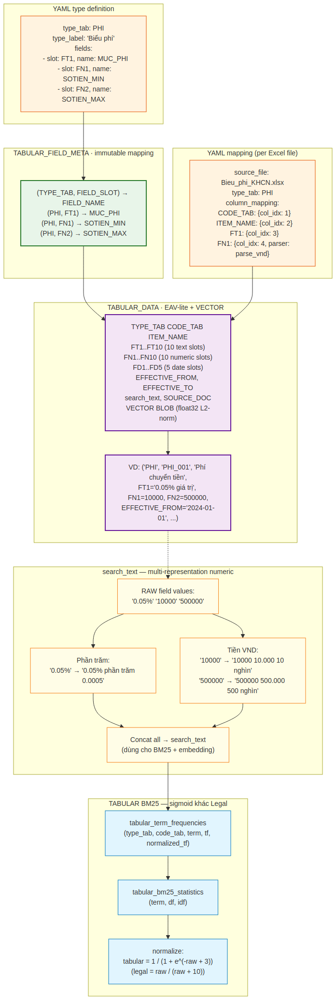

*Hình 2.3 — TABULAR_DATA schema EAV-lite với 25 slots (10 text + 10 numeric + 5 date) và search_text được enrich bằng multi-representation numeric.*

#### 2.3.1 Bảy bảng Tabular trong `metadata.db`

| Bảng | Mục đích |
|---|---|
| `TABULAR_TYPE_REGISTRY` | Danh sách `TYPE_TAB` đã đăng ký (`PHI`, `LAI_SUAT`, …). |
| `TABULAR_FIELD_META` | EAV schema: `(TYPE_TAB, FIELD_SLOT) → FIELD_NAME`. **Immutable** — không đổi tên field đã có data. |
| `TABULAR_DATA` | Dữ liệu thực: 25 slots + VECTOR BLOB + search_text. |
| `tabular_bm25_statistics` | BM25 IDF per term (riêng cho tabular, không chung với legal). |
| `tabular_term_frequencies` | BM25 TF per `(type_tab, code_tab, term)` với `normalized_tf`. |
| `tabular_ingestion_log` | Audit log nạp dữ liệu: `row_count`, `source_checksum`, `status`. |
| `query_classification_log` | Log phân loại query để analytics: `classifier_rule`, `confidence`, `result_count`. |

Tách riêng các bảng `tabular_*` vs Legal là quyết định có chủ đích — đảm bảo Nguyên tắc N5 (Phần 1 §3.2): zero cross-contamination giữa Legal và Tabular pipeline.

#### 2.3.2 EAV-lite schema — vì sao 10+10+5 slots?

`TABULAR_DATA` có **25 column dữ liệu** chia thành 3 nhóm:

```sql
-- 10 text slots
FT1 TEXT, FT2 TEXT, ..., FT10 TEXT,

-- 10 numeric slots
FN1 REAL, FN2 REAL, ..., FN10 REAL,

-- 5 date slots
FD1 TEXT, FD2 TEXT, ..., FD5 TEXT,
```

Mỗi slot có ý nghĩa khác nhau **tuỳ theo `TYPE_TAB`**, được quy định trong bảng `TABULAR_FIELD_META`:

| TYPE_TAB | FIELD_SLOT | FIELD_NAME | FIELD_LABEL |
|---|---|---|---|
| `PHI` | `FT1` | `MUC_PHI` | "Mức phí" |
| `PHI` | `FN1` | `SOTIEN_MIN` | "Số tiền tối thiểu" |
| `PHI` | `FN2` | `SOTIEN_MAX` | "Số tiền tối đa" |
| `LAI_SUAT` | `FN1` | `LAI_SUAT_NAM` | "Lãi suất năm" |
| `LAI_SUAT` | `FN2` | `KY_HAN_THANG` | "Kỳ hạn (tháng)" |

> **Ưu điểm của EAV-lite:** Thêm `TYPE_TAB` mới (ví dụ `KHUYEN_MAI`) không cần `ALTER TABLE` — chỉ insert vài row vào `TABULAR_FIELD_META`. Schema migration không cần khi business mở rộng.
>
> **Nhược điểm:** Query SQL kém tự nhiên hơn (`SELECT FN1 AS LAI_SUAT_NAM FROM TABULAR_DATA WHERE TYPE_TAB='LAI_SUAT'`). Vì vậy tất cả truy vấn đi qua `TabularPromptBuilder` (Phase 3) thay vì SQL trực tiếp — builder nhìn `TABULAR_FIELD_META` để biết slot nào là field nào.

**Bất biến quan trọng:** `(TYPE_TAB, FIELD_SLOT) → FIELD_NAME` mapping là **immutable** sau khi đăng ký. Không được đổi `(PHI, FT1) → MUC_PHI` thành `(PHI, FT1) → MUC_PHI_KHAC` vì sẽ phá vỡ tất cả search_text + embedding đã build trước đó. Nếu cần đổi, phải migrate toàn bộ `TABULAR_DATA` rồi rebuild BM25/vector.

#### 2.3.3 YAML config — hai cấp định nghĩa

**Cấp 1 — Type definition** (`data/tabular/types/PHI.yaml`):

```yaml
type_tab: PHI
type_label: "Biểu phí"
fields:
  - slot: FT1
    name: MUC_PHI                # tên nghiệp vụ — IMMUTABLE sau register
    label: "Mức phí"
    order: 1                     # thứ tự hiển thị trong prompt
    searchable: true
    required: true
  - slot: FN1
    name: SOTIEN_MIN
    label: "Số tiền tối thiểu"
    numeric: true
    order: 2
```

`register_tabular_type.py` đọc YAML này → ghi `TABULAR_TYPE_REGISTRY` + `TABULAR_FIELD_META`. Lỗi nếu `(TYPE_TAB, FIELD_SLOT)` đã tồn tại với `FIELD_NAME` khác → immutable violation.

**Cấp 2 — File mapping** (`data/tabular/mapping_PHI_KHCN.yaml`):

```yaml
source_file: "data/uploads/Bieu phi theo 2929/BieuPhi_KHCN.xlsx"
type_tab: PHI
sheets:
  - name: "Phí chuyển tiền"
header_row: 3                    # 1-based
data_start_row: 5                # 1-based
skip_empty_code: true            # bỏ qua row không có CODE_TAB
column_mapping:
  CODE_TAB:  { excel_col_index: 1 }              # 0-based integer
  ITEM_NAME: { excel_col_index: 2 }
  FT1:       { excel_col_index: 3 }
  FN1:       { excel_col_index: 4, parser: parse_vnd }
  FN2:       { excel_col_index: 5, parser: parse_vnd }
```

> **Vì sao `excel_col_index` (0-based int) thay vì `excel_column` (tên)?** Nhiều file Excel của Agribank có header 2 dòng hoặc merged cells — tên cột bị duplicate hoặc rỗng. Chỉ số cột là cách duy nhất tin cậy.

**Parsers mặc định:**

| Parser | Input | Output | Ghi chú |
|---|---|---|---|
| `parse_vnd` | `"1,000,000"` hoặc `"1.000.000"` | `1000000.0` | Smart locale detection (US vs EU). |
| `parse_percent` | `"0.02%"` hoặc `"2"` | `0.02` | Chuyển sang decimal. |
| `parse_currency_amount` | `"1,000 USD"` | `(1000.0, "USD")` | Hỗ trợ VND/VNĐ, USD, EUR, GBP, JPY, CNY, SGD, THB. Yêu cầu khai báo `currency_slot` để lưu currency string vào TEXT slot kế bên. |

#### 2.3.4 Multi-representation numeric — bí quyết BM25 cho số

Thử thách: BM25 là keyword search dựa trên token matching. Số `0.05%` được tokenize thành `["0.05", "%"]` — không match được nếu user gõ `"phần trăm"` hay `"0.0005"`.

Giải pháp: build `search_text` với **multi-representation numeric** — mỗi giá trị số được mở rộng thành nhiều dạng biểu diễn khác nhau:

| Field gốc | Multi-representation trong search_text |
|---|---|
| `0.05%` | `0.05% phần trăm 0.0005` |
| `1.000.000` (VND) | `1000000 1.000.000 1 triệu` |
| `500.000` (VND) | `500000 500.000 500 nghìn` |
| `15` (years) | `15 mười lăm 15 năm` |

Khi user hỏi `"phần trăm bao nhiêu?"`, BM25 match được token `"phần trăm"` — vốn không có trong giá trị gốc nhưng đã được "embed sẵn" vào search_text.

**Vector embedding** cũng dùng search_text này → cùng pattern multi-rep, tăng cosine similarity với câu hỏi của user.

#### 2.3.5 Hot-reload signal

Sau khi `load_tabular_data.py` ghi xong batch row, file `data/tabular_reload_signal.txt` được cập nhật `mtime` về thời điểm hiện tại.

Trong runtime, `RetrievalOrchestrator._check_tabular_reload_signal()` kiểm tra mtime của file này mỗi khi `retrieve_tabular()` được gọi. Nếu mtime mới hơn lần check trước → gọi `TabularVectorIndex.rebuild()` để load lại numpy matrix vào RAM.

> **Tinh tế:** Hot-reload không cần restart server. Ops engineer có thể chạy `load_tabular_data.py` để cập nhật biểu phí mới, server tự nhận biết trong vòng vài giây mà không gián đoạn user nào đang chat.

### 2.4 Cấu trúc lưu trữ — Schema chi tiết

#### 2.4.1 LegalDocumentSchema (MongoDB + in-memory)

```
LegalDocumentSchema
├── document_id: str          # hash(filename + content[:1000])
├── file_name: str
├── title: str
├── domain: str               # TD | TC | THUE | LD | BH | TT | CNTT | KHAC
├── total_articles: int
├── total_clauses: int
├── status: DocumentStatus    # active | archived | deleted | processing | error
└── structure: List[ArticleSchema]
    └── ArticleSchema
        ├── article_number: str    # "1", "2", ..., "13"
        ├── article_title: str     # có thể None
        ├── article_content: str   # toàn bộ nội dung thô của Điều
        └── clauses: List[ClauseSchema]
            └── ClauseSchema
                ├── clause_id: str       # {doc_id}_art{N}_cl{M}
                ├── clause_number: str
                ├── clause_content: str  # text đã normalize
                ├── original_content: str
                └── token_count: int
```

`document_id` = hash(filename + 1000 ký tự đầu nội dung) → đảm bảo cùng file luôn cho ra cùng `document_id` (ổn định cho re-ingestion guard).

`clause_id` format `{doc_id}_art{N}_cl{M}` là **khoá nối 3 store**: ChromaDB ID, SQLite `chunks.chunk_id`, và MongoDB `articles[].clauses[]`.

#### 2.4.2 SQLite Legal Schema

```sql
CREATE TABLE documents (
    id INTEGER PRIMARY KEY AUTOINCREMENT,
    document_id TEXT UNIQUE NOT NULL,
    file_name TEXT NOT NULL,
    file_path TEXT,                   -- đường dẫn tuyệt đối
    title TEXT, domain TEXT,
    mongodb_id TEXT NOT NULL,
    mongodb_collection TEXT,
    total_articles INTEGER, total_clauses INTEGER,
    version TEXT, status TEXT,
    file_size INTEGER, checksum TEXT,
    created_at TIMESTAMP, updated_at TIMESTAMP
);

CREATE TABLE chunks (
    id INTEGER PRIMARY KEY AUTOINCREMENT,
    chunk_id TEXT UNIQUE NOT NULL,
    document_id TEXT NOT NULL,
    chunk_index INTEGER NOT NULL,
    text TEXT NOT NULL,           -- normalized
    original_text TEXT,
    token_count INTEGER,
    article_number TEXT, article_title TEXT, clause_number TEXT,
    metadata TEXT,                -- JSON string
    created_at TIMESTAMP,
    FOREIGN KEY (document_id) REFERENCES documents(document_id)
);

CREATE TABLE bm25_statistics (
    term TEXT PRIMARY KEY,
    document_frequency INTEGER NOT NULL,
    idf_score REAL NOT NULL,
    total_term_frequency INTEGER DEFAULT 0,
    updated_at TIMESTAMP
);

CREATE TABLE chunk_term_frequencies (
    chunk_id TEXT NOT NULL,
    term TEXT NOT NULL,
    term_frequency INTEGER NOT NULL,
    PRIMARY KEY (chunk_id, term)
);
```

#### 2.4.3 ChromaDB Collection

| Thuộc tính | Giá trị |
|---|---|
| Tên collection | `legal_clauses` |
| ID | `clause_id` (khớp với SQLite `chunk_id`) |
| Document text | `clause_content` (đã normalize) |
| Metadata | `{document_id, chunk_id, article_number, article_title, clause_number, domain, chunk_index, document_title}` |
| Persist dir | `data/chromadb/` |
| Embedding model | `paraphrase-multilingual-MiniLM-L12-v2` (384-dim) |

### 2.5 CLI và operations

#### 2.5.1 Lệnh chạy chính

```bash
# Ingest 1 file, build BM25 luôn
python phase1_indexing/ingestion.py data/uploads/file.docx --domain TD --build-bm25

# Ingest với title tuỳ chỉnh (bỏ qua auto-detect)
python phase1_indexing/ingestion.py data/uploads/file.docx --domain TD \
  --title "Thông tư 15/2024/TT-NHNN"

# Batch ingest từ docs_list.csv (delimiter ';', không header)
python phase1_indexing/ingestion.py --batch --build-bm25

# Xoá toàn bộ Legal (yêu cầu nhập "YES")
python phase1_indexing/ingestion.py --purge-all

# Rebuild BM25 sau khi ingest nhiều file không --build-bm25
python scripts/rebuild_bm25.py

# Verify dữ liệu trong cả 3 DB
python phase1_indexing/verify_phase1.py

# Rebuild adaptive_keywords (dùng cho Phase 2 Adaptive routing)
python scripts/rebuild_adaptive_keywords.py --top-n 50

# Tabular: register type và load data
python scripts/register_tabular_type.py data/tabular/types/PHI.yaml
python scripts/load_tabular_data.py data/tabular/mapping_PHI_KHCN.yaml
```

#### 2.5.2 IngestionResult — Kết quả trả về

Pipeline trả về object `IngestionResult` với 2 trạng thái chính:

```python
# Ingest thành công
IngestionResult(
    success=True, skipped=False,
    document_id="abc123...",
    file_name="QuyetDinh123.docx",
    articles_processed=15,
    clauses_processed=67,
    chunks_indexed=67,
    mongodb_id="507f1f77bcf86cd799439011",
    sqlite_id=3,
    duration_seconds=8.4
)

# File không thay đổi (checksum trùng) — bỏ qua
IngestionResult(
    success=True, skipped=True,
    document_id="abc123...",
    chunks_indexed=0,
    error_message="Skipped: identical file already indexed",
    duration_seconds=0.1
)
```

`BatchIngestionResult` aggregate kết quả nhiều file:

```python
BatchIngestionResult(
    total_files=5, successful=5, failed=0,
    results=[...],                  # List[IngestionResult]
    total_duration_seconds=42.1
)
```

---

## 3. Phase 2 — Retrieval

### 3.1 Tổng quan và bốn chiến lược retrieval

Phase 2 là tầng **truy xuất tài liệu** trong pipeline RAG — nhận câu truy vấn từ Phase 3, tìm kiếm chunk liên quan trong các kho dữ liệu đã được Phase 1 lập chỉ mục, trả về danh sách `RetrievalResult` đã được rerank và mở rộng ngữ cảnh.

Phase 2 phục vụ **ba phương thức retrieval khác nhau**:

| Phương thức | Mục đích | Khi nào dùng |
|---|---|---|
| `retrieve()` | Legal — chunks pháp lý từ SQLite (BM25) + ChromaDB (vector) | Câu hỏi pháp lý thông thường, hoặc Unified Dispatch |
| `retrieve_tabular()` | Tabular — biểu phí/lãi suất từ SQLite only | Câu hỏi biểu phí/lãi suất thông thường, hoặc Unified Dispatch |
| `retrieve_unified_sync()` | Parallel legal + tabular → CrossEncoder rerank merged pool | Mặc định trong Phase 3 (Unified Dispatch enabled) |

Phase 2 phục vụ hai cách sử dụng:

1. **FastAPI server** trên port `8000` cho client bên ngoài (hữu ích để test retrieval độc lập).
2. **Import trực tiếp** bởi Phase 3 (không qua HTTP) — đây là path chính trong vận hành.

#### 3.1.1 Bốn chiến lược retrieval cho Legal

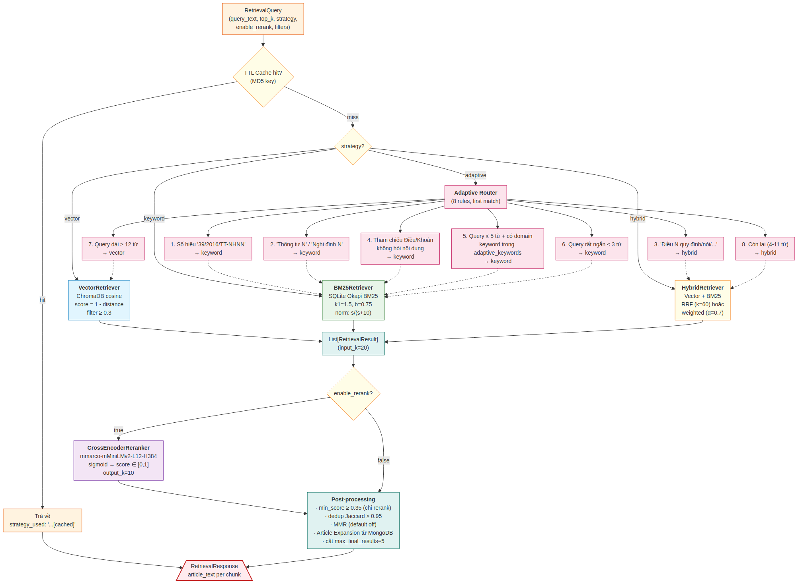

*Hình 3.1 — Vector / Keyword / Hybrid / Adaptive — bốn chiến lược tương ứng với bốn loại câu truy vấn khác nhau, với 8 quy tắc routing trong Adaptive.*

Bốn chiến lược retrieval đại diện cho ba điểm cân bằng giữa **chính xác từ khoá** (keyword) và **chính xác ngữ nghĩa** (vector), cộng với một strategy meta-level (adaptive) tự chọn:

##### 3.1.2 Vector — Semantic Search

- **Class:** `VectorRetriever`
- **Backend:** ChromaDB collection `legal_clauses`
- **Model:** `paraphrase-multilingual-MiniLM-L12-v2`

Quy trình:
1. Embed câu truy vấn bằng SentenceTransformer.
2. Gọi `ChromaDBManager.query()` với `n_results=top_k`.
3. Chuyển đổi khoảng cách cosine sang điểm tương đồng: `score = 1 - distance`.
4. Lọc chunk có `score < similarity_threshold` (mặc định `0.3` — đã hạ từ `0.5` vì khi có reranker, `min_score` mới là ngưỡng cuối cùng).

**Phù hợp với:** Câu hỏi ngữ nghĩa, diễn đạt khác nhau nhưng cùng ý nghĩa. Ví dụ `"điều kiện được vay tín dụng?"` match với chunk có `"các yêu cầu để cấp khoản vay tín dụng"` mặc dù không có từ khoá chung.

##### 3.1.3 Keyword (BM25)

- **Class:** `BM25Retriever`
- **Backend:** SQLite — bảng `chunks`, `bm25_statistics`, `chunk_term_frequencies`
- **Tokenizer:** `underthesea` (tiếng Việt)

Quy trình:
1. Tokenize + lowercase câu truy vấn.
2. SQL `_get_candidate_chunks`: lấy tất cả chunk có ít nhất 1 term trùng với query (qua JOIN với `chunk_term_frequencies`).
3. `_calculate_bm25_scores_batch`: **một query SQL duy nhất** lấy `(chunk_id, term, tf)` cho toàn bộ candidates — tránh N+1 query. Đây là một tối ưu quan trọng — query naive sẽ chạy 1 SQL/chunk → với 100 candidates là 100 round-trip.
4. Tính BM25:
   ```
   score(q, d) = Σ IDF(t) × [tf(t,d) × (k1+1)] / [tf(t,d) + k1×(1 - b + b×|d|/avgdl)]
   ```
   Tham số: `k1=1.5`, `b=0.75`.
5. Normalize về `[0,1]` bằng: `score / (score + 10)` (sigmoid-like).

**Phù hợp với:** Câu hỏi có điều khoản cụ thể, số hiệu văn bản, từ khoá chính xác. Ví dụ `"Điều 5 Thông tư 39"` cần exact term match.

##### 3.1.4 Hybrid (RRF Fusion)

- **Class:** `HybridRetriever`
- **Cấp độ:** Gọi cả `VectorRetriever` lẫn `BM25Retriever`, hợp nhất bằng RRF hoặc weighted fusion.

**Tinh tế quan trọng:** `HybridRetriever` nhận **shared instances** của `VectorRetriever` và `BM25Retriever` từ `RetrievalOrchestrator` thay vì tự tạo mới. Điều này tránh load embedding model hai lần (~420 MB lần) — quan trọng với máy chủ CPU-only RAM hạn chế.

Số lượng candidates per sub-retriever:
```
retrieval_k = min(int(top_k × retrieval_multiplier), 30)
```
Với `retrieval_multiplier=1.5` — đủ overlap cho fusion mà không lãng phí tài nguyên.

**RRF (Reciprocal Rank Fusion) — mặc định:**

```
RRF_score(d) = Σ 1 / (k + rank(d))     k=60
```

Chunk xuất hiện cao ở **cả hai** danh sách được ưu tiên mạnh.

**Weighted Fusion (tuỳ chọn):**

```
score(d) = α × vector_score_norm + (1-α) × keyword_score_norm
```

Với `α=0.7` (vector) và `1-α=0.3` (keyword). Cả hai điểm được min-max normalize trước.

**Phù hợp với:** Hầu hết câu hỏi thực tế — cân bằng giữa ngữ nghĩa và từ khoá. Khi không biết câu hỏi thuộc loại nào, hybrid là lựa chọn an toàn nhất.

##### 3.1.5 Adaptive — Rule-based Routing

`Adaptive` không phải là một strategy retrieval mới mà là **meta-strategy** tự chọn một trong ba strategy trên dựa vào đặc điểm câu truy vấn. Class `RetrievalOrchestrator._select_adaptive_strategy()` chứa 8 quy tắc theo thứ tự ưu tiên:

| # | Điều kiện | Strategy được chọn | Lý do |
|:-:|---|:-:|---|
| 1 | Số hiệu văn bản đầy đủ (`39/2016/TT-NHNN`) | keyword | Exact match là tốt nhất |
| 2 | Loại văn bản + số (`Thông tư 39`, `Nghị định 117`) | keyword | Exact term match |
| 3 | `Điều N quy định/nói/nêu/gì/như thế nào` | hybrid | Cần cả exact (Điều N) lẫn semantic (nội dung) |
| 4 | Tham chiếu `Điều N` / `Khoản N` không hỏi nội dung | keyword | Exact match đủ |
| 5 | Query ≤ 5 từ **và** có domain keyword trong SQLite | keyword | Term match chính xác hơn |
| 6 | Query rất ngắn (≤ 3 từ) | keyword | Quá ngắn cho semantic |
| 7 | Query dài (≥ 12 từ) | vector | Câu dài mang ngữ nghĩa phức tạp |
| 8 | Còn lại (4–11 từ, không có rule trên) | hybrid | Cân bằng cả hai |

**Domain keyword routing (Rule 5)** đáng chú ý: keyword được load từ bảng `adaptive_keywords` (bảng SQLite riêng) lúc khởi động. Bảng này được build bằng `python scripts/rebuild_adaptive_keywords.py` — extract top-N keyword per domain từ corpus chunks. Nếu bảng rỗng (chưa rebuild), Rule 5 tự động bị bỏ qua, không crash.

### 3.2 Hybrid Retrieval — Quy trình chi tiết end-to-end

Để hiểu cách `hybrid+rerank` hoạt động trong thực tế, dưới đây là một lần `retrieve()` đầy đủ với câu hỏi cụ thể.

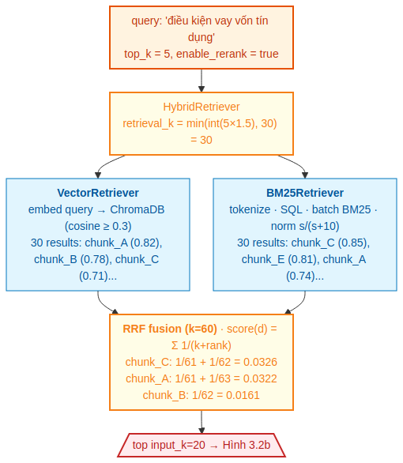

*Hình 3.2a — Phần đầu của Hybrid retrieval: query đi qua HybridRetriever → song song Vector + BM25 (mỗi sub-retriever 30 candidates) → RRF fusion với k=60. Ví dụ chunk_C xuất hiện ở cả 2 danh sách → RRF score cao nhất 0.0326.*

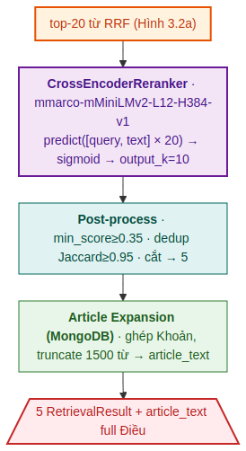

*Hình 3.2b — Phần sau: top-20 từ RRF đi qua CrossEncoder reranker (mmarco model), post-process (min_score, dedup), Article Expansion từ MongoDB lấy full Điều — kết quả cuối là 5 RetrievalResult với article_text đầy đủ.*

#### 3.2.1 Bước 1 — Xác định strategy

Với `strategy="adaptive"`, orchestrator chạy `_select_adaptive_strategy(query_text)`:

- `query_text = "điều kiện vay vốn tín dụng ngân hàng"` (7 từ)
- Không match Rule 1–5 (không có số hiệu, không có "Điều N", có domain keyword nhưng > 5 từ)
- Không match Rule 6 (không phải ≤ 3 từ)
- Không match Rule 7 (không phải ≥ 12 từ)
- Match **Rule 8**: 4–11 từ → `hybrid`

#### 3.2.2 Bước 2 — Tính `retrieval_k`

```
retrieval_k = min(int(top_k × 1.5), 30)
            = min(int(5 × 1.5), 30)
            = min(7, 30) = 7
```

Lưu ý: nếu `enable_rerank=True`, `effective_top_k = max(top_k, input_k=20) = 20` được dùng thay top_k để retrieve thêm candidates cho reranker.

#### 3.2.3 Bước 3 — Chạy song song Vector + BM25

Cả hai sub-retriever chạy độc lập (không thực sự parallel ở implementation hiện tại, nhưng có thể parallelize trong tương lai):

- **VectorRetriever**: embed query → ChromaDB → 30 results với cosine score `[0.65, 0.92]` sau khi lọc threshold 0.3.
- **BM25Retriever**: tokenize → SQL → batch BM25 → 30 results với normalized score `[0.4, 0.85]`.

#### 3.2.4 Bước 4 — RRF fusion

Mỗi chunk xuất hiện trong vector hoặc BM25 nhận điểm `1/(k+rank)`. Chunk có ở cả hai danh sách được cộng điểm từ cả hai vị trí:

```
chunk_C: rank=0 BM25 + rank=1 vector → 1/61 + 1/62 = 0.0326
chunk_A: rank=0 vector + rank=2 BM25 → 1/61 + 1/63 = 0.0322
chunk_B: rank=1 vector (chỉ vector) → 1/62 = 0.0161
```

> **Tinh tế của RRF:** Chỉ cần xuất hiện ở vị trí cao trong **một** danh sách là có điểm đáng kể (`1/61 ≈ 0.0164`). Xuất hiện thấp ở cả hai (rank 19 + 19 = `1/79 + 1/79 = 0.0253`) cũng có thể vượt qua chunk chỉ xuất hiện cao ở một danh sách. RRF là cách hợp nhất đơn giản nhưng hiệu quả mà không cần normalize hai thang điểm khác nhau.

Sau RRF, lấy top-20 (`input_k`) đưa cho reranker.

#### 3.2.5 Bước 5 — CrossEncoder reranker

- **Model:** `cross-encoder/mmarco-mMiniLMv2-L12-H384-v1` (~490 MB, hỗ trợ tiếng Việt)
- **Đặc điểm:** Cross-encoder nhận `(query, passage)` cùng lúc, predict relevance score qua transformer cross-attention — chính xác hơn cosine similarity nhưng O(N) inference. Vì vậy chỉ dùng cho top-20 sau RRF.

```
predict([(query, chunk_A.text), (query, chunk_C.text), ...]) → logits
sigmoid(logits) → rerank_score ∈ [0, 1]
```

Sau rerank, các điểm sẽ thay đổi đáng kể so với RRF:

```
chunk_A → 0.91 (rerank)         ← lên top
chunk_C → 0.84
chunk_E → 0.62
chunk_B → 0.38                   ← bị min_score=0.35 lọc xuống nhưng vẫn pass
```

**Lưu ý quan trọng:** Reranker **ghi đè cả `result.score` lẫn `result.rerank_score`** với giá trị sigmoid. `min_score` filter (post-processing) so sánh trên `result.rerank_score`.

**Lazy load:** Model chỉ load lần đầu có request `enable_rerank=True` — không block API startup. Khi server idle, không tốn ~500MB RAM của reranker.

#### 3.2.6 Bước 6 — Post-processing

Pipeline 6 bước:

1. **Min-score filter** (chỉ khi `enable_rerank=True`): loại kết quả có `rerank_score < min_score` (mặc định `0.35`).
2. **Text-level deduplication**: loại chunk trùng lặp bằng Jaccard word overlap ≥ `0.95`.
3. **Article-level deduplication**: *thực chất KHÔNG được gọi ở Phase 2* — method `_deduplicate_by_article()` tồn tại nhưng comment-out trong `_post_process()`. Article-level dedup được Phase 3 PromptBuilder xử lý.
4. **MMR**: disabled mặc định (`mmr.enabled: false`). Lý do: article-level dedup ở Phase 3 đã đảm bảo diversity.
5. **Limit** kết quả về `max_final_results` (mặc định `5`).
6. **Article Expansion** từ MongoDB.

#### 3.2.7 Bước 7 — Article Expansion

Đây là bước đặc biệt của hệ thống RAG này — không phải mọi RAG system đều có:

```python
# orchestrator.py — _expand_to_articles()
for result in results:
    doc_id = result.metadata['document_id']
    article_num = result.metadata['article_number']

    # Cache theo doc_id để tránh fetch nhiều lần cùng document
    doc = mongo_doc_cache.get(doc_id)
    if doc is None:
        doc = mongo_mgr.get_document(doc_id)
        mongo_doc_cache[doc_id] = doc

    article = next((a for a in doc['articles'] if a['article_number'] == article_num), None)
    if article:
        result.article_text = _build_article_text(article, max_tokens=1500)
        result.metadata['title'] = doc['title']
```

`_build_article_text()`:
- Ưu tiên `article_content` (pre-assembled trong Phase 1).
- Fallback: ghép tất cả Khoản từ `clauses[]` thành một block text.
- **Truncation:** nếu tổng số từ vượt `max_article_tokens` (mặc định 1500), các Khoản còn lại được thay bằng marker `"[... (N khoản tiếp theo được lược bỏ)]"`. Ngưỡng 1500 từ ≈ 1200 token tiếng Việt.

**Tại sao Article Expansion?** Một Khoản đứng riêng có thể vô nghĩa. Ví dụ Khoản quy định `"Trong trường hợp quy định tại Khoản 1, ngân hàng phải..."` — nếu LLM không thấy Khoản 1, nó không hiểu "trường hợp" là gì. Đưa toàn bộ Điều giúp LLM có context đầy đủ.

**`MongoDBManager` được lazy-init** lần đầu — nếu thất bại (Mongo down), article expansion bị tắt silently (không crash). `result.article_text = None`, Phase 3 fallback dùng `result.text` thay thế.

### 3.3 Tabular Retrieval

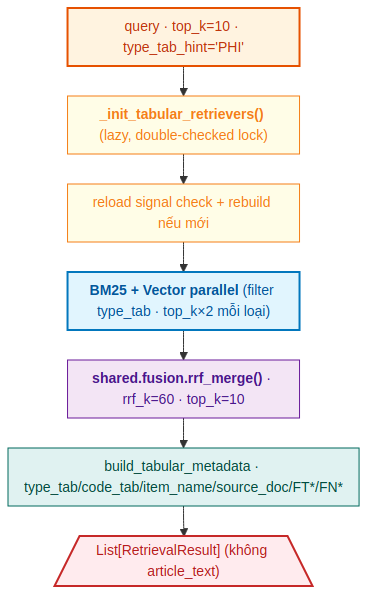

*Hình 3.3 — Pipeline retrieve_tabular: lazy init thread-safe, hot-reload signal check, parallel BM25+Vector, RRF merge.*

`retrieve_tabular()` đơn giản hơn `retrieve()` Legal về flow nhưng có một số đặc điểm riêng đáng lưu ý.

#### 3.3.1 Lazy initialization (thread-safe double-checked lock)

Tabular retrievers được khởi tạo **lazy** — chỉ load lần đầu có request tabular:

```python
# orchestrator.py
self._tabular_lock = threading.Lock()
self._tabular_bm25 = None
self._tabular_vector = None

def _init_tabular_retrievers(self):
    if self._tabular_bm25 is not None:
        return                                  # fast path (no lock)
    with self._tabular_lock:
        if self._tabular_bm25 is not None:      # double-check (locked)
            return
        embedding_fn = self._get_embedding_fn()
        self._tabular_bm25 = TabularBM25Retriever(self.sqlite_mgr)
        self._tabular_vector_index = TabularVectorIndex(self.sqlite_mgr, embedding_fn)
        self._tabular_vector = TabularVectorRetriever(self._tabular_vector_index, embedding_fn)
```

**Vì sao double-checked lock?** Trong môi trường multi-threaded (FastAPI uvicorn workers), nhiều request tabular đến cùng lúc có thể cùng vào `_init_*()` → race condition khởi tạo 2 lần = lãng phí RAM cho 2 bản matrix. Lock giải quyết, nhưng `lock.acquire()` mỗi request là overhead → fast path no-lock check trước.

`_get_embedding_fn()` extract embedding function từ `VectorRetriever` đã load (Legal pipeline) — **tránh load model lần thứ hai** (~420 MB).

#### 3.3.2 Hot-reload signal check

```python
def _check_tabular_reload_signal(self):
    signal_path = Path(self.data_dir) / 'tabular_reload_signal.txt'
    if not signal_path.exists():
        return
    mtime = signal_path.stat().st_mtime
    if mtime > self._last_reload_check:
        self._tabular_vector_index.rebuild()
        self._tabular_bm25.rebuild()
        self._last_reload_check = mtime
```

Mỗi lần `retrieve_tabular()` được gọi, kiểm tra mtime của file signal. Nếu mới hơn lần check trước → rebuild matrix + BM25. Cost của check ~0.1ms khi không có thay đổi.

#### 3.3.3 Parallel BM25 + Vector

```python
# Cả hai retriever đều support type_tab_filter để filter sớm
bm25_results = self._tabular_bm25.retrieve(query, top_k=top_k*2, filters=effective_filters)
vec_results = self._tabular_vector.retrieve(query, top_k=top_k*2, filters=effective_filters)

results = rrf_merge([bm25_results, vec_results], rrf_k=60, top_k=top_k)
```

Cả `top_k*2` candidates per retriever cho RRF merge có overlap đủ → top-K kết quả ổn định.

**Score normalization khác Legal BM25:**

```
tabular_normalized = 1 / (1 + e^(-raw_score + 3))   # sigmoid với offset +3
legal_normalized   = raw_score / (raw_score + 10)   # sigmoid-like đơn giản
```

Hai công thức khác nhau vì dataset Tabular nhỏ hơn → distribution score khác — sigmoid chuẩn với offset +3 phân tách vùng điểm tốt hơn.

#### 3.3.4 Metadata phong phú hơn Legal

`build_tabular_metadata(row)` (trong `shared/tabular_helpers.py`) enrich metadata cho mỗi row:

| Field | Nguồn |
|---|---|
| `type_tab`, `code_tab` | TABULAR_DATA primary key |
| `item_name`, `source_doc` | TABULAR_DATA columns |
| `FT1`–`FT5` | Text slot values từ TABULAR_DATA |
| `FN1`–`FN5` | Numeric slot values từ TABULAR_DATA |
| `effective_from`, `effective_to` | TABULAR_DATA |
| `content_type: 'tabular'` | Auto-set bởi retriever |

Phase 3 `TabularPromptBuilder` dùng `TABULAR_FIELD_META` để dịch từ `FT1` → `MUC_PHI` → `"Mức phí"` khi build prompt.

#### 3.3.5 Không có rerank trong path Tabular thuần

`retrieve_tabular()` **không** chạy CrossEncoder rerank — dataset nhỏ (~1000 rows), RRF đủ chính xác. Reranking chỉ xảy ra trong **Unified Dispatch** (`retrieve_unified_sync()`), khi merged pool legal+tabular cần được chấm điểm đồng bộ.

### 3.4 TTL Cache và unified dispatch

#### 3.4.1 TTL Cache

Cache kết quả tại tầng `RetrievalOrchestrator.retrieve()`, sử dụng `cachetools.TTLCache`.

**Cache key** = MD5 hash của JSON serialize:
```json
{
  "text": "<query_text>",
  "strategy": "<strategy>",
  "top_k": <top_k>,
  "filters": {<metadata_filters>},
  "enable_mmr": <bool>,
  "enable_rerank": <bool>
}
```

| Tham số | Mặc định | Mô tả |
|---|---|---|
| `enabled` | `true` | Bật/tắt cache |
| `ttl_seconds` | `300` | Thời gian sống (5 phút) |
| `maxsize` | `500` | Số entry tối đa |

Cache hit được ghi nhận qua `strategy_used` có suffix `[cached]`. `invalidate_cache()` xoá toàn bộ cache và reset counter `hits`/`misses` — dùng sau khi ingest văn bản mới.

#### 3.4.2 retrieve_unified_sync() — Phase 2 upgrade

```python
def retrieve_unified_sync(self, query, top_k_legal=20, top_k_tabular=10,
                          type_tab_hint=None, final_top_k=10):
    def _run_legal():
        q = RetrievalQuery(query_text=query, top_k=top_k_legal,
                           strategy='hybrid',           # cố định, không adaptive
                           enable_mmr=False, enable_rerank=False)  # tránh rerank 2 lần
        resp = self.retrieve(q)
        for r in resp.results:
            r.metadata.setdefault('content_type', 'legal')
        return resp.results

    def _run_tabular():
        try:
            results = self.retrieve_tabular(query, top_k_tabular, type_tab_hint=type_tab_hint)
            for r in results:
                r.metadata.setdefault('content_type', 'tabular')
            return results
        except Exception as e:
            logger.warning(f"Tabular failed in unified: {e}")
            return []                               # swallow, không fail unified

    with ThreadPoolExecutor(max_workers=2) as executor:
        f_legal = executor.submit(_run_legal)
        f_tabular = executor.submit(_run_tabular)
        legal_results, tabular_results = f_legal.result(), f_tabular.result()

    unified_pool = legal_results + tabular_results
    if not unified_pool:
        return []
    return self.reranker.rerank(query, unified_pool)[:final_top_k]
```

Ba điểm tinh tế:

1. **`strategy='hybrid'` cố định, không adaptive** trong path legal — adaptive có thể chọn keyword cho query có pattern số văn bản nhưng trong unified dispatch ta cần kết quả semantic tốt để rerank với tabular pool.
2. **`enable_rerank=False`** trong path legal — rerank sẽ chạy lại trên merged pool.
3. **Tabular errors bị swallow** (log warning, trả về `[]`) — legal vẫn hoạt động nếu tabular chưa init. Đảm bảo unified dispatch không bị fail vì tabular optional.

### 3.5 Cấu hình Phase 2 — `retrieval_config.yaml`

```yaml
retrieval:
  vector:
    chromadb_path: "../data/chromadb"
    collection_name: "legal_clauses"
    embedding_model: "sentence-transformers/paraphrase-multilingual-MiniLM-L12-v2"
    local_model_path: "models/embeddings/paraphrase-multilingual-MiniLM-L12-v2"
    top_k: 20
    similarity_threshold: 0.3       # Hạ từ 0.5 — min_score sau rerank mới quyết định cuối

  keyword:
    sqlite_path: "../data/metadata.db"
    k1: 1.5
    b: 0.75
    top_k: 20
    tokenizer: "underthesea"
    remove_stopwords: true
    language: "vi"

  hybrid:
    fusion_method: "rrf"             # hoặc "weighted"
    rrf_k: 60
    weights: { vector: 0.7, keyword: 0.3 }
    top_k: 15
    retrieval_multiplier: 1.5

  rerank:
    enabled: true
    model: "cross-encoder/mmarco-mMiniLMv2-L12-H384-v1"
    local_model_path: "models/reranker/mmarco-mMiniLMv2-L12-H384-v1"
    input_k: 20
    output_k: 10
    batch_size: 32

  cache:
    enabled: true
    ttl_seconds: 300
    maxsize: 500

  postprocess:
    deduplication: { enabled: true, threshold: 0.95 }
    mmr: { enabled: false, lambda: 0.7 }   # Disabled — Phase 3 dedup đã đủ
    context_window:
      enabled: true                  # bật article expansion
      max_article_tokens: 1500
    min_score: 0.35                  # chỉ áp dụng khi enable_rerank=true
    max_final_results: 5

defaults:
  top_k: 5
  strategy: "hybrid"
  enable_rerank: true
  enable_mmr: false
```

---

## 4. Phase 3 — Generation

### 4.1 Tổng quan Phase 3

Phase 3 là **tầng sinh câu trả lời** của hệ thống RAG. Đây là phase phức tạp nhất về logic nghiệp vụ vì phải xử lý nhiều trường hợp khác nhau:

- Phân loại câu hỏi (legal vs tabular).
- Slot detection cho câu hỏi pháp lý (Điều/Khoản/văn bản đã nêu hay chưa).
- Clarification và Disambiguation khi câu hỏi mơ hồ.
- Contextual condensation cho câu hỏi tiếp nối.
- Multi-query rewriting để mở rộng coverage retrieval.
- LLM streaming với fallback model khi API fail.
- Post-stream side effects (lưu history, sinh follow-up suggestions).

#### 4.1.1 Mục tiêu thiết kế

- **Legal pipeline:** Trả lời câu hỏi pháp lý, **luôn trích dẫn** Điều/Khoản cụ thể trong văn bản nguồn.
- **Tabular pipeline:** Tra cứu biểu phí / lãi suất / khuyến mãi từ SQLite TABULAR_DATA.
- **ContentTypeClassifier:** 7 rules regex ~0ms, fallback về `legal` — zero regression guarantee.
- Hỗ trợ **hội thoại đa lượt** có nhớ ngữ cảnh (multi-turn).
- Chạy được với cả **Gemini API (cloud)** và **VinaLlama (local CPU)**.
- Không phụ thuộc vào Phase 2 API server — gọi trực tiếp qua import Python.

#### 4.1.2 Cấu trúc module

```
phase3_generation/
├── api/
│   └── main.py                       # FastAPI app, endpoint definitions, startup
├── configs/
│   └── generation_config.yaml        # Cấu hình toàn bộ Phase 3
├── core/
│   ├── shared_imports.py             # sys.path setup, re-export shared schemas
│   ├── generation_orchestrator.py    # Pipeline chính + ContentTypeClassifier dispatch
│   ├── query_rewriter.py             # Multi-query, HyDE
│   ├── prompt_builder.py             # Legal prompt builder
│   ├── prompt_builder_tabular.py     # TabularPromptBuilder
│   ├── prompt_templates.py           # SYSTEM_PROMPT constants + build_tabular_user_prompt()
│   ├── session_manager.py            # Lịch sử hội thoại (conversations.db)
│   ├── slot_detector.py              # Slot detection + Tầng A/B/B.5
│   ├── slot_resolver.py              # SlotResolutionResult dataclass
│   ├── contextual_condenser.py       # Tầng C — LLM condense
│   ├── followup_generator.py         # Sinh gợi ý câu hỏi tiếp theo
│   ├── tabular_aggregator.py         # TabularAggregator — markdown table/list
│   ├── handlers/
│   │   ├── base_handler.py           # BaseGenerationHandler (shared deps)
│   │   ├── legal_handler.py          # LegalGenerationHandler (4-tier pipeline)
│   │   └── tabular_handler.py        # TabularGenerationHandler (P1–P5)
│   └── llm/
│       ├── __init__.py               # Factory create_llm()
│       ├── base.py                   # Abstract BaseLLM
│       ├── gemini_llm.py             # Gemini API
│       ├── vinallama_llm.py          # VinaLlama 7B (CPU)
│       ├── llama_cpp_base.py         # LlamaCppBaseLLM (shared)
│       └── llama3_llm.py             # Llama-3.2-3B (CPU)
└── tests/
    └── test_generation.py
```

### 4.2 GenerationOrchestrator — Điều phối trung tâm

`GenerationOrchestrator` là class trung tâm của Phase 3, khởi tạo **một lần khi startup** và xử lý mọi request.

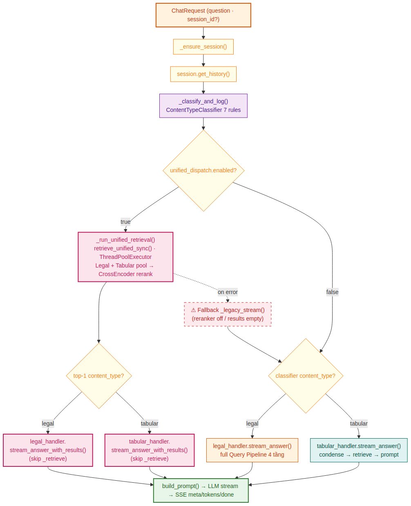

*Hình 4.1 — Flow của GenerationOrchestrator: classify → unified dispatch (mặc định) hoặc legacy single-path → handler → LLM → SSE.*

#### 4.2.1 Khởi tạo (startup)

`GenerationOrchestrator.__init__()` thực hiện 14 bước:

1. Load config từ `generation_config.yaml`.
2. `create_llm(config["llm"])` — factory pattern cho LLM backend.
3. `_init_retrieval_orchestrator()` — load Phase 2 qua `importlib.util` (xem §4.4).
4. `PromptBuilder(prompt_config)` — legal prompt builder.
5. `TabularPromptBuilder(config)` — tabular prompt builder.
6. `SessionManager(config["session"])` — quản lý conversations.db.
7. `ContextualCondenser(llm, config)` — Tầng C (shared giữa hai handler).
8. `FollowupGenerator(llm, config)` — sinh gợi ý câu hỏi (shared).
9. `ContentTypeClassifier()` — từ `shared/classifiers/`.
10. `QueryRewriter`, `HyDERewriter` — legal only, dùng chung LLM instance.
11. `LegalGenerationHandler(...)`.
12. `TabularGenerationHandler(...)`.
13. Read `unified_dispatch` config:
    ```python
    self._ud_enabled       = ud_cfg.get("enabled", True)   # mặc định bật
    self._ud_top_k_legal   = ud_cfg.get("top_k_legal", 20)
    self._ud_top_k_tabular = ud_cfg.get("top_k_tabular", 10)
    self._ud_final_top_k   = ud_cfg.get("final_top_k", 10)
    ```
14. Mở `query_classification_log` table connection cho `_classify_and_log()`.

#### 4.2.2 Dispatch flow

```python
classification = self._classify_and_log(question, session_id)
content_type = classification.content_type   # 'legal' | 'tabular'

if self._ud_enabled:
    # Unified Dispatch path (mặc định)
    async for event in self._stream_answer_unified(question, session_id, classification, ...):
        yield event
    return

# Legacy single-path
if content_type == 'tabular':
    handler = self._tabular_handler
else:
    handler = self._legal_handler              # fallback luôn là legal

async for event in handler.stream_answer(question, session_id, **kwargs):
    yield event
```

#### 4.2.3 Sáu method helper Unified Dispatch

| Method | Mô tả |
|---|---|
| `_get_type_tab_hint()` | Trích `type_tab_hint` từ `ClassificationResult` để filter tabular trước rerank |
| `_run_unified_retrieval()` | Gọi `retrieve_unified_sync()`, trả `(results, retrieval_ms)`. Raises `RuntimeError` nếu reranker off |
| `_answer_unified()` | Non-streaming unified path; fallback `_legacy_answer()` nếu fail |
| `_stream_answer_unified()` | Async streaming unified path; fallback `_legacy_stream()` nếu fail |
| `_legacy_answer()` | Legacy single-path dispatch (tabular / legal) — non-streaming |
| `_legacy_stream()` | Legacy single-path dispatch — async streaming |

**Fallback tự động:** Nếu `retrieve_unified_sync()` raise `RuntimeError` (reranker không tồn tại) hoặc trả về list rỗng → tự động fallback về `_legacy_answer()` / `_legacy_stream()` với `classifier_ct` từ ban đầu. **Không có downtime hay exception visible ra client** — đảm bảo trải nghiệm liền mạch khi config thay đổi.

### 4.3 Legal Generation Handler — Query Pipeline 4 tầng

`LegalGenerationHandler` là phần phức tạp nhất của Phase 3, với **Query Pipeline 4 tầng + 3 giai đoạn tiền xử lý**. Mục tiêu: trước khi retrieval, làm mọi cách để biến câu hỏi thành dạng cụ thể, rõ ràng, có đủ thông tin để tìm đúng văn bản.

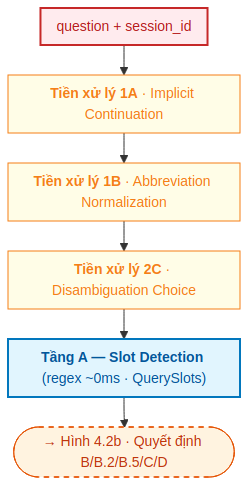

*Hình 4.2a — Trước khi vào Query Pipeline: 3 giai đoạn tiền xử lý (1A implicit continuation, 1B abbreviation normalization, 2C disambiguation choice resolution) chuẩn hoá câu hỏi. Tầng A slot detection bằng regex (~0ms) trích xuất QuerySlots: article_nums, clause_nums, doc_refs, intent...*

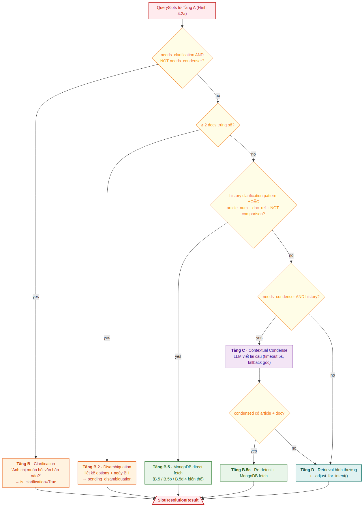

*Hình 4.2b — Decision tree dựa trên QuerySlots từ Tầng A: route câu hỏi qua các tầng tương ứng (B clarification, B.2 disambiguation, B.5 MongoDB direct fetch — 4 biến thể, C contextual condense, B.5c re-detect, D retrieval bình thường). Kết quả thống nhất trong SlotResolutionResult.*

#### 4.3.1 Ba giai đoạn tiền xử lý (chạy trước Tầng A)

**Giai đoạn 1A — Implicit Continuation:**

```python
# slot_detector.py — fill_doc_ref_from_history()
# Nếu query có article_ref/clause_ref nhưng KHÔNG có doc_ref,
# lấy doc_ref từ ≤ 3 turn history gần nhất.
```

Use case: User hỏi `"Khoản 3 Điều 5 Thông tư 39 quy định gì?"`, sau đó tiếp `"Điều 6 thì sao?"`. Câu thứ hai không có `"Thông tư 39"` nhưng người dùng rõ ràng đang hỏi tiếp về cùng văn bản đó. Giai đoạn 1A scan history, tìm doc_ref gần nhất, fill vào câu hỏi mới → tránh clarification không cần thiết.

**Giai đoạn 1B — Abbreviation Normalization:**

```python
# slot_detector.py — _normalize_abbrevs()
# TT39 → Thông tư 39
# NĐ13 → Nghị định 13
# QĐ12 → Quyết định 12
```

User hay viết tắt khi gõ nhanh trên mobile. Chuẩn hoá trước khi regex match doc_ref.

**Giai đoạn 2C — Disambiguation Choice Resolution:**

```python
# slot_detector.py — resolve_disambiguation_choice()
# Khi session có pending_disambiguation, kiểm tra user nhập:
#   - Số thứ tự (1/2/3) → resolve thành option tương ứng
#   - Hoặc tên đầy đủ ("Thông tư 39/2024/TT-NHNN")
#   - Hoặc câu khác hoàn toàn → bỏ pending, tiếp tục bình thường
```

Khi Tầng B.2 (turn trước) đã hỏi user chọn 1 trong nhiều options trùng số văn bản, turn này resolve lựa chọn của user.

#### 4.3.2 Tầng A — Slot Detection

```python
# Trả về QuerySlots dataclass
slots = detect_slots(question)
# slots.article_nums  : List[str]   # ['5', '6']
# slots.clause_nums   : List[str]   # ['3']
# slots.doc_refs      : List[str]   # ['Thông tư 39']
# slots.is_comparison : bool         # 'so sánh Điều 5 TT 39 và Điều 5 TT 40'
# slots.is_definition : bool         # 'là gì?', 'định nghĩa'
# slots.has_pronoun   : bool         # 'cái đó', 'nó'
# slots.is_continuation : bool       # 'thì sao?', 'còn'
# slots.query_intent  : str          # 'comparison'|'exact_lookup'|'definition'|'semantic'|'partial_ref'
```

Toàn bộ regex, ~0ms. Output `QuerySlots` được dùng làm input cho các Tầng B/B.2/B.5/C.

#### 4.3.3 Tầng B — Clarification

Điều kiện: `needs_clarification AND NOT needs_condenser` (turn 1 không có doc_ref).

User hỏi `"Khoản 3 Điều 5 quy định gì?"` mà chưa nêu văn bản nào → hệ thống không thể trả lời chính xác (Điều 5 ở Thông tư nào?). Tầng B trả về `is_clarification=True` với câu hỏi rule-based:

> *"Anh chị muốn hỏi về văn bản nào? Có nhiều thông tư có Điều 5 trong kho — vui lòng nêu rõ tên hoặc số văn bản."*

Return sớm → không retrieval, không tốn LLM call.

#### 4.3.4 Tầng B.2 — Disambiguation

Điều kiện: tìm thấy ≥ 2 documents trùng số văn bản (`"Thông tư 39"` → `39/2016/TT-NHNN` và `39/2024/TT-NHNN`).

Tầng B cũ (legacy) sẽ im lặng chọn document đầu tiên → sai với xác suất cao. Tầng B.2 mới:

1. Liệt kê tất cả options với title + ngày ban hành.
2. Lưu `pending_disambiguation` vào session metadata.
3. Trả về câu hỏi:
   > *"Có 2 văn bản trùng số 39 trong kho. Anh chị chọn:*
   > *1) Thông tư 39/2024/TT-NHNN (ban hành 15/03/2024)*
   > *2) Thông tư 39/2016/TT-NHNN (ban hành 30/12/2016)*
   > *Vui lòng trả lời 1 hoặc 2."*

Turn tiếp theo, Giai đoạn 2C resolve lựa chọn của user.

#### 4.3.5 Tầng B.5 — MongoDB Direct Fetch (4 biến thể)

Khi đã biết chính xác `(article_num, doc_ref)`, **bypass BM25/vector hoàn toàn** — fetch thẳng từ MongoDB.

| Biến thể | Điều kiện |
|---|---|
| **B.5** | History có clarification pattern cuối + slot có article+doc |
| **B.5b** | Direct fetch bất kể history: `article_num AND doc_ref AND NOT is_comparison` |
| **B.5c** | Sau Tầng C: `condensed_slots` có article+doc (ngữ cảnh được condense thành câu cụ thể) |
| **B.5d** | `is_comparison` (≥ 2 distinct doc_refs): zip `article_nums × doc_refs` → fetch mỗi pair → merge |

> **Vì sao bypass retrieval?** Một số Điều có thể không có chunks tốt trong SQLite BM25 (Điều quá ngắn, ít từ khoá phân biệt) nhưng có đầy đủ trong MongoDB. Direct fetch đảm bảo trả lời được mọi câu hỏi có Điều/Khoản cụ thể.

#### 4.3.6 Tầng C — Contextual Condense

Điều kiện: `needs_condenser AND history`.

```python
# contextual_condenser.py
condensed = await condenser.condense_async(
    question="Điều 6 thì sao?",
    history=[
        {"role": "user", "content": "Điều 5 Thông tư 39 quy định gì?"},
        {"role": "assistant", "content": "Điều 5 Thông tư 39 quy định..."}
    ]
)
# → "Điều 6 Thông tư 39 quy định gì?"
```

`llm_timeout_seconds=5` — nếu LLM không trả lời kịp, **fallback dùng câu gốc** thay vì raise. Tránh delay quá lâu cho user khi LLM cloud chậm.

Đây là **tầng duy nhất cần LLM** trong Query Pipeline. Các tầng A/B/B.2/B.5 đều regex hoặc lookup trực tiếp.

#### 4.3.7 Tầng D — Retrieval bình thường + Intent Routing

Nếu không match B/B.2/B.5/C → retrieval bình thường qua Phase 2 `retrieve()`.

`_adjust_for_intent()` (khi `slot_detection.enable_intent_routing: true`):

- `query_intent="semantic"` → `effective_top_k = top_k × 1.5` (cần nhiều context hơn)
- `query_intent="definition"` → force `effective_strategy = "hybrid"` (cần cả exact term và ngữ nghĩa)

#### 4.3.8 SlotResolutionResult — Output thống nhất

```python
@dataclass
class SlotResolutionResult:
    retrieval_query: str                                    # câu cho retrieval
    followup_chunks: Optional[List[RetrievalResult]] = None # None = retrieval bình thường;
                                                             # list = MongoDB direct-fetch
    metadata_filters: Optional[dict] = None
    is_clarification: bool = False
    is_disambiguation: bool = False
    clarification_text: Optional[str] = None                # cho cả clarification & disambiguation
    disambiguation_options: List[dict] = field(default_factory=list)
    effective_top_k: Optional[int] = None
    effective_strategy: Optional[str] = None
```

### 4.4 Tabular Generation Handler — P1 đến P5

`TabularGenerationHandler` đơn giản hơn LegalGenerationHandler — không có slot detection, không MongoDB, nhưng có **5 features chuyên biệt P1–P5** đã được thiết kế cho dữ liệu biểu phí.

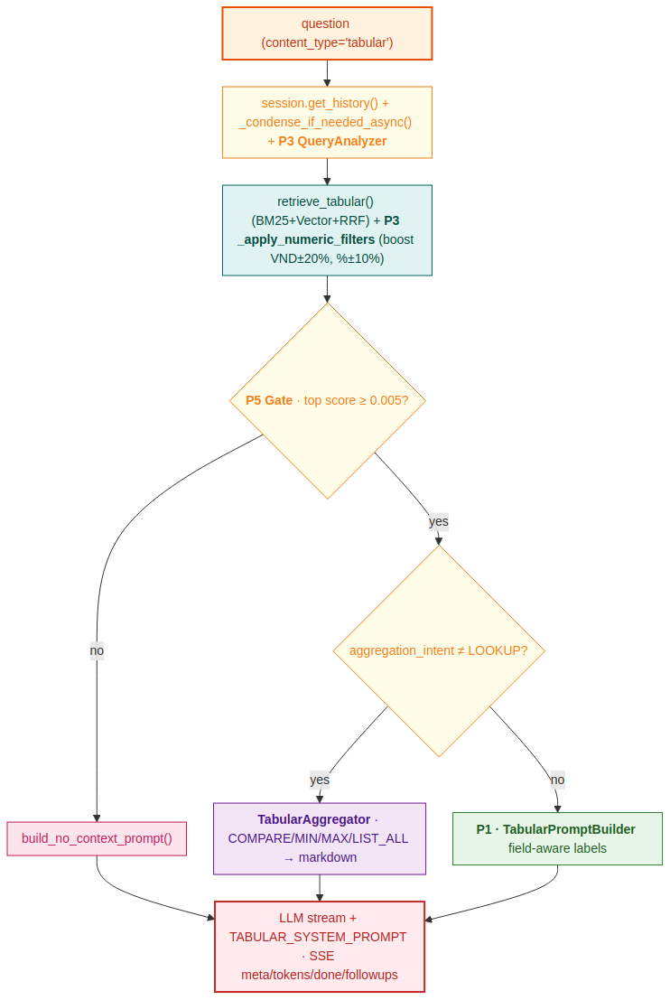

*Hình 4.3 — Pipeline TabularGenerationHandler: condense → P3 query analyzer → retrieve → P3 numeric filter → P5 confidence gate → P5 aggregation hoặc P1 field-aware → LLM stream.*

#### 4.4.1 P1 — Field-Aware Prompt

`TabularPromptBuilder` đọc `TABULAR_FIELD_META` để dịch slot → label nghiệp vụ:

```
[1] PHI_001 — Phí chuyển tiền trong nước
    Mức phí: 0.05% giá trị giao dịch          ← FT1 → MUC_PHI → "Mức phí"
    Số tiền tối thiểu: 10,000 VND              ← FN1 → SOTIEN_MIN → "Số tiền tối thiểu"
    Số tiền tối đa: 500,000 VND                ← FN2 → SOTIEN_MAX → "Số tiền tối đa"
    Nguồn: 2929/QĐ-NHNo-KHCN
```

**Field meta caching** thread-safe: `_field_meta_cache: Dict[str, List[Dict]]` được bảo vệ bằng `threading.Lock`. Lazy fetch từ `sqlite_mgr.get_tabular_field_meta(type_tab)` khi miss cache.

**LOAI_TIEN handling:** Khi `field_name` khớp pattern `LOAI_TIEN_FN1` (currency slot cho FN1), slot đó bị suppress khỏi display riêng lẻ; giá trị currency được ghép inline với FN1 value:

```
"0.05% VND"      (thay vì "0.05% / VND")
"1,000,000 USD"  (thay vì "1,000,000 / USD")
```

#### 4.4.2 P2 — Type-Tab Filter

Khi classifier trả về `type_tab_hint='PHI_CANHAN'` với `confidence ≥ 0.80`, filter được áp dụng tại Phase 2 BM25 + Vector trước khi retrieve:

```sql
SELECT ... FROM TABULAR_DATA
WHERE TYPE_TAB = 'PHI'
  AND FT5 = 'KHCN'              -- example: filter type_tab_hint
  ...
```

→ Search space giảm đáng kể, độ chính xác tăng.

#### 4.4.3 P3 — Query Analyzer

```python
# query_analyzer.py — extract entities + intent
analysis = QueryAnalyzer().analyze("Phí chuyển tiền 5 triệu là bao nhiêu?")
# analysis.numeric_entities  = [{"value": 5000000, "type": "VND"}]
# analysis.temporal_entities = []
# analysis.aggregation_intent = "LOOKUP"   # | COMPARE | MIN | MAX | LIST_ALL
```

Lưu vào `_last_analysis` để dùng ở post-retrieval filter.

#### 4.4.4 P3 — Numeric Filters & Boost

Sau retrieval, `_apply_numeric_filters()` boost score những row có giá trị số phù hợp với entity user yêu cầu:

```python
# Tolerance:
#   numeric_tolerance_vnd: 0.20    # ±20% cho VND
#   numeric_tolerance_pct: 0.10    # ±10% cho %
# numeric_boost: 0.15                # +0.15 vào score nếu match
```

Câu hỏi `"5 triệu chuyển khoản phí bao nhiêu?"` → row có `SOTIEN_MIN ≤ 5,000,000 ≤ SOTIEN_MAX` được boost lên top.

#### 4.4.5 P5 — Confidence Gate + Aggregation

**Confidence Gate:**

```python
if results[0].score < tabular.min_score:        # 0.005
    # No-context prompt: "Hệ thống chưa tìm thấy biểu phí phù hợp..."
    return build_no_context_prompt()
```

`min_score=0.005` đã được điều chỉnh từ `0.30` cũ — sau khi đo phân phối thực tế thấy RRF score tabular max ~0.033 → `0.30` quá khắt khe, gây miss nhiều câu hợp lệ.

**Aggregation:**

Khi `aggregation_intent` không phải `LOOKUP`, builder dùng `TabularAggregator`:

| Intent | Output format |
|---|---|
| `COMPARE` | Markdown table với các row được so sánh side-by-side |
| `MIN` / `MAX` | Highlighted row với note "đây là mức thấp/cao nhất" |
| `LIST_ALL` | Numbered list tất cả options |
| `LOOKUP` | Default — single row hoặc top-3 |

Output được nhúng vào prompt thành markdown — LLM render lại nguyên dạng cho user.

### 4.5 LLM Backends và Streaming

#### 4.5.1 BaseLLM interface

```python
class BaseLLM(ABC):
    @abstractmethod
    def generate(self, prompt: str, system_prompt: Optional[str] = None) -> str: ...

    @abstractmethod
    def stream(self, prompt: str, system_prompt: Optional[str] = None) -> Iterator[str]: ...

    @property
    @abstractmethod
    def provider_name(self) -> str: ...

    def health_check(self) -> dict:
        return {"status": "unknown"}                # optional override
```

Tất cả backends implement interface này → handler không cần biết LLM nào đang dùng.

#### 4.5.2 GeminiLLM (mặc định)

- **SDK:** `google-genai` (NOT `google.generativeai` — đã deprecated, API khác).
- **Client:** `genai.Client(api_key=...)` — stateless per-request.
- **Model:** `gemini-2.5-flash` (mặc định), cấu hình được.
- **Config được tạo qua `_make_config(system_prompt)` mỗi request:**
  - `GenerateContentConfig(temperature, max_output_tokens, top_p, top_k)`
  - `system_instruction=system_prompt` — truyền system prompt **đúng chuẩn Gemini API** thay vì nối thủ công vào contents. Giúp model phân biệt rõ system context vs user message.
  - `thinking_config=ThinkingConfig(thinking_budget=N)` — chỉ đính kèm khi `thinking_budget > 0`.

**Thinking mode** (Gemini 2.5+):
- `0` = tắt
- `1024–8192` = bật với budget tokens tối đa
- Mặc định `1024` (bật) — chain-of-thought nội bộ, cải thiện chất lượng câu trả lời cho câu hỏi phức tạp.

**Fallback model + exponential retry:**

```yaml
gemini:
  model: "gemini-2.5-flash"
  fallback_model: "gemini-2.0-flash"   # khi primary fail (503/429/500)
  retry_max_attempts: 3
  retry_delay_seconds: 1.0
  retry_backoff: 2.0                   # 1s → 2s → 4s
```

Khi primary fail sau 3 retry → switch sang fallback, retry tiếp 3 lần. Đảm bảo BCP khi Gemini có sự cố.

**Streaming:** `client.models.generate_content_stream()` — sync iterator, yield từng `chunk.text`.

#### 4.5.3 LlamaCppBaseLLM (VinaLlama / Llama3)

Base class chia sẻ giữa `VinaLlamaLLM` và `Llama3LLM`. Backend `llama-cpp-python` chạy `.gguf` model trên CPU.

| Provider | Model file | n_ctx | max_context_tokens | Tốc độ |
|---|---|---|---|---|
| `vinallama` | `vinallama-7b-chat_q5_0.gguf` | 4096 | 1800 | 5–12 phút/câu |
| `llama3` | `Llama-3.2-3B-Instruct-Q4_K_M.gguf` | 8192 | 4000 | 2–4 phút/câu |

Streaming là blocking iterator → cần `_stream_in_thread()` wrap.

#### 4.5.4 Streaming SSE — `_stream_in_thread()`

Vấn đề: FastAPI chạy trên asyncio event loop. Gemini và llama-cpp stream đều là **blocking iterators** — không thể `await` trực tiếp. Nếu gọi `for chunk in llm.stream()` trong async handler → block toàn bộ event loop → service đứng.

Giải pháp: thread pool + asyncio queue:

```python
async def _stream_in_thread(self, prompt: str, system_prompt: str):
    loop = asyncio.get_running_loop()
    queue: asyncio.Queue = asyncio.Queue()
    SENTINEL = object()                       # marker kết thúc

    def _worker():
        """Chạy trong thread pool."""
        try:
            for chunk in self.llm.stream(prompt, system_prompt):
                loop.call_soon_threadsafe(queue.put_nowait, chunk)
        except Exception as e:
            loop.call_soon_threadsafe(queue.put_nowait, e)
        finally:
            loop.call_soon_threadsafe(queue.put_nowait, SENTINEL)

    loop.run_in_executor(None, _worker)        # khởi động thread, không await

    while True:
        item = await queue.get()
        if item is SENTINEL:
            break
        if isinstance(item, Exception):
            raise item
        yield item                              # async generator
```

Pattern này được dùng ở **cả hai handler** (`legal_handler.py` và `tabular_handler.py`) qua `BaseGenerationHandler._stream_in_thread()`.

#### 4.5.5 SSE Event Format

Format SSE event mà RAG Core gửi qua BFF về frontend:

| Event type | Khi nào | Fields |
|---|---|---|
| `meta` | Trước token đầu tiên | `session_id`, `sources[]`, `chunks_used`, `content_type` (`'legal'`\|`'tabular'`), `retrieval_query?` |
| `token` | Mỗi chunk LLM | `content` (string) |
| `done` | Khi xong | `retrieval_time_ms`, `generation_time_ms`, `total_time_ms`, `llm_provider`, `is_clarification?` |
| `followups` | Sau `done` (nếu enabled) | `items: string[]` |
| `error` | Khi có lỗi | `detail` |

**`sources[]` shape khác nhau giữa Legal và Tabular:**

```json
// Legal source
{
  "document_id": "...",
  "article_number": "5",
  "clause_number": "3",
  "domain": "TD",
  "title": "Thông tư 39/2016/TT-NHNN",
  "score": 0.91
}

// Tabular source
{
  "content_type": "tabular",
  "type_tab": "PHI",
  "code_tab": "PHI_001",
  "item_name": "Phí chuyển tiền",
  "source_doc": "2929/QĐ-NHNo-KHCN",
  "score": 0.87
}
```

### 4.6 SessionManager — Lịch sử hội thoại 72h

`SessionManager` quản lý lịch sử hội thoại trong `data/conversations.db` — tách biệt hoàn toàn với `metadata.db` của Phase 1/2.

#### 4.6.1 Schema

```sql
CREATE TABLE sessions (
    session_id  TEXT PRIMARY KEY,
    created_at  TIMESTAMP DEFAULT CURRENT_TIMESTAMP,
    updated_at  TIMESTAMP DEFAULT CURRENT_TIMESTAMP,
    metadata    TEXT DEFAULT '{}'    -- JSON: user_id, custom fields
);

CREATE TABLE messages (
    id           INTEGER PRIMARY KEY AUTOINCREMENT,
    session_id   TEXT NOT NULL,
    role         TEXT NOT NULL CHECK(role IN ('user', 'assistant')),
    content      TEXT NOT NULL,
    sources_json TEXT DEFAULT '[]', -- JSON list of SourceInfo
    created_at   TIMESTAMP DEFAULT CURRENT_TIMESTAMP,
    FOREIGN KEY (session_id) REFERENCES sessions(session_id)
);

CREATE INDEX idx_msg_session     ON messages(session_id);
CREATE INDEX idx_session_updated ON sessions(updated_at);
```

#### 4.6.2 Vòng đời session

| Hàm | Hành vi |
|---|---|
| `create_session(user_id?)` | Tạo session UUID v4 mới. Lưu `user_id` vào metadata JSON nếu có. |
| `create_session_with_id(session_id)` | `INSERT OR IGNORE` — giữ nguyên `session_id` gốc khi TTL hết → BFF không nhận UUID lạ gây lỗi 403. |
| `get_session(session_id)` | Kiểm tra `updated_at` — nếu quá `session_ttl_hours` (mặc định 72h) → auto-delete và trả về `None`. |
| `cleanup_expired_sessions()` | Chạy startup nếu `cleanup_on_startup: true`. |

**Bất biến quan trọng — `create_session_with_id`:** Khi TTL hết, BFF vẫn gửi `session_id` cũ (do users.db giữ vĩnh viễn). RAG Core dùng `INSERT OR IGNORE` để tạo lại session với cùng ID → BFF không bị lệch ownership map. Nếu dùng `INSERT` thường, lỗi `UNIQUE` sẽ raise; nếu tạo session mới với ID khác, BFF sẽ trả 403 vì user không sở hữu ID mới.

#### 4.6.3 Hai kiểu `get_history`

- `get_history()` — chỉ trả `role` + `content`, dùng để build prompt (tránh prompt quá dài với sources).
- `get_full_history()` — kèm `sources_json`, dùng cho API response `/sessions/{id}` khi BFF muốn render lại history với SourceCard.

#### 4.6.4 Thread safety

Mỗi operation mở connection riêng (`_connection()` / `_transaction()`) với `check_same_thread=False`. **Không dùng shared connection** — tránh deadlock khi nhiều request đồng thời cùng update một session.

### 4.7 Cấu hình Phase 3 — `generation_config.yaml`

```yaml
# ── LLM ─────────────────────────────────────────────────────────
llm:
  provider: "gemini"               # "gemini" | "vinallama" | "llama3"
  gemini:
    model: "gemini-2.5-flash"
    fallback_model: "gemini-2.0-flash"
    temperature: 0.1
    max_output_tokens: 8192
    top_p: 0.95
    top_k: 40
    thinking_budget: 1024
    max_context_tokens: 8000        # override prompt.max_context_tokens
    retry_max_attempts: 3
    retry_delay_seconds: 1.0
    retry_backoff: 2.0
  vinallama:
    model_path: "models/vinallama-7b-chat_q5_0.gguf"
    n_ctx: 4096
    max_tokens: 1024
    max_context_tokens: 1800
  llama3:
    model_path: "models/Llama-3.2-3B-Instruct-Q4_K_M.gguf"
    n_ctx: 8192
    max_tokens: 2048
    max_context_tokens: 4000

# ── Retrieval (Phase 2 integration) ────────────────────────────
retrieval:
  config_path: "../phase2_retrieval/configs/retrieval_config.yaml"
  top_k: 8
  tabular_top_k: 10
  tabular_source_gap: 0.05         # chỉ hiển thị sources có score ≥ top×(1-gap)
  strategy: "adaptive"
  enable_mmr: true
  enable_rerank: true

# ── Query Rewriting ─────────────────────────────────────────────
query_rewriting:
  enabled: true
  num_variants: 3                  # ngoài câu gốc → tổng 4 queries
  rrf_k: 60
  llm_timeout_seconds: 8
  variant_strategy: hybrid         # KHÔNG dùng adaptive

hyde:
  enabled: false                   # chỉ bật khi strategy="vector"

# ── Slot Detection Pipeline ─────────────────────────────────────
slot_detection:
  enable_abbrev_normalization: true
  enable_implicit_continuation: true
  enable_disambiguation: true
  enable_intent_routing: true

# ── Contextual Condensation (Tầng C) ────────────────────────────
contextual_condensation:
  enabled: true
  llm_timeout_seconds: 5
  max_history_turns_for_condense: 3
  include_source_titles_in_context: true

# ── Follow-up Suggestions ────────────────────────────────────────
followup_suggestions:
  enabled: false                   # mặc định tắt
  num_followups: 3
  llm_timeout_seconds: 6
  max_answer_chars_for_prompt: 800

# ── Unified Dispatch (Phase 2 upgrade) ───────────────────────────
unified_dispatch:
  enabled: true                    # MẶC ĐỊNH BẬT
  top_k_legal: 20
  top_k_tabular: 10
  final_top_k: 10

# ── Tabular Pipeline ─────────────────────────────────────────────
tabular:
  field_aware_prompt: { enabled: true }
  type_tab_filter: { enabled: true, min_confidence: 0.80 }
  query_analyzer:
    enabled: true
    numeric_boost: 0.15
    numeric_tolerance_vnd: 0.20
    numeric_tolerance_pct: 0.10
  aggregation:
    enabled: true
    min_rows_for_table: 2
  min_score: 0.005                 # đã giảm từ 0.30 — RRF max ~0.033

# ── Prompt ────────────────────────────────────────────────────────
prompt:
  max_context_tokens: 2000         # bị override bởi llm.<provider>.max_context_tokens
  max_history_turns: 5
  language: "vi"
  require_citations: true

# ── Session ───────────────────────────────────────────────────────
session:
  db_path: "data/conversations.db"
  session_ttl_hours: 72
  max_sessions: 1000
  cleanup_on_startup: true

api:
  host: "127.0.0.1"                # internal only — CORS/rate limit do BFF
  port: 8001
  reload: false
```

---

## 5. Các quyết định thiết kế quan trọng (ADR)

### 5.1 Tại sao Phase 3 import Phase 2 qua `importlib`?

Cách rõ ràng nhất là `from phase2_retrieval.src.orchestrator import RetrievalOrchestrator`. Tuy nhiên, Phase 2 dùng package name `src` (`from src.retrievers import ...`). Nếu `phase2_retrieval/` không ở đầu `sys.path` khi Phase 2 module được exec, Python sẽ resolve `src` sang nơi khác (ví dụ `phase3_generation/src/` cũ).

Giải pháp:
1. Đổi `phase3_generation/src/` → `phase3_generation/core/` để tránh conflict tên.
2. Dùng `importlib.util.spec_from_file_location` với path tuyệt đối để load Phase 2.
3. Tạm thời `sys.path.insert(0, phase2_retrieval_dir)`, exec module, restore `sys.path` sau khi load xong.

### 5.2 Tại sao `article_text` thay vì chunk text?

Một Khoản (clause) thường chỉ có nghĩa trong ngữ cảnh của toàn bộ Điều (article). Khoản quy định `"Trong trường hợp quy định tại Khoản 1, ngân hàng phải..."` — không có Khoản 1 thì LLM không hiểu "trường hợp" là gì. Article Expansion (Phase 2) fetch toàn bộ Điều từ MongoDB → đưa cả `article_text` vào prompt → LLM trả lời chính xác hơn đáng kể.

### 5.3 Tại sao blocking LLM stream chạy trong thread pool?

FastAPI chạy trên asyncio event loop. VinaLlama (`llama-cpp-python`) và Gemini stream đều là blocking iterators — không thể `await` trực tiếp. Dùng `loop.run_in_executor()` + `asyncio.Queue`:

- Thread pool chạy LLM, push token vào queue không blocking event loop.
- Coroutine chính `await queue.get()` và yield cho SSE → không bị block.

### 5.4 Tại sao tách `conversations.db` riêng khỏi `metadata.db`?

`metadata.db` của Phase 1/2 chứa document metadata + BM25 index — schema cố định, chỉ Phase 1 write. Conversation history có write pattern khác (frequent inserts, TTL deletes). Tách DB:

- Tránh **lock contention** giữa heavy reads của retrieval và frequent writes của history.
- Có thể xoá/reset conversation data mà không ảnh hưởng indexed documents.
- Backup riêng — conversations có thể giữ ngắn hạn (72h TTL), metadata phải giữ lâu dài.

### 5.5 Tại sao `system_instruction` thay vì nối thủ công trong GeminiLLM?

Gemini API hỗ trợ `system_instruction` trong `GenerateContentConfig` — đây là cơ chế chính thức để truyền system prompt, giúp model phân biệt rõ giữa **system context** (vai trò, quy tắc) và **user message** (câu hỏi + context). Nối thủ công `f"{system_prompt}\n\n{prompt}"` hoạt động nhưng kém hiệu quả hơn vì toàn bộ nội dung được xử lý như một user turn.

### 5.6 Tại sao `max_context_tokens` được override per-provider?

Gemini 2.5 Flash có context window 1M token, có thể nhận 8000 tokens context và vẫn sinh câu trả lời chất lượng cao. VinaLlama (local, `n_ctx=4096`) chỉ có 1800 tokens an toàn cho context sau khi trừ output và overhead. Lưu `max_context_tokens` trong `llm.<provider>` block thay vì `prompt` block giúp khi đổi provider, giá trị ngữ cảnh tự động thay đổi theo mà không cần sửa config `prompt`.

### 5.7 Tại sao `enable_rerank: true` mặc định?

Cross-encoder reranking cải thiện đáng kể chất lượng kết quả retrieval cho tiếng Việt với model multilingual `mmarco-mMiniLMv2-L12-H384-v1`. Chi phí latency (~150–300ms) được bù đắp bởi chất lượng câu trả lời tốt hơn — nhân viên tin tưởng kết quả hơn, ít phải tra cứu lại.

### 5.8 Tại sao multi-query variants phải dùng `variant_strategy: hybrid` thay vì `adaptive`?

Adaptive router dùng rule-based matching: nếu query chứa `\d+/\d{4}/[A-Z]` (pattern số văn bản), router chọn `keyword` strategy. Khi LLM sinh biến thể (variant), variant "Dùng thuật ngữ pháp lý chuyên ngành" thường chứa tham chiếu như `"Nghị định 13/2023/NĐ-CP"` → adaptive sai → BM25 nhận câu dài tiếng Việt → tokenizer trả về empty → warning `"Query tokenized to empty"`.

**Fix:** Pin variant strategy = `hybrid` (cho variant index ≥ 1); câu gốc (index 0) giữ nguyên strategy người dùng chọn.

### 5.9 Tại sao Tabular pipeline không có slot detection?

Legal pipeline cần slot detection vì câu hỏi `"Khoản 3 Điều 5 quy định gì?"` phải biết chính xác văn bản nào để fetch từ MongoDB. Tabular data **không có cấu trúc phân cấp** — mỗi row là một hạng mục độc lập (`code_tab`) với giá trị số/text. BM25 + Vector đủ để tìm đúng hạng mục mà không cần slot extract.

Condenser được giữ lại cho Tabular vì user có thể hỏi tiếp nối (`"còn loại VIP thì sao?"`) — heuristic đơn giản (`_has_pronoun_or_continuation`) detect đủ các trường hợp này mà không cần LLM classify.

### 5.10 Tại sao ContentTypeClassifier fallback về `legal`?

Biểu phí/lãi suất là domain rất hẹp — query không rõ ràng không có nguy cơ mất thông tin khi route sang legal (legal RAG trả lời "không tìm thấy"). Ngược lại, nếu legal query bị route nhầm sang tabular, retrieval hoàn toàn không trả kết quả (sai domain). **Rủi ro bất cân xứng** → fallback về legal an toàn hơn.

### 5.11 Tại sao Unified Dispatch dùng CrossEncoderReranker thay vì score thresholds?

Classifier đã có thể đoán loại nội dung đúng ~90% trường hợp. Vấn đề không phải là phân loại sai — mà là **bỏ sót**: query `"Điều 12 quy định phí chuyển khoản bao nhiêu?"` được classifier R1 route sang legal, nhưng câu trả lời thực sự nằm trong `TABULAR_DATA` (con số cụ thể). Single-path dispatch cắt hẳn nhánh tabular trước khi search.

CrossEncoderReranker là lựa chọn hợp lý:

1. **Đã tồn tại và bật trong production** — không thêm dependency mới.
2. **Cross-encoder đánh giá relevance theo ngữ nghĩa** — phân biệt được "quy định về phí" (legal) vs "số tiền phí cụ thể" (tabular) trong cùng merged pool.
3. **Top-1 làm dispatch key** — thay vì chọn handler trước retrieval, chọn sau rerank; nếu top-1 là tabular row, tabular handler nhận kết quả đó.

Score thresholds cứng không khả thi vì legal score (rerank ~0.3–0.9) và tabular score (RRF ~0.01–0.03) có phân phối khác nhau — không có threshold nào đúng với cả hai.

### 5.12 Tại sao Disambiguation (Tầng B.2) thay vì pick văn bản đầu tiên?

Khi user hỏi `"Thông tư 39 quy định gì?"` mà MongoDB trả về nhiều document có số 39 (ví dụ `39/2016/TT-NHNN` và `39/2024/TT-NHNN`), Tầng B cũ sẽ im lặng chọn kết quả đầu tiên — **sai với xác suất cao**, đặc biệt khi user hỏi về văn bản mới (2024) nhưng vector hoặc BM25 ranking văn bản cũ (2016) lên trước.

Tầng B.2 liệt kê tất cả options (title + ngày ban hành) và hỏi user chọn số thứ tự. `pending_disambiguation` được lưu vào session metadata. Giai đoạn 2C `resolve_disambiguation_choice()` trong turn tiếp theo nhận số (1/2/3) và resolve thành `doc_ref` cụ thể trước khi Tầng A chạy.

**Fallback:** Nếu user không chọn số mà hỏi câu khác → Giai đoạn 2C bỏ qua, pipeline tiếp tục bình thường — không bắt buộc user phải trả lời.

---

> **Hết Phần 2 — RAG Core.** Phần 3 sẽ đi sâu vào BFF Service: kiến trúc Mixin của UserDB, JWT + RBAC 4 tầng, Session Ownership, SSE Proxy, và các tầng middleware (rate limit, request logger).
