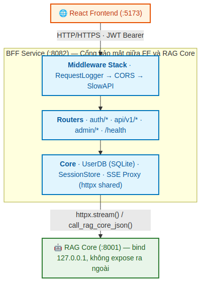
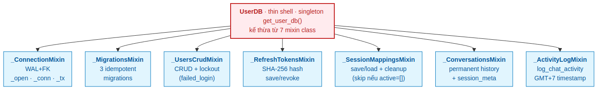
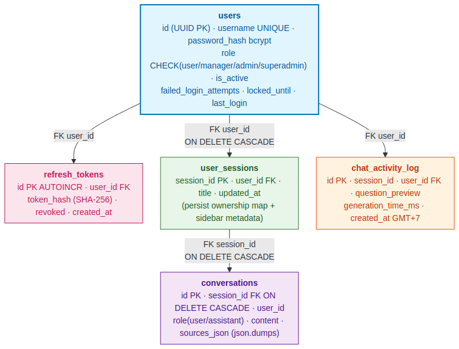
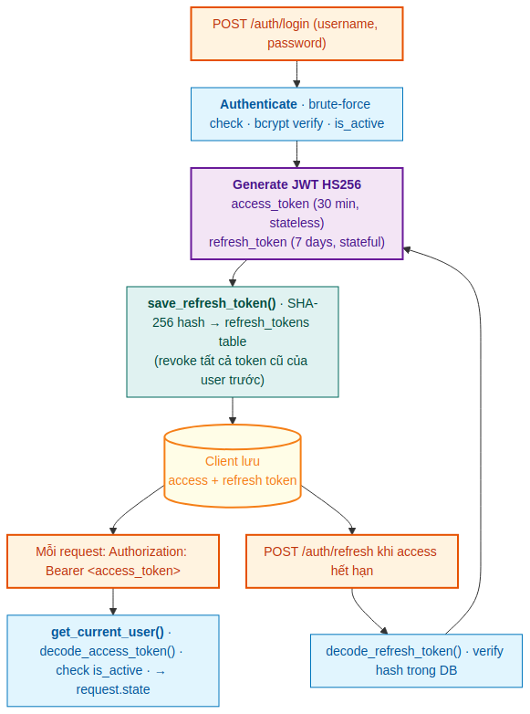
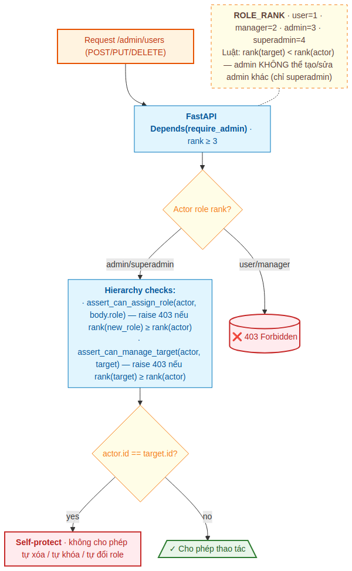
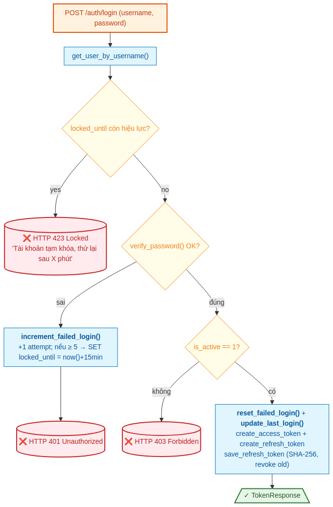
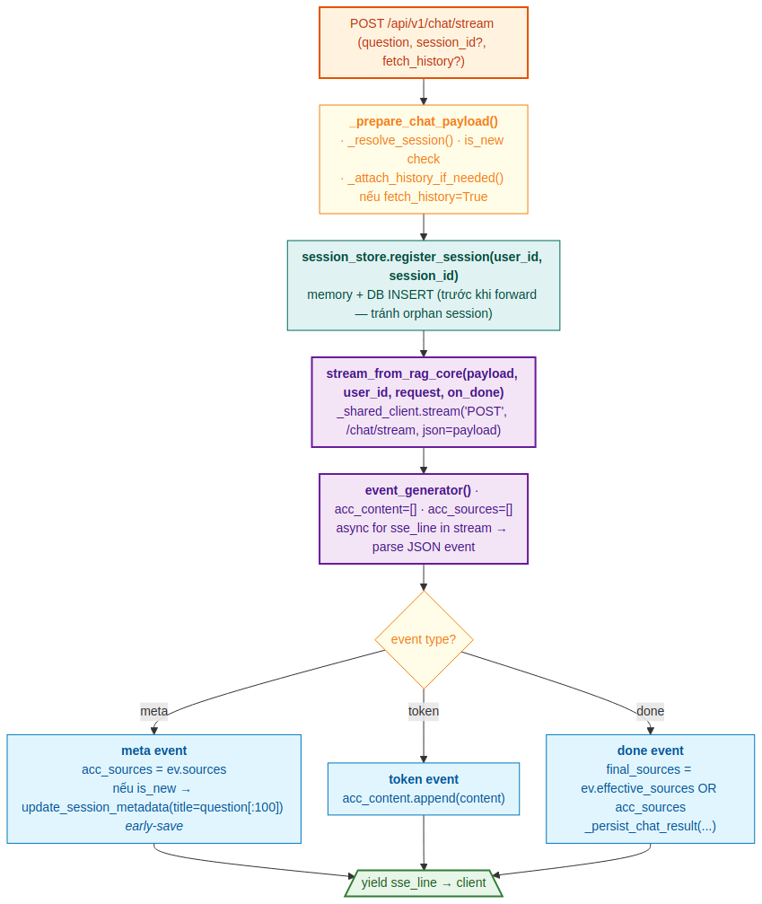
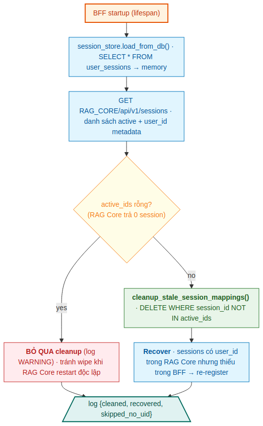

# PHẦN 3 — BFF SERVICE

## 1. Giới thiệu Phần 3

Phần này đi sâu vào phân hệ `bff-service` — **cổng bảo mật** đứng giữa React Frontend và RAG Core trong hệ thống RAG-Chatbot Pháp lý Agribank. BFF (Backend-for-Frontend) bổ sung ba lớp kiểm soát mà **không cần thay đổi RAG Core**:

1. **Xác thực người dùng** (JWT HS256 + bcrypt + brute-force protection)
2. **Phân quyền theo phiên** (Session ownership map giữa user_id và session_id)
3. **Giới hạn tốc độ và audit** (rate limiting per-user + permanent history)

Phần 3 được tổ chức thành **bảy mục chính**:

| § | Tiêu đề | Trọng tâm |
|---|---|---|
| 1 | Giới thiệu Phần 3 | Bối cảnh, nguyên tắc thiết kế |
| 2 | Kiến trúc tổng thể | Sơ đồ 3 lớp, vị trí trong toàn hệ thống |
| 3 | UserDB — Mixin Architecture | 7 mixin class, schema 5 bảng |
| 4 | JWT + RBAC 4 cấp rank-aware | Vòng đời token, hierarchy permissions |
| 5 | SSE Proxy & Session Ownership | Streaming proxy, reconcile, permanent history |
| 6 | Middleware & API design | RequestLogger · CORS · SlowAPI · Endpoints |
| 7 | ADR — Quyết định thiết kế quan trọng | 7 quyết định và đánh đổi |

### Quy ước trong Phần 3

- `:8082` là port mặc định BFF (cũ là `:8080`, đã đổi để tránh xung đột với các tool khác).
- `RC` viết tắt cho **RAG Core** (`:8001`), đã được đặc tả chi tiết ở Phần 2.
- Mọi đường dẫn file tham chiếu tới thư mục `bff-service/` trừ khi nói khác.

### Ba nguyên tắc thiết kế cốt lõi

| Nguyên tắc | Cách thực hiện trong BFF |
|---|---|
| **Tách biệt trách nhiệm** | RAG Core = xử lý AI thuần; BFF = bảo mật và routing. RAG Core không biết user nào đang hỏi, BFF không biết câu trả lời được sinh ra như thế nào. |
| **Defense in depth** | Auth → Ownership → Rate limit. Ba lớp độc lập. Lỗi ở lớp ngoài không cho phép vào lớp trong. |
| **Streaming-first** | SSE được thiết kế ngay từ đầu (không phải afterthought). `httpx.AsyncClient` shared, `client.stream()` thay vì `.post()`, buffer cap 64KB, client disconnect detection. |

---

## 2. Kiến trúc tổng thể

### 2.1 Sơ đồ ba lớp



*Hình 1.1 — BFF đứng giữa Frontend (`:5173`) và RAG Core (`:8001`). RAG Core bind `127.0.0.1` — không thể truy cập từ ngoài. Mọi request từ FE phải đi qua BFF → BFF kiểm soát auth, ownership, rate limit rồi forward.*

### 2.2 Vị trí trong toàn hệ thống

Theo kiến trúc 3-tier đã được mô tả ở Phần 1, BFF là tầng giữa:

| Tầng | Service | Port | Trách nhiệm |
|---|---|:-:|---|
| **Frontend** | agribank-chat (React/Vite) | 5173 | UI, gửi câu hỏi qua HTTP |
| **BFF** | bff-service (FastAPI) | 8082 | Xác thực, phân quyền, rate limit, lưu lịch sử |
| **RAG Core** | rag-core (FastAPI) | 8001 | RAG pipeline (Phase 1/2/3) |

### 2.3 Cấu trúc thư mục

```
bff-service/
├── main.py                 # FastAPI app + lifespan + middleware + routers
├── config.py               # Pydantic Settings (single source of truth)
├── run_bff.py              # Entry point uvicorn
├── requirements.txt
├── .env.example
│
├── auth/                   # Xác thực JWT
│   ├── jwt_handler.py      # python-jose · encode/decode HS256
│   ├── password.py         # bcrypt qua passlib
│   ├── permissions.py      # ROLE_RANK + assert_* helpers
│   ├── dependencies.py     # FastAPI Depends: get_current_user, require_admin...
│   └── router.py           # /auth/login, /refresh, /me, /logout, /change-password
│
├── users/                  # Quản lý user (Mixin Architecture)
│   ├── user_db.py          # UserDB shell kế thừa 7 mixin
│   ├── _connection.py      # _ConnectionMixin (WAL+FK)
│   ├── _migrations.py      # _MigrationsMixin (3 idempotent migrations)
│   ├── _users_crud.py      # _UsersCrudMixin (CRUD + lockout)
│   ├── _refresh_tokens.py  # _RefreshTokensMixin (SHA-256 hash)
│   ├── _session_mappings.py # _SessionMappingsMixin (cleanup_stale guard)
│   ├── _conversations.py   # _ConversationsMixin (permanent history)
│   ├── _activity_log.py    # _ActivityLogMixin (GMT+7 timestamp)
│   ├── schemas.py          # Pydantic models
│   └── router.py           # /admin/users, /admin/stats, /admin/logs
│
├── proxy/                  # Forward sang RAG Core
│   ├── sse_proxy.py        # httpx.stream() + meta event injection
│   ├── session_store.py    # Memory + SQLite ownership map
│   ├── session_authorization.py  # assert_session_access()
│   └── router.py           # /api/v1/chat, /chat/stream, /sessions, /my/sessions
│
├── middleware/
│   ├── logger.py           # RequestLoggerMiddleware (set request.state)
│   └── rate_limiter.py     # slowapi per-user
│
├── utils/
│   └── errors.py           # unauthorized() · forbidden() · not_found_user()
│
├── data/users.db           # SQLite (auto-created khi startup)
└── logs/bff.log            # Log file
```

### 2.4 Thứ tự khởi động (lifespan)

`main.py` lifespan thực hiện theo thứ tự nghiêm ngặt:

```python
async def lifespan(app: FastAPI):
    # === STARTUP ===
    # 1. Log toàn bộ config (host, port, RAG Core URL, CORS, rate limit, DB path)
    log_config_summary()

    # 2. Tạo shared httpx.AsyncClient và inject vào sse_proxy
    proxy.sse_proxy._shared_client = httpx.AsyncClient(timeout=settings.RAG_CORE_TIMEOUT)

    # 3. Khởi tạo UserDB (singleton) → trigger migrations + seed admin
    db = get_user_db()  # __init__ chạy migration chain + _seed_default_admin

    # 4. Dọn refresh tokens hết hạn
    db.cleanup_expired_refresh_tokens()

    # 5. Load session ownership từ DB vào memory
    session_store.load_from_db(db)

    # 6. Reconcile với RAG Core (try/except, non-fatal)
    rag_sessions = await fetch_rag_core_sessions()
    session_store.reconcile_with_rag_core(db, rag_sessions)

    # 7. Log stats cuối startup
    logger.info(f"SessionStore: {session_store.get_stats()}")

    yield

    # === SHUTDOWN ===
    await proxy.sse_proxy._shared_client.aclose()
```

**Bất biến quan trọng:**
- Bước 6 phải dùng `try/except` — RAG Core có thể chưa sẵn sàng khi BFF startup. Reconcile thất bại không được kill BFF.
- Global exception handler **không bao giờ** expose `str(exc)` — chỉ trả `"Lỗi server nội bộ"`. Detail log ở server-side.

---

## 3. UserDB — Mixin Architecture

### 3.1 Tại sao Mixin?

Trước refactoring, `user_db.py` là một file đơn 1200+ dòng, quản lý 5 bảng SQLite, 3 migrations, 7 nhóm chức năng. File quá dài khiến:

- Khó tìm method liên quan đến từng bảng
- Lockout, refresh token, conversation logic lẫn lộn
- Migration code nằm cạnh CRUD code
- Khó test riêng từng nhóm

**Giải pháp:** tách thành **7 mixin class**, mỗi mixin trong file riêng, mỗi mixin quản lý đúng một concern. `UserDB` trở thành **thin shell** gộp tất cả.



*Hình 2.1 — UserDB là thin shell kế thừa từ 7 mixin class. Mỗi mixin trong một file riêng (`_connection.py`, `_migrations.py`...) quản lý đúng một nhóm chức năng — tách biệt rõ ràng giữa concerns.*

### 3.2 Bảy mixin class chi tiết

| Mixin | File | Vai trò chính | Method nổi bật |
|---|---|---|---|
| `_ConnectionMixin` | `_connection.py` | Quản lý SQLite connection | `_open()` · `_conn()` · `_tx()` |
| `_MigrationsMixin` | `_migrations.py` | 3 migrations idempotent | `_migrate_role_constraint()` · `_migrate_fix_broken_fk()` · `_migrate_user_sessions_v2()` |
| `_UsersCrudMixin` | `_users_crud.py` | CRUD users + lockout | `create/update/delete_user()` · `increment_failed_login()` · `reset_failed_login()` |
| `_RefreshTokensMixin` | `_refresh_tokens.py` | Quản lý refresh tokens | `save_refresh_token()` · `is_refresh_token_valid()` · `revoke_all_tokens()` |
| `_SessionMappingsMixin` | `_session_mappings.py` | Persist session ownership | `save_session_mapping()` · `cleanup_stale_session_mappings()` |
| `_ConversationsMixin` | `_conversations.py` | Permanent message history | `save_conversation_message()` · `get_recent_messages()` · `update_session_metadata()` |
| `_ActivityLogMixin` | `_activity_log.py` | Audit log lượt chat | `log_chat_activity()` · `get_recent_activity()` |

### 3.3 Connection layer — `_open()` với WAL + FK

`_ConnectionMixin._open()` là context manager nền tảng:

```python
@contextmanager
def _open(self):
    conn = sqlite3.connect(self._db_path, timeout=10)
    conn.row_factory = sqlite3.Row
    conn.execute("PRAGMA journal_mode=WAL")     # Multiple readers + 1 writer
    conn.execute("PRAGMA foreign_keys=ON")      # Enforce FK constraints
    try:
        yield conn
    finally:
        conn.close()
```

`_conn()` là alias cho read-only context. `_tx()` thêm `commit()` on success / `rollback()` on exception:

```python
@contextmanager
def _tx(self):
    with self._open() as conn:
        try:
            yield conn
            conn.commit()
        except Exception:
            conn.rollback()
            raise
```

**Quan trọng:** Mỗi `_conn()` / `_tx()` tạo connection mới — không chia sẻ giữa thread. SQLite thread-safe khi mỗi thread dùng connection riêng.

> **`PRAGMA foreign_keys=ON` là bắt buộc.** Nếu thiếu, các `ON DELETE CASCADE` (như xóa user → xóa session_mappings → xóa conversations) sẽ **âm thầm không hoạt động**, để lại orphan rows. SQLite mặc định FK off để tương thích lùi với SQLite 2.

### 3.4 Migration chain — 3 idempotent migrations

`UserDB.__init__()` chạy migration chain với **raw connection riêng** (vì `executescript()` tự issue COMMIT, không dùng được `_tx()`):

```python
def __init__(self, db_path):
    self._db_path = db_path
    # Migrations cần raw conn vì executescript() implicit COMMIT
    _raw = sqlite3.connect(self._db_path, timeout=10)
    self._migrate_role_constraint(_raw)        # 1. Rebuild users với role constraint mới
    self._migrate_fix_broken_fk(_raw)           # 2. Phát hiện + sửa dangling FK
    self._migrate_user_sessions_v2(_raw)        # 3. Thêm title, updated_at vào user_sessions
    _raw.commit()
    _raw.close()
    self._init_schema()                         # CREATE TABLE IF NOT EXISTS (idempotent)
    self._seed_default_admin()                  # Tạo superadmin random password nếu DB rỗng
```

**Bất biến của migration:**
1. **Idempotent** — chạy nhiều lần cho cùng một kết quả.
2. **Forward-only** — không có rollback migration.
3. **Dùng `PRAGMA legacy_alter_table=ON`** khi rebuild bảng (tránh SQLite 3.36+ tự động đổi tên FK).

### 3.5 Schema 5 bảng SQLite



*Hình 7.1 — Quan hệ giữa 5 bảng trong `data/users.db`. `users` là root entity. `user_sessions` và `chat_activity_log` đều có FK đến `users` với `ON DELETE CASCADE` để xóa user là dọn sạch dữ liệu liên quan. `conversations` có FK đến `user_sessions` (không phải `users` trực tiếp) cũng với CASCADE — xóa session là dọn messages.*

**Schema chi tiết (DDL):**

```sql
-- Bảng users
CREATE TABLE users (
    id                     TEXT PRIMARY KEY,                    -- UUID v4
    username               TEXT UNIQUE NOT NULL,
    full_name              TEXT NOT NULL,
    email                  TEXT,
    password_hash          TEXT NOT NULL,                       -- bcrypt
    role                   TEXT NOT NULL DEFAULT 'user'
                           CHECK(role IN ('user','manager','admin','superadmin')),
    unit                   TEXT,                                -- Phòng ban
    position               TEXT,                                -- Chức vụ
    is_active              INTEGER DEFAULT 1,                   -- 0 = bị khóa vĩnh viễn
    created_at             TIMESTAMP DEFAULT CURRENT_TIMESTAMP,
    last_login             TIMESTAMP,
    failed_login_attempts  INTEGER NOT NULL DEFAULT 0,
    locked_until           TIMESTAMP                            -- NULL = không bị khóa tạm thời
);

-- Bảng refresh_tokens (SHA-256 hash, không bcrypt)
CREATE TABLE refresh_tokens (
    id          INTEGER PRIMARY KEY AUTOINCREMENT,
    user_id     TEXT NOT NULL,
    token_hash  TEXT NOT NULL,                                  -- SHA-256(raw_token)
    created_at  TIMESTAMP DEFAULT CURRENT_TIMESTAMP,
    revoked     INTEGER NOT NULL DEFAULT 0,
    FOREIGN KEY (user_id) REFERENCES users(id)
);

-- Bảng user_sessions (persist ownership + sidebar metadata)
CREATE TABLE user_sessions (
    session_id  TEXT PRIMARY KEY,
    user_id     TEXT NOT NULL,
    created_at  TIMESTAMP DEFAULT CURRENT_TIMESTAMP,
    title       TEXT NOT NULL DEFAULT '',                       -- 100 ký tự đầu câu hỏi
    updated_at  TIMESTAMP,
    FOREIGN KEY (user_id) REFERENCES users(id) ON DELETE CASCADE
);

-- Bảng conversations (permanent message history — không TTL)
CREATE TABLE conversations (
    id           INTEGER PRIMARY KEY AUTOINCREMENT,
    session_id   TEXT NOT NULL,
    user_id      TEXT NOT NULL,
    role         TEXT NOT NULL CHECK(role IN ('user', 'assistant')),
    content      TEXT NOT NULL,
    sources_json TEXT DEFAULT '[]',                             -- json.dumps(list[dict])
    created_at   TIMESTAMP DEFAULT CURRENT_TIMESTAMP,
    FOREIGN KEY (session_id) REFERENCES user_sessions(session_id) ON DELETE CASCADE
);
CREATE INDEX idx_conv_session ON conversations(session_id);

-- Bảng chat_activity_log (audit lượt chat)
CREATE TABLE chat_activity_log (
    id                 INTEGER PRIMARY KEY AUTOINCREMENT,
    session_id         TEXT NOT NULL,
    user_id            TEXT NOT NULL,
    question_preview   TEXT,
    generation_time_ms REAL,
    created_at         TIMESTAMP DEFAULT CURRENT_TIMESTAMP,
    FOREIGN KEY (user_id) REFERENCES users(id) ON DELETE CASCADE
);
CREATE INDEX idx_cal_created ON chat_activity_log(created_at);
```

**Hai cột quan trọng cần lưu ý:**

| Cột | Ý nghĩa |
|---|---|
| `users.password_hash` | bcrypt hash (qua passlib) — slow hash, phòng brute-force offline |
| `refresh_tokens.token_hash` | SHA-256 hash — fast hash, đủ dùng vì mục đích chỉ là "không lưu raw token" |
| `users.failed_login_attempts` + `locked_until` | Brute-force protection persist qua restart |
| `conversations.sources_json` | Phải `json.dumps()` khi ghi và `json.loads()` khi đọc — nếu quên, FE nhận string `'[]'` thay vì array `[]` → `m.sources.map()` throw TypeError |

### 3.6 Seed default admin — Random password

Khi `users` table rỗng, BFF tạo tài khoản `superadmin` với **mật khẩu ngẫu nhiên 16 ký tự** và **in ra log một lần duy nhất**:

```python
def _seed_default_admin(self):
    if self.user_count() > 0:
        return  # DB không trống → skip

    random_password = secrets.token_urlsafe(12)  # ~16 chars khi base64
    self.create_user(
        username="superadmin",
        full_name="Super Administrator",
        password=random_password,
        role="superadmin",
        is_active=True,
    )
    logger.warning(f"=== SUPERADMIN PASSWORD: {random_password} ===")
    logger.warning("=== ĐỔI MẬT KHẨU NGAY SAU KHI ĐĂNG NHẬP LẦN ĐẦU ===")
```

**Không có mật khẩu mặc định cố định** (như `admin123`) — buộc người vận hành phải đọc log để lấy mật khẩu.

---

## 4. JWT + RBAC 4 cấp rank-aware

### 4.1 Vòng đời JWT token



*Hình 3.1 — Vòng đời token: login tạo cặp (access, refresh), client gắn access vào header mỗi request, refresh đổi access mới khi hết hạn. Refresh token lưu SHA-256 hash trong DB; tạo mới sẽ revoke tất cả token cũ của user (one active token tại một thời điểm).*

### 4.2 Hai loại token

| | Access Token | Refresh Token |
|---|---|---|
| **Thuật toán** | JWT HS256 (symmetric) | JWT HS256 (symmetric) |
| **TTL** | 30 phút | 7 ngày |
| **Stateless?** | ✓ — không cần tra DB khi verify | ✗ — phải tra `refresh_tokens` table |
| **Lưu ở client** | Authorization header mỗi request | localStorage / secure storage |
| **Lưu ở server** | Không lưu (stateless) | SHA-256 hash trong `refresh_tokens` |
| **Payload** | `{sub, username, role, type="access", iat, exp}` | `{sub, username, role, type="refresh", iat, exp}` |
| **Khi nào revoke** | Tự hết hạn (TTL) | logout · reset password · lock account · đổi password |

**Tại sao access stateless còn refresh stateful?** Access token verify ở mọi endpoint — nếu phải tra DB mỗi lần thì tốn IO. Stateless đủ an toàn vì TTL ngắn. Refresh token chỉ verify khi đổi access (hiếm) → có thể tra DB; lưu hash vì lý do bảo mật (DB leak không lộ raw token).

### 4.3 RBAC 4 cấp với rank-aware permissions

`auth/permissions.py` định nghĩa hệ thống rank:

```python
ROLE_RANK = {"user": 1, "manager": 2, "admin": 3, "superadmin": 4}

def get_role_rank(role: str) -> int:
    return ROLE_RANK.get(role, 0)
```

Ba helper assert:

```python
def assert_role_at_least(user, min_role, detail=None):
    """Raise 403 nếu rank(user.role) < rank(min_role)."""
    if get_role_rank(user["role"]) < get_role_rank(min_role):
        raise forbidden(detail or f"Yêu cầu role >= {min_role}")

def assert_can_manage_target(actor, target):
    """Raise 403 nếu actor rank ≤ target rank.
    Ý nghĩa: chỉ được quản lý target có rank STRICTLY THẤP HƠN mình.
    """
    if get_role_rank(actor["role"]) <= get_role_rank(target["role"]):
        raise forbidden("Không thể thao tác trên user có rank ≥ rank của bạn")

def assert_can_assign_role(actor, new_role):
    """Raise 403 nếu rank(new_role) >= rank(actor).
    Quan trọng: dùng >= chứ không phải >.
    Ý nghĩa: admin (rank 3) KHÔNG được gán role admin (rank 3) cho người khác.
    Chỉ superadmin (rank 4) mới có thể gán role admin.
    """
    if get_role_rank(new_role) >= get_role_rank(actor["role"]):
        raise forbidden(f"Không thể gán role {new_role}")
```

**Sự tinh tế của `assert_can_assign_role`:** dùng `>=` (lớn hơn hoặc bằng) chứ không phải `>`. Lý do: nếu admin gán được role admin cho người khác, hệ thống mất tính phân tầng — bất kỳ admin nào cũng có thể nhân bản quyền admin vô tận. Buộc `superadmin` mới gán được `admin` đảm bảo có cấp kiểm soát cuối.

### 4.4 Decision tree khi admin thao tác user khác



*Hình 3.2 — Quy trình kiểm tra quyền cho POST/PUT/DELETE `/admin/users`. Đầu tiên `require_admin` lọc theo rank, sau đó hai assert kiểm tra hierarchy (target rank và new_role rank), cuối cùng self-protect chặn các hành động tự tử (xóa/khóa/đổi role chính mình).*

### 4.5 Login với brute-force protection



*Hình 4.1 — Login đi qua 3 lớp kiểm tra: locked_until (HTTP 423) → password (401, increment fail count) → is_active (403). Sau 5 fail liên tiếp, locked_until được set thành `now()+15min` — tồn tại qua restart vì lưu trong DB.*

**Code thực tế trong `auth/router.py`:**

```python
@router.post("/login", response_model=TokenResponse)
@limiter.limit("10/minute")
async def login(request: Request, body: LoginRequest, db: UserDB = Depends(get_user_db)):
    # 1. Tìm user
    user = db.get_user_by_username(body.username)
    if not user:
        raise unauthorized("Tên đăng nhập hoặc mật khẩu sai")

    # 2. Kiểm tra locked
    if user["locked_until"]:
        locked_dt = datetime.fromisoformat(user["locked_until"])
        if locked_dt > datetime.now(timezone.utc):
            remaining = (locked_dt - datetime.now(timezone.utc)).seconds // 60
            raise HTTPException(423, f"Tài khoản tạm khóa, thử lại sau {remaining} phút")

    # 3. Verify password
    if not verify_password(body.password, user["password_hash"]):
        db.increment_failed_login(body.username)
        raise unauthorized("Tên đăng nhập hoặc mật khẩu sai")

    # 4. Kiểm tra active
    if not user["is_active"]:
        raise forbidden("Tài khoản đã bị vô hiệu hóa")

    # 5. Reset fail count + tạo tokens
    db.reset_failed_login(user["id"])
    db.update_last_login(user["id"])
    access_token = create_access_token(user["id"], user["username"], user["role"])
    refresh_token = create_refresh_token(user["id"], user["username"], user["role"])
    db.save_refresh_token(user["id"], refresh_token)  # SHA-256, revoke cũ
    return TokenResponse(...)
```

**Ba self-protect rules cho admin:**

```python
# users/router.py — DELETE /admin/users/{id}
if target["id"] == current_user["id"]:
    raise forbidden("Không thể tự xóa tài khoản chính mình")

# POST /admin/users/{id}/toggle-active
if target["id"] == current_user["id"]:
    raise forbidden("Không thể tự khóa tài khoản chính mình")

# PUT /admin/users/{id} — khi body có 'role' và target == self
if body.role and target["id"] == current_user["id"]:
    raise forbidden("Không thể tự đổi role của chính mình")
```

Lý do: tránh trường hợp admin tự đặt mình vào trạng thái không khôi phục được (xóa nhầm tài khoản admin duy nhất, tự khóa khi đang đăng nhập, hạ role mình thành user).

### 4.6 Đổi mật khẩu — Force re-login mọi thiết bị

```python
@router.post("/me/change-password")
async def change_password(body: SelfChangePasswordRequest,
                          current_user: dict = Depends(get_current_user),
                          db: UserDB = Depends(get_user_db)):
    user_row = db.get_user(current_user["id"])
    if not verify_password(body.old_password, user_row["password_hash"]):
        raise HTTPException(400, "Mật khẩu cũ không đúng")
    if body.old_password == body.new_password:
        raise HTTPException(400, "Mật khẩu mới phải khác mật khẩu cũ")
    db.change_password(current_user["id"], body.new_password)
    db.revoke_all_tokens(current_user["id"])  # Force re-login khắp nơi
    return {"message": "Đổi mật khẩu thành công, vui lòng đăng nhập lại"}
```

**Tại sao revoke all tokens?** Nếu attacker đã copy refresh token từ thiết bị khác, chỉ revoke active session hiện tại thì attacker vẫn dùng được. Revoke all đảm bảo *mọi nơi* phải đăng nhập lại với mật khẩu mới.

---

## 5. SSE Proxy & Session Ownership

### 5.1 Sơ đồ luồng SSE streaming



*Hình 5.1 — Khi nhận POST /api/v1/chat/stream: BFF chuẩn bị payload (resolve session, fetch history nếu cần), đăng ký session ownership trước khi forward (tránh orphan), mở stream qua httpx, parse từng SSE event và xử lý theo type. Title session được lưu sớm khi nhận `meta` event (early-save), nội dung được lưu permanent khi nhận `done`.*

### 5.2 Shared `httpx.AsyncClient`

```python
# proxy/sse_proxy.py
_shared_client: Optional[httpx.AsyncClient] = None

@asynccontextmanager
async def _get_client(timeout: float):
    if _shared_client is not None:
        yield _shared_client
    else:
        # Fallback cho test/dev (tạo mới)
        async with httpx.AsyncClient(timeout=timeout) as client:
            yield client
```

`main.py` startup inject shared client:
```python
proxy.sse_proxy._shared_client = httpx.AsyncClient(timeout=settings.RAG_CORE_TIMEOUT)
```

Tại sao? Mỗi `httpx.AsyncClient()` mới mở connection pool riêng → tốn TCP handshake (3 round-trip) + TLS handshake (~2 round-trip) cho mỗi request. Shared client tận dụng keep-alive → chỉ cần handshake 1 lần khi BFF startup.

### 5.3 `client.stream()` thay vì `.post()`

**Sai:** Dùng `.post()` cho SSE
```python
# ❌ Đợi toàn bộ response body trước khi return
response = await client.post("/chat/stream", json=payload)
return response.text  # SSE đã được consume xong, không stream được!
```

**Đúng:** Dùng `.stream()` để forward từng chunk
```python
# ✓ Forward chunk ngay khi RAG Core yield
async with client.stream("POST", url, json=payload) as response:
    async for chunk in response.aiter_text():
        yield chunk
```

Khi user hỏi câu khó, RAG Core có thể mất 5-10s để LLM sinh xong câu trả lời. Dùng `.post()` → user phải đợi 5-10s trắng màn hình. Dùng `.stream()` → user thấy text bắt đầu xuất hiện sau ~1s (khi token đầu được sinh).

### 5.4 Buffer cap 64KB và client disconnect

```python
async def stream_from_rag_core(payload, user_id, request=None, on_done=None):
    buffer = ""
    BUFFER_CAP = 64 * 1024  # 64KB

    async with _get_client(120.0) as client:
        async with client.stream("POST", url, json=payload) as response:
            async for chunk in response.aiter_text():
                # Detect client disconnect
                if request and await request.is_disconnected():
                    logger.info(f"Client disconnected, user={user_id}")
                    return

                buffer += chunk
                if len(buffer) > BUFFER_CAP:
                    yield _sse_event({"type": "error", "detail": "Buffer overflow"})
                    return

                # Split buffer theo "\n\n" (SSE message boundary)
                while "\n\n" in buffer:
                    line, buffer = buffer.split("\n\n", 1)
                    if not line.startswith("data: "):
                        continue
                    try:
                        ev = json.loads(line[6:])
                    except json.JSONDecodeError:
                        logger.warning("Skip invalid SSE line")
                        continue

                    # Inject user_id vào meta (audit)
                    if ev.get("type") == "meta":
                        ev["user_id"] = user_id

                    # Callback on done
                    if ev.get("type") == "done" and on_done:
                        on_done(ev.get("generation_time_ms"))

                    yield _sse_event(ev)
```

**Buffer cap 64KB** ngăn OOM nếu RAG Core trả response bất thường (ví dụ một line `data:` cực dài không có `\n\n`). 64KB đủ cho một event SSE bình thường (~vài KB).

**Client disconnect detection** qua `request.is_disconnected()` — nếu user đóng tab, BFF dừng đọc từ RAG Core ngay (không lãng phí resource server).

### 5.5 Error handling matrix

| Lỗi | Hành vi |
|---|---|
| Client disconnect | Stop reading, log INFO, return (không yield error) |
| Buffer > 64KB | Yield error event "Buffer overflow", return |
| RAG Core timeout (`httpx.ReadTimeout`) | Yield error event "Quá thời gian chờ" |
| Connection refused | Yield error event "Không thể kết nối tới RAG Core" |
| HTTP non-200 | Yield error event với status code thực |
| JSON parse error | Log WARNING, continue (skip dòng lỗi) |

### 5.6 Permanent History — Early-save title

Trước fix (bug cũ): title session chỉ được lưu khi nhận `done` event. Nếu stream bị gián đoạn giữa chừng (timeout, network error), title không bao giờ ghi → khi reload trang, sidebar hiển thị "Hội thoại mới" thay vì câu hỏi đầu.

**Fix:** lưu title ngay khi nhận `meta` event (trước khi LLM sinh xong):

```python
async def event_generator():
    acc_content, acc_sources = [], []

    async for sse_line in stream_from_rag_core(payload, user_id, request):
        ev = json.loads(sse_line[6:].strip())

        if ev["type"] == "meta":
            acc_sources = ev.get("sources", [])
            if is_new_session:
                # ★ Early-save title — không đợi 'done'
                db.update_session_metadata(session_id, title=body.question[:100])

        elif ev["type"] == "token":
            acc_content.append(ev["content"])

        elif ev["type"] == "done" and acc_content:
            # Prefer effective_sources (sources thực sự được citation)
            final_sources = ev.get("effective_sources", acc_sources)
            _persist_chat_result(
                db, session_id, user_id, body.question,
                "".join(acc_content), final_sources,
                is_new_session=False,  # Title đã được save sớm
                gen_time_ms=ev.get("generation_time_ms"),
            )

        yield sse_line  # Forward về client
```

**`effective_sources` vs `acc_sources`:** RAG Core có thể tính `effective_sources` (chỉ những sources thực sự được citation trong câu trả lời) ở `done` event. Nếu có, ưu tiên dùng — sources hiển thị cho user đúng với những gì LLM trích dẫn. Fallback `acc_sources` (toàn bộ retrieval pool) nếu RAG Core không trả `effective_sources`.

### 5.7 Session Ownership — Vấn đề và giải pháp

**Vấn đề cốt lõi:** RAG Core chỉ biết `session_id`, không biết user nào sở hữu. Nếu user A truy cập `/api/v1/sessions/{id}` của user B, RAG Core sẽ trả về dữ liệu (vì RAG Core không có khái niệm user). BFF phải làm cổng kiểm soát.

**Giải pháp:** SessionStore với 2 map:

```python
class SessionStore:
    _store:   dict[str, set[str]]    # user_id → {session_id, ...}    in-memory
    _reverse: dict[str, str]         # session_id → user_id           reverse map
    _db:      Optional[UserDB]       # set qua load_from_db()

    def register_session(self, user_id, session_id):
        # Memory + DB (atomic về mặt logic)
        self._store.setdefault(user_id, set()).add(session_id)
        self._reverse[session_id] = user_id
        if self._db:
            self._db.save_session_mapping(user_id, session_id)

    def is_owner(self, user_id, session_id) -> bool:
        return self._reverse.get(session_id) == user_id

    def get_session_owner(self, session_id) -> Optional[str]:
        return self._reverse.get(session_id)  # Cho audit log admin access
```

`assert_session_access()` trong `proxy/session_authorization.py`:

```python
def assert_session_access(user, session_id, session_store, admin_bypass_role="admin"):
    """Admin+ bypass; user/manager phải là owner."""
    if get_role_rank(user["role"]) >= get_role_rank(admin_bypass_role):
        return  # Admin bypass — sẽ được audit log riêng

    if not session_store.is_owner(user["id"], session_id):
        raise forbidden("Bạn không có quyền truy cập session này")
```

**Admin audit log** khi admin truy cập session của user khác:

```python
owner_id = session_store.get_session_owner(session_id)
if owner_id and owner_id != current_user["id"]:
    logger.warning(
        f"ADMIN_ACCESS: admin={current_user['username']} "
        f"accessed session={session_id} owner_id={owner_id}"
    )
```

### 5.8 Reconcile với RAG Core khi startup



*Hình 6.1 — Khi BFF startup: load `user_sessions` từ DB vào memory, query RAG Core lấy active sessions, sau đó cleanup stale **CHỈ KHI** active_ids không rỗng. Bug gốc trước fix: khi RAG Core restart độc lập (active_ids=[]), BFF wipe toàn bộ user_sessions → mất ownership map.*

**Code `cleanup_stale_session_mappings`:**

```python
def cleanup_stale_session_mappings(self, active_ids: list[str]) -> int:
    """Xóa user_sessions không còn active trong RAG Core.
    Quan trọng: nếu active_ids rỗng → BỎ QUA (không phải xóa hết).
    """
    if not active_ids:
        logger.warning(
            "cleanup_stale_session_mappings: active_ids rỗng — "
            "bỏ qua để tránh wipe (RAG Core có thể vừa restart)"
        )
        return 0

    placeholders = ",".join("?" for _ in active_ids)
    with self._tx() as conn:
        cursor = conn.execute(
            f"DELETE FROM user_sessions WHERE session_id NOT IN ({placeholders})",
            active_ids,
        )
        return cursor.rowcount
```

**Lý do bỏ qua khi rỗng:** RAG Core có thể restart vì nhiều lý do (deploy, crash, TTL cleanup). Lúc đó `GET /api/v1/sessions` trả `[]`. Nếu BFF coi đây là "tất cả sessions đã chết" và xóa hết, BFF mất hoàn toàn ownership map → user reload trang không thấy lịch sử chat. Conservative cleanup: chỉ xóa khi **biết chắc** danh sách active.

---

## 6. Middleware & API Design

### 6.1 Middleware stack (LIFO order)

Starlette áp dụng middleware theo thứ tự **LIFO** — middleware được `add_middleware` *cuối cùng* sẽ nằm *ngoài cùng*. Code đăng ký:

```python
# main.py — thứ tự đăng ký
app.add_middleware(SlowAPIMiddleware)            # 1st added — innermost
app.add_middleware(CORSMiddleware, ...)          # 2nd added
app.add_middleware(RequestLoggerMiddleware)      # 3rd added — outermost
```

Thứ tự xử lý request:
```
Request → [RequestLogger] → [CORS] → [SlowAPI] → Router handler
              ↓                ↓          ↓
         set request.state  CORS check  rate limit check
```

### 6.2 RequestLoggerMiddleware

Chạy **đầu tiên** trong request processing. Set `request.state` cho các middleware sau dùng:

```python
class RequestLoggerMiddleware(BaseHTTPMiddleware):
    SKIP_PATHS = {"/health", "/docs", "/redoc", "/openapi.json", "/favicon.ico"}

    async def dispatch(self, request: Request, call_next):
        # Skip log một số paths
        if request.url.path in self.SKIP_PATHS:
            return await call_next(request)

        # Validate IP qua trusted proxies
        client_ip = get_trusted_client_ip(request)
        request.state.client_ip = client_ip
        request.state.user_id = None
        request.state.actor_id = f"ip:{client_ip}"

        # Decode JWT nếu có (best-effort, không raise)
        auth_header = request.headers.get("Authorization", "")
        if auth_header.startswith("Bearer "):
            payload = decode_access_token(auth_header[7:])
            if payload:
                request.state.user_id = payload["sub"]
                request.state.actor_id = f"user:{payload['username']}"

        start = time.time()
        response = await call_next(request)
        elapsed_ms = (time.time() - start) * 1000

        logger.info(
            f"{request.method} {request.url.path} "
            f"actor={request.state.actor_id} "
            f"status={response.status_code} {elapsed_ms:.0f}ms"
        )
        return response
```

**Tại sao decode JWT ở middleware?** Để rate limiter (chạy sau) có thể đọc `request.state.user_id` và rate limit per-user thay vì per-IP — nhiều người cùng IP (NAT) không bị share rate limit.

### 6.3 IP validation qua TRUSTED_PROXIES

```python
def get_trusted_client_ip(request: Request) -> str:
    direct_ip = request.client.host if request.client else "unknown"
    trusted = settings.TRUSTED_PROXIES.split(",") if settings.TRUSTED_PROXIES else []

    if direct_ip in trusted:
        # Request đến từ trusted proxy → trust X-Forwarded-For
        xff = request.headers.get("X-Forwarded-For", "")
        if xff:
            return xff.split(",")[0].strip()  # Client IP gốc

    # Không trust XFF → dùng IP trực tiếp (tránh IP spoofing)
    return direct_ip
```

**Threat:** Nếu BFF luôn trust `X-Forwarded-For`, attacker có thể gửi `X-Forwarded-For: 1.2.3.4` để fake IP và bypass rate limit per-IP. Chỉ trust XFF khi request đến từ IP của reverse proxy (nginx, load balancer) đã được khai báo trong `TRUSTED_PROXIES`.

### 6.4 SlowAPI rate limiter

Dùng **slowapi** (leaky bucket algorithm) với key per-user:

```python
def _get_user_or_ip(request: Request) -> str:
    """Key cho rate limiter: ưu tiên user_id, fallback IP."""
    user_id = getattr(request.state, "user_id", None)
    if user_id:
        return f"user:{user_id}"
    client_ip = getattr(request.state, "client_ip", None)
    if client_ip:
        return f"ip:{client_ip}"
    return f"ip:{request.client.host if request.client else 'unknown'}"

limiter = Limiter(key_func=_get_user_or_ip)

# Áp dụng ở router
@router.post("/api/v1/chat/stream")
@limiter.limit(settings.RATE_LIMIT_CHAT)  # 20/minute
async def chat_stream(...):
    ...
```

**Custom error response** (thay vì default `429 Too Many Requests`):

```json
{
  "error": "Quá nhiều yêu cầu",
  "detail": "Vượt giới hạn: 20 per 1 minute. Vui lòng thử lại sau.",
  "retry_after": "60 giây"
}
```
Headers: `Retry-After: 60`

### 6.5 API Endpoints — Tổng hợp

#### Auth & Self-service

| Method | Path | Auth | Rate Limit | Mô tả |
|---|---|---|---|---|
| POST | `/auth/login` | — | 10/min | Đăng nhập; lockout 423 nếu sai 5 lần |
| POST | `/auth/refresh` | — | 60/min | Đổi access token mới |
| GET | `/auth/me` | JWT | 60/min | Thông tin user hiện tại |
| POST | `/auth/logout` | JWT | 60/min | Revoke refresh token |
| POST | `/auth/me/change-password` | JWT | 60/min | Đổi mật khẩu (verify old) → revoke all |

#### Chat & Session

| Method | Path | Auth | Rate Limit | Body |
|---|---|---|---|---|
| POST | `/api/v1/chat` | JWT | 20/min | `{question, session_id?, content_type?, fetch_history?}` |
| POST | `/api/v1/chat/stream` | JWT | 20/min | (cùng schema) — SSE response |
| POST | `/api/v1/sessions/new` | JWT | 60/min | `{}` — tạo session mới trên RAG Core |
| GET | `/api/v1/sessions/{id}` | JWT + Owner | 60/min | — |
| DELETE | `/api/v1/sessions/{id}` | JWT + Owner | 60/min | — |
| GET | `/api/v1/my/sessions` | JWT | 60/min | List sessions với title + updated_at |
| GET | `/api/v1/health` | Public | — | Proxy health check |

#### Admin (RBAC)

| Method | Path | Min Role | Mô tả |
|---|---|---|---|
| GET | `/admin/stats` | manager | Thống kê BFF + RAG Core |
| GET | `/admin/documents` | manager | Danh sách văn bản đã index (proxy RAG Core) |
| GET | `/admin/logs?page&page_size` | manager | Nhật ký chat (phân trang) |
| GET | `/admin/users?page&page_size` | manager | Danh sách users |
| GET | `/admin/users/{id}` | manager | Chi tiết user |
| POST | `/admin/users` | admin + rank check | Tạo user (HTTP 201) |
| PUT | `/admin/users/{id}` | admin + rank + self check | Cập nhật user |
| DELETE | `/admin/users/{id}` | admin + rank + self check | Xóa user (HTTP 204) |
| POST | `/admin/users/{id}/reset-password` | admin + rank check | Reset password → revoke tokens |
| POST | `/admin/users/{id}/toggle-active` | admin + rank + self check | Khóa/mở khóa |

#### System

| Method | Path | Mô tả |
|---|---|---|
| GET | `/health` | BFF health check (probe RAG Core) |
| GET | `/` | Service info |
| GET | `/docs` | Swagger UI |

### 6.6 Cấu hình môi trường (`.env`)

```env
# === Bắt buộc thay đổi ===
JWT_SECRET_KEY=your-strong-secret-key-at-least-32-characters-long

# === JWT ===
JWT_ALGORITHM=HS256
JWT_ACCESS_TOKEN_EXPIRE_MINUTES=30
JWT_REFRESH_TOKEN_EXPIRE_DAYS=7

# === BFF Server ===
BFF_HOST=0.0.0.0
BFF_PORT=8082
BFF_RELOAD=false                    # false trong production
BFF_LOG_LEVEL=info

# === RAG Core (nội bộ) ===
RAG_CORE_BASE_URL=http://127.0.0.1:8001
RAG_CORE_TIMEOUT=120.0

# === CORS ===
CORS_ORIGINS=http://localhost:5173,https://your-domain.com

# === Rate Limiting ===
RATE_LIMIT_CHAT=20/minute
RATE_LIMIT_DEFAULT=60/minute

# === Trusted Proxies (trust X-Forwarded-For) ===
TRUSTED_PROXIES=127.0.0.1            # Để trống nếu không qua proxy

# === Storage ===
USERS_DB_PATH=data/users.db
LOG_FILE=logs/bff.log
LOG_LEVEL=INFO
```

**Validator quan trọng** trong `config.py`:

```python
@field_validator("JWT_SECRET_KEY")
def check_secret_strength(cls, v):
    if len(v) < 32:
        raise ValueError("JWT_SECRET_KEY phải >= 32 ký tự")
    if v == "your-strong-secret-key-at-least-32-characters-long":
        logger.warning("⚠️ Đang dùng JWT_SECRET_KEY mặc định!")
    return v
```

`get_settings()` dùng `lru_cache` → file `.env` chỉ đọc 1 lần khi app startup, sau đó dùng cached value.

---

## 7. ADR — Quyết định thiết kế quan trọng

### 7.1 SessionStore — Memory + SQLite (không dùng Redis)

**Quyết định:** Lưu `user_id → session_ids` trong RAM (in-memory map), backed bởi bảng `user_sessions` trong SQLite.

**Lý do:**
- In-memory lookup O(1) cho hot path (ownership check mỗi request)
- SQLite đảm bảo tồn tại qua restart — không mất ownership khi BFF deploy lại

**Đánh đổi:** Với nhiều worker process, mỗi process có memory store riêng nhưng cùng SQLite. Khi register session, ghi vào DB ngay → các worker khác sẽ load lúc startup. Hệ thống nội bộ ~100 user, 1 worker đủ.

**Upgrade path:** Khi cần multi-worker scale-out → thay `session_store.py` bằng Redis (interface `register/is_owner/unregister` không đổi).

### 7.2 Shared `httpx.AsyncClient` (không tạo mỗi request)

**Quyết định:** Một `httpx.AsyncClient` duy nhất cho toàn BFF, tạo lúc startup.

**Lý do:** Tránh overhead TCP + TLS handshake mỗi request đến RAG Core. Connection pool tái sử dụng → mỗi request chỉ tốn time gửi data.

**Hệ quả:** Cần inject client vào `sse_proxy` qua module-level variable. `_get_client()` context manager fallback về tạo mới nếu shared chưa sẵn sàng (test/dev).

### 7.3 `httpx.stream()` thay vì `.post()` cho SSE

**Quyết định:** Dùng `client.stream("POST", url, ...)` cho mọi SSE endpoint.

**Lý do:** `.post()` đợi toàn bộ response body trước khi return → blocking, latency cao với LLM generation (5-10s). `.stream()` cho phép forward chunk ngay khi RAG Core yield → user thấy text bắt đầu xuất hiện sau ~1s.

**Hệ quả:** Phải maintain `async with client.stream()` context và handle partial SSE line buffering thủ công. Buffer cap 64KB ngăn OOM.

### 7.4 HS256 thay vì RS256

**Quyết định:** Dùng symmetric HS256 (cùng secret để encode + decode).

**Lý do:** Hệ thống single-service (chỉ BFF verify token). HS256 đơn giản hơn, đủ bảo mật nếu secret đủ mạnh (≥ 32 ký tự).

**Khi nào nên đổi:** Nếu mở rộng sang microservices nơi nhiều service cần verify token độc lập → RS256 với public key distribution.

### 7.5 Một refresh token tại một thời điểm (revoke cũ khi tạo mới)

**Quyết định:** Khi tạo refresh token mới (login hoặc refresh), revoke tất cả token cũ của user đó.

**Lý do:** Phát hiện token theft — nếu attacker dùng refresh token cũ sau khi user đã đăng nhập lại, request sẽ fail (token đã bị revoke). User biết có bất thường (bị logout đột ngột).

**Đánh đổi:** Không hỗ trợ đăng nhập đồng thời từ nhiều thiết bị độc lập. Đây là trade-off chấp nhận được cho banking context.

### 7.6 SQLite thay vì PostgreSQL

**Quyết định:** SQLite cho user data, session mappings, conversations, activity log.

**Lý do:**
- Load thấp (~100 nhân viên Agribank, không phải public internet)
- Zero ops (không cần install/maintain DB server)
- File-based backup đơn giản (`cp users.db backup.db`)
- WAL mode cho phép concurrent reads + 1 write

**Khi nào nên đổi:** Khi cần horizontal scaling hoặc concurrent writes > vài chục req/s.

### 7.7 Conservative Session Cleanup khi RAG Core rỗng

**Quyết định:** Khi `cleanup_stale_session_mappings(active_ids=[])` — tức RAG Core trả về 0 session — **bỏ qua cleanup** thay vì DELETE FROM user_sessions.

**Lý do:** RAG Core có thể restart độc lập với BFF (deploy, crash, TTL cleanup toàn bộ session). Lúc đó `user_sessions` trong BFF vẫn hợp lệ về mặt ownership — chỉ là RAG Core chưa có lại sessions tương ứng. Xóa toàn bộ là quá aggressive.

**Hệ quả:** Một số rows trong `user_sessions` có thể trỏ tới sessions không còn trong RAG Core. Vô hại — orphan sessions không thể được dùng (RAG Core không tìm thấy) và sẽ được dọn ở lần reconcile tiếp khi RAG Core có sessions list thực.

**Bug gốc đã fix:** Trước khi có guard này, `BFF_RELOAD=true` (dev mode hot-reload) + RAG Core restart → mỗi lần BFF auto-reload đều wipe toàn bộ `user_sessions`. Bảng luôn rỗng dù chat thành công. Dev confused vì sidebar không hiện lịch sử.

---

> **Hết Phần 3 — BFF Service.** Phần 4 sẽ đi sâu vào agribank-chat (UI) — kiến trúc React component, Zustand state management, useChat hook xử lý SSE streaming, và phụ lục các API contracts giữa BFF và Frontend.
