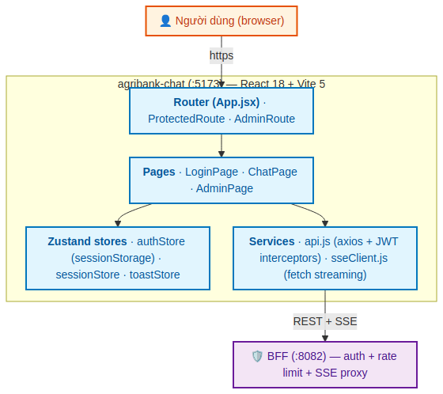
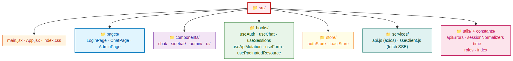
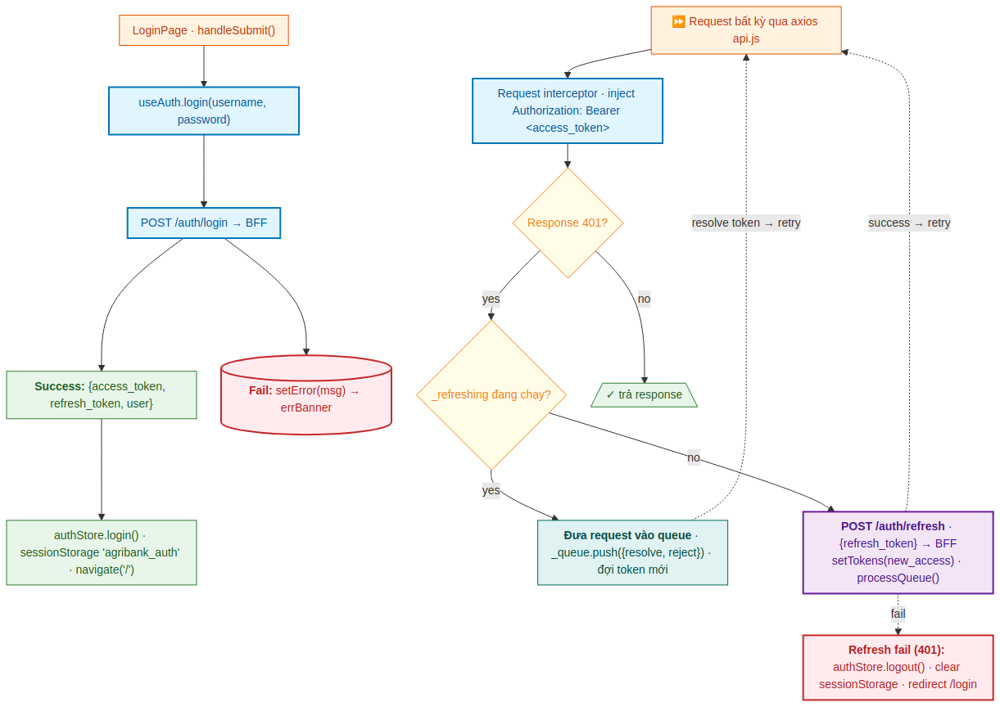
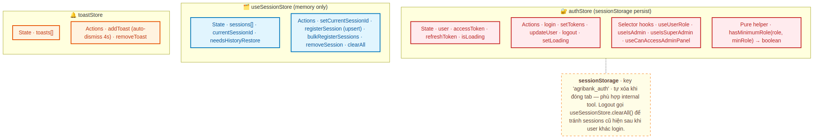
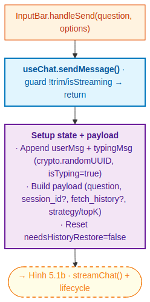
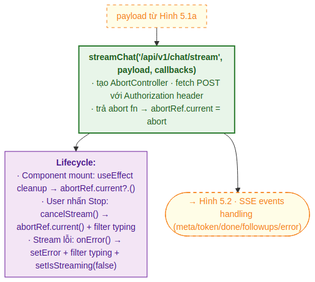
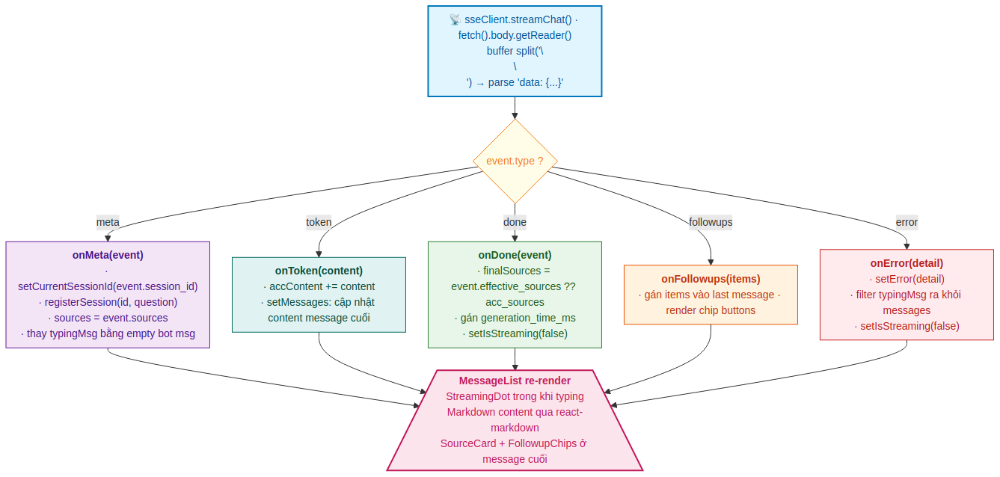
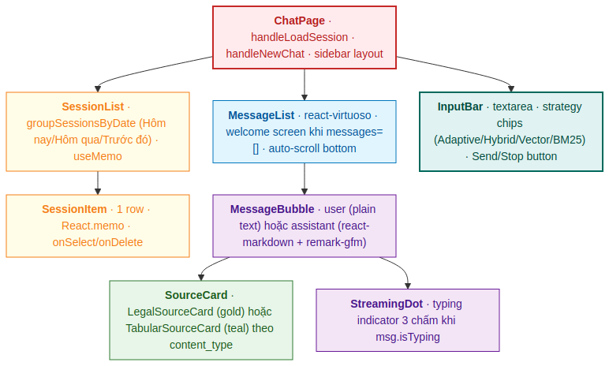
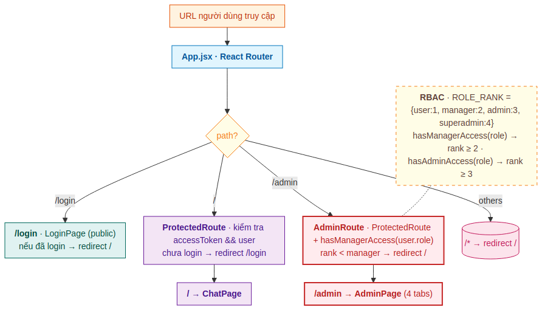
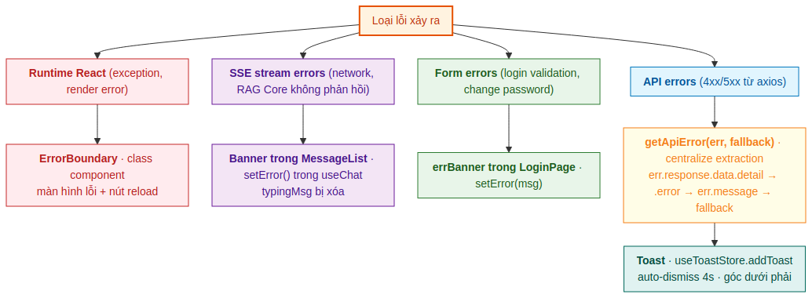

# PHẦN 4 — agribank-chat (UI) + PHỤ LỤC

## 1. Giới thiệu Phần 4

Phần này đi sâu vào phân hệ `agribank-chat` — frontend Single Page Application (SPA) dựa trên React 18 + Vite 5, đóng vai trò giao diện người dùng cuối cùng trong hệ thống RAG-Chatbot Pháp lý Agribank.

Sau khi đã xem qua RAG Core ở **Phần 2** và BFF Service ở **Phần 3**, đây là tầng trực tiếp tương tác với nhân viên Agribank — nơi câu hỏi pháp lý được nhập, câu trả lời được hiển thị streaming với trích dẫn, và toàn bộ trải nghiệm được "kết tinh" thành một sản phẩm hoàn chỉnh.

### Cấu trúc Phần 4

| § | Tiêu đề | Trọng tâm |
|---|---|---|
| 1 | Giới thiệu Phần 4 | Bối cảnh, nguyên tắc thiết kế UI |
| 2 | Kiến trúc tổng thể & cấu trúc thư mục | Stack thực tế, thư mục `src/` |
| 3 | Auth flow + JWT refresh interceptor | Login, sessionStorage, queue-based refresh |
| 4 | State management với Zustand | 3 stores · selector hooks · pure helpers |
| 5 | useChat hook + SSE streaming | sendMessage, sseClient, event handlers |
| 6 | Component tree & UI design | ChatPage layout, MessageBubble, SourceCard variants |
| 7 | Routing & Guards | ProtectedRoute, AdminRoute, RBAC |
| 8 | Error handling hierarchy | ErrorBoundary, Toast, banner inline |
| 9 | Phụ lục A — API Contracts (BFF ↔ FE) | SSE event types, request/response schemas |
| 10 | Phụ lục B — Glossary toàn bộ thuật ngữ | Tham chiếu chéo Phần 1-4 |
| 11 | Phụ lục C — File ↔ chức năng (3 service) | Bảng tra cứu nhanh khi debug |
| 12 | Phụ lục D — 7 ADR — Quyết định thiết kế UI | sessionStorage, fetch vs EventSource, Zustand vs Redux... |

### Ba nguyên tắc thiết kế UI

| Nguyên tắc | Cách thực hiện |
|---|---|
| **Streaming-first** | Token-by-token rendering qua SSE → user thấy phản hồi sau ~1s thay vì đợi 5-10s. Không dùng `EventSource` (không hỗ trợ Authorization header) — dùng `fetch().body.getReader()`. |
| **Optimistic UI** | User message + typing indicator append ngay lập tức khi user gửi câu hỏi (không đợi server phản hồi). Sau đó typing được thay thế bằng streaming content. |
| **Defensive client guards** | Client-side route guards (`ProtectedRoute`, `AdminRoute`) chỉ là **first line of defense**. Server (BFF) luôn validate JWT độc lập. Client guard chỉ để UX (không hiển thị nút admin nếu không có quyền). |

---

## 2. Kiến trúc tổng thể & cấu trúc thư mục

### 2.1 Sơ đồ kiến trúc



*Hình 1.1 — `agribank-chat` (`:5173`) gồm 4 lớp chính: Router (App.jsx) → Pages → Zustand stores + Services. Toàn bộ giao tiếp với BFF (`:8082`) qua axios (REST) và sseClient (SSE streaming). Frontend không bao giờ gọi trực tiếp RAG Core — mọi thứ đều qua BFF.*

### 2.2 Stack công nghệ thực tế

Đây là dependencies thực tế đọc từ `package.json`:

| Thư viện | Phiên bản | Vai trò |
|---|---|---|
| `react` + `react-dom` | 18.3.1 | UI framework |
| `vite` | 5.x | Build tool + dev proxy + HMR |
| `react-router-dom` | 6.23.1 | Client-side routing |
| `zustand` | 4.5.2 | State management |
| `axios` | 1.7.2 | HTTP client với interceptors |
| `react-virtuoso` | 4.18.4 | Virtual scrolling cho MessageList |
| `react-markdown` | 10.1.0 | Render bot responses dạng Markdown |
| `remark-gfm` | 4.0.1 | GFM tables/strikethrough cho react-markdown |
| `eslint` 9 (flat config) + `prettier` 3 | — | Linting + formatting |

**Quyết định KHÔNG dùng:**
- ❌ Redux / Redux Toolkit — Zustand đủ cho scale này, ít boilerplate
- ❌ Material-UI / Ant Design / Chakra — CSS Modules đủ, kiểm soát tốt hơn
- ❌ TypeScript — giữ JS để giảm dependency và build complexity (revisit sau)
- ❌ React Query / SWR — request đơn giản, axios + custom hooks đủ
- ❌ Tailwind CSS — đã dùng CSS Modules với design tokens

### 2.3 Cấu trúc thư mục `src/`



*Hình 2.1 — Tổ chức thư mục theo concern: pages (top-level routes), components (UI building blocks chia theo feature), hooks (logic reuse), store (state), services (HTTP/SSE), utils + constants (helpers).*

```
src/
├── main.jsx              # Entry point: ReactDOM + ErrorBoundary + Toaster wrapper
├── App.jsx               # Router + ProtectedRoute + AdminRoute
├── index.css             # CSS design tokens, resets, animations
│
├── pages/                # Top-level routes
│   ├── LoginPage.jsx     # Hero + form + ChangePassword modal
│   ├── ChatPage.jsx      # Layout sidebar + main (chat chính)
│   └── AdminPage.jsx     # 4 tabs: stats / users / docs / logs
│
├── components/
│   ├── chat/             # MessageList · MessageBubble · SourceCard · InputBar · StreamingDot
│   ├── sidebar/          # SessionList · SessionItem
│   ├── admin/            # UserTable · StatsPanel
│   └── ui/               # ErrorBoundary · Toaster · Modal · Pagination · RoleBadge · ChangePasswordModal
│
├── hooks/
│   ├── useAuth.js              # Login/logout + error state
│   ├── useChat.js              # SendMessage + SSE stream + messages state
│   ├── useSessions.js          # Session CRUD + Zustand store export
│   ├── useApiMutation.js       # Generic 1-shot async wrapper
│   ├── useForm.js              # Form state (values/setField/reset)
│   └── usePaginatedResource.js # Pagination helper (url/pageSize/dataKey)
│
├── services/
│   ├── api.js          # Axios instance + JWT interceptors + 401 retry queue
│   └── sseClient.js    # Custom fetch-based SSE (hỗ trợ Authorization header)
│
├── store/
│   ├── authStore.js    # Zustand: user, tokens, sessionStorage + selector hooks
│   └── toastStore.js   # Zustand: toast notifications (auto-dismiss 4s)
│
├── constants/
│   ├── roles.js        # ROLE_RANK, hasManagerAccess, hasAdminAccess, ROLE_LABELS
│   └── index.js        # DEFAULTS, PAGE_SIZES, SUPPORT_CONTACT
│
└── utils/
    ├── apiErrors.js           # getApiError(), getValidationErrors()
    ├── sessionNormalizers.js  # normalizeSession(), groupSessionsByDate()
    └── time.js                # fmtTime, fmtVNDate, fmtMsgTime, dateStrVN
```

> **Lưu ý:** `useSessionStore` không có file riêng — được export từ `hooks/useSessions.js`. Đây là Zustand singleton dùng chung giữa `useChat` và `SessionList` để đồng bộ session state.

---

## 3. Auth flow + JWT refresh interceptor

### 3.1 Sơ đồ luồng xác thực và refresh token



*Hình 3.1 — Luồng đăng nhập và auto-refresh JWT: login lưu cặp (access, refresh) vào `sessionStorage`. Mỗi request được axios interceptor inject `Authorization: Bearer <access>`. Khi gặp 401, request đầu trigger refresh, các request đồng thời được đưa vào queue và retry sau khi có token mới.*

### 3.2 Lưu trữ token: `sessionStorage` (không phải `localStorage`)

```javascript
// store/authStore.js
const STORAGE_KEY = 'agribank_auth'

const loadPersistedState = () => {
  try {
    const raw = sessionStorage.getItem(STORAGE_KEY)
    if (!raw) return null
    return JSON.parse(raw)
  } catch {
    return null
  }
}

const saveState = (user, accessToken, refreshToken) => {
  try {
    sessionStorage.setItem(
      STORAGE_KEY,
      JSON.stringify({ user, accessToken, refreshToken })
    )
  } catch { /* ignore quota exceeded */ }
}
```

**Lý do dùng `sessionStorage` thay vì `localStorage`:**
- `sessionStorage` tự xóa khi đóng tab → user phải đăng nhập lại khi mở browser hôm sau
- Phù hợp **internal banking tool** — không tiện cho user nhưng giảm rủi ro token leak nếu máy bị truy cập trái phép
- Refresh trang vẫn giữ login (vì sessionStorage tồn tại trong cùng tab)

**Đánh đổi:** Mở chatbot ở 2 tab → mỗi tab có session riêng (không chia sẻ login). Đây là behavior mong muốn cho banking context.

### 3.3 Login flow chi tiết

```javascript
// hooks/useAuth.js
const login = async ({ username, password }) => {
  setLoading(true)
  setError(null)
  try {
    const res = await api.post('/auth/login', { username, password })
    const { access_token, refresh_token, user } = res.data
    authStore.login(user, access_token, refresh_token)
    navigate('/')
  } catch (err) {
    setError(getApiError(err, 'Đăng nhập thất bại'))
  } finally {
    setLoading(false)
  }
}
```

`authStore.login()` (trong `store/authStore.js`):

```javascript
login: (user, accessToken, refreshToken) => {
  saveState(user, accessToken, refreshToken)
  set({ user, accessToken, refreshToken, isLoading: false })
},
```

Một call ghi cả `sessionStorage` và Zustand state. Không có race condition vì cả hai đều synchronous.

### 3.4 Auto-refresh interceptor (queue-based)

Đây là phần phức tạp nhất của `services/api.js`. Vấn đề: nhiều request đồng thời cùng nhận 401 — không thể trigger refresh nhiều lần. Giải pháp: **một lần refresh, queue các request khác**.

```javascript
// services/api.js
let _refreshing = false
let _queue = []  // requests chờ refresh

const processQueue = (error, token = null) => {
  _queue.forEach(({ resolve, reject }) => {
    if (error) reject(error)
    else resolve(token)
  })
  _queue = []
}

api.interceptors.response.use(
  (response) => response,
  async (error) => {
    const original = error.config

    // Chỉ xử lý 401 và không phải request refresh/login
    if (
      error.response?.status === 401 &&
      !original._retry &&
      !original.url?.includes('/auth/login') &&
      !original.url?.includes('/auth/refresh')
    ) {
      if (_refreshing) {
        // Đợi refresh đang thực hiện xong
        return new Promise((resolve, reject) => {
          _queue.push({ resolve, reject })
        }).then((token) => {
          original.headers.Authorization = `Bearer ${token}`
          return api(original)
        })
      }

      original._retry = true
      _refreshing = true

      const { refreshToken, setTokens, logout } = useAuthStore.getState()

      if (!refreshToken) {
        logout()
        return Promise.reject(error)
      }

      try {
        const res = await axios.post(`${BASE_URL}/auth/refresh`, {
          refresh_token: refreshToken,
        })
        const newAccessToken = res.data.access_token
        setTokens(newAccessToken, refreshToken)
        processQueue(null, newAccessToken)
        original.headers.Authorization = `Bearer ${newAccessToken}`
        return api(original)
      } catch (refreshErr) {
        processQueue(refreshErr, null)
        logout()
        return Promise.reject(refreshErr)
      } finally {
        _refreshing = false
      }
    }

    return Promise.reject(error)
  }
)
```

**Chi tiết quan trọng:**

| Check | Lý do |
|---|---|
| `!original._retry` | Tránh vòng lặp vô hạn nếu retry vẫn 401 |
| `!original.url?.includes('/auth/login')` | Login fail → user nhập sai mật khẩu, không phải token hết hạn |
| `!original.url?.includes('/auth/refresh')` | Refresh fail → refresh token cũng hết hạn → logout, không retry |
| `_refreshing` flag | Race condition: nhiều request cùng nhận 401, chỉ một được phép trigger refresh |
| `_queue` array | Các request khác đợi refresh xong, retry với token mới |
| `axios.post('/auth/refresh', ...)` (không qua `api`) | Tránh interceptor đệ quy gọi chính nó |

### 3.5 Đổi mật khẩu

`POST /auth/me/change-password` từ BFF (đã document ở Phần 3 §4.6) revoke **tất cả** refresh tokens. Sau khi đổi, FE phải logout user:

```javascript
// components/ui/ChangePasswordModal.jsx
const handleSubmit = async () => {
  try {
    await api.post('/auth/me/change-password', { old_password, new_password })
    addToast('Đổi mật khẩu thành công, vui lòng đăng nhập lại', 'success')
    authStore.logout()  // Force re-login
    navigate('/login')
  } catch (err) {
    setError(getApiError(err, 'Đổi mật khẩu thất bại'))
  }
}
```

---

## 4. State management với Zustand

### 4.1 Sơ đồ ba stores



*Hình 4.1 — Ba store độc lập: `authStore` persist sessionStorage cho user/tokens; `useSessionStore` memory-only cho danh sách sessions sidebar; `toastStore` cho thông báo hiển thị tạm thời. Mỗi store có pattern State + Actions; `authStore` còn có selector hooks và pure helper riêng.*

### 4.2 authStore — Persist pattern

**Lý do dùng Zustand thay vì useContext:**

| | useContext | Zustand |
|---|---|---|
| Boilerplate | Provider + reducer pattern | `create(set => ({...}))` |
| Re-render khi state đổi | Tất cả consumers re-render | Chỉ subscribers re-render |
| Selector pattern | Cần `useMemo` thủ công | Built-in qua function arg |
| Bundle size | 0 (built-in React) | ~3 KB (rất nhẹ) |
| Test | Phải wrap Provider | Direct store access |

**Selector hooks** — chỉ subscribe vào field cần dùng, tránh unnecessary re-render:

```javascript
// store/authStore.js
export const useUserRole          = () => useAuthStore(s => s.user?.role)
export const useIsAdmin           = () => useAuthStore(s => s.user?.role === 'admin')
export const useIsSuperAdmin      = () => useAuthStore(s => s.user?.role === 'superadmin')
export const useIsManager         = () => useAuthStore(s => s.user?.role === 'manager')
export const useCanAccessAdminPanel = () =>
  useAuthStore(s => getRoleRank(s.user?.role) >= ROLE_RANK.manager)

// Pure helper — KHÔNG phải hook, dùng làm closure được (ví dụ trong event handler)
export const hasMinimumRole = (role, minRole) =>
  getRoleRank(role) >= getRoleRank(minRole)
```

**Tại sao tách hook vs pure helper?** React hook chỉ dùng được ở top-level component. Nếu ở event handler, async callback, hoặc closure (vd: filter function), phải dùng pure helper với role lấy từ `useAuthStore.getState().user?.role`.

### 4.3 useSessionStore — Memory only, no persist

```javascript
// hooks/useSessions.js
import { create } from 'zustand'

const useSessionStore = create((set, get) => ({
  // State
  sessions: [],
  currentSessionId: null,
  needsHistoryRestore: false,

  // Actions
  setCurrentSessionId: (id) => set({ currentSessionId: id }),

  registerSession: (id, firstQuestion, updatedAt) => {
    const sessions = get().sessions
    const existing = sessions.find(s => s.id === id)

    if (!existing) {
      // Session mới — thêm vào đầu danh sách
      set({
        sessions: [
          { id, title: firstQuestion || 'Hội thoại mới', updatedAt: updatedAt || new Date().toISOString() },
          ...sessions,
        ],
      })
      return
    }

    // Upsert: nếu existing có title fallback và firstQuestion thực → cập nhật title
    if (existing.title === 'Hội thoại mới' && firstQuestion) {
      set({
        sessions: sessions.map(s =>
          s.id === id ? { ...s, title: firstQuestion } : s
        ),
      })
    }
    // Nếu existing có title thực → bỏ qua (không overwrite)
  },

  bulkRegisterSessions: (incoming) => {
    // Merge với sessions hiện có, sort DESC theo updatedAt
    const existing = get().sessions
    const map = new Map(existing.map(s => [s.id, s]))
    incoming.forEach(s => map.set(s.id, { ...map.get(s.id), ...s }))
    const merged = Array.from(map.values())
      .sort((a, b) => new Date(b.updatedAt) - new Date(a.updatedAt))
    set({ sessions: merged })
  },

  removeSession: (id) => {
    const { sessions, currentSessionId } = get()
    set({
      sessions: sessions.filter(s => s.id !== id),
      currentSessionId: currentSessionId === id ? null : currentSessionId,
    })
  },

  clearAll: () => set({ sessions: [], currentSessionId: null, needsHistoryRestore: false }),
  setNeedsHistoryRestore: (val) => set({ needsHistoryRestore: val }),
}))
```

**Tại sao không persist sessions?** Sessions được **re-fetch từ BFF** mỗi khi `ChatPage` mount (qua `GET /api/v1/my/sessions`). BFF lưu permanent trong SQLite — đó là source of truth. FE persist sẽ tạo divergence khi user khác login trên cùng tab.

**Logic upsert quan trọng** trong `registerSession`:
- Khi `useChat.sendMessage()` gọi `registerSession(sid, question)` lần đầu của session mới → title = câu hỏi
- Khi `bulkRegisterSessions()` từ `fetchUserSessions()` chạy sau và session đã có title fallback → title được cập nhật
- Tránh trường hợp session bị kẹt ở "Hội thoại mới" sau reload

### 4.4 toastStore — Auto-dismiss

```javascript
// store/toastStore.js
import { create } from 'zustand'

let _id = 0

export const useToastStore = create((set) => ({
  toasts: [],

  addToast: (message, type = 'info') => {
    const id = ++_id
    set(state => ({ toasts: [...state.toasts, { id, message, type }] }))
    // Auto-remove sau 4 giây
    setTimeout(() => {
      set(state => ({ toasts: state.toasts.filter(t => t.id !== id) }))
    }, 4000)
  },

  removeToast: (id) =>
    set(state => ({ toasts: state.toasts.filter(t => t.id !== id) })),
}))
```

**Cách dùng từ ngoài component (closure, async callback):**

```javascript
// utils/apiErrors.js — không phải React component
import { useToastStore } from '@/store/toastStore'

export const showApiError = (err, fallback) => {
  const msg = getApiError(err, fallback)
  useToastStore.getState().addToast(msg, 'error')
}
```

`getState()` truy cập state ngoài React lifecycle — không tạo subscription.

---

## 5. useChat hook + SSE streaming

### 5.1 Sơ đồ flow gửi tin nhắn



*Hình 5.1a — Khi user nhấn Send: `useChat.sendMessage()` validate (không trim empty, không double-send), append cả userMsg và typingMsg vào state cùng lúc (optimistic UI), build payload với các flags (session_id, fetch_history, strategy) và reset `needsHistoryRestore` ngay sau build.*



*Hình 5.1b — `streamChat()` tạo `AbortController`, fetch POST với Authorization header và trả về abort function. `abortRef` lưu lại để cancel khi user nhấn Stop hoặc component unmount. Stream lỗi sẽ filter typing message ra khỏi state.*

### 5.2 sseClient.js — Tại sao dùng `fetch()` thay vì `EventSource`?

**Hạn chế của `EventSource`:** chỉ hỗ trợ GET requests và **không cho phép custom headers** — không gửi được `Authorization: Bearer <token>`.

**Giải pháp:** dùng `fetch().body.getReader()` để stream chunks thủ công:

```javascript
// services/sseClient.js
export function streamChat(path, body, callbacks) {
  const { onMeta, onToken, onDone, onFollowups, onError } = callbacks
  const controller = new AbortController()
  const token = useAuthStore.getState().accessToken

  ;(async () => {
    try {
      const res = await fetch(`${BASE_URL}${path}`, {
        method: 'POST',
        headers: {
          'Content-Type': 'application/json',
          ...(token ? { Authorization: `Bearer ${token}` } : {}),
        },
        body: JSON.stringify(body),
        signal: controller.signal,
      })

      if (!res.ok) {
        let detail = `HTTP ${res.status}`
        try {
          const err = await res.json()
          detail = err.detail || err.error || detail
        } catch { /* ignore JSON parse error */ }
        onError?.(detail)
        return
      }

      const reader = res.body.getReader()
      const decoder = new TextDecoder()
      let buffer = ''

      while (true) {
        const { done, value } = await reader.read()
        if (done) break

        buffer += decoder.decode(value, { stream: true })

        // SSE messages phân tách bằng '\n\n'
        const parts = buffer.split('\n\n')
        buffer = parts.pop()  // phần chưa hoàn chỉnh giữ lại

        for (const part of parts) {
          const line = part.trim()
          if (!line.startsWith('data: ')) continue

          const raw = line.slice(6)
          let event
          try {
            event = JSON.parse(raw)
          } catch {
            continue  // bỏ qua dòng không hợp lệ
          }

          switch (event.type) {
            case 'meta':      onMeta?.(event); break
            case 'token':     onToken?.(event.content); break
            case 'done':      onDone?.(event); break
            case 'followups': onFollowups?.(event.items); break
            case 'error':     onError?.(event.detail || 'Lỗi không xác định'); break
          }
        }
      }
    } catch (err) {
      if (err.name === 'AbortError') return  // bị hủy chủ động
      onError?.(err.message || 'Lỗi kết nối')
    }
  })()

  // Trả về hàm abort để component có thể hủy khi unmount
  return () => controller.abort()
}
```

**Các quyết định quan trọng:**

| Quyết định | Lý do |
|---|---|
| `decoder.decode(value, {stream: true})` | Multi-byte chars (UTF-8 tiếng Việt) có thể bị split giữa 2 chunks. `stream: true` giữ partial bytes lại cho lần decode tiếp. |
| `buffer.split('\n\n')` + `parts.pop()` | SSE message boundary là `\n\n`. Nếu chunk kết thúc giữa message, `pop()` lấy phần dở dang lại buffer cho lần đọc tiếp. |
| `if (err.name === 'AbortError') return` | Khi user nhấn Stop hoặc component unmount, controller.abort() throw AbortError — đây là behavior mong đợi, không phải lỗi. |
| `onError?.(detail)` (optional chaining) | Tất cả callbacks đều optional — caller có thể chỉ subscribe vào events cần thiết. |

### 5.3 useChat — Optimistic UI pattern

```javascript
// hooks/useChat.js
const sendMessage = useCallback(async (question, options = {}) => {
  if (!question.trim() || isStreaming) return

  setError(null)
  const now = new Date().toISOString()

  // 1. Append userMsg + typingMsg ngay lập tức (optimistic UI)
  const userMsg  = { role: 'user', content: question, created_at: now, id: crypto.randomUUID() }
  const typingId = crypto.randomUUID()
  const typingMsg = {
    role: 'assistant', content: '', isTyping: true,
    sources: [], id: typingId, created_at: now,
  }
  setMessages(prev => [...prev, userMsg, typingMsg])
  setIsStreaming(true)

  // 2. Build payload
  const payload = {
    question,
    ...(currentSessionId   ? { session_id: currentSessionId } : {}),
    ...(needsHistoryRestore ? { fetch_history: true }          : {}),
    ...(options.strategy   ? { strategy: options.strategy }    : {}),
    ...(options.topK       ? { top_k: options.topK }           : {}),
    ...(options.enableRerank !== undefined
        ? { enable_rerank: options.enableRerank } : {}),
  }
  // Reset ngay sau build payload — tránh re-send khi user gửi tin tiếp theo
  if (needsHistoryRestore) setNeedsHistoryRestore(false)

  // 3. Stream với accumulator pattern
  let accContent = ''
  let sources = []

  const abort = streamChat('/api/v1/chat/stream', payload, {
    onMeta: (event) => {
      if (event.session_id) {
        setCurrentSessionId(event.session_id)
        registerSession(event.session_id, question)
      }
      sources = event.sources || []
      // Thay typingMsg bằng empty bot message (sẵn sàng nhận tokens)
      setMessages(prev => [
        ...prev.slice(0, -1),
        { role: 'assistant', content: '', sources: [], id: typingId, created_at: new Date().toISOString() },
      ])
    },

    onToken: (token) => {
      accContent += token
      setMessages(prev => [
        ...prev.slice(0, -1),
        { ...prev[prev.length - 1], content: accContent },
      ])
    },

    onDone: (event) => {
      // Prefer effective_sources từ done event
      const finalSources = event.effective_sources ?? sources
      setMessages(prev => [
        ...prev.slice(0, -1),
        {
          role: 'assistant',
          content: accContent,
          sources: finalSources,
          id: typingId,
          created_at: new Date().toISOString(),
          generation_time_ms: event.generation_time_ms,
        },
      ])
      setIsStreaming(false)
    },

    onFollowups: (items) => {
      setMessages(prev => {
        const last = prev[prev.length - 1]
        return [...prev.slice(0, -1), { ...last, followups: items }]
      })
    },

    onError: (detail) => {
      setError(detail)
      setMessages(prev => prev.filter(m => m.id !== typingId))
      setIsStreaming(false)
    },
  })

  abortRef.current = abort
}, [isStreaming, currentSessionId, ...])
```

**Hai pattern then chốt:**

1. **Optimistic UI** — userMsg và typingMsg append ngay khi user nhấn Send (trước khi server phản hồi). UX trở nên responsive.

2. **Accumulator + replace last** — `accContent` tích lũy ngoài state, mỗi `onToken` thay thế **last message** với content mới. Tránh re-render cả list.

### 5.4 Xử lý 5 SSE event types



*Hình 5.2 — Năm event types từ BFF: `meta` (session_id + initial sources), `token` (LLM streaming chunks), `done` (final sources + timing), `followups` (gợi ý câu hỏi tiếp theo, gửi sau done), `error` (chi tiết lỗi). Mỗi event trigger callback tương ứng và update messages state.*

| Event | Khi nào | Hành vi useChat |
|---|---|---|
| `meta` | Đầu stream | Set `currentSessionId`, `registerSession`, lưu initial sources |
| `token` | Mỗi token LLM | Append vào `accContent`, update last message |
| `done` | Cuối stream | Cập nhật `effective_sources`, `generation_time_ms`, `setIsStreaming(false)` |
| `followups` | Sau `done` (optional) | Gắn `items` vào last message → render chip buttons |
| `error` | Bất kỳ lúc nào | Set error, xóa typingMsg ra khỏi messages |

> **Mở rộng cho Agentic RAG (Phần 6 §7):** Khi bật `agentic_rag=true` và câu hỏi đi nhánh agent, BFF chuyển tiếp thêm event `step` (trạng thái trung gian, vd "Đang tra cứu văn bản pháp lý...") **trước** các event `token`. `sseClient.js` thêm callback `onStep`; `useChat` lưu `currentStep` trên message đang stream và xóa khi token đầu tiên tới; `MessageBubble.jsx` hiện spinner + `currentStep` khi chưa có nội dung. Client cũ bỏ qua event lạ nên không vỡ nếu chưa cập nhật handler. Lưu ý: token của nhánh agent là nội dung **đã được CitationGuard verify** (xem Phần 6 §7.1 — verify-trước-stream).

### 5.5 needsHistoryRestore flag — Khôi phục context cho session cũ

**Vấn đề:** Session trên RAG Core có TTL 72h. Sau 72h, conversation history bị xóa → LLM mất context. Nhưng BFF lưu permanent trong SQLite.

**Giải pháp:** Khi user click session cũ trong sidebar, FE set `needsHistoryRestore=true`. Lần `sendMessage()` đầu tiên sẽ kèm flag `fetch_history=true` → BFF lấy history từ SQLite, gửi sang RAG Core seed lại context.

```javascript
// hooks/useSessions.js — loadSession
const loadSession = useCallback(async (sessionId, onLoaded) => {
  setLoadingSession(true)
  try {
    const res = await api.get(`/api/v1/sessions/${sessionId}`)
    setCurrentSessionId(sessionId)
    setNeedsHistoryRestore(true)  // ← flag set ở đây
    onLoaded?.(res.data.messages)
  } catch (err) {
    addToast(getApiError(err, 'Không thể tải hội thoại'), 'error')
  } finally {
    setLoadingSession(false)
  }
}, [...])
```

Trong `sendMessage()`, flag được consume **một lần** rồi reset:

```javascript
...(needsHistoryRestore ? { fetch_history: true } : {}),

// Reset NGAY sau khi build payload (không đợi response) — tránh re-send
// nếu component re-render hoặc user gửi tiếp tin trong cùng session
if (needsHistoryRestore) setNeedsHistoryRestore(false)
```

---

## 6. Component tree & UI design

### 6.1 Sơ đồ cây component ChatPage



*Hình 6.1 — ChatPage gồm 3 vùng chính: Sidebar (SessionList → SessionItem), MessageList (virtualized với react-virtuoso, render MessageBubble + SourceCard + StreamingDot), và InputBar (textarea + strategy chips + Send/Stop).*

### 6.2 Layout ChatPage

```
┌──────────────────────────────────────────────────────────────────┐
│ Sidebar (276px)           │ Main Area (flex: 1)                  │
│ ┌─────────────────────┐   │ ┌──────────────────────────────────┐ │
│ │ Header (brand)      │   │ │ Topbar (title + Admin btn)       │ │
│ ├─────────────────────┤   │ ├──────────────────────────────────┤ │
│ │ [✦ Hội thoại mới]   │   │ │                                  │ │
│ ├─────────────────────┤   │ │  MessageList (flex: 1, scroll)   │ │
│ │ ▣ Hôm nay           │   │ │  ┌──────────┐                    │ │
│ │   - "Điều 5 TT 39"  │   │ │  │UserBubble│                    │ │
│ │   - "Phí chuyển..." │   │ │  └──────────┘                    │ │
│ │ ▣ Hôm qua           │   │ │              ┌────────────┐      │ │
│ │   - "Lãi suất..."   │   │ │              │ BotBubble  │      │ │
│ │ ▣ Trước đó          │   │ │              └────────────┘      │ │
│ │                     │   │ │              └── SourceCards     │ │
│ │ [User dropdown]     │   │ │              └── FollowupChips   │ │
│ └─────────────────────┘   │ ├──────────────────────────────────┤ │
│                            │ │ InputBar                         │ │
│                            │ │ [Adaptive][Hybrid][Vector][BM25] │ │
│                            │ │ [textarea          ] [Send/Stop] │ │
│                            │ └──────────────────────────────────┘ │
└──────────────────────────────────────────────────────────────────┘
```

### 6.3 SourceCard — Legal vs Tabular dispatch

`SourceCard.jsx` dispatch dựa vào `source.content_type`:

```javascript
// components/chat/SourceCard.jsx
function SourceCard({ source }) {
  // Gotcha quan trọng: legal sources KHÔNG có content_type field
  // → check === 'tabular', không dùng !== 'legal'
  if (source.content_type === 'tabular') {
    return <TabularSourceCard source={source} />
  }
  return <LegalSourceCard source={source} />
}
```

| Variant | Accent | Icon | Fields hiển thị |
|---|---|---|---|
| `LegalSourceCard` | `--gold-bg` (vàng) | 📎 | tên Điều/Khoản, tên văn bản, score |
| `TabularSourceCard` | teal `#E8F6F3 / #5DADE2` | 📊 | `item_name`, `source_doc`, score |

**Tabular source shape** từ SSE `meta.sources[]`:
```json
{
  "content_type": "tabular",
  "type_tab": "PHI",
  "code_tab": "PHI_001",
  "item_name": "Phí chuyển tiền",
  "source_doc": "2929/QĐ-NHNo-KHCN",
  "score": 0.87
}
```

### 6.4 MessageBubble — react-markdown cho bot responses

User message render plain text. Bot message qua `react-markdown + remark-gfm` để hỗ trợ tables/strikethrough/checkboxes:

```jsx
// components/chat/MessageBubble.jsx
import ReactMarkdown from 'react-markdown'
import remarkGfm from 'remark-gfm'

function MessageBubble({ message, onSendFollowup }) {
  if (message.role === 'user') {
    return <div className={styles.userBubble}>{message.content}</div>
  }

  // Bot message
  return (
    <div className={styles.botBubble}>
      {message.isTyping ? (
        <StreamingDot />
      ) : (
        <ReactMarkdown remarkPlugins={[remarkGfm]}>
          {message.content}
        </ReactMarkdown>
      )}

      {message.sources?.length > 0 && (
        <div className={styles.sources}>
          {message.sources.map((src, idx) => (
            <SourceCard key={idx} source={src} />
          ))}
        </div>
      )}

      {message.followups?.length > 0 && !message.isTyping && (
        <div className={styles.followups}>
          {message.followups.map((q, idx) => (
            <button
              key={idx}
              className={styles.followupChip}
              onClick={() => onSendFollowup(q)}
            >
              {q}
            </button>
          ))}
        </div>
      )}
    </div>
  )
}
```

**XSS protection:** `react-markdown` tự escape HTML. Tuyệt đối không dùng `dangerouslySetInnerHTML` để render bot responses.

### 6.5 react-virtuoso — Virtual scrolling

```jsx
// components/chat/MessageList.jsx
import { Virtuoso } from 'react-virtuoso'

function MessageList({ messages, onSendFollowup }) {
  if (messages.length === 0) {
    return <WelcomeScreen />
  }

  return (
    <Virtuoso
      data={messages}
      followOutput="auto"  // auto-scroll xuống cuối khi có message mới
      itemContent={(index, msg) => (
        <MessageBubble
          message={msg}
          onSendFollowup={onSendFollowup}
        />
      )}
    />
  )
}
```

**Lý do dùng `react-virtuoso`:** session dài (>50 messages) chứa nhiều SourceCards + Markdown rendering. Native scroll re-render tất cả → UI giật. Virtuoso chỉ render messages trong viewport.

### 6.6 Design tokens (index.css)

```css
:root {
  /* Brand colors */
  --red:    #0EA5E9;   /* tên --red nhưng thực tế là xanh dương */
  --gold:   #C68A15;
  --green:  #00703C;

  /* Layout */
  --sidebar-w: 276px;
  --topbar-h:  56px;

  /* Radius */
  --r:    12px;
  --r-sm: 8px;
  --r-lg: 18px;

  /* Font */
  --font-d: 'Playfair Display', serif;  /* headings */
  --font:   'Be Vietnam Pro', sans-serif; /* body — hỗ trợ tiếng Việt tốt */
}
```

> **Lưu ý lịch sử:** CSS variable `--red` thực tế là **màu xanh dương** (`#0EA5E9`). Tên giữ nguyên từ thiết kế gốc — không đổi để tránh ripple effect khắp codebase.

---

## 7. Routing & Guards

### 7.1 Sơ đồ routing



*Hình 7.1 — Ba route chính: `/login` public (redirect / nếu đã đăng nhập), `/` ChatPage qua ProtectedRoute, `/admin` AdminPage qua AdminRoute. Tất cả URL khác redirect về `/`. RBAC client-side dùng `hasManagerAccess()` từ `constants/roles.js`.*

### 7.2 ProtectedRoute và AdminRoute

```jsx
// App.jsx
import { Navigate, Outlet } from 'react-router-dom'
import { useAuthStore } from '@/store/authStore'
import { hasManagerAccess } from '@/constants/roles'

function ProtectedRoute({ children }) {
  const { accessToken, user } = useAuthStore()
  if (!accessToken || !user) {
    return <Navigate to="/login" replace />
  }
  return children
}

function AdminRoute({ children }) {
  const { accessToken, user } = useAuthStore()
  if (!accessToken || !user) {
    return <Navigate to="/login" replace />
  }
  if (!hasManagerAccess(user.role)) {
    return <Navigate to="/" replace />
  }
  return children
}

export default function App() {
  return (
    <Routes>
      <Route path="/login" element={<LoginPage />} />
      <Route path="/" element={<ProtectedRoute><ChatPage /></ProtectedRoute>} />
      <Route path="/admin" element={<AdminRoute><AdminPage /></AdminRoute>} />
      <Route path="*" element={<Navigate to="/" replace />} />
    </Routes>
  )
}
```

### 7.3 RBAC constants — `constants/roles.js`

```javascript
export const ROLE_RANK = {
  user:       1,
  manager:    2,
  admin:      3,
  superadmin: 4,
}

export const getRoleRank = (role) => ROLE_RANK[role] ?? 0

export const hasManagerAccess = (role) => getRoleRank(role) >= ROLE_RANK.manager
export const hasAdminAccess   = (role) => getRoleRank(role) >= ROLE_RANK.admin

export const ROLE_LABELS = {
  user:       'Người dùng',
  manager:    'Quản lý',
  admin:      'Quản trị',
  superadmin: 'Siêu quản trị',
}
```

**Quan trọng:** RBAC client-side **chỉ là UX layer** — ẩn nút "Quản trị" nếu user không có quyền. **Server BFF luôn validate JWT độc lập** với cùng ROLE_RANK logic. Nếu user gọi trực tiếp `GET /admin/users` qua curl → BFF reject 403, không cần FE.

---

## 8. Error handling hierarchy

### 8.1 Sơ đồ phân tầng xử lý lỗi



*Hình 8.1 — Bốn loại lỗi với cách xử lý khác nhau: Runtime React (ErrorBoundary + nút reload), API errors (Toast notifications), SSE stream errors (banner trong MessageList), Form errors (errBanner inline). `getApiError()` centralize việc trích xuất error message theo thứ tự ưu tiên.*

### 8.2 `getApiError()` — Trích xuất error message

```javascript
// utils/apiErrors.js
export function getApiError(err, fallback = 'Có lỗi xảy ra') {
  // FastAPI HTTPException → response.data.detail
  if (err.response?.data?.detail) {
    return err.response.data.detail
  }
  // Custom API error field
  if (err.response?.data?.error) {
    return err.response.data.error
  }
  // Network error / JS error
  if (err.message) {
    return err.message
  }
  return fallback
}

// Validation errors từ Pydantic
export function getValidationErrors(err) {
  const detail = err.response?.data?.detail
  if (Array.isArray(detail)) {
    // Pydantic trả [{loc, msg, type}]
    return detail.map(e => `${e.loc.join('.')}: ${e.msg}`).join('; ')
  }
  return typeof detail === 'string' ? detail : null
}
```

### 8.3 ErrorBoundary — Class component

`ErrorBoundary` phải là class component vì hooks không hỗ trợ `componentDidCatch` lifecycle:

```jsx
// components/ui/ErrorBoundary.jsx
import { Component } from 'react'

export class ErrorBoundary extends Component {
  state = { hasError: false, error: null }

  static getDerivedStateFromError(error) {
    return { hasError: true, error }
  }

  componentDidCatch(error, info) {
    console.error('React error:', error, info)
    // TODO: gửi sang Sentry/server log nếu cần
  }

  render() {
    if (this.state.hasError) {
      return (
        <div className={styles.errorScreen}>
          <h1>⚠️ Đã xảy ra lỗi</h1>
          <p>{this.state.error?.message}</p>
          <button onClick={() => window.location.reload()}>
            Tải lại trang
          </button>
        </div>
      )
    }
    return this.props.children
  }
}
```

### 8.4 Quy tắc UX cho lỗi

| Loại lỗi | Hiển thị ở đâu | Lý do |
|---|---|---|
| Background ops (xóa session, toggle user, fetch admin data) | Toast | Không gián đoạn flow chính |
| Form validation (login, change password) | Banner inline | User cần focus vào field cụ thể |
| Stream error (SSE) | Banner trong MessageList | Liên quan trực tiếp đến message vừa gửi |
| Runtime exception | Full-screen ErrorBoundary | App đã ở state không xác định |

**Tuyệt đối không dùng `window.alert()`** — chặn UI thread và xấu UX. Chỉ dùng `window.confirm()` cho thao tác xóa dữ liệu.

---

## 9. Phụ lục A — API Contracts (BFF ↔ Frontend)

### 9.1 Auth endpoints

#### POST `/auth/login`

**Request:**
```json
{ "username": "nguyen.van.a", "password": "..." }
```

**Response (200):**
```json
{
  "access_token": "eyJhbGc...",
  "refresh_token": "eyJhbGc...",
  "user": {
    "id": "uuid",
    "username": "nguyen.van.a",
    "full_name": "Nguyễn Văn A",
    "role": "manager",
    "unit": "Phòng Tín dụng",
    "position": "Chuyên viên"
  }
}
```

**Errors:** 401 (sai password), 403 (is_active=0), 423 (locked do brute-force).

#### POST `/auth/refresh`

**Request:** `{ "refresh_token": "..." }`
**Response (200):** `{ "access_token": "..." }`

#### POST `/auth/me/change-password`

**Request:** `{ "old_password": "...", "new_password": "..." }`
**Response (200):** `{ "message": "..." }`
**Hậu quả:** BFF revoke tất cả refresh tokens → FE phải logout user.

### 9.2 Chat endpoints

#### POST `/api/v1/chat/stream`

**Request body:**
```json
{
  "question": "Điều 5 Thông tư 39 quy định gì?",
  "session_id": "uuid (optional)",
  "fetch_history": false,
  "strategy": "adaptive | hybrid | vector | keyword",
  "top_k": 5,
  "enable_rerank": true
}
```

**Response:** SSE stream với 5 event types.

#### Event `meta` (gửi đầu tiên)
```json
{
  "type": "meta",
  "session_id": "uuid",
  "user_id": "uuid",
  "sources": [
    {
      "content_type": "legal" | "tabular",
      "doc_id": "...",
      "article_number": "5",
      "clause_number": "1",
      "doc_title": "Thông tư 39/2016/TT-NHNN",
      "score": 0.91
    }
  ],
  "content_type": "legal" | "tabular"
}
```

#### Event `token` (mỗi token LLM)
```json
{ "type": "token", "content": "Theo " }
```

#### Event `done` (cuối stream)
```json
{
  "type": "done",
  "effective_sources": [...],
  "generation_time_ms": 2140,
  "retrieval_time_ms": 320,
  "total_time_ms": 2460,
  "llm_provider": "gemini",
  "is_clarification": false
}
```

#### Event `followups` (sau done, optional)
```json
{
  "type": "followups",
  "items": [
    "Có thể cho ví dụ về điều kiện cụ thể?",
    "Khoản 2 quy định gì?"
  ]
}
```

#### Event `error`
```json
{ "type": "error", "detail": "RAG Core không phản hồi" }
```

### 9.3 Session endpoints

| Method | Path | Response |
|---|---|---|
| `GET` | `/api/v1/my/sessions` | `{ user_id, session_count, sessions: [{id, title, updated_at}] }` |
| `GET` | `/api/v1/sessions/{id}` | `{ session_id, messages: [{role, content, sources, created_at}], created_at, updated_at, message_count }` |
| `DELETE` | `/api/v1/sessions/{id}` | `204 No Content` |

### 9.4 Admin endpoints (rút gọn — full ở Phần 3 §6.5)

| Method | Path | Min Role | Pagination |
|---|---|---|---|
| `GET` | `/admin/stats` | manager | — |
| `GET` | `/admin/users?page&page_size` | manager | ✓ |
| `GET` | `/admin/documents?page&page_size` | manager | ✓ |
| `GET` | `/admin/logs?page&page_size` | manager | ✓ |
| `POST/PUT/DELETE` | `/admin/users/...` | admin | — |

---

## 10. Phụ lục B — Glossary

Bảng thuật ngữ tổng hợp từ Phần 1-4 để tra cứu nhanh:

| Thuật ngữ | Phần | Ý nghĩa |
|---|:-:|---|
| **Adaptive retrieval** | 2 | 8 rules tự động chọn strategy theo query |
| **Article Expansion** | 2 | Mở rộng từ Khoản → toàn Điều khi build context |
| **BFF** | 3 | Backend-for-Frontend — tầng giữa FE và RAG Core |
| **BM25** | 2 | Keyword retrieval với Okapi (k1=1.5, b=0.75) |
| **brute-force lockout** | 3 | 5 fail → khóa 15 phút (persist DB) |
| **ChromaDB** | 2 | Vector DB lưu embeddings của Khoản |
| **Clause** (Khoản) | 2 | Đơn vị chunk nhỏ nhất trong văn bản pháp lý |
| **CORS** | 3 | Whitelist origins của FE qua middleware |
| **CSP** | 4 | Content-Security-Policy meta tag trong index.html |
| **Defense in depth** | 3 | Auth → Ownership → Rate limit (3 lớp độc lập) |
| **EAV-lite** | 2 | Schema linh hoạt cho Tabular: 10 text + 10 numeric + 5 date slots |
| **effective_sources** | 3, 4 | Sources thực sự được citation trong câu trả lời |
| **EventSource** | 4 | Web API cho SSE — không hỗ trợ headers, FE dùng fetch thay thế |
| **fetch_history** | 3, 4 | Flag để BFF gửi history từ SQLite cho session > TTL |
| **GenerationOrchestrator** | 2 | Class điều phối Phase 3: classify → dispatch → stream |
| **Hybrid retrieval** | 2 | Vector + BM25 kết hợp qua RRF fusion |
| **HyDE** | 2 | Đã loại bỏ — bypass bug với multi-query path |
| **JWT HS256** | 3 | Symmetric token, access 30min + refresh 7 ngày |
| **Khoản** | 2 | Đơn vị nhỏ nhất trong văn bản pháp lý (= clause) |
| **MongoDB** | 2 | Document store cho cấu trúc phân cấp Văn bản → Điều → Khoản |
| **Mixin Architecture** | 3 | UserDB tách thành 7 mixin class theo concern |
| **needsHistoryRestore** | 4 | Flag FE → BFF khi resume session cũ (>72h) |
| **Optimistic UI** | 4 | Append message ngay khi user submit, không đợi server |
| **Phase 1/2/3** | 2 | Indexing (offline) / Retrieval (runtime) / Generation (runtime) |
| **PRAGMA foreign_keys=ON** | 3 | Bắt buộc trong _ConnectionMixin để CASCADE hoạt động |
| **Query Pipeline 4 tầng** | 2 | Tầng A (Slot) → B/B.2/B.5/C/D theo decision tree |
| **RAG Core** | 2 | Service xử lý AI thuần (`:8001`, bind 127.0.0.1) |
| **rank-aware permissions** | 3 | `assert_can_assign_role` dùng `>=` chứ không `>` |
| **RBAC 4 cấp** | 3, 4 | user(1) / manager(2) / admin(3) / superadmin(4) |
| **react-virtuoso** | 4 | Virtual scrolling cho MessageList session dài |
| **refresh queue** | 4 | Khi 401, request đầu trigger refresh, các request khác đợi |
| **RRF (Reciprocal Rank Fusion)** | 2 | Kết hợp Vector + BM25: `score = Σ 1/(k+rank)` |
| **Saga Pattern** | 2 | Compensating transaction cho 3 store ingestion |
| **SessionStore** | 3 | Memory + SQLite ownership map (user_id → session_ids) |
| **sessionStorage** | 4 | Token lưu ở đây — tự xóa khi đóng tab |
| **SSE** | 3, 4 | Server-Sent Events cho streaming chat |
| **Tabular** | 2 | Dữ liệu bảng (biểu phí/lãi suất) — pipeline riêng |
| **TRUSTED_PROXIES** | 3 | Whitelist IP của reverse proxy để trust X-Forwarded-For |
| **VinaLlama** | 2 | LLM tiếng Việt local CPU (fallback) |
| **WAL mode** | 3 | SQLite journal mode cho phép concurrent reads |
| **Zustand** | 4 | Store nhẹ thay Redux (3 KB) |

---

## 11. Phụ lục C — Bảng đối chiếu file ↔ chức năng

### Khi cần fix bug, tra bảng này để biết file nào cần edit:

#### rag-core (Phần 2)

| Triệu chứng | File chính cần xem |
|---|---|
| Ingestion fail → orphan data | `phase1_indexing/ingestion.py` (Saga) |
| Bug chunking sai cấu trúc Điều/Khoản | `phase1_indexing/lib/legal_document_splitter.py` |
| Retrieval trả ít/nhiều kết quả không phù hợp | `phase2_retrieval/src/orchestrator.py` (chọn strategy adaptive) |
| RRF score không như expected | `shared/fusion.py` + `phase2_retrieval/src/retrievers/hybrid_retriever.py` |
| LLM trả lời không đúng strategy | `phase3_generation/core/generation_orchestrator.py` |
| Slot detection thiếu | `phase3_generation/core/slot_detector.py` |
| Tabular không filter đúng type | `phase3_generation/core/handlers/tabular_handler.py` |
| Session TTL sai | `phase3_generation/core/session_manager.py` |

#### bff-service (Phần 3)

| Triệu chứng | File chính cần xem |
|---|---|
| Login lockout không hoạt động | `users/_users_crud.py` (increment_failed_login) |
| Refresh token leak | `users/_refresh_tokens.py` (SHA-256 hash) |
| FK CASCADE không hoạt động | `users/_connection.py` (PRAGMA foreign_keys) |
| Admin xóa được chính mình | `users/router.py` (self-protect rules) |
| RBAC bypass | `auth/permissions.py` (assert_can_assign_role) |
| SSE buffering | `proxy/sse_proxy.py` (httpx.stream()) |
| Session ownership bypass | `proxy/session_authorization.py` |
| user_sessions bị wipe | `users/_session_mappings.py` (active_ids guard) |
| Rate limit không per-user | `middleware/rate_limiter.py` (_get_user_or_ip) |

#### agribank-chat (Phần 4)

| Triệu chứng | File chính cần xem |
|---|---|
| Token không refresh khi 401 | `services/api.js` (response interceptor) |
| SSE stream không chạy | `services/sseClient.js` (fetch + getReader) |
| Message không append optimistic | `hooks/useChat.js` (sendMessage) |
| Session title kẹt 'Hội thoại mới' | `hooks/useSessions.js` (registerSession upsert) |
| Sidebar trống sau login | `pages/ChatPage.jsx` (fetchUserSessions on mount) |
| Admin button hiện cho user thường | `App.jsx` (AdminRoute) + `constants/roles.js` |
| Toast không tự dismiss | `store/toastStore.js` (setTimeout 4000) |
| Markdown bot reply render lỗi | `components/chat/MessageBubble.jsx` (react-markdown) |

---

## 12. Phụ lục D — 7 ADR — Quyết định thiết kế UI quan trọng

### 12.1 Zustand thay vì Redux/Context

**Quyết định:** Dùng Zustand cho tất cả state management.

**Lý do:**
- Zustand ~3 KB vs Redux Toolkit ~15 KB
- API tối giản: `create(set => ({...}))` thay vì action/reducer/dispatch boilerplate
- Selector built-in qua function arg → không cần `useMemo` thủ công
- Test dễ — không cần wrap Provider

**Khi nào nên đổi:** Khi state phức tạp hơn nhiều (devtools, time-travel debugging, middleware) hoặc team đã quen Redux.

### 12.2 sessionStorage thay vì localStorage

**Quyết định:** Lưu JWT trong `sessionStorage` (tự xóa khi đóng tab).

**Lý do:** Internal banking tool — giảm rủi ro token leak nếu máy bị truy cập trái phép. Refresh trang vẫn giữ login (cùng tab).

**Đánh đổi:** Mở 2 tab → 2 session độc lập (không chia sẻ login). Đây là behavior mong đợi cho banking.

### 12.3 fetch + ReadableStream thay vì EventSource cho SSE

**Quyết định:** Custom SSE client dùng `fetch().body.getReader()`.

**Lý do:** `EventSource` không hỗ trợ custom headers — không gửi được `Authorization: Bearer`. Hệ thống yêu cầu auth trên mọi endpoint.

**Hệ quả:** Phải tự handle buffer split, multi-byte UTF-8 decoding, AbortController cho cancellation. Code dài hơn ~50 dòng so với EventSource nhưng kiểm soát hoàn toàn.

### 12.4 Optimistic UI cho user message

**Quyết định:** Append `userMsg` + `typingMsg` vào state ngay khi user nhấn Send, không đợi server.

**Lý do:** Streaming RAG có thể mất 2-10s. Nếu đợi server response mới hiển thị, user nghĩ app bị treo.

**Hệ quả:** Phải handle rollback khi error — `setMessages(prev => prev.filter(m => m.id !== typingId))` để xóa message lỗi.

### 12.5 react-virtuoso cho MessageList

**Quyết định:** Virtualize danh sách messages thay vì native scroll.

**Lý do:** Session dài (>50 messages) chứa Markdown + SourceCards → re-render nặng làm UI giật. Virtuoso chỉ render trong viewport.

**Đánh đổi:** Thêm 1 dependency (~30 KB). Phải config `followOutput="auto"` để auto-scroll khi có message mới.

### 12.6 react-markdown cho bot responses

**Quyết định:** Render bot content qua `react-markdown + remark-gfm`, KHÔNG dùng `dangerouslySetInnerHTML`.

**Lý do:**
- LLM output có thể chứa markdown (tables, lists, code blocks)
- `react-markdown` tự escape HTML → an toàn XSS
- `remark-gfm` thêm GFM features (tables, strikethrough)

**Bất biến:** Tuyệt đối không bypass escape của react-markdown — kể cả khi output có HTML hợp lệ.

### 12.7 Refresh queue thay vì retry độc lập

**Quyết định:** Khi nhiều request cùng nhận 401, chỉ một request trigger refresh, các request khác đợi qua queue.

**Lý do:** Nếu mỗi request tự refresh → race condition: nhiều token mới được tạo, nhiều token cũ bị revoke. Server BFF chỉ giữ 1 active refresh token tại một thời điểm — sẽ fail.

**Code quan trọng:**
```javascript
let _refreshing = false
let _queue = []

if (_refreshing) {
  return new Promise((resolve, reject) => {
    _queue.push({ resolve, reject })
  }).then((token) => api(originalRequest))
}
```

---

> **Hết Phần 4.** Bộ tài liệu **RAG-Chatbot Pháp lý Agribank** gồm 4 phần đã hoàn chỉnh — sẵn sàng cho công tác đào tạo, chuyển giao và vận hành. Phần 1 cung cấp tổng quan kiến trúc, Phần 2 đi sâu RAG Core (Phase 1/2/3), Phần 3 chi tiết BFF Service (auth + ownership + rate limit), và Phần 4 hoàn thiện với agribank-chat (UI) cùng các phụ lục tham chiếu.
