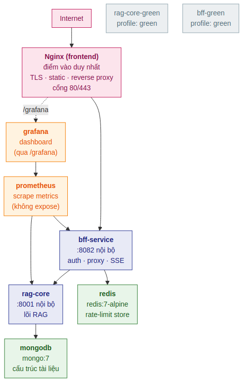
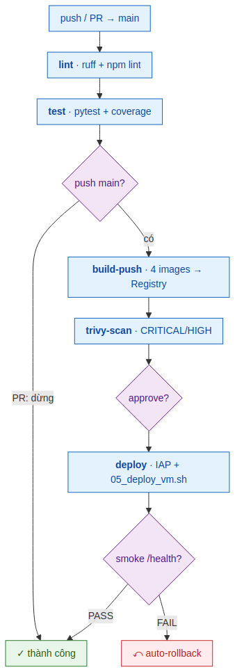
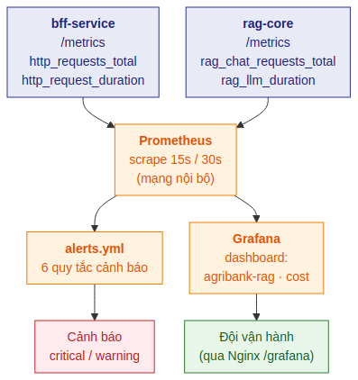
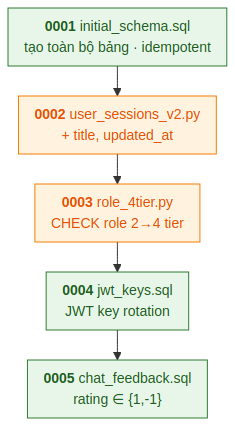
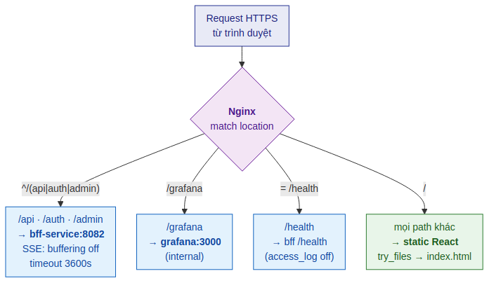
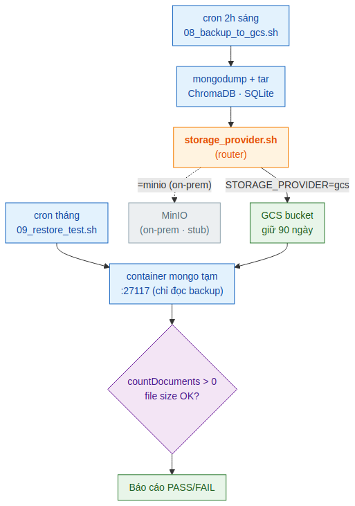

# PHẦN 5 - HẠ TẦNG & VẬN HÀNH

## 1. Giới thiệu Phần 5

Bốn phần đầu của bộ tài liệu mô tả *phần mềm* của hệ thống RAG-Chatbot: RAG Core sinh câu trả lời (Phần 2), BFF Service quản lý xác thực và proxy (Phần 3), và giao diện React (Phần 4), với bức tranh tổng thể đặt ở Phần 1. Tuy nhiên, một hệ thống chạy trong môi trường sản xuất cần nhiều hơn mã nguồn: nó cần một quy trình đưa mã lên máy chủ an toàn, một lớp giám sát để biết khi nào có sự cố, một cơ chế nâng cấp cơ sở dữ liệu không mất dữ liệu, và một kế hoạch sao lưu để phục hồi khi sự cố xảy ra. Phần 5 này tài liệu hóa toàn bộ lớp *hạ tầng và vận hành* (infrastructure & operations) đó.

Đối tượng đọc chính của Phần 5 là kỹ sư vận hành (DevOps/SRE) và kỹ sư phần mềm phụ trách triển khai. Cũng như các phần trước, mỗi cơ chế được trình bày theo lối **Why → What → How**: trước khi mô tả cấu hình làm gì, tài liệu giải thích vì sao cần đến nó trong bối cảnh cụ thể của dự án — một hệ thống nội bộ chạy trên một máy ảo GCP duy nhất, không có môi trường staging riêng, phục vụ khoảng 100 người dùng tại Trung tâm Thanh toán và dự kiến mở rộng.

### 1.1 Các nguyên tắc thiết kế cốt lõi

Toàn bộ lớp hạ tầng được xây dựng quanh ba nguyên tắc, và ba nguyên tắc này lặp lại xuyên suốt các quyết định trong Phần 5:

- **An toàn khi không có staging.** Vì mỗi lần triển khai đều tác động trực tiếp lên môi trường sản xuất, quy trình deploy bắt buộc phải tự bảo vệ: sao lưu trước, lưu lại phiên bản cũ, kiểm tra sức khỏe sau khi lên, và **tự động quay lui (auto-rollback)** nếu kiểm tra thất bại. Không có bước nào được phép giả định "chắc là chạy được".

- **GCP-native nhưng khả chuyển (portable).** Hệ thống hiện chạy trên Google Cloud, nhưng vòng đời sản xuất dự kiến sẽ chuyển về hạ tầng on-premise của Agribank sau 1–2 năm. Vì vậy mọi phần phụ thuộc nhà cung cấp đám mây (quản lý bí mật, lưu trữ sao lưu) đều được đặt sau một **lớp trừu tượng** (abstraction layer) để khi di trú chỉ cần đổi provider, không phải viết lại logic.

- **Quan sát được trước khi mở rộng.** Trước khi thêm tính năng hay tăng quy mô người dùng, hệ thống phải *quan sát được* (observable): mọi request được đo, mọi sự cố được cảnh báo. Lớp Prometheus + Grafana mô tả ở §4 là điều kiện tiên quyết, không phải tính năng phụ thêm.

### 1.2 Mục lục Phần 5

| § | Tiêu đề | Sơ đồ |
|---|---|---|
| 2 | Kiến trúc triển khai production | Hình 5.1 |
| 3 | Quy trình CI/CD | Hình 5.2 |
| 4 | Giám sát & Cảnh báo (Observability) | Hình 5.3 |
| 5 | Tiến hóa lược đồ CSDL (Database Migrations) | Hình 5.4 |
| 6 | Nginx & HTTPS | Hình 5.5 |
| 7 | Sao lưu, Phục hồi & Tính khả chuyển | Hình 5.6 |
| 8 | ADR — Các quyết định thiết kế hạ tầng | — |

---

## 2. Kiến trúc triển khai production

### 2.1 Vì sao cần một topology riêng cho production

Trong môi trường phát triển, ba service (RAG Core, BFF, frontend) chạy bằng `docker-compose.yml` với cấu hình tối giản: cổng mở ra ngoài để dễ gỡ lỗi, không giới hạn quyền container, không có giám sát. Cấu hình đó hoàn toàn không phù hợp để chạy thật. Môi trường sản xuất được định nghĩa bằng một file riêng — `docker-compose.prod.yml` — với các khác biệt cốt lõi: thêm các service hạ tầng (cơ sở dữ liệu, cache, giám sát), siết chặt quyền của từng container, và *không* mở cổng nội bộ ra Internet.

Việc tách thành hai file (`docker-compose.yml` cho dev, `docker-compose.prod.yml` cho prod) giúp lập trình viên không vô tình mang cấu hình lỏng lẻo của dev lên sản xuất, đồng thời cho phép production khai báo những thành phần mà dev không cần (như Redis hay Prometheus).

### 2.2 Bảy service trong topology production



*Hình 5.1 — Bảy service trong docker-compose.prod.yml: Nginx là điểm vào duy nhất ra Internet; BFF và RAG Core nằm trong mạng nội bộ; MongoDB, Redis, Prometheus, Grafana là các service hỗ trợ không expose cổng. Hai service màu xám (rag-core-green, bff-green) chỉ kích hoạt khi triển khai blue-green.*

Topology sản xuất gồm các service sau, tất cả nối với nhau qua một mạng Docker nội bộ:

- **frontend (Nginx):** điểm vào duy nhất tiếp xúc Internet. Nginx vừa phục vụ file tĩnh của giao diện React, vừa làm reverse proxy chuyển các request `/api`, `/auth`, `/admin` sang BFF. Đây là service *duy nhất* khai báo `ports` ánh xạ ra host (xem §6).
- **bff-service:** lớp Backend-for-Frontend (Phần 3), lắng nghe cổng 8082 *chỉ trong mạng nội bộ*. Nginx truy cập qua tên service `bff-service:8082`, không qua Internet.
- **rag-core:** lõi RAG (Phần 2), lắng nghe cổng 8001 chỉ trong mạng nội bộ. Chỉ BFF gọi đến RAG Core; người dùng không bao giờ chạm trực tiếp.
- **mongodb (mongo:7):** lưu cấu trúc tài liệu pháp lý. Container có healthcheck; được giữ lại quyền root tối thiểu vì entrypoint của MongoDB cần các capability `CHOWN`/`DAC_OVERRIDE` để khởi tạo thư mục dữ liệu.
- **redis (redis:7-alpine):** lưu trữ chia sẻ cho rate limiting (xem Phần 3 và §4.3 của phần này). Khi có nhiều tiến trình BFF, Redis đảm bảo bộ đếm rate limit là *dùng chung*, không bị phân mảnh theo từng tiến trình.
- **prometheus & grafana:** lớp giám sát (§4). Cả hai **không** mở cổng ra ngoài — Prometheus thu thập số liệu qua mạng nội bộ, Grafana được truy cập qua đường dẫn `/grafana/` phía sau Nginx.

### 2.3 Siết chặt quyền container (hardening)

Mỗi container production được cấu hình theo nguyên tắc đặc quyền tối thiểu (least privilege), nhằm giảm thiệt hại nếu một service bị xâm nhập:

```yaml
rag-core:
  cap_drop:
    - ALL                      # bỏ toàn bộ Linux capabilities
  security_opt:
    - no-new-privileges:true   # tiến trình con không thể nâng quyền
  read_only: true              # hệ thống file gốc chỉ đọc
  environment:
    PYTHONDONTWRITEBYTECODE: "1"  # không ghi .pyc (vì root fs read-only)
```

Ba lớp bảo vệ này hoạt động cùng nhau: `cap_drop: ALL` loại bỏ mọi quyền hệ thống đặc biệt; `no-new-privileges` chặn việc leo thang đặc quyền; `read_only: true` khiến kẻ tấn công không thể ghi mã độc vào hệ thống file của container. Vì hệ thống file gốc ở chế độ chỉ đọc, biến `PYTHONDONTWRITEBYTECODE` được bật để Python không cố ghi file bytecode `.pyc` (việc này sẽ gây lỗi). Các thư mục cần ghi (dữ liệu, log tạm) được mount riêng dưới dạng volume hoặc `tmpfs`.

> **Ngoại lệ MongoDB.** Container MongoDB *không* dùng `cap_drop: ALL`, vì entrypoint chính thức của image `mongo:7` cần một số capability của root để đổi quyền sở hữu thư mục dữ liệu khi khởi động. Đây là đánh đổi có chủ đích và được ghi rõ trong file compose bằng comment, để người vận hành sau này không nhầm tưởng là thiếu sót.

### 2.4 Triển khai Blue-Green

Vì không có máy chủ staging riêng, việc nâng cấp một phiên bản có rủi ro luôn đi kèm câu hỏi: làm sao thử phiên bản mới mà không làm gián đoạn người dùng đang hoạt động? Topology sản xuất chuẩn bị sẵn cho mô hình **blue-green** bằng cách khai báo hai service phụ — `rag-core-green` và `bff-green` — đặt sau một Docker Compose *profile* tên `green`:

```yaml
rag-core-green:
  image: ${REGISTRY}/rag-core:${IMAGE_TAG:-latest}
  profiles: [green]      # chỉ khởi động khi: docker compose --profile green up
```

Ở chế độ vận hành bình thường, hai service `green` *không* chạy (vì profile chưa được kích hoạt), nên không tốn tài nguyên. Khi cần kiểm thử một phiên bản mới song song với phiên bản đang phục vụ ("blue"), người vận hành kích hoạt profile `green` để dựng bản mới lên cùng lúc, kiểm tra, rồi mới chuyển luồng. Mô hình này là nền tảng cho chiến lược nâng cấp không gián đoạn trong tương lai, và được giữ ở dạng "chuẩn bị sẵn" để không làm phức tạp quy trình deploy hiện tại (xem §3).

---

## 3. Quy trình CI/CD

### 3.1 Vì sao cần pipeline tự động

Triển khai thủ công lên một máy chủ sản xuất duy nhất là nguồn rủi ro lớn: dễ quên một bước, dễ đưa lên mã chưa qua kiểm thử, và không có dấu vết kiểm toán về việc ai đã đưa gì lên lúc nào. Pipeline CI/CD (`.github/workflows/ci-cd.yml`) biến quy trình này thành một chuỗi bước tự động, có kiểm soát, kích hoạt mỗi khi mã được đẩy lên nhánh `main`. Pipeline lọc theo đường dẫn thay đổi (`paths`), nên một thay đổi chỉ liên quan tài liệu sẽ không kích hoạt cả quy trình build nặng nề.

### 3.2 Bảy bước của pipeline



*Hình 5.2 — Pipeline CI/CD tuần tự: lint và test chạy cho mọi push/PR; các bước build, quét bảo mật và deploy chỉ chạy khi push vào main; bước deploy cần phê duyệt thủ công và tự động quay lui nếu smoke test thất bại.*

Pipeline gồm các job nối tiếp, mỗi job chỉ chạy khi job trước thành công:

- **lint:** kiểm tra phong cách mã. Backend dùng `ruff check` trên `rag-core/` và `bff-service/`; frontend chạy `npm run lint`. Bước này bắt các lỗi đơn giản trước khi tốn công build.
- **test:** chạy `pytest` với đo độ phủ (coverage). BFF yêu cầu độ phủ tối thiểu `--cov-fail-under=25`, rag-core yêu cầu `--cov-fail-under=6` trên bốn package (`shared`, `phase1_indexing`, `phase2_retrieval`, `phase3_generation`). Hai ngưỡng này phản ánh thực trạng độ phủ hiện tại và là *sàn* để ngăn độ phủ tụt xuống, không phải mục tiêu cuối cùng.
- **build-push:** chỉ chạy khi đẩy vào `main`. Build bốn image Docker (`rag-core`, `bff`, `frontend`, `perf-eval`) bằng Docker Buildx, đẩy lên Google Artifact Registry. Mỗi image được gắn hai tag: mã commit ngắn (`git rev-parse --short HEAD`) và `latest`.
- **trivy-scan:** quét lỗ hổng bảo mật trên cả bốn image bằng Trivy, chỉ tính mức `CRITICAL` và `HIGH`. Nếu phát hiện lỗ hổng (chưa được liệt kê trong `.trivyignore`), pipeline dừng với `exit-code: 1`.
- **deploy:** gắn với GitHub Environment tên `production`, nghĩa là **cần phê duyệt thủ công** trước khi chạy. Bước này kết nối vào VM qua đường hầm IAP (Identity-Aware Proxy) thay vì mở cổng SSH ra Internet, đồng bộ các script và cấu hình lên `/opt/agribank-rag/`, rồi chạy script deploy an toàn.
- **smoke test:** sau khi deploy, gọi `https://<domain>/health` từ bên ngoài (qua IAP tunnel) để xác nhận hệ thống thực sự phục vụ được, thử lại tối đa 5 lần.

> **Tăng tốc build bằng cache.** Lần build đầu phải tải về toàn bộ mô hình embedding và reranker (~610MB từ HuggingFace). Từ lần thứ hai, GitHub Actions cache (`type=gha`, `mode=max`, scope riêng theo từng service) cho phép tái dùng các layer Docker, nên không cần tải lại mô hình. Đây là lý do thời gian build giảm mạnh sau lần đầu.

### 3.3 Deploy an toàn và tự động quay lui

Trái tim của bước deploy là script `scripts/gcp/05_deploy_vm.sh`, hiện thực nguyên tắc "an toàn khi không có staging" của §1.1. Vì mỗi lần deploy tác động trực tiếp lên sản xuất, script tuân theo một quy trình sáu bước bắt buộc:

1. **Sao lưu trước** — chạy backup dữ liệu trước khi động vào bất cứ thứ gì.
2. **Lưu tag cũ** — đọc `IMAGE_TAG` hiện tại từ `.env.prod`, ghi ra `.prev_image_tag.txt` để có đường lui.
3. **Lấy bí mật + cập nhật tag** — fetch secrets qua lớp trừu tượng (§7), ghi tag mới vào `.env.prod`.
4. **Kéo image mới và khởi động** — `docker compose ... up` với image tag mới.
5. **Chờ healthy** — chờ tối đa 5 phút cho các service báo trạng thái `healthy` qua Docker healthcheck.
6. **Smoke test** — gọi `/health` (thử lại 6 lần × 30s, vì healthcheck TCP của Docker pass *trước* khi RAG Core sẵn sàng phục vụ HTTP) và kiểm tra MongoDB có dữ liệu.

Nếu smoke test thất bại ở bước cuối, script **tự động gọi `99_rollback.sh <prev-tag>`** để khôi phục về phiên bản trước, rồi thoát với mã lỗi. Nhờ vậy, một lần deploy hỏng sẽ tự phục hồi mà không cần can thiệp thủ công giữa đêm. Khi deploy thành công, script dọn các image cũ để giải phóng dung lượng đĩa.

---

## 4. Giám sát & Cảnh báo (Observability)

### 4.1 Vì sao đo lường là bắt buộc

Một hệ thống không đo lường được là một hệ thống vận hành trong bóng tối: khi người dùng báo "chatbot chậm" hoặc "không trả lời", đội vận hành không có cách nào biết nguyên nhân ở tầng nào, hay sự cố đã kéo dài bao lâu. Lớp giám sát dựa trên Prometheus (thu thập số liệu) và Grafana (trực quan hóa) biến mọi request thành dữ liệu định lượng, và biến các ngưỡng bất thường thành cảnh báo tự động.



*Hình 5.3 — Prometheus scrape số liệu từ BFF và RAG Core qua mạng nội bộ; đánh giá các quy tắc cảnh báo; Grafana đọc từ Prometheus để hiển thị dashboard. Endpoint /metrics không bao giờ expose ra Internet.*

### 4.2 Prometheus thu thập số liệu

Prometheus được cấu hình (`monitoring/prometheus/prometheus.yml`) để *scrape* (thu thập định kỳ) số liệu từ hai nguồn qua mạng Docker nội bộ:

- **bff-service:8082/metrics** — chu kỳ mặc định 15 giây.
- **rag-core:8001/metrics** — chu kỳ 30 giây, timeout 25 giây. Chu kỳ dài hơn vì RAG Core có thể phản hồi chậm khi đang tải mô hình.

Điểm an toàn quan trọng: endpoint `/metrics` **chỉ truy cập được trong mạng nội bộ**, không bao giờ được Nginx expose ra Internet. Số liệu vận hành (đường dẫn API, tần suất lỗi) là thông tin nhạy cảm không nên công khai.

### 4.3 BFF sinh số liệu như thế nào

Phía BFF, một middleware (`middleware/metrics.py` — lớp `MetricsMiddleware`) bọc mọi request để ghi hai chỉ số:

- `http_requests_total{method, path, status}` — bộ đếm (Counter) tổng số request.
- `http_request_duration_seconds{method, path}` — biểu đồ phân phối (Histogram) thời gian xử lý, với các mốc từ 0,05s đến 60s.

Một chi tiết kỹ thuật quan trọng là **chuẩn hóa đường dẫn** (path normalization): trước khi ghi nhãn `path`, middleware thay các UUID và ID số trong đường dẫn bằng placeholder `:id`. Nếu không làm vậy, mỗi `session_id` riêng sẽ tạo ra một chuỗi nhãn mới, khiến số lượng chuỗi thời gian (cardinality) bùng nổ và làm Prometheus quá tải. Middleware cũng bỏ qua các đường dẫn hạ tầng (`/health`, `/metrics`, `/docs`…) để không làm nhiễu số liệu, và được thiết kế sao cho **lỗi khi ghi metric không bao giờ làm hỏng request thật**.

> **Liên hệ với rate limiting (Phần 3).** Lớp rate limiter của BFF (`middleware/rate_limiter.py`) cũng phát ra một metric riêng — `rate_limit_redis_errors_total` — tăng lên mỗi khi Redis (kho lưu trữ bộ đếm dùng chung) không khả dụng. Khi điều đó xảy ra, rate limiter hoạt động theo cơ chế *fail-open*: cho request đi qua kèm cảnh báo, thay vì chặn người dùng vì một sự cố hạ tầng. Metric này cho phép đội vận hành phát hiện sự cố Redis ngay cả khi người dùng không nhận ra.

### 4.4 Sáu quy tắc cảnh báo

File `monitoring/prometheus/alerts.yml` định nghĩa sáu cảnh báo, chia theo mức độ nghiêm trọng:

| Cảnh báo | Điều kiện | Thời gian giữ | Mức |
|---|---|:-:|:-:|
| HighErrorRate | Tỷ lệ HTTP 5xx > 5% | 5 phút | critical |
| HighLatencyP95 | p95 thời gian xử lý BFF > 10s | 5 phút | warning |
| RagCoreDown | Không scrape được rag-core | 2 phút | critical |
| BffDown | Không scrape được bff-service | 2 phút | critical |
| GeminiHighErrorRate | Tỷ lệ lỗi chat (LLM/retrieval) > 20% | 5 phút | critical |
| LlmHighLatency | p95 thời gian sinh của LLM > 60s | 10 phút | warning |

Trường "thời gian giữ" (`for`) là điều kiện chống báo động giả: một cú nhảy lỗi tức thời sẽ không kích hoạt cảnh báo; chỉ khi điều kiện duy trì liên tục đủ lâu thì cảnh báo mới phát. Các ngưỡng được chọn theo đặc thù hệ thống — ví dụ p95 LLM 60 giây là bất thường với Gemini Flash, nên vượt mốc này trong 10 phút là dấu hiệu cần điều tra (quota, mạng, hoặc sự cố phía nhà cung cấp).

### 4.5 Grafana trực quan hóa

Grafana đọc dữ liệu từ Prometheus và hiển thị qua hai dashboard được cấu hình sẵn (provisioning tự động khi khởi động):

- **agribank-rag** — dashboard vận hành chính: tần suất request, tỷ lệ lỗi, phân phối latency, trạng thái service.
- **cost** — dashboard theo dõi chi phí, hỗ trợ giám sát mức tiêu thụ (đặc biệt là lượng gọi LLM Gemini, vốn tính phí theo token).

Grafana không mở cổng ra Internet mà được truy cập qua đường dẫn `/grafana/` phía sau Nginx, với xác thực do chính Grafana quản lý.

---

## 5. Tiến hóa lược đồ CSDL (Database Migrations)

### 5.1 Vì sao cần migration có quản lý

Cơ sở dữ liệu của BFF (SQLite, lưu người dùng, phiên, lịch sử hội thoại) tiến hóa theo thời gian: thêm cột, thêm bảng, thay đổi ràng buộc. Trên một hệ thống đã chạy thật với dữ liệu người dùng, việc sửa lược đồ tùy tiện rất nguy hiểm — một câu lệnh `ALTER TABLE` sai có thể mất dữ liệu hoặc khóa hệ thống. Hệ thống dùng công cụ **yoyo-migrations** để quản lý việc này: mỗi thay đổi lược đồ là một file migration được đánh số, chạy đúng một lần, theo thứ tự, và mỗi file khai báo nó *phụ thuộc* vào file nào trước đó (`depends`).

Nguyên tắc xuyên suốt là **idempotent**: mỗi migration phải an toàn khi chạy trên cả cơ sở dữ liệu mới tinh lẫn cơ sở dữ liệu đã có dữ liệu. Trên DB đã có sẵn cấu trúc, migration là no-op (không làm gì); trên DB mới, nó tạo cấu trúc đầy đủ. Nhờ vậy, cùng một bộ migration chạy được trên mọi trạng thái DB mà không cần phân nhánh logic.



*Hình 5.4 — Năm migration tuần tự, mỗi bước phụ thuộc bước trước. Migration .sql cho thay đổi đơn giản; migration .py cho logic cần kiểm tra trạng thái (như SQLite không hỗ trợ ALTER COLUMN).*

### 5.2 Năm migration hiện có

| # | File | Nội dung | Vì sao |
|:-:|---|---|---|
| 0001 | `0001_initial_schema.sql` | Tạo toàn bộ bảng (`users`, `refresh_tokens`, `user_sessions`, `conversations`…) với `IF NOT EXISTS`. | Nền móng — idempotent trên mọi trạng thái. |
| 0002 | `0002_user_sessions_v2.py` | Thêm cột `title` và `updated_at` vào `user_sessions`. | Hỗ trợ hiển thị tiêu đề phiên trên sidebar. |
| 0003 | `0003_role_4tier.py` | Mở rộng ràng buộc `CHECK` của `users.role` từ 2 vai trò (user, admin) thành 4 (user, manager, admin, superadmin). | Phục vụ RBAC 4 tầng (Phần 3). |
| 0004 | `0004_jwt_keys.sql` | Tạo bảng `jwt_keys(kid, secret, created_at, retired_at)`. | Nền tảng cho **xoay khóa JWT** (key rotation). |
| 0005 | `0005_chat_feedback.sql` | Tạo bảng `chat_feedback` (đánh giá thích/không thích mỗi câu trả lời). | Thu thập phản hồi người dùng để cải thiện chất lượng. |

### 5.3 Hai loại migration: SQL và Python

Migration đơn giản (tạo bảng, thêm index) viết bằng SQL thuần (`.sql`). Migration cần *logic kiểm tra trạng thái* viết bằng Python (`.py`), vì SQL thuần không đủ biểu đạt. Ví dụ điển hình là `0003_role_4tier.py`: SQLite **không hỗ trợ** `ALTER TABLE ... ALTER COLUMN` để sửa một ràng buộc `CHECK`. Cách duy nhất là đổi tên bảng cũ, tạo bảng mới với ràng buộc đúng, chép dữ liệu sang, rồi xóa bảng cũ. Migration Python kiểm tra trước xem ràng buộc đã đúng chưa (`if "manager" in row[0]: return`) để không chạy lại trên DB đã migrate, sau đó dùng `PRAGMA legacy_alter_table=ON` để giữ nguyên các tham chiếu khóa ngoại trong quá trình tái tạo bảng.

> **Hai tính năng đáng chú ý đến từ migration.** Migration 0004 và 0005 không chỉ là thay đổi lược đồ, chúng mở ra hai năng lực mới của hệ thống. **Xoay khóa JWT** (0004): bảng `jwt_keys` lưu nhiều khóa bí mật với một `kid` (key ID); token mới ký bằng khóa active, token cũ vẫn xác thực được bằng khóa tương ứng với `kid` của nó, cho phép thay khóa định kỳ mà không vô hiệu hóa toàn bộ phiên đăng nhập. Khóa đầu tiên được "gieo" (seed) từ biến môi trường `JWT_SECRET_KEY` tại thời điểm khởi động (trong `_jwt_keys.py`, vì việc seed cần logic Python không làm được bằng SQL thuần). **Phản hồi hội thoại** (0005): bảng `chat_feedback` lưu đánh giá thích/không thích (`rating` chỉ nhận giá trị 1 hoặc -1) kèm các nguồn đã dùng; khóa ngoại `conversation_id` dùng `ON DELETE SET NULL` để giữ lại phản hồi như dấu vết kiểm toán ngay cả khi hội thoại bị xóa.

---

## 6. Nginx & HTTPS

### 6.1 Vai trò của Nginx

Nginx là điểm vào duy nhất của hệ thống ra Internet, đảm nhiệm bốn việc: kết thúc TLS (HTTPS), phục vụ file tĩnh của giao diện React, làm reverse proxy cho các request API sang BFF, và đặc biệt là **truyền tải luồng SSE** (Server-Sent Events) — cơ chế stream câu trả lời từng phần tới trình duyệt (đã mô tả ở Phần 3 và Phần 4). Cấu hình proxy của Nginx phải tôn trọng đặc thù của SSE, nếu không câu trả lời sẽ không hiển thị dần mà bị "kẹt" đến khi hoàn tất.

### 6.2 Hai biến thể cấu hình: GCP và on-premise

Phản ánh nguyên tắc "GCP-native nhưng khả chuyển", có hai file cấu hình Nginx cho hai môi trường:

- **`https.conf`** — môi trường GCP hiện tại. Dùng chứng chỉ **Let's Encrypt** (tự động gia hạn), chạy trên image `nginx-unprivileged` (lắng nghe cổng 8080/8443 không cần quyền root, được Docker ánh xạ ra cổng 80/443 của host). Có endpoint `/.well-known/acme-challenge/` để Let's Encrypt xác thực sở hữu tên miền.
- **`agribank.conf`** — môi trường on-premise tương lai. Dùng chứng chỉ từ **CA nội bộ** của Agribank (không dùng Let's Encrypt cho tên miền `.internal`), lắng nghe trực tiếp cổng 80/443. Các đường dẫn chứng chỉ và tên miền được đánh dấu `TODO` để xác nhận với đội hạ tầng trước khi triển khai.

Cả hai biến thể chia sẻ cùng một bộ thiết lập bảo mật cốt lõi: chỉ cho phép TLS 1.2/1.3, bật HSTS (`Strict-Transport-Security`), và các header chống tấn công (`X-Frame-Options`, `X-Content-Type-Options`, `Referrer-Policy`).



*Hình 5.5 — Nginx định tuyến: /api, /auth, /admin → BFF (với cấu hình SSE đặc biệt); /grafana → Grafana nội bộ; mọi đường dẫn khác → file tĩnh React với SPA fallback.*

### 6.3 Cấu hình SSE cốt lõi

Khối định tuyến API chứa các thiết lập quyết định để SSE hoạt động đúng:

```nginx
location ~ ^/(api|auth|admin)(/|$) {
    proxy_pass http://bff-service:8082;
    proxy_http_version 1.1;
    proxy_set_header Connection "";
    proxy_read_timeout 3600s;     # giữ kết nối lâu cho câu trả lời dài
    proxy_send_timeout 3600s;
    proxy_buffering off;          # QUAN TRỌNG: không gom buffer → stream tức thì
    proxy_cache off;
}
```

Thiết lập then chốt là `proxy_buffering off`: nếu để mặc định, Nginx sẽ gom toàn bộ phản hồi vào buffer rồi mới gửi một lần, làm mất hoàn toàn hiệu ứng stream từng từ. Tắt buffer cho phép mỗi đoạn (chunk) mà BFF đẩy ra được chuyển ngay tới trình duyệt. Hai timeout 3600 giây đảm bảo kết nối không bị cắt giữa chừng với câu trả lời dài. Định tuyến file tĩnh ở khối `location /` dùng `try_files ... /index.html` để hỗ trợ điều hướng phía client của ứng dụng SPA, kèm chính sách cache khác nhau cho tài nguyên có vân tay (JS/CSS cache 1 năm) và HTML (không cache).

---

## 7. Sao lưu, Phục hồi & Tính khả chuyển

### 7.1 Vì sao backup phải kèm restore test

Một bản sao lưu chưa từng được phục hồi thử thì không phải là một bản sao lưu — nó chỉ là một file mà ta *hy vọng* dùng được. Nhiều hệ thống chỉ phát hiện backup hỏng đúng vào lúc cần khôi phục khẩn cấp. Vì vậy chiến lược ở đây gồm hai nửa không tách rời: sao lưu định kỳ, và **kiểm tra phục hồi tự động định kỳ**.

### 7.2 Sao lưu hàng ngày

Script `08_backup_to_gcs.sh` chạy hàng ngày (qua cron lúc 2h sáng), sao lưu cả ba kho dữ liệu của hệ thống:

- **MongoDB** — dùng `mongodump`, nén thành `mongodb.tar.gz`.
- **ChromaDB + SQLite** — gói `data/rag/chromadb/`, `data/rag/metadata.db`, `data/bff/conversations.db`, `data/bff/users.db` thành `data.tar.gz`.

Tất cả được đẩy lên object storage (Google Cloud Storage, bucket `gs://agribank-rag-backup`) theo thư mục gắn nhãn ngày-giờ, giữ lại **90 ngày**. Bên cạnh bản tar.gz "khả chuyển" (chép đi đâu cũng restore được), hệ thống còn dùng song song **disk snapshot** của GCP cho khả năng phục hồi nhanh — hai cơ chế bổ trợ cho nhau.

### 7.3 Kiểm tra phục hồi tự động

Script `09_restore_test.sh`, chạy tự động hàng tháng qua workflow `restore-test.yml`, thực hiện một bài kiểm tra phục hồi *thật* nhưng *an toàn*:

1. Lấy bản backup gần nhất từ GCS.
2. Dựng một container MongoDB tạm (ephemeral, cổng 27117, tách biệt hoàn toàn với production).
3. `mongorestore` vào container tạm và xác minh số lượng tài liệu > 0.
4. Giải nén `data.tar.gz` và kiểm tra kích thước file vượt ngưỡng tối thiểu.
5. Dọn dẹp container và file tạm (trong `trap EXIT`, đảm bảo không rò tài nguyên kể cả khi lỗi giữa chừng).
6. In báo cáo PASS/FAIL.

Điểm an toàn cốt lõi: script này **chỉ đọc** từ GCS và làm việc trên container tạm, **không bao giờ chạm vào** cơ sở dữ liệu hay container production. Nhờ vậy, việc kiểm tra phục hồi không tạo ra rủi ro cho hệ thống đang chạy.



*Hình 5.6 — Backup hàng ngày đẩy lên storage qua lớp trừu tượng; restore test hàng tháng đọc lại và xác minh trên container tạm. Lớp provider cho phép đổi GCS↔MinIO và Secret Manager↔Vault chỉ bằng biến môi trường.*

### 7.4 Lớp trừu tượng cho tính khả chuyển

Để hiện thực hóa nguyên tắc "GCP-native nhưng khả chuyển", mọi tương tác với dịch vụ đám mây đi qua hai bộ định tuyến (router) trong `scripts/lib/`:

- **`secrets_provider.sh`** — interface `fetch_secret(name)`. Provider chọn qua biến `SECRETS_PROVIDER`: mặc định `gcp` (Google Secret Manager), có sẵn `vault` (HashiCorp Vault) cho on-premise.
- **`storage_provider.sh`** — interface `storage_upload / storage_list / storage_remove`. Provider chọn qua `STORAGE_PROVIDER`: mặc định `gcs` (Google Cloud Storage), có sẵn `minio` cho on-premise.

Mỗi router chỉ định nghĩa *giao diện*; phần hiện thực nằm ở file riêng (`secrets_provider_gcp.sh`, `storage_provider_minio.sh`…). Mã nghiệp vụ (script backup, deploy) chỉ gọi hàm giao diện, không bao giờ gọi trực tiếp `gcloud` hay `gsutil`. Kết quả là khi di trú về Agribank on-premise, đội vận hành chỉ cần đổi giá trị hai biến môi trường (`SECRETS_PROVIDER=vault`, `STORAGE_PROVIDER=minio`) và cấu hình provider tương ứng — không phải sửa một dòng logic nào trong các script vận hành.

---

## 8. ADR — Các quyết định thiết kế hạ tầng

Mục này tổng hợp các quyết định kiến trúc quan trọng của lớp hạ tầng, mỗi quyết định kèm lý do, đánh đổi, và điều kiện nên xem lại.

### ADR-5.1 — Một VM duy nhất, không staging riêng

- **Quyết định:** Chạy toàn bộ hệ thống trên một máy ảo GCP `e2-standard-4`, không dựng môi trường staging tách biệt.
- **Lý do:** Quy mô hiện tại (~100 người dùng) không biện minh được chi phí và độ phức tạp của hạ tầng nhiều môi trường. Một VM đủ tải và dễ vận hành cho một lập trình viên.
- **Đánh đổi:** Không có nơi thử nghiệm an toàn trước sản xuất → bù lại bằng quy trình deploy an toàn (backup + smoke test + auto-rollback) và topology blue-green chuẩn bị sẵn.
- **Khi nào nên đổi:** Khi mở rộng lên 500–1000 người dùng hoặc khi tần suất triển khai tăng cao đến mức rủi ro deploy trực tiếp không còn chấp nhận được.

### ADR-5.2 — Auto-rollback dựa trên smoke test

- **Quyết định:** Mọi lần deploy tự động quay lui về tag trước nếu smoke test sau triển khai thất bại.
- **Lý do:** Không có staging nghĩa là lỗi chỉ lộ ra trên sản xuất; cần cơ chế tự phục hồi để giảm thời gian gián đoạn.
- **Đánh đổi:** Smoke test phải đủ tin cậy — thử lại nhiều lần để tránh báo lỗi giả khi service khởi động chậm (healthcheck TCP pass trước khi HTTP sẵn sàng).
- **Khi nào nên đổi:** Khi chuyển sang blue-green hoàn chỉnh, lúc đó "rollback" trở thành "không chuyển luồng sang bản mới" thay vì khôi phục bản cũ.

### ADR-5.3 — Container hardening (cap_drop, read_only)

- **Quyết định:** Mọi container ứng dụng chạy với `cap_drop: ALL`, `no-new-privileges`, `read_only: true`.
- **Lý do:** Giảm tối đa thiệt hại nếu một service bị xâm nhập, theo nguyên tắc đặc quyền tối thiểu.
- **Đánh đổi:** Cần cấu hình thêm (volume cho thư mục ghi, `PYTHONDONTWRITEBYTECODE`); MongoDB phải miễn trừ vì entrypoint cần quyền root.
- **Khi nào nên đổi:** Không nên nới lỏng; nếu một service mới cần quyền, cấp đúng capability cần thiết thay vì bỏ `cap_drop`.

### ADR-5.4 — Lớp trừu tượng provider cho secrets và storage

- **Quyết định:** Mọi truy cập secrets/storage qua router chọn provider bằng biến môi trường.
- **Lý do:** Vòng đời sản xuất dự kiến di trú từ GCP về on-premise; tránh khóa cứng vào nhà cung cấp.
- **Đánh đổi:** Thêm một lớp gián tiếp; cần duy trì các file hiện thực provider song song.
- **Khi nào nên đổi:** Nếu quyết định ở lại GCP vĩnh viễn, có thể đơn giản hóa; nhưng lớp này chi phí thấp nên không cấp thiết.

### ADR-5.5 — yoyo-migrations với migration idempotent

- **Quyết định:** Quản lý tiến hóa lược đồ SQLite bằng yoyo-migrations, mọi migration idempotent, dùng `.py` khi cần logic kiểm tra trạng thái.
- **Lý do:** Sửa lược đồ trên DB có dữ liệu thật cần an toàn và lặp lại được; SQLite thiếu `ALTER COLUMN` nên cần logic Python cho thay đổi ràng buộc.
- **Đánh đổi:** Migration `.py` phức tạp hơn `.sql` (rename + recreate + copy); bù lại an toàn trên mọi trạng thái DB.
- **Khi nào nên đổi:** Khi di trú sang PostgreSQL (dự kiến sau bảo vệ NCKH), nhiều thao tác `ALTER` phức tạp sẽ làm được trực tiếp bằng SQL, giảm nhu cầu migration `.py`.

### ADR-5.6 — Prometheus + Grafana nội bộ, không expose /metrics

- **Quyết định:** Giám sát bằng Prometheus + Grafana chạy trong mạng nội bộ; endpoint `/metrics` không bao giờ ra Internet.
- **Lý do:** Quan sát được là điều kiện tiên quyết để vận hành; nhưng số liệu vận hành là thông tin nhạy cảm.
- **Đánh đổi:** Truy cập dashboard phải qua Nginx (`/grafana/`) thay vì trực tiếp; thêm hai container vào VM.
- **Khi nào nên đổi:** Khi mở rộng nhiều VM, có thể tách giám sát ra dịch vụ quản lý riêng (managed Prometheus).
